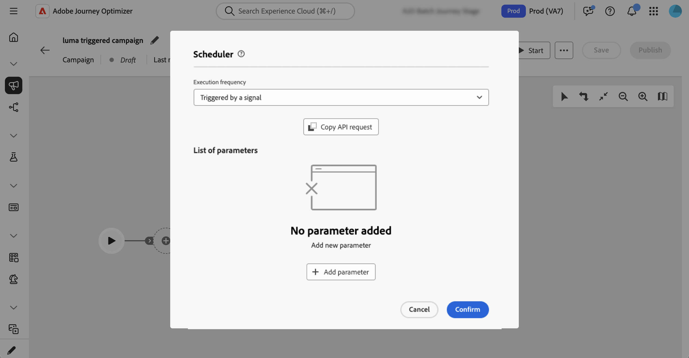
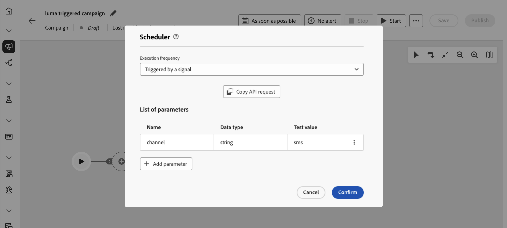

# シグナルを活用したトリガーオーケストレーションされたキャンペーン {#trigger-signal}

オーケストレーションされたキャンペーンをスケジュールどおりに実行するのではなく、シグナルを送ることでトリガーできます。 シグナルは、外部システムまたはアプリケーションからのAPI呼び出しを介して送信されます。 信号を使用する場合は、パラメーターを渡すことができます。 これらの変数は、オーケストレーションされたキャンペーンで実行コンテキストのイベント変数として使用できるようになり、ターゲティング、条件、式で使用できます。

シグナルを使用してオーケストレーションされたキャンペーンをトリガーするエンドツーエンドのプロセス：

1. [シグナルによってトリガーされるキャンペーンをスケジュールします](#set-an-orchestrated-campaign-to-wait-for-a-signal-configure-signal)
1. [信号ペイロードのパラメーターを追加](#add-parameters-for-the-signal-payload-optional-parameters) （オプション）
1. [キャンペーンの構築とテスト](#build-and-test-the-campaign-build-and-test)
1. [キャンペーンの公開とトリガー](#publish-and-trigger-the-campaign-publish)

>[!NOTE]
>
>シグナルを使用してオーケストレーションされたキャンペーンをトリガーするには、**[!DNL Publish orchestrated campaigns]**&#x200B;権限（`orchestrated-campaign.publish`）が必要です。 [組み込み権限](../administration/ootb-permissions.md)を参照してください。

## シグナルによってトリガーされるキャンペーンをスケジュールします {#configure-signal}

スケジュールではなくシグナルで開始するようにオーケストレーションされたキャンペーンを設定するには、次の手順に従います。

1. シグナルを使用してトリガーするオーケストレーションキャンペーンを開きます。

1. スケジュール設定を開きます。 [&#x200B; オーケストレーションされたキャンペーンをスケジュールする方法について説明します](create-orchestrated-campaign.md#schedule)。

1. キャンペーンがスケジュールで実行するのではなくシグナルを待つように、**[!UICONTROL シグナルによってトリガー]**&#x200B;を選択します。

   {zoomable="yes"}

## 信号ペイロードのパラメーターを追加します（オプション） {#parameters}

トリガーシグナルでパラメーターを渡し、ターゲティング、条件、式など、キャンペーンの実行コンテキストでパラメーターを使用できます。 最初にスケジュール設定で各パラメーターを定義し、トリガー APIを呼び出すときにその値を渡します。

1. キャンペーンスケジューラーを開き、**[!UICONTROL パラメーターを追加]**&#x200B;を選択します。

1. 信号ペイロードで送信する各パラメーターの名前とデータタイプを定義します。 キャンペーンをテストモードでトリガーするときに使用する&#x200B;**テスト値**&#x200B;を指定することもできます。 [&#x200B; トリガーされたキャンペーンをテストする方法を説明します](#build-and-test)。

   {zoomable="yes"}

>[!NOTE]
>
>スケジューラーで定義されていないAPI呼び出しにパラメーターを渡した場合、API呼び出しは引き続き成功し、パラメーターは伝播されます。式で使用できます。 ただし、オーケストレーションされたキャンペーンインターフェイスは使用に役立ちません。例えば、テストアクティビティでは、スケジューラーで定義されていないパラメーターが一覧表示されたり、表示されたりしません。

## キャンペーンの構築とテスト {#build-and-test}

キャンバス上でキャンペーンを構築し、オプションでAPI経由でシグナルをトリガーしてドラフトでテストしてから公開します。

1. キャンバス上のアクティビティ（オーディエンス、ターゲティング、配信）を追加して接続します。 [キャンペーンアクティビティの調整方法の詳細情報](orchestrate-activities.md)

1. シグナルでパラメーターを定義した場合は、キャンバスロジック（条件やターゲティングなど）にパラメーターをワイヤー接続できます。 この例では、「channel」パラメーターが&#x200B;**[!UICONTROL Test]** アクティビティの条件として使用されています。

   

   式エディターで信号パラメーターを使用するには（例えば、**[!UICONTROL オーディエンスを作成]** アクティビティでクエリを作成するには）、「式」フィールドに「`$(vars/@<parameterName>)`」と入力します。 `<parameterName>`を、スケジューラーで定義されているパラメーター名（例：`$(vars/@channel)`）に置き換えます。 [詳しくは、式エディターの操作方法を参照してください](edit-expressions.md)。

1. キャンペーンスケジューラーを開き、**[!UICONTROL API リクエストをコピー]**&#x200B;を選択し、形式（cURLまたはHTTP リクエスト）を選択します。

   コピーされた情報には、オーケストレーションされたキャンペーン ID、サンドボックス名、組織ID、およびパラメーターのテスト値が含まれています。

   

   +++パラメーターとテスト値を含むcURL リクエストのサンプル

   ```bash
   POST https://platform.adobe.io/ajo/campaign-orchestration/orchestratedCampaigns/1c7529c7-7a8c-491a-a2c6-3d8131d2e17d/trigger
   
   Headers:
   Authorization: Bearer ## Access token ##
   Content-Type: application/json
   x-api-key: ## Provide API Key here ##
   x-api-version: 1
   x-gw-ims-org-id: 123456ABCDEFG@LumaOrg
   x-sandbox-name: prod
   
   Body:
   {
   "variables": {
      "channel": "sms"
   }
   }
   ```

   +++

1. 「**[!UICONTROL 開始]**」をクリックして、キャンペーンを開始します。

1. スケジューラーからコピーしたサンプルリクエストを使用して、トリガー API呼び出しを送信します。<!--For the complete API reference, refer to the [Journey Optimizer API documentation](https://developer.adobe.com/journey-optimizer-apis/){target="_blank"}.-->

テスト結果に満足したら、[&#x200B; キャンペーンを公開](#publish)します。

## キャンペーンの公開とトリガー {#publish}

[&#x200B; キャンペーンを作成してテストした後](#build-and-test)、キャンペーンを公開して、アプリケーションからトリガーできるようにします。

1. キャンペーンキャンバスで「**[!UICONTROL 公開]**」をクリックします。 外部システムからキャンペーンをトリガーする前に、キャンペーンを公開する必要があります。 [&#x200B; キャンペーンの開始と監視の詳細](start-monitor-campaigns.md#publish)。

1. キャンペーンスケジューラーを開き、**[!UICONTROL API リクエストをコピー]**&#x200B;を選択し、形式（cURLまたはHTTP リクエスト）を選択します。

   コピーされた情報には、オーケストレーションされたキャンペーン ID、サンドボックス名、組織ID、およびパラメーターが含まれます（一部を追加した場合）。

   

1. システムからトリガー APIを呼び出します。

   >[!IMPORTANT]
   >
   >ライブオーケストレーションされたキャンペーンの場合、スロットルガードレールにより、2つのAPIトリガーの実行の間に&#x200B;**最低1時間**&#x200B;の間隔が適用されます。 間隔が経過する前にAPIを再度呼び出すと、APIは&#x200B;**HTTP 429** エラー（リクエストが多すぎます）を返します。 このガードレールは、ドラフトバージョンをトリガーしてテストする場合は適用されません。

   シグナルペイロードにパラメーターを追加した場合、API呼び出しで渡した値は、キャンペーンの実行時にキャンペーンイベント変数として公開されます。 それらを調べるには、キャンペーンキャンバスツールバーからキャンペーンログを開きます。 「**[!UICONTROL タスク]**」タブで、シグナルに対応するタスクを特定し、鉛筆アイコンをクリックして関連するイベント変数にアクセスします。 [&#x200B; ログとタスクへのアクセス方法を確認する](start-monitor-campaigns.md#logs-tasks)。

   {zoomable="yes"}
