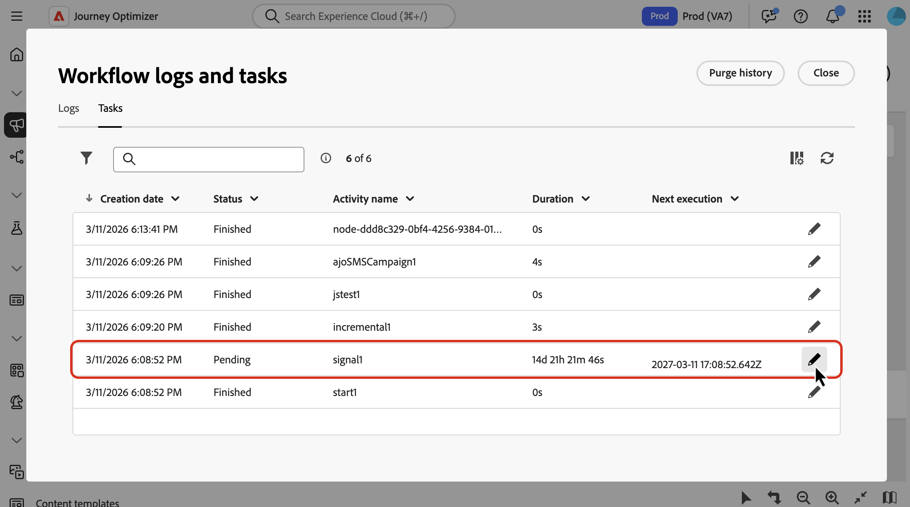

# シグナルを使用したオーケストレーションキャンペーンのトリガー {#trigger-signal}

固定スケジュールではなくシグナルを使用して、オーケストレーションされたキャンペーンを開始できます。 キャンペーンがシグナルを受信すると、そのシグナルが実行され、ペイロードでパラメーターを渡すことができます。 ターゲティング、条件、式の変数として使用できます。

シグナルは、次のいずれかから得られます。

* REST API — アプリケーションまたは統合がトリガーエンドポイントを呼び出します（[ キャンペーンの公開とトリガー](#publish)および[API リファレンス ](https://developer.adobe.com/journey-optimizer-apis/references/oc-trigger){target="_blank"}を参照）。
* 別のオーケストレーションされたキャンペーン – アップストリームキャンペーンの&#x200B;**[!UICONTROL 終了]** アクティビティは、ブランチが完了したときに同じ種類のシグナルを送信します。 [終了アクティビティの設定方法を説明します](#signal-end)。

このページでは、シグナル（スケジュール、パラメーター、テスト、公開）を受信するキャンペーンを設定する方法と、APIまたは&#x200B;**[!UICONTROL End]** アクティビティから実行する方法について説明します。 変数が使用可能になったら、ルールと&#x200B;**[!UICONTROL テスト]**&#x200B;条件での変数の使用方法について詳しくは、[ オーケストレーションされたキャンペーンでの変数の使用](variables-orchestrated-campaigns.md)を参照してください。

トリガーエンドポイントのREST仕様（パス、ヘッダー、本文、レスポンス、およびエラー）については、Adobe Journey Optimizer API ドキュメントの[トリガーオーケストレーションされたキャンペーン API](https://developer.adobe.com/journey-optimizer-apis/references/oc-trigger){target="_blank"}を参照してください。

シグナルを使用してオーケストレーションされたキャンペーンをトリガーするエンドツーエンドのプロセス：

1. [シグナルによってトリガーされるキャンペーンをスケジュールします](#configure-signal)
1. [信号ペイロードのパラメーターを追加](#parameters) （オプション）
1. [キャンペーンの構築とテスト](#build-and-test)
1. [キャンペーンの公開とトリガー](#publish)

>[!NOTE]
>
>シグナルを使用してオーケストレーションされたキャンペーンをトリガーするには、**[!DNL Publish orchestrated campaigns]**&#x200B;権限（`orchestrated-campaign.publish`）が必要です。 [組み込み権限](../administration/ootb-permissions.md)を参照してください。

## シグナルによってトリガーされるキャンペーンをスケジュールします {#configure-signal}

スケジュールではなくシグナルで開始するようにオーケストレーションされたキャンペーンを設定するには、次の手順に従います。

1. シグナルを使用してトリガーするオーケストレーションキャンペーンを開きます。

1. スケジュール設定を開きます。 [ オーケストレーションされたキャンペーンをスケジュールする方法について説明します](create-orchestrated-campaign.md#schedule)。

1. キャンペーンがスケジュールで実行するのではなくシグナルを待つように、**[!UICONTROL シグナルによってトリガー]**&#x200B;を選択します。

   {zoomable="yes"}

## 信号ペイロードのパラメーターを追加します（オプション） {#parameters}

トリガーシグナルでパラメーターを渡し、ターゲティング、条件、式など、キャンペーンの実行コンテキストでパラメーターを使用できます。 最初にスケジュール設定で各パラメーターを定義し、トリガー APIを呼び出すときや、アップストリームキャンペーンの&#x200B;**[!UICONTROL 終了]** アクティビティからパラメーターをマッピングするときにその値を渡します（[以下](#signal-end)を参照）。

1. キャンペーンスケジューラーを開き、**[!UICONTROL パラメーターを追加]**&#x200B;を選択します。

1. 信号ペイロードで送信する各パラメーターの名前とデータタイプを定義します。 キャンペーンをテストモードでトリガーするときに使用する&#x200B;**テスト値**&#x200B;を指定することもできます。 [ トリガーされたキャンペーンをテストする方法を説明します](#build-and-test)。

   {zoomable="yes"}

>[!NOTE]
>
>REST APIによってトリガーされるオーケストレーションキャンペーンの場合、スケジューラーで定義されていないAPI呼び出しにパラメーターを渡すと、API呼び出しは引き続き成功し、パラメーターが伝播され、式で使用できます。 ただし、オーケストレーションされたキャンペーンインターフェイスは使用に役立ちません。例えば、テストアクティビティは、スケジューラーで定義されていないパラメーターを一覧表示したり、表示したりしません。

## キャンペーンのテスト {#build-and-test}

キャンバスでキャンペーンを作成し、REST APIを介してシグナルを送信して公開する前に&#x200B;**[!UICONTROL ドラフト]**&#x200B;でテストします。

* REST APIによってトリガーされる&#x200B;**オーケストレーションされたキャンペーン** – 次の手順を使用して、キャンペーンをドラフトで実行し、公開前にターゲティング、パラメーター、配信ロジックを検証します。

* **終了アクティビティによってトリガーされたオーケストレーションされたキャンペーン** – 下書きでチェーン全体をエンドツーエンドで実行することはできません。上流キャンペーンが公開されると、その&#x200B;**[!UICONTROL 終了]** アクティビティは公開された下流キャンペーンのみを開始します。 両方のキャンペーンが公開される前にダウンストリームサイドをテストするには、そのキャンペーンを&#x200B;**[!UICONTROL ドラフト]**&#x200B;に保持し、スケジューラーで信号パラメーターに&#x200B;**[!UICONTROL テスト値]**&#x200B;を設定し（[信号ペイロードのパラメーターを追加](#parameters)）、次のAPI手順に従います。 トリガー API呼び出しは、実行時に&#x200B;**[!UICONTROL End]** アクティビティと同じペイロードを使用するので、ダウンストリームキャンペーンを公開し、アップストリーム **[!UICONTROL End]** アクティビティ （[別のキャンペーンの終了アクティビティからのトリガー](#signal-end)）を設定する前に、パラメータルーティングとキャンバスロジックを検証できます。

1. キャンバス上のアクティビティ（オーディエンス、ターゲティング、配信）を追加して接続します。 [キャンペーンアクティビティの調整方法の詳細情報](orchestrate-activities.md)

1. シグナルでパラメーターを定義した場合は、キャンバスロジック（条件やターゲティングなど）にパラメーターをワイヤー接続できます。 この例では、「channel」パラメーターが&#x200B;**[!UICONTROL Test]** アクティビティの条件として使用されています。

   

   式エディターで信号パラメーターを使用するには（例えば、**[!UICONTROL オーディエンスを作成]** アクティビティでクエリを作成するには）、「式」フィールドに「`$(vars/@<parameterName>)`」と入力します。 `<parameterName>`を、スケジューラーで定義されているパラメーター名（例：`$(vars/@channel)`）に置き換えます。 [詳しくは、式エディターの操作方法を参照してください](edit-expressions.md)。

1. キャンペーンスケジューラーを開き、**[!UICONTROL API リクエストをコピー]**&#x200B;を選択し、形式（cURLまたはHTTP リクエスト）を選択します。

   コピーされた情報には、オーケストレーションされたキャンペーン ID、サンドボックス名、組織ID、およびパラメーターのテスト値が含まれています。

   

   +++パラメーターとテスト値を含むcURL リクエストのサンプル

   ```bash
   POST https://platform.adobe.io/ajo/campaign-orchestration/orchestratedCampaigns/1c7529c7-7a8c-491a-a2c6-3d8131d2e17d/trigger
   
   Headers:
   Authorization: Bearer ## Access token ##
   Content-Type: application/json
   x-api-key: ## Provide API Key here ##
   x-api-version: 1
   x-gw-ims-org-id: 123456ABCDEFG@LumaOrg
   x-sandbox-name: prod
   
   Body:
   {
   "variables": {
      "channel": "sms"
   }
   }
   ```

   +++

1. 「**[!UICONTROL 開始]**」をクリックして、キャンペーンを開始します。

1. スケジューラーからコピーしたサンプルリクエストを使用して、トリガー API呼び出しを送信します。 リクエストとレスポンスの詳細については、[トリガー オーケストレーション キャンペーン API](https://developer.adobe.com/journey-optimizer-apis/references/oc-trigger){target="_blank"}を参照してください。

テスト結果に満足したら、[ キャンペーンを公開](#publish)します。

## キャンペーンの公開とトリガー {#publish}

キャンペーン ](#build-and-test)を[ テストした後、それを公開して、アプリケーションまたは別のキャンペーンの&#x200B;**[!UICONTROL 終了]** アクティビティからシグナルを受信できるようにします。 [ キャンペーンの開始と監視の詳細](start-monitor-campaigns.md#publish)。

次に、REST APIまたは別のキャンペーンの&#x200B;**[!UICONTROL End]** アクティビティからトリガーできます。 以下のセクションを参照してください。

### REST APIを使用したシグナルの送信 {#publish-api}

公開後、独自のアプリケーションからキャンペーンをトリガーするたびに、次の手順に従います。

1. キャンペーンスケジューラーを開き、**[!UICONTROL API リクエストをコピー]**&#x200B;を選択し、形式（cURLまたはHTTP リクエスト）を選択します。

   コピーされた情報には、オーケストレーションされたキャンペーン ID、サンドボックス名、組織ID、およびパラメーターが含まれます（一部を追加した場合）。

   

1. システムからトリガー APIを呼び出します。 ライブエンドポイントの仕様については、[トリガーオーケストレーションキャンペーン API](https://developer.adobe.com/journey-optimizer-apis/references/oc-trigger){target="_blank"}を参照してください。

   >[!IMPORTANT]
   >
   >ライブオーケストレーションされたキャンペーンの場合、スロットルガードレールにより、2つのAPIトリガーの実行の間に最低1時間の間隔が適用されます。 間隔が経過する前にAPIを再度呼び出すと、APIはHTTP 429 （リクエストが多すぎる）を返します。 このガードレールは、ドラフトバージョンをトリガーしてテストする場合は適用されません。

   シグナルペイロードにパラメーターを追加した場合、API呼び出しで渡した値は、キャンペーンの実行時にキャンペーンイベント変数として公開されます。 それらを調べるには、キャンペーンキャンバスツールバーからキャンペーンログを開きます。 「**[!UICONTROL タスク]**」タブで、シグナルに対応するタスクを特定し、鉛筆アイコンをクリックして関連するイベント変数にアクセスします。 [ ログとタスクへのアクセス方法を確認する](start-monitor-campaigns.md#logs-tasks)。

   {zoomable="yes"}

### 別のキャンペーンの終了アクティビティからのシグナルの送信 {#signal-end}

このパスを使用して、オーケストレーションされたキャンペーンをチェーンします。アップストリームキャンペーンがブランチを完了すると、**[!UICONTROL 終了]** アクティビティは、シグナルによってトリガーされた&#x200B;**[!UICONTROL に既に設定されているダウンストリームキャンペーンにシグナルを送信します]**。 これにより、小規模な施策を再利用し、各呼び出し元から異なるペイロードを渡すことができます。

>[!NOTE]
>
>* 同じキャンバスで複数の&#x200B;**[!UICONTROL End]** アクティビティを使用し、それぞれ設定して異なるダウンストリームキャンペーンをトリガーできます。
>* 複数のキャンペーンが同じダウンストリームキャンペーンをトリガーできます。 各呼び出しは異なるペイロードを送信できます。

最初に実行する必要があるキャンペーンで、次の手順に従います。

1. シグナルを送信する必要があるオーケストレーションキャンペーンを開き、ダウンストリームキャンペーンが開始する前に完了する必要があるブランチの末尾にある&#x200B;**[!UICONTROL End]** アクティビティを選択します。
1. **[!UICONTROL 外部シグナル]** セクションで、トリガーするダウンストリームキャンペーンを選択します。

1. オプションで、パラメーターを追加します。ダウンストリームキャンペーンのスケジュールと同じ名前を使用し、各値を設定します。

   

1. ダウンストリームキャンペーンを公開する前にドラフトモードでテストするには、「[ キャンペーンをテスト ](#build-and-test)」セクションの手順に従って、ドラフトでREST APIとトリガーします。

ダウンストリームキャンペーンは、アップストリームキャンペーンをトリガーする&#x200B;**[!UICONTROL End]** アクティビティに到達するのに十分な距離まで実行する前に公開する必要があります。 ターゲットキャンペーンが公開されていない間にシグナルが送信された場合、実行は失敗します。 ダウンストリームキャンペーンを公開し、必要に応じて再開または再起動します。
