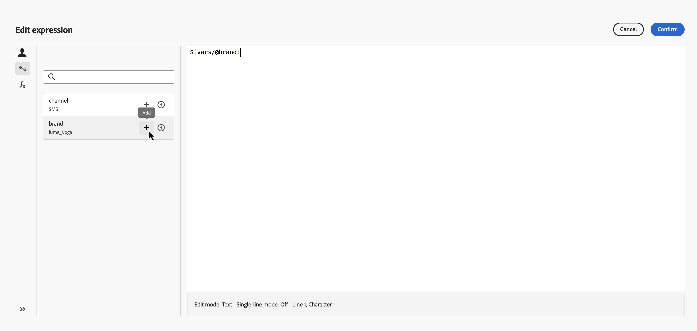

# オーケストレーションされたキャンペーンでの変数の使用 {#variables-oc}

## 変数の設定方法 {#set}

オーケストレーションキャンペーンでは、変数（ターゲティングを促進する値、**[!UICONTROL テスト]**&#x200B;条件、その他のキャンバスロジック）を使用して作業できます。 これらの値は、次の2つの場所から取得できます。

* **シグナル** — キャンペーン スケジュールが&#x200B;**[!UICONTROL シグナル]**&#x200B;によってトリガーされる場合、キャンペーンを実行するときにパラメーターを渡すことができます。 これらのパラメーターは、その実行のトリガーされたオーケストレーションキャンペーンで変数として使用できるようになります。 [&#x200B; シグナルを使用してオーケストレーションされたキャンペーンをトリガーする方法を学ぶ](trigger-orchestrated-campaign.md)

* **グローバル変数** — **[!UICONTROL 変数の編集]** メニューを使用して、キャンペーン上で名前と値のペアを直接定義できます。APIやシグナルは必要ありません。 [&#x200B; オーケストレーションされたキャンペーンでグローバル変数を定義する方法を学ぶ](global-variables.md)

>[!NOTE]
>
>現時点では、変数は&#x200B;**text**&#x200B;の値のみをサポートしています。
>
>変数は&#x200B;**キャンバスロジック** （ルール、条件）を駆動するので、メッセージのパーソナライズには使用できません。

## キャンバスでの変数の使用 {#use}

変数は、キャンバスの次の場所で使用できます。

* **ルールビルダー** — ルールの式エディターを開き、**イベント変数** ピッカーを使用して変数を選択し、その参照を式に挿入します。 [詳しくは、式の編集方法を参照してください。](edit-expressions.md)

  次の例では、`brand`という名前の変数が渡され、ルールはそれをフィルター条件として使用します。

  {zoomable="yes"}

* **[!UICONTROL テスト &#x200B;] アクティビティ** – 条件を定義すると、**[!UICONTROL 条件タイプ]** ドロップダウンには、スコープ内のすべての変数が&#x200B;**[!UICONTROL 人口数]**&#x200B;と共に一覧表示されます。 テスト ブランチのベースとして使用する変数を選択します。 [**[!UICONTROL テスト]** アクティビティ &#x200B;](activities/test.md)の設定方法について説明します

  以下の例では、`channel`変数を使用して、その値に応じて異なる遷移にフローをルーティングします。

  {zoomable="yes"}
