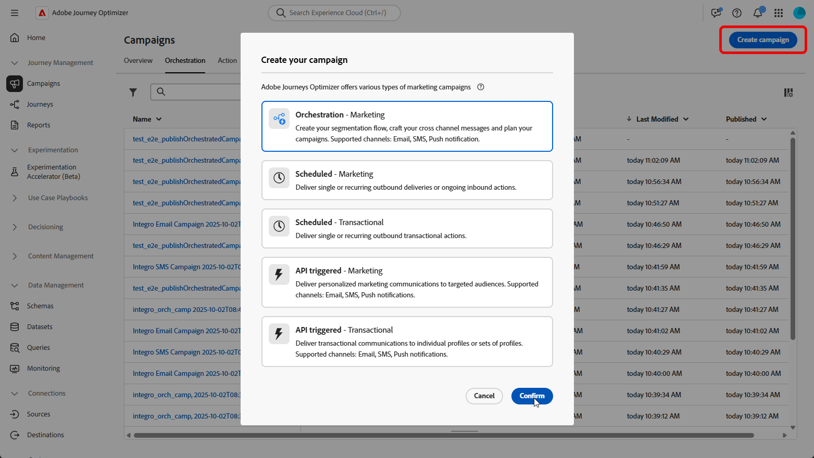
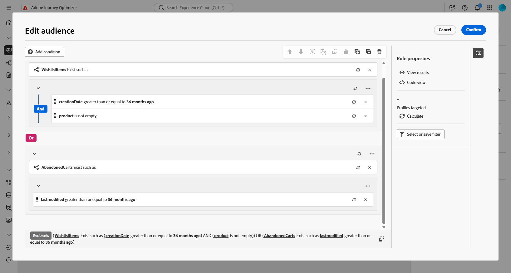
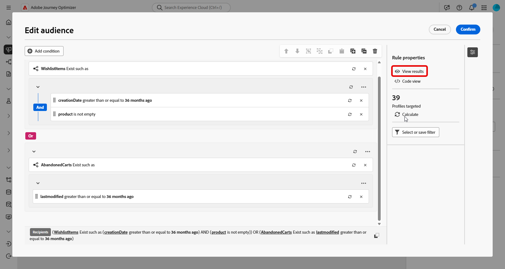
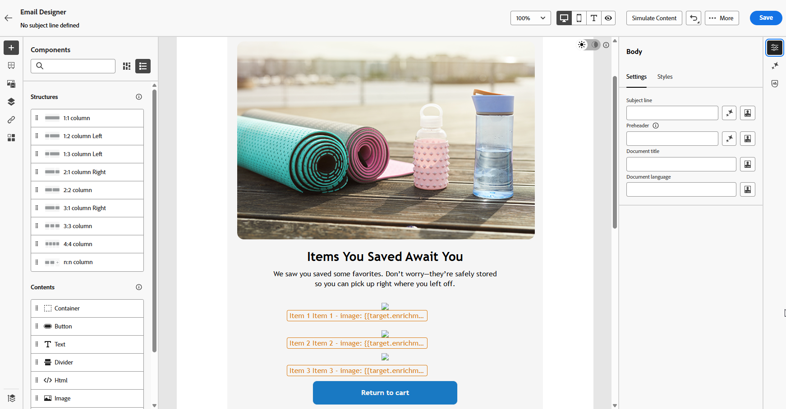

# ウィッシュリスト項目の更新を送信 {#wishist-uc}

>[!BEGINSHADEBOX]

この例では&#x200B;**Wishlist** スキーマを使用していますが、**購入**、**サブスクリプション**&#x200B;など、**受信者**&#x200B;と1対多の関係を持つエンティティ、または各受信者が複数の関連レコードを持つカスタムスキーマにも同じ方法が適用されます。

**この使用例に必要なスキーマ：**

* **受信者**: ターゲティングディメンションとして使用されます
* **WishlistItems**: フィールド：`creationDate`、`product`、`Wishlistid`
* **製品**: フィールド：`description`、`priceref`、`imageurl`
* **AbandonedCarts** （オプション）: フィールド：`lastmodified`

➡️ [ リレーショナルスキーマの設定方法を学ぶ](gs-schemas.md)

>[!ENDSHADEBOX]

{zoomable="yes"}

このオーケストレーションされたキャンペーンでは、ウィッシュリストに保存された商品をリマインドすることで、訪問者の再エンゲージに重点を置いています。 キャンペーンオーケストレーションを利用して、ウィッシュリストのアクティビティにもとづいて条件を設定し、オーディエンスを定義することで、訪問者をコンバージョンへ誘導できます。

1. まず、ウィッシュリストのリエンゲージメントを目的とした新しい施策を策定しましょう。 これにより、商品を保存することで、購買意欲を示した顧客にメッセージを集中させることができます。

   {zoomable="yes"}

1. **キャンペーン設定**&#x200B;を入力します。

1. ウィッシュリストの動作に基づいて、ターゲットとする顧客のグループを特定する&#x200B;**[!UICONTROL オーディエンスを作成]** アクティビティを追加します。

   {zoomable="yes"}

1. このオーディエンスに対して記述的な&#x200B;**[!UICONTROL ラベル]**&#x200B;を設定し、**[!UICONTROL 受信者]**&#x200B;を&#x200B;**[!UICONTROL ターゲティングディメンション]**&#x200B;として選択します。 次に、**[!UICONTROL 続行]**&#x200B;をクリックして、オーディエンスを設定します。

1. 「**[!UICONTROL 条件を追加]**」をクリックして、次の条件を作成してオーディエンスを絞り込みます。

   `WishlistItems Exist such as (creationDate greater than or equal to 36 months ago) AND (product is not empty`
または
   `AbandonedCarts Exist such as lastmodified greater than or equal to 36 months ago`

   このオーディエンスは、ウィッシュリストを持つ受信者、製品画像を含むアイテム、定義された期間内にカートを放棄した受信者に基づいています。

   {zoomable="yes"}

1. **[!UICONTROL 計算]**&#x200B;をクリックして、これらの条件によって影響を受けるプロファイルの数を確認し、**[!UICONTROL 結果を表示]**&#x200B;して各条件の詳細を調べ、オーディエンスがターゲットセグメントに一致することを確認します。

   {zoomable="yes"}

1. 「**[!UICONTROL 確認]**」をクリックします。

1. **[!UICONTROL エンリッチメント]** アクティビティを追加して、**ウィッシュリスト**&#x200B;および&#x200B;**製品情報**&#x200B;でキャンペーンをパーソナライズします。

   {zoomable="yes"}

1. 「**[!UICONTROL エンリッチメントデータを追加]**」をクリックします。

1. `Targeting dimension > Wishlistitems > Wishlistid`にアクセスします。

   {zoomable="yes"}

1. データの収集方法を選択します。この場合、**[!UICONTROL データを収集]**&#x200B;して、オーディエンスのウィッシュリストの詳細を収集します。

1. 取得する行数を選択します。 デフォルトでは、ウィッシュリストごとに3つのアイテムが取得されますが、キャンペーンのニーズに応じて調整することで、より多くの商品や少ない商品を強調表示することができます。

1. 「**[!UICONTROL 属性を追加]**」をクリックして、次の3つの属性を作成します。

   * `Product > description`
   * `Product > priceref`
   * `Product > imageurl`

   これにより、コンバージョンを促進するための詳細な製品情報で、メッセージを充実させることができます。

   {zoomable="yes"}

1. メールアクティビティを追加して、顧客一人ひとりに合わせてパーソナライズされたリエンゲージメントメッセージを作成します。 「**[!UICONTROL コンテンツを編集]**」をクリックして、コンテンツのデザインを開始します。

   ➡️ [電子メールのパーソナライゼーションの詳細](../email/content-from-scratch.md)

   {zoomable="yes"}

1. メールを確定したら、オーケストレーションされたキャンペーンから「**[!UICONTROL 開始]**」をクリックして、キャンペーンをドラフトモードで保存して実行します。

1. ドラフトモードを開始した後、ウィッシュリストの詳細でオーディエンスをプレビューします。

   詳細なインサイトを得るには、出力結果をクリックし、**[!UICONTROL 結果をプレビュー]**&#x200B;を選択します。

   {zoomable="yes"}

キャンペーンが実行された後はレポートを確認できるため、キャンペーンのパフォーマンスに関する堅牢なデータとKPIのセットを入手できます。

➡️ [ レポートの詳細](../reports/campaign-global-report-cja.md)
