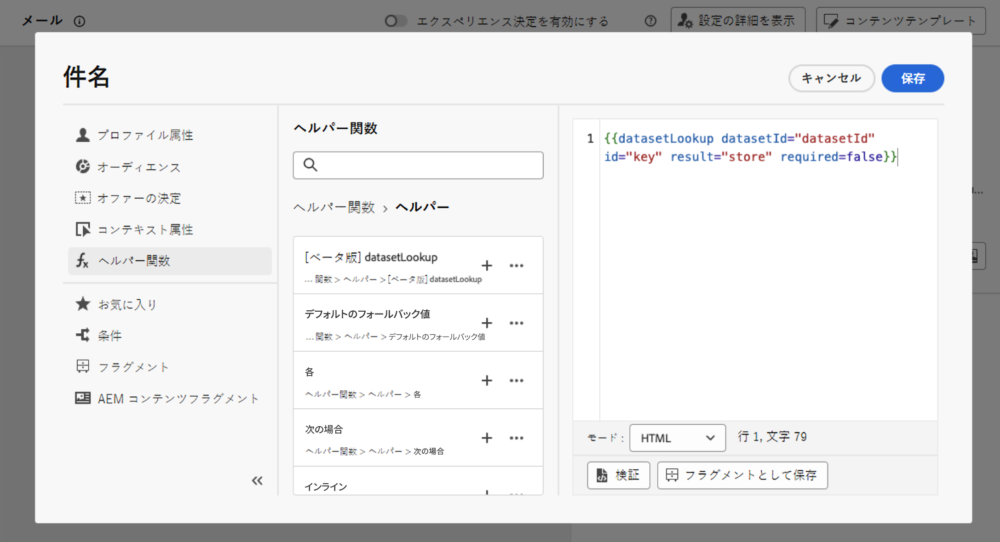
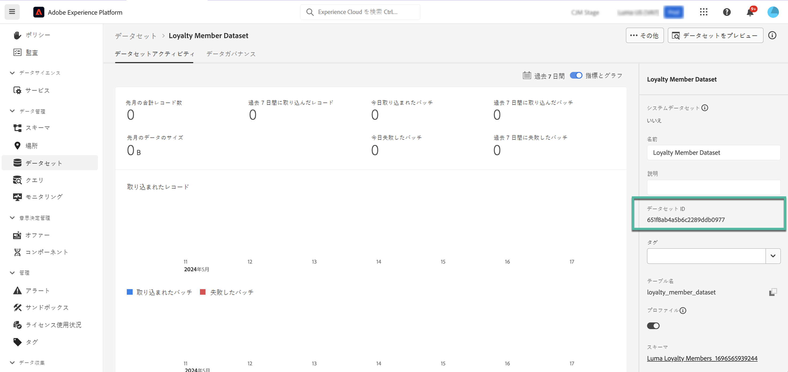
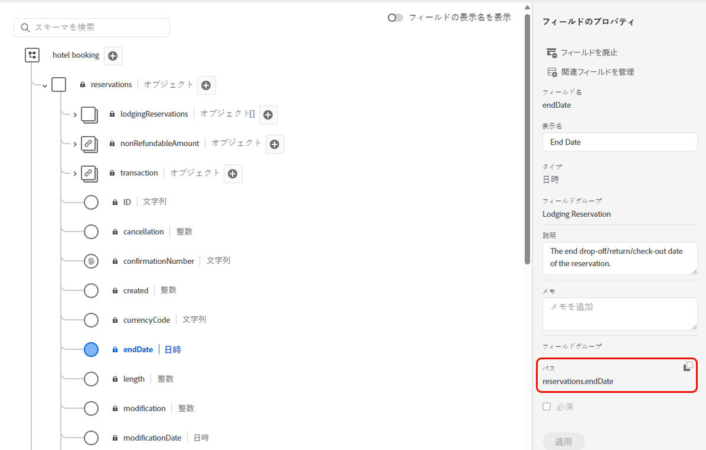
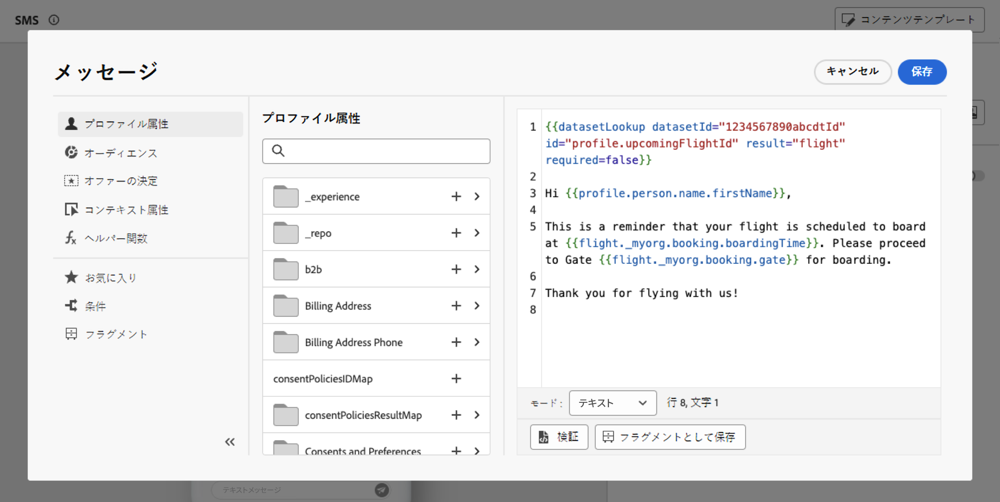

# Adobe Experience Platform データをパーソナライゼーションに使用 {#aep-data}

>[!BEGINSHADEBOX]

**このページ：** パーソナライゼーションエディターでdatasetLookup ヘルパー関数を使用して、Adobe Experience Platform レコードデータセットからフィールドを取得し、コンテンツをパーソナライズする方法を説明します。

>[!ENDSHADEBOX]

>[!AVAILABILITY]
>
>この機能は現在、限定提供リリースとしてすべてお客様が利用できます。
>
>現時点では、限定された一連のお客様のみが、「datasetLookup」ヘルパー関数を式フラグメント内で使用できます。 アクセス権を取得するには、アドビ担当者にお問い合わせください。

Journey Optimizer を使用すると、パーソナライゼーションエディターで Adobe Experience Platform レコードデータセットのデータを利用して、[コンテンツをパーソナライズする](../personalization/personalize.md)ことができます。 開始する前に、まず、参照パーソナライゼーションに必要なデータセットを参照に対して有効にする必要があります。 詳しくは、[Adobe Experience Platform データの使用](../data/lookup-aep-data.md)の節を参照してください。

データセットの参照パーソナライゼーションが有効になると、そのデータを使用してコンテンツを [!DNL Journey Optimizer] にパーソナライズできます。

1. メッセージなどのパーソナライズ機能を定義でき、すべてのコンテキストで使用できるパーソナライゼーションエディターを開きます。 [パーソナライゼーションエディターの操作方法を学ぶ](../personalization/personalization-build-expressions.md)

1. ヘルパー関数リストに移動して、**datasetLookup** ヘルパー関数をコードペインへ追加します。

   

1. この関数は、Adobe Experience Platform データセットからフィールドを呼び出すことができる、定義済みの構文を提供します。 構文は以下の通りです。

   ```
   {{datasetLookup datasetId="datasetId" id="key" result="store" required=false}}
   ```

   * **datasetId** は作業中のデータセットの ID です。
   * **id** は、参照データセットのプライマリ ID と結合する必要があるソース列の ID です。

     >[!NOTE]
     >
     >このフィールドに入力する値は、フィールド ID（`profile.packages.packageSKU`）、ジャーニーイベントで渡されるフィールド（`context.journey.events.event_ID.productSKU`）、または静的な値（`sku007653`）です。 いずれの場合も、システムは値を使用してデータセットを検索し、キーと一致するかどうかを確認します。
     >
     >キーにリテラル文字列値を使用する場合は、テキストを引用符で囲みます。 例：`{{datasetLookup datasetId="datasetId" id="SKU1234" result="store" required=false}}`。 属性値を動的キーとして使用する場合は、引用符を削除します。 例：`{{datasetLookup datasetId="datasetId" id=category.product.SKU result="SKU" required=false}}`

   * **result** はデータセットから取得するすべてのフィールド値を参照するために指定する必要がある、任意の名前です。 この値はコード内で各フィールドを呼び出すために使用されます。

   * **required=false**：required が TRUE に設定されている場合、一致するキーが見つかった場合にのみメッセージが配信されます。 false に設定した場合は、一致するキーは必要なく、メッセージを配信できます。 false に設定した場合、メッセージコンテンツのフォールバックまたはデフォルト値を考慮することをお勧めします。

   +++データセット ID はどこで取得できますか？

   データセット ID は、Adobe Experience Platform ユーザーインターフェイスで取得できます。 データセットの操作方法について詳しくは、[Adobe Experience Platform ドキュメント](https://experienceleague.adobe.com/ja/docs/experience-platform/catalog/datasets/user-guide#view-datasets){target="_blank"}を参照してください。

   

   +++

1. ニーズに合わせて構文を調整します。 この例では、乗客のフライトに関連するデータを取得します。 構文は以下の通りです。

   ```
   {{datasetLookup datasetId="1234567890abcdtId" id=profile.upcomingFlightId result="flight"}}
   ```

   * ID が「1234567890abcdtId」のデータセットで作業しています。
   * ルックアップデータセットとの結合に使用するフィールドは、*profile.upcomingFlightId* です。
   * 「フライト」参照の下のすべてのフィールド値を含めるようにします。

1. Adobe Experience Platform データセットで呼び出す構文が設定されたら、取得するフィールドを指定できます。 構文は以下の通りです。

   ```
   {{result.fieldId}}
   ```

   >[!NOTE]
   >
   >データセットフィールドを参照する場合は、スキーマ内で定義されている完全なフィールドパスと一致することを確認します。
   >
   >ヘルパー関数を使用して取得できるフィールドの数にハードリミットはありません。 ただし、最高のパフォーマンスを得るには、スループットに影響を与えないように、フィールド数を 50 未満に保つことをお勧めします。

   * **result** は **datasetLookup** ヘルパー関数で **result** パラメーターに割り当てた値です。 この例では「フライト」です。
   * **fieldID** は取得するフィールドの ID です。 この ID は、データセットに関連するレコードスキーマを参照する際に、[!DNL Adobe Experience Platform] ユーザーインターフェイスに表示されます。

     +++フィールド ID はどこで取得できますか？

     フィールド ID は、Adobe Experience Platform ユーザーインターフェイスでデータセットをプレビューするときに取得できます。 データセットのプレビュー方法について詳しくは、[Adobe Experience Platform ドキュメント](https://experienceleague.adobe.com/ja/docs/experience-platform/catalog/datasets/user-guide#preview){target="_blank"}を参照してください。

     

     +++

   この例では、乗客の搭乗時間と搭乗口に関する情報を使用します。 したがって、次の 2 行を追加します。

   * `{{flight._myorg.booking.boardingTime}}`
   * `{{flight._myorg.booking.gate}}`

1. コードの準備が整ったら、通常どおりコンテンツを完成させ、シミュレーションメソッドを使用してテストします。「**[!UICONTROL コンテンツをシミュレート]**」をクリックして、サンプル入力データまたはAI自動生成を使用してコンテンツのバリエーションをテストするか、「**[!UICONTROL コンテンツをシミュレート]**」をクリックし、ドロップダウンから「**[!UICONTROL コンテンツをシミュレート（AEP プロファイル）]**」を選択して、テストプロファイルでプレビューします。 [コンテンツのプレビューとテストの方法について学ぶ](../content-management/preview-test.md)


   

## クイックリファレンス {#quick-reference}

このセクションには、このトピックに関連する解釈、検索、質問への回答をサポートすることを目的とした構造化された知識が含まれています。

理解を深めるには、この情報をこのページのドキュメントと組み合わせる必要があります。 どちらのソースも単独で使用することを意図していません。このページでは、機能について説明しますが、この節では、用語、意図、適用可能性、および制約の曖昧さを解消するのに役立つ追加のコンテキストを提供します。

>[!BEGINTABS]

>[!TAB 概要]

**TL;DR**

このページでは、Journey Optimizer パーソナライゼーションエディターの`datasetLookup` ヘルパー関数を使用して、Adobe Experience Platform レコードデータセットからフィールドを取得し、メッセージのパーソナライゼーションに組み込む方法を説明します。

**インテント**

* ルックアップパーソナライズ用のAEP レコードデータセットの有効化
* パーソナライゼーション式に`datasetLookup` ヘルパー関数を追加します
* データセット ID、結合キー、結果エイリアス、必須フラグを使用して関数を設定します
* 結果エイリアスを使用して、パーソナライゼーション式で取得したデータセットフィールドを参照します
* コンテンツフローをシミュレートを使用して、パーソナライズされたコンテンツをテストする

>[!TAB 用語集]

* **datasetLookup**：指定されたキーで結合することで、AEP レコードデータセットからフィールド値を取得するパーソナライゼーションエディターのヘルパー関数。 *（製品固有）*
* **レコードデータセット**：検索パーソナライゼーションで有効にできるレコードレベルのデータを含むAdobe Experience Platform データセットタイプ。 *（製品固有）*
* **ルックアップパーソナライゼーション**：送信時にAEP レコードデータセットからフィールドを取得し、メッセージコンテンツをパーソナライズするプロセス。 *（製品固有）*
* **結果パラメーター**: `datasetLookup`呼び出しで割り当てられた任意のエイリアス。後続の式（例：`{{result.fieldId}}`）で取得したすべてのフィールド値を参照するために使用されます。
* **必須パラメーター**: メッセージ配信にデータセット内で一致するキーが必要かどうかを制御する`datasetLookup`のブール型フラグ。

>[!TAB 用語]

* **正規の名前：** datasetLookup — バリアント：データセット検索、データセット検索ヘルパー、データセット検索ヘルパー関数
* **類義語：** 「datasetLookup」 = 「dataset lookup helper function」
* **混同しないでください：** 「datasetId」（AEP データセットの識別子）≠「id」（データセットのプライマリ IDと結合するために使用されるソース列）≠「result」（取得したフィールド値を参照するためのエイリアス）

>[!TAB  ガードレールと制限]

* 機能は限定的に提供されますが、一部のお客様にはまだ一般提供されていません。
* 式フラグメント内の`datasetLookup` ヘルパー関数は、限られたセットのお客様のみが利用できます。アクセスするには、Adobe担当者にお問い合わせください。
* データセットを`datasetLookup`で使用する前に、ルックアップのパーソナライゼーションに対して明示的に有効にする必要があります。
* スループットへの影響を避けるために、`datasetLookup`呼び出しごとに取得されるフィールド数を50未満に抑えます（推奨される制限 – ページにハード制限は記載されていません）。

>[!TAB FAQ]

**Q: `datasetLookup` ヘルパー関数とは何ですか？**

これは、Adobe Experience Platform レコードデータセットからフィールド値を取得するパーソナライゼーションエディターのヘルパー関数で、そのデータをメッセージパーソナライゼーションに組み込むことができます。

**Q: `required=false`と一致するキーがデータセットに見つからない場合はどうなりますか？**

メッセージは引き続き配信できます。 `required=false`を使用する場合は、メッセージコンテンツのフォールバックまたはデフォルト値を考慮することをお勧めします。

**Q: `required=true`と一致するキーが見つからなかった場合はどうなりますか？**

一致するキーがデータセット内に見つかった場合にのみ、メッセージが配信されます。

**Q：構文に必要なデータセット IDとフィールド IDはどこにありますか？**

データセット IDは、Adobe Experience Platform UIのデータセットで取得できます。 フィールド IDは、データセットをプレビューし、AEP UIでレコードスキーマを参照する際に表示されます。

**Q: `datasetLookup`を使用するコンテンツをテストするにはどうすればよいですか？**

「**コンテンツをシミュレート**」ボタンを使用して、サンプル入力データまたはAIによる自動生成でテストするか、ドロップダウンから「**コンテンツをシミュレート（AEP プロファイル）**」を選択して、テストプロファイルでプレビューします。

>[!ENDTABS]

<!-- ai-section-version: 1 | source-hash: 89d99e47 -->
