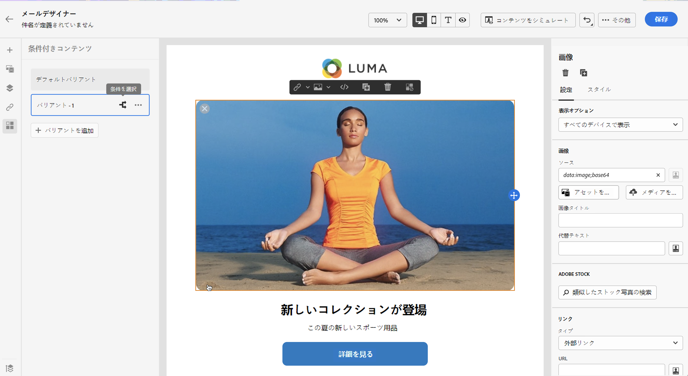
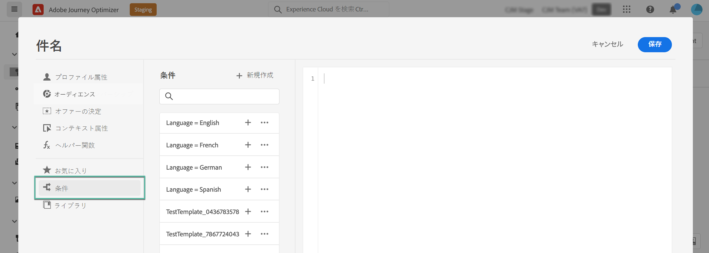
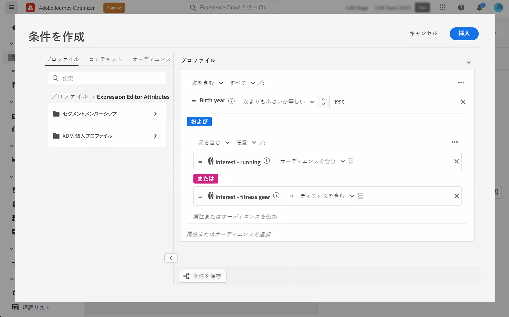
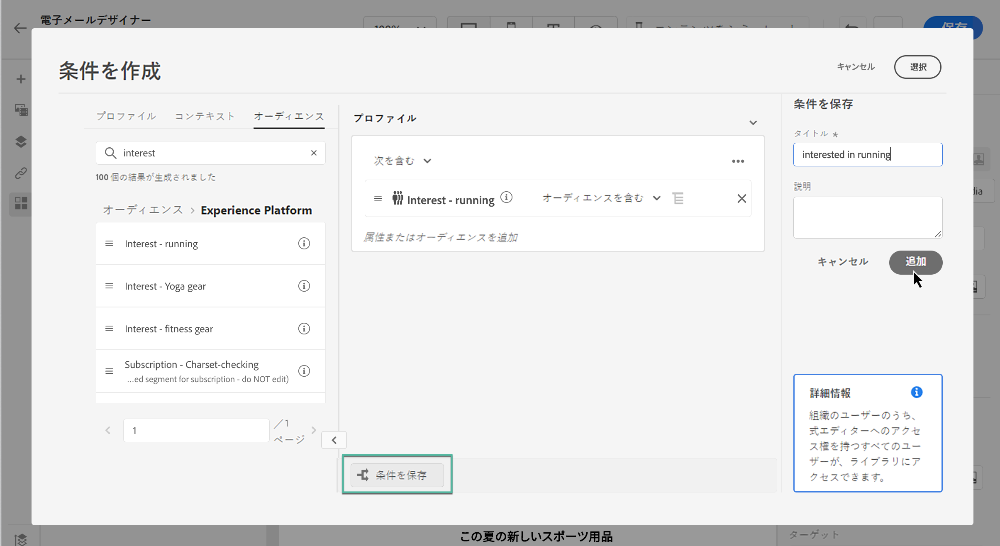
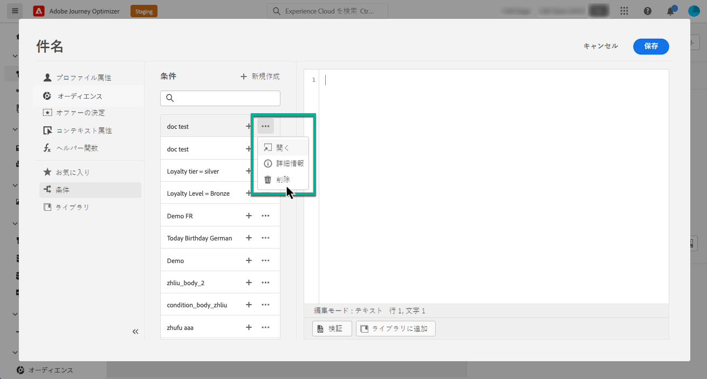

# 条件付きルールの操作 {#conditions}

>[!BEGINSHADEBOX]

**このページ：**&#x200B;では、パーソナライゼーションエディターでプロファイル属性、コンテキストイベント、オーディエンスから条件付きルールを作成し、コンテンツ全体で再利用できるようにライブラリに保存する方法を説明します。

>[!ENDSHADEBOX]

条件付きルールとは、プロファイルの属性、オーディエンスメンバーシップ、コンテキストイベントなどの様々な条件に応じて、メッセージに表示するコンテンツを定義する一連のルールです。

条件付きルールは、パーソナライゼーションエディターを使用して作成し、コンテンツ間で再利用する場合は保存できます。 [ライブラリに条件付きルールを保存する方法を学ぶ](#save)

>[!NOTE]
>
>個人が条件付きルールを保存または削除するには、[ライブラリ項目を管理](../administration/ootb-product-profiles.md)する権限が必要になります。 保存した条件は、組織内のすべてのユーザーが使用できます。

## 条件付きルールビルダーへのアクセス {#access}

条件付きルールは、パーソナライゼーションエディター内の&#x200B;**[!UICONTROL 条件]**&#x200B;メニューで作成されます。このメニューには次のいずれかの方法でアクセスできます。

* メール本文のコンポーネントに対して動的コンテンツを有効にする場合は、E メールデザイナーから。 [メールに動的コンテンツを追加する方法を学ぶ](dynamic-content.md#emails)

  

* [パーソナライゼーションエディター](personalization-build-expressions.md)を使用してパーソナライゼーションを追加できる任意のフィールド。

  

## 条件付きルールの作成 {#create-condition}

>[!CONTEXTUALHELP]
>id="ajo_expression_editor_conditions_create"
>title="条件の作成"
>abstract="プロファイル属性、コンテキストイベントまたはオーディエンスを組み合わせて、メッセージに表示するコンテンツを定義するルールを作成します。"

>[!CONTEXTUALHELP]
>id="ajo_expression_editor_conditions"
>title="条件の作成"
>abstract="プロファイル属性、コンテキストイベントまたはオーディエンスを組み合わせて、メッセージに表示するコンテンツを定義するルールを作成します。"

条件付きルールを作成する主な手順は次のとおりです。

1. パーソナライゼーションエディターまたは E メールデザイナーから&#x200B;**[!UICONTROL 条件]**&#x200B;メニューにアクセスし、「**[!UICONTROL 新規作成]**」をクリックします。

1. 必要に応じて、条件付きルールを作成します。 これを行うには、左のメニューから目的の属性をキャンバスにドラッグ&amp;ドロップして配置します。

   属性をキャンバスに組み合わせる手順は、セグメント作成のエクスペリエンスと似ています。 ルールビルダーキャンバスの操作方法について詳しくは、[このドキュメント](https://experienceleague.adobe.com/docs/experience-platform/segmentation/ui/segment-builder.html?lang=ja#rule-builder-canvas)を参照してください。

   

   属性は次の 3 つのタブに整理されます。

   * **[!UICONTROL プロファイル]**：
      * **[!UICONTROL オーディエンス]**&#x200B;には、すべてのオーディエンス属性（ステータス、バージョンなど）が一覧表示されます [Adobe Experience Platform Segmentation service](https://experienceleague.adobe.com/docs/experience-platform/segmentation/home.html?lang=ja){target="_blank"}の場合、
      * **[!UICONTROL XDM 個別プロファイル]**&#x200B;には、Adobe Experience Platform で定義される[エクスペリエンスデータモデル（XDM）スキーマ](https://experienceleague.adobe.com/docs/experience-platform/xdm/home.html?lang=ja){target="_blank"}に関連するすべてのプロファイル属性が一覧表示されます。
   * **[!UICONTROL コンテキスト]**：ジャーニーでメッセージを使用している場合、コンテキストジャーニーフィールドをこのタブから使用できます。
   * **[!UICONTROL オーディエンス]**：[Adobe Experience Platform セグメント化サービス](https://experienceleague.adobe.com/docs/experience-platform/segmentation/home.html?lang=ja){target="_blank"}で作成されたセグメント定義から生成されたすべてのオーディエンスを一覧表示します。

1. 条件付きルールの準備が整ったら、メッセージに追加して、動的コンテンツを作成できます。 [動的コンテンツの追加方法を学ぶ](dynamic-content.md)

   また、ルールを保存して、後で再利用することもできます。 [条件の保存方法を学ぶ](#save)

## 条件付きルールの保存 {#save}

頻繁に再利用する条件付きルールがある場合は、条件ライブラリに保存できます。 保存されたルールはすべて共有され、組織内の個人がアクセスして使用できます。

>[!NOTE]
>
>ジャーニーのコンテキスト属性を利用する条件付きルールは、ライブラリに保存できません。

1. 条件編集画面で、「**[!UICONTROL 条件を保存]**」ボタンをクリックします。

1. ルールに名前と説明（オプション）を入力し、「**[!UICONTROL 追加]**」をクリックします。

   

1. 条件付きルールがライブラリに保存され、 メッセージに動的コンテンツを作成するために使用できるようになります。 [動的コンテンツの追加方法を学ぶ](dynamic-content.md)

>[!CAUTION]
>
>条件付きコンテンツのバリアントに名前を付ける場合は、英数字（A～Z、a～z、0～9）のみを使用します。 特殊文字の使用（`<`、`>`、`=`、`{`、`}`など） バリエーション名では、テンプレートエディターでコンポーネントが壊れたり非表示になったりする場合があります。

## 保存済み条件付きルールの編集と削除 {#edit-delete}

「...」ボタンを使用すれば、いつでも条件付きルールを削除できます。

ライブラリに保存された条件付きルールは変更できません。 ただし、これらを使用して新しいルールを作成することはできます。 これを行うには、条件付きルールを開き、必要な変更を加えて、ライブラリに保存します。 [ライブラリに条件を保存する方法を学ぶ](#save)

## クイックリファレンス {#quick-reference}

このセクションには、このトピックに関連する解釈、検索、質問への回答をサポートすることを目的とした構造化された知識が含まれています。

理解を深めるには、この情報をこのページのドキュメントと組み合わせる必要があります。 どちらのソースも単独で使用することを意図していません。このページでは、機能について説明しますが、この節では、用語、意図、適用可能性、および制約の曖昧さを解消するのに役立つ追加のコンテキストを提供します。

>[!BEGINTABS]

>[!TAB 概要]

**TL;DR**

このページでは、パーソナライゼーションエディターでプロファイル属性、コンテキストイベント、オーディエンスから条件付きルールを作成する方法と、メッセージコンテンツ全体で再利用するためにライブラリに保存する方法について説明します。

**インテント**

* パーソナライゼーションエディターまたはメールDesignerから条件付きルールビルダーにアクセスします
* プロファイル属性、オーディエンスメンバーシップ、コンテクストに即したジャーニーフィールドを組み合わせて、条件付きルールを構築できます
* メッセージに条件付きルールを追加して動的コンテンツを作成する
* 条件ルールを条件ライブラリに保存して、組織全体で再利用できるようにします
* 保存された条件付きルールの編集または削除

>[!TAB 用語集]

* **条件付きルール**: プロファイル属性、オーディエンスメンバーシップ、コンテキストイベントなどの条件に基づいて、メッセージに表示するコンテンツを定義するルールのセット。 *（製品固有）*
* **条件ライブラリ**：保存された条件付きルールが保存され、すべてのユーザーがアクセスできる組織内の共有リポジトリ。 *（製品固有）*
* **動的コンテンツ**：表示が条件付きルールによって管理されているメッセージコンテンツ。 *（製品固有）*
* **コンテキストフィールド**: ジャーニーでメッセージが使用されている場合、ルールビルダーでジャーニー固有のフィールドを使用できます。これらのフィールドを使用するルールは、ライブラリに保存できません。
* **XDM個人プロファイル**: Adobe Experience Platformで定義されたExperience Data Model （XDM） スキーマに関連付けられたプロファイル属性で、ルール条件として使用できます。

>[!TAB 用語]

* **正規名：**&#x200B;条件付きルール – バリアント：条件、条件付きコンテンツルール
* **類義語：** 「条件付きルール」 = 「条件」 （UIのラベル付き）
* **混同しないでください：** 「プロファイル」タブ（「Audiences属性」と「XDM Individual profiles」サブセクションの両方を含む）≠「Audiences」タブ（「AEP Segmentation」サービスのセグメント定義から生成されたすべてのオーディエンスを一覧表示）
* **混同しないでください：** 「条件を保存」（ルールを共有ライブラリに保存）≠「条件を作成」（エディターで新しいルールを作成）

>[!TAB  ガードレールと制限]

* ジャーニーのコンテキスト属性を活用する条件付きルールは、条件ライブラリに保存できません。
* ライブラリからコンディショナルルールを保存または削除できるのは、**ライブラリ項目を管理**&#x200B;権限を持つユーザーのみです。
* 保存された条件は、組織内のすべてのユーザーが共有してアクセスできます。
* ライブラリに保存された条件付きルールは直接変更できません。ルールを開いて、必要な変更を行い、ライブラリに保存してください。
* バリアント名には英数字（A ～ Z、a ～ z、0 ～ 9）のみを使用する必要があります。`<`、`>`、`=`、`{`、`}`などの特殊文字を使用すると、テンプレートエディターでコンポーネントが壊れたり非表示になったりする可能性があります。

>[!TAB FAQ]

**Q：条件ルールの作成に使用できる条件は何ですか？**

プロファイル属性、オーディエンスメンバーシップ、コンテキストジャーニーフィールド（メッセージがジャーニーで使用される場合）。

**Q: ジャーニーのコンテキスト属性を使用する条件付きルールを保存できますか？**

いいえ。 ジャーニーのコンテキスト属性を活用する条件付きルールは、条件ライブラリに保存できません。

**Q: ライブラリのコンディショナルルールを保存または削除できるのは誰ですか？**

条件ルールを保存または削除できるのは、**ライブラリ項目の管理**&#x200B;権限を持つユーザーのみです。

**Q：既にライブラリに保存されている条件付きルールを変更できますか？**

ライブラリに保存された条件付きルールは、直接変更できません。 保存したルールを開いて、必要な変更を加え、ライブラリに保存できます。

**Q：条件付きコンテンツのバリエーションの命名制限はありますか？**

はい。 バリアント名には、英数字（A ～ Z、a ～ z、0 ～ 9）のみを使用する必要があります。 `<`、`>`、`=`、`{`、`}`などの特殊文字を使用すると、テンプレートエディターでコンポーネントが壊れたり非表示になったりする可能性があります。

>[!ENDTABS]

<!-- ai-section-version: 1 | source-hash: f375658d -->
