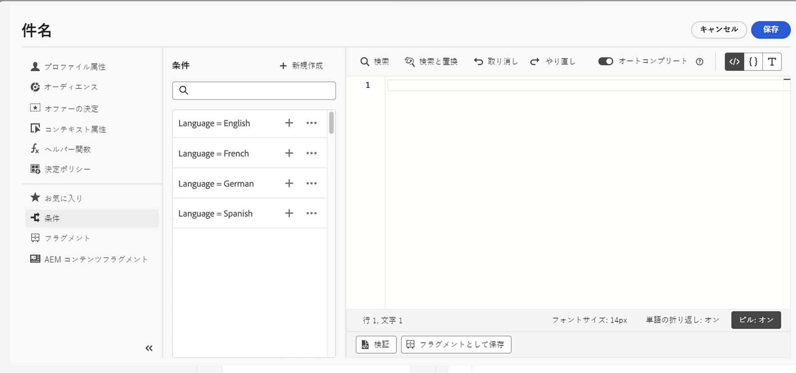

# 条件付きルールの操作 {#conditions}

条件付きルールとは、プロファイルの属性、オーディエンスメンバーシップ、コンテキストイベントなどの様々な条件に応じて、メッセージに表示するコンテンツを定義する一連のルールです。

条件付きルールは、パーソナライゼーションエディターを使用して作成し、コンテンツ間で再利用する場合は保存できます。[ライブラリに条件付きルールを保存する方法を学ぶ](#save)

>[!NOTE]
>
>個人が条件付きルールを保存または削除するには、[ライブラリ項目を管理](../administration/ootb-product-profiles.md)する権限が必要になります。保存した条件は、組織内のすべてのユーザーが使用できます。

## 条件付きルールビルダーへのアクセス {#access}

条件付きルールは、パーソナライゼーションエディター内の&#x200B;**[!UICONTROL 条件]**&#x200B;メニューで作成されます。このメニューには次のいずれかの方法でアクセスできます。

* メール本文のコンポーネントに対して動的コンテンツを有効にする場合は、E メールデザイナーから。[メールに動的コンテンツを追加する方法を学ぶ](dynamic-content.md#emails)

  

* [パーソナライゼーションエディター](personalization-build-expressions.md)を使用してパーソナライゼーションを追加できる任意のフィールド。

  

## 条件付きルールの作成 {#create-condition}

>[!CONTEXTUALHELP]
>id="ajo_expression_editor_conditions_create"
>title="条件の作成"
>abstract="プロファイル属性、コンテキストイベントまたはオーディエンスを組み合わせて、メッセージに表示するコンテンツを定義するルールを作成します。"

>[!CONTEXTUALHELP]
>id="ajo_expression_editor_conditions"
>title="条件の作成"
>abstract="プロファイル属性、コンテキストイベントまたはオーディエンスを組み合わせて、メッセージに表示するコンテンツを定義するルールを作成します。"

条件付きルールを作成する主な手順は次のとおりです。

1. パーソナライゼーションエディターまたは E メールデザイナーから&#x200B;**[!UICONTROL 条件]**&#x200B;メニューにアクセスし、「**[!UICONTROL 新規作成]**」をクリックします。

1. 必要に応じて、条件付きルールを作成します。これを行うには、左のメニューから目的の属性をキャンバスにドラッグ&amp;ドロップして配置します。

   属性をキャンバスに組み合わせる手順は、セグメント作成のエクスペリエンスと似ています。ルールビルダーキャンバスの操作方法について詳しくは、[このドキュメント](https://experienceleague.adobe.com/docs/experience-platform/segmentation/ui/segment-builder.html?lang=ja#rule-builder-canvas)を参照してください。

   

   属性は次の 3 つのタブに整理されます。

   * **[!UICONTROL プロファイル]**：
      * **[!UICONTROL オーディエンス]**&#x200B;には、[Adobe Experience Platform セグメント化サービス](https://experienceleague.adobe.com/docs/experience-platform/segmentation/home.html?lang=ja){target="_blank"}のすべてのオーディエンス属性（ステータス、バージョンなど）が一覧表示されます。
      * **[!UICONTROL XDM 個別プロファイル]**&#x200B;には、Adobe Experience Platform で定義される[エクスペリエンスデータモデル（XDM）スキーマ](https://experienceleague.adobe.com/docs/experience-platform/xdm/home.html?lang=ja){target="_blank"}に関連するすべてのプロファイル属性が一覧表示されます。
   * **[!UICONTROL コンテキスト]**：ジャーニーでメッセージを使用している場合、コンテキストジャーニーフィールドをこのタブから使用できます。
   * **[!UICONTROL オーディエンス]**：[Adobe Experience Platform セグメント化サービス](https://experienceleague.adobe.com/docs/experience-platform/segmentation/home.html?lang=ja){target="_blank"}で作成されたセグメント定義から生成されたすべてのオーディエンスを一覧表示します。

1. 条件付きルールの準備が整ったら、メッセージに追加して、動的コンテンツを作成できます。[動的コンテンツの追加方法を学ぶ](dynamic-content.md)

   また、ルールを保存して、後で再利用することもできます。[条件の保存方法を学ぶ](#save)

## 条件付きルールの保存 {#save}

頻繁に再利用する条件付きルールがある場合は、条件ライブラリに保存できます。保存されたルールはすべて共有され、組織内の個人がアクセスして使用できます。

>[!NOTE]
>
>ジャーニーのコンテキスト属性を利用する条件付きルールは、ライブラリに保存できません。

1. 条件編集画面で、「**[!UICONTROL 条件を保存]**」ボタンをクリックします。

1. ルールに名前と説明（オプション）を入力し、「**[!UICONTROL 追加]**」をクリックします。

   

1. 条件付きルールがライブラリに保存され、メッセージに動的コンテンツを作成するために使用できるようになります。[動的コンテンツの追加方法を学ぶ](dynamic-content.md)

>[!CAUTION]
>
>条件付きコンテンツのバリアントに名前を付ける場合は、英数字（A～Z、a～z、0～9）のみを使用します。バリアント名に特殊文字（`<`、`>`、`=`、`{`、`}` など）を使用すると、テンプレートエディターでコンポーネントが損なわれたり、非表示になったりする場合があります。

## 保存済み条件付きルールの編集と削除 {#edit-delete}

「...」ボタンを使用すれば、いつでも条件付きルールを削除できます。

ライブラリに保存された条件付きルールは変更できません。ただし、これらを使用して新しいルールを作成することはできます。これを行うには、条件付きルールを開き、必要な変更を加えて、ライブラリに保存します。[ライブラリに条件を保存する方法を学ぶ](#save)
