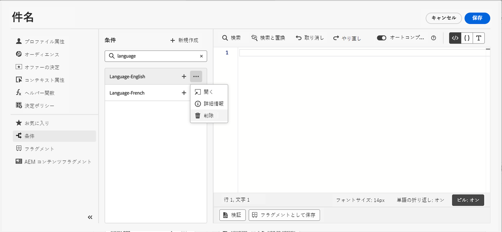

# 条件付きルールの使用 {#conditions}

条件ルールは、プロファイルの属性、セグメントのメンバーシップ、コンテキストイベントなどの様々な条件に応じて、メッセージに表示するコンテンツを定義する一連のルールです。

条件ルールは式エディターを使用して作成し、コンテンツ間で再利用する場合に保存できます。 [ライブラリに条件ルールを保存する方法を説明します](#save)

>[!NOTE]
>
>個人には [ライブラリ項目を管理](../administration/ootb-product-profiles.md) 条件ルールを保存または削除する権限。 保存した条件は、組織内のすべてのユーザーが使用できます。

## 条件付きルールビルダーへのアクセス {#access}

条件ルールは **[!UICONTROL 条件]** 式エディター内のメニュー。次のいずれかにアクセスできます。

* E メールデザイナーから、E メール本文のコンポーネントに対して動的コンテンツを有効にする場合。 [E メールに動的コンテンツを追加する方法を説明します](dynamic-content.md#emails)

   

* パーソナライゼーションを追加するには、 [式エディター](personalization-build-expressions.md).

   

## 条件ルールの作成 {#create-condition}

>[!CONTEXTUALHELP]
>id="ajo_expression_editor_conditions_create"
>title="条件の作成"
>abstract="プロファイル属性、コンテキストイベントまたはオーディエンスを組み合わせて、メッセージに表示するコンテンツを定義するルールを作成します。"

>[!CONTEXTUALHELP]
>id="ajo_expression_editor_conditions"
>title="条件の作成"
>abstract="プロファイル属性、コンテキストイベントまたはオーディエンスを組み合わせて、メッセージに表示するコンテンツを定義するルールを作成します。"

条件ルールを作成する手順は次のとおりです。

1. 次にアクセス： **[!UICONTROL 条件]** 式エディターまたは E メールデザイナーのメニューから、 **[!UICONTROL 新規作成]**.

1. 必要に応じて、条件付きルールを作成します。 これをおこなうには、左のメニューから目的の属性をキャンバスにドラッグ&amp;ドロップして配置します。

   属性をキャンバスに組み合わせる手順は、セグメント作成のエクスペリエンスと似ています。 ルールビルダーキャンバスの操作方法について詳しくは、 [このドキュメント](https://experienceleague.adobe.com/docs/experience-platform/segmentation/ui/segment-builder.html?lang=en#rule-builder-canvas).

   

   属性は次の 3 つのタブに整理されます。

   * **[!UICONTROL プロファイル]**:
      * **[!UICONTROL セグメントメンバーシップ]** には、すべてのセグメント属性（ステータス、バージョンなど）が表示されます。 対象 [Adobe Experience Platform Segmentation service](https://experienceleague.adobe.com/docs/experience-platform/segmentation/home.html?lang=ja),
      * **[!UICONTROL XDM 個別プロファイル]** に、 [エクスペリエンスデータモデル (XDM) スキーマ](https://experienceleague.adobe.com/docs/experience-platform/xdm/home.html?lang=ja) Adobe Experience Platformで定義されます。
   * **[!UICONTROL コンテキスト]**:メッセージをジャーニーで使用する場合、このタブからコンテキストジャーニーフィールドを使用できます。
   * **[!UICONTROL オーディエンス]**:には、 [Adobe Experience Platform Segmentation service](https://experienceleague.adobe.com/docs/experience-platform/segmentation/home.html).

1. 条件ルールの準備が整ったら、メッセージに追加して、動的コンテンツを作成できます。 [動的コンテンツの追加方法を説明します](dynamic-content.md)

   また、ルールを保存して、さらに再利用することもできます。 [条件の保存方法を学ぶ](#save)

## 条件付きルールの保存 {#save}

頻繁に再利用する条件ルールがある場合は、条件ライブラリに保存できます。 保存されたルールはすべて共有され、組織内の個人がアクセスして使用できます。

>[!NOTE]
>
>ジャーニーのコンテキスト属性を利用する条件ルールは、ライブラリに保存できません。

1. 条件編集画面で、 **[!UICONTROL 条件を保存]** 」ボタンをクリックします。

1. ルールに名前と説明（オプション）を入力し、「 **[!UICONTROL 追加]**.

   

1. 条件ルールがライブラリに保存されます。 これで、メッセージ内に動的コンテンツを作成するのに使用できます。 [動的コンテンツの追加方法を説明します](dynamic-content.md)

## 保存済み条件ルールの編集と削除 {#edit-delete}

楕円形ボタンを使用すれば、いつでも条件付きルールを削除できます。

ライブラリに保存された条件付きルールは変更できません。 ただし、これらを使用して新しいルールを作成することはできます。 これをおこなうには、条件付きルールを開き、必要な変更を加えて、ライブラリに保存します。 [ライブラリに条件を保存する方法を説明します](#save)
