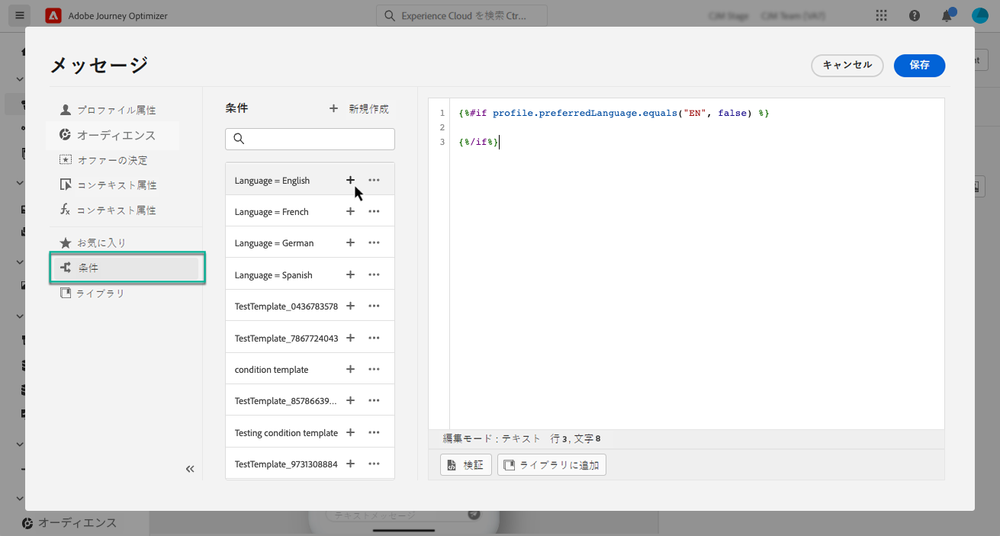
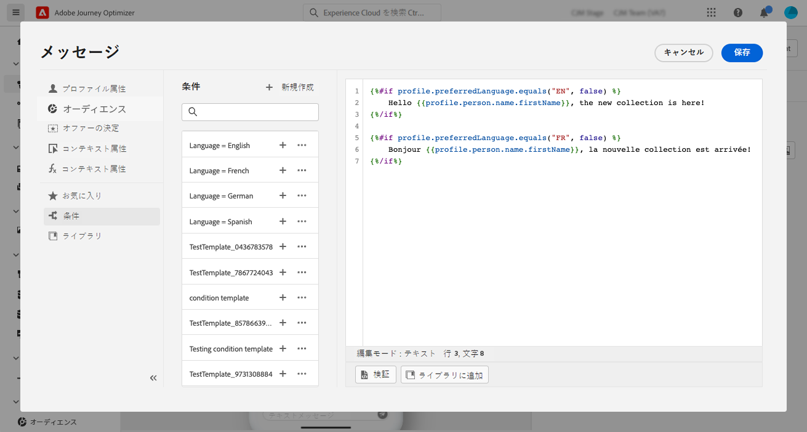
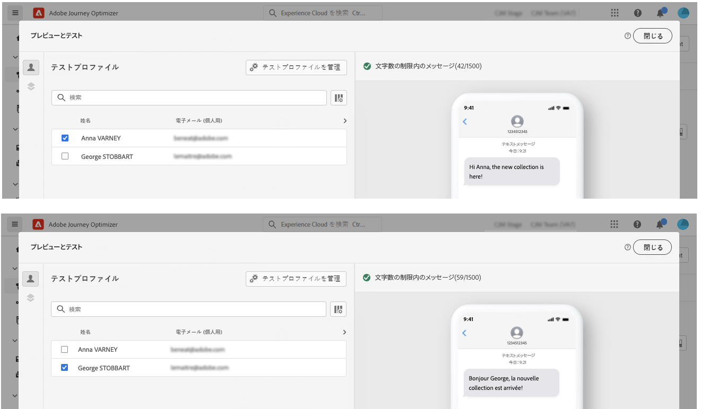
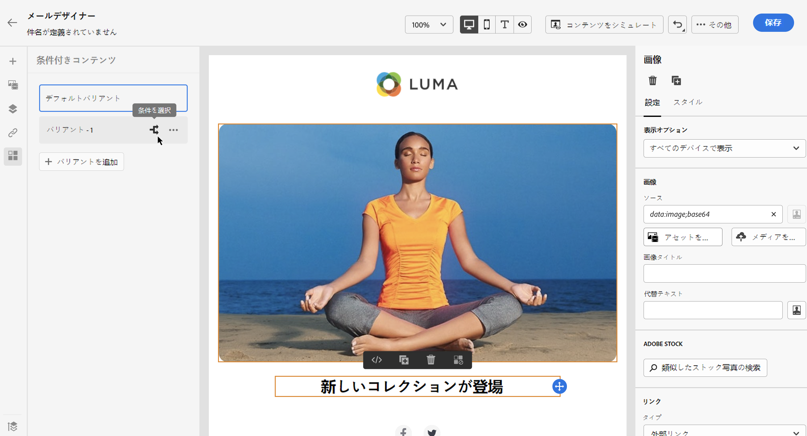
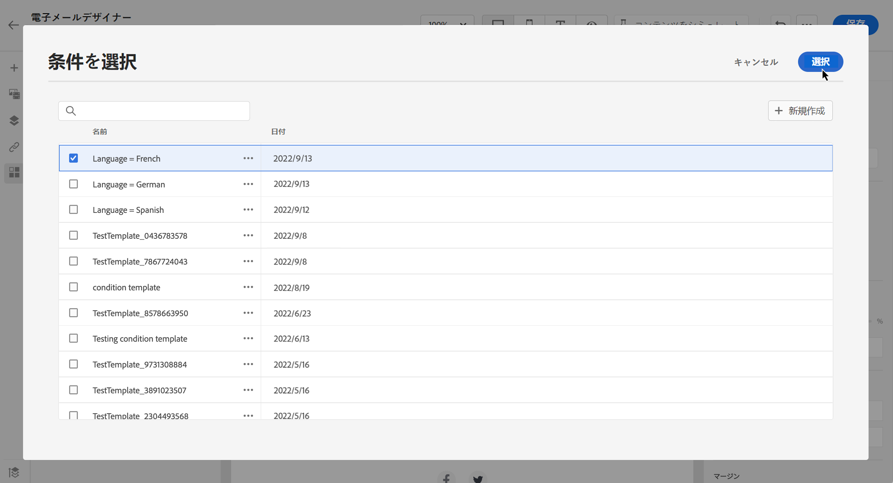
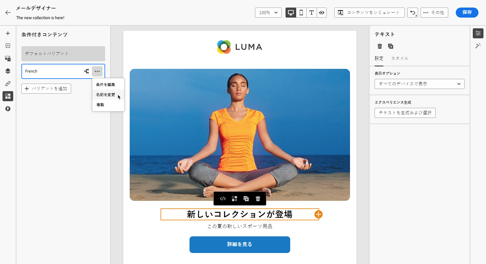
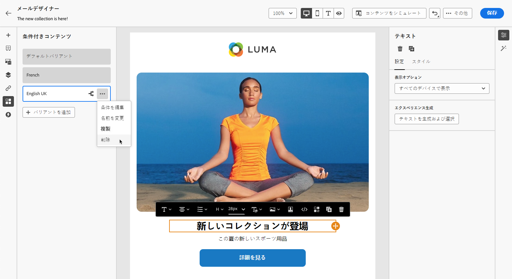

# 動的コンテンツの作成 {#dynamic-content}

>[!BEGINSHADEBOX]

**このページでは、**&#x200B;条件付きルールを使用して、パーソナライゼーション式の場合と、メール Designerのコンテンツコンポーネントのバリエーションの場合の両方で、メッセージに動的コンテンツを追加する方法について説明します。

>[!ENDSHADEBOX]

Adobe Journey Optimizer では、ライブラリで作成した条件付きルールを活用して、メッセージに動的コンテンツを追加できます。

パーソナライゼーションエディターを使用して、パーソナライゼーションを追加できる任意のフィールドに動的コンテンツを作成できます。 これには、件名行、リンク、プッシュ通知コンテンツまたはテキストタイプのオファーの表示域が含まれます。 [詳しくは、パーソナライゼーションを参照してください](personalize.md)

さらに、条件付きルールを E メールデザイナーで使用して、コンテンツコンポーネントの複数のバリアントを作成できます。

## 式への動的コンテンツの追加 {#perso-expressions}

式に動的コンテンツを追加する手順は次のとおりです。

1. 動的コンテンツを追加するフィールドに移動し、パーソナライゼーションエディターを開きます。

1. **[!UICONTROL 条件]**&#x200B;メニューを選択して、使用可能な条件付きルールのリストを表示します。 ルールの横にある「+」ボタンをクリックして、そのルールを現在の式に追加します。

   また、「**[!UICONTROL 新規作成]**」を選択して、新しいルールを作成することもできます。 [条件の作成方法についてはこちらから](create-conditions.md)

   

1. 条件付きルールが満たされた場合に表示するコンテンツを `{%if}` タグと `{%/if}` タグの間に追加します。 必要な数のルールを追加して、式の複数のバリアントを作成できます。

   次の例では、受信者の優先言語に応じて、SMS コンテンツの 2 つのバリアントが作成されています。

   

1. コンテンツの準備が整ったら、「**[!UICONTROL コンテンツをシミュレート]**」をクリックしてサンプル入力データまたはAI自動生成を使用してコンテンツのバリエーションをテストするか、「**[!UICONTROL コンテンツをシミュレート]**」をクリックし、ドロップダウンから「**[!UICONTROL コンテンツをシミュレート（AEP プロファイル）]**」を選択して、テストプロファイルでプレビューします。 [メッセージのテストとプレビューの方法についてはこちらから](../content-management/preview-test.md)

   

>[!CAUTION]
>
>条件ブロックを追加した後に E メールデザイナーが適切にレンダリングされない場合は、新しい条件の構文が正しいことと、重複または競合するステートメントが存在しないことを確認します。 問題が解決しない場合は、問題のあるセクションを新しいテンプレートで再作成し、各条件ブロックを段階的にテストすることを考慮します。

## メールへの動的コンテンツの追加 {#emails}

>[!CONTEXTUALHELP]
>id="ac_conditional_content"
>title="条件付きコンテンツ"
>abstract="条件付きルールを使用すると、コンテンツコンポーネントのバリアントを複数作成できます。 メッセージの送信時にどの条件も満たさなかった場合、デフォルトバリアントのコンテンツが表示されます。"

>[!CONTEXTUALHELP]
>id="ac_conditional_content_select"
>title="条件付きコンテンツ"
>abstract="ライブラリに保存されている条件付きルールを使用するか、新しい条件付きルールを作成します。"

E メールデザイナーでコンテンツコンポーネントのバリアントを作成する手順は次のとおりです。

1. [E メールデザイナー](../email/content-from-scratch.md)で、コンテンツコンポーネントを選択し、「**[!UICONTROL 条件付きコンテンツの有効化]**」をクリックします。

   

1. **[!UICONTROL 条件付きコンテンツ]**&#x200B;パネルが左側に表示されます。 このパネルでは、条件を使用して、選択したコンテンツコンポーネントの複数のバリアントを作成できます。

   最初のバリアントを設定するには、「**[!UICONTROL 条件を選択]**」ボタンを選択します。

   

1. 条件ライブラリが表示されます。 バリアントに関連付ける条件付きルールを選択し、「**[!UICONTROL 選択]**」をクリックします。 この例では、受信者の優先言語に応じてコンポーネントテキストを調整します。

   

   また、「**[!UICONTROL 新規作成]**」をクリックして、新しいルールを作成することもできます。 [条件の作成方法についてはこちらから](create-conditions.md)

1. 条件付きルールはバリアントに関連付けられます。 読みやすくするために、その他のアクションアイコンから、**[!UICONTROL 名前を変更]**&#x200B;アクションを選択します。

   

1. メッセージの送信時にルールが満たされた場合のコンポーネントの表示方法を設定します。 この例では、受信者の優先言語がフランス語の場合、テキストをフランス語で表示します。

   

1. コンテンツコンポーネントに必要な数だけバリアントを追加します。 異なるバリアントをいつでも切り替えて、条件付きルールに応じてコンテンツコンポーネントを表示する方法を確認できます。

   >[!NOTE]
   >
   >* メッセージの送信時にバリアントで定義されたルールがいずれも満たされない場合、コンテンツコンポーネントは、**[!UICONTROL デフォルトのバリアント]**&#x200B;に定義されたコンテンツを表示します。
   >
   >* 条件付きコンテンツは、関連付けられているルールに照らして、バリアントの表示順に評価されます。 他の条件を満たさない場合は、常にデフォルトのバリアントが表示されます。
   >
   >* 複数の条件付きバリアントを含むメールの配達確認をシミュレートまたはレンダリングする際、Journey Optimizer ではより多くの処理時間が必要になる場合があります。 タイムアウトやエラーメッセージが発生した場合は、バリアントの合計数を減らすか、条件ルールを簡素化することを検討してください。 コンテンツのテストについて詳しくは、[このページ](../content-management/preview-test.md)を参照してください。

1. バリアントを削除するには、目的のバリアントの横にある「その他のアクション」アイコンをクリックし、「**[!UICONTROL 削除]**」を選択します。

   

## クイックリファレンス {#quick-reference}

このセクションには、このトピックに関連する解釈、検索、質問への回答をサポートすることを目的とした構造化された知識が含まれています。

理解を深めるには、この情報をこのページのドキュメントと組み合わせる必要があります。 どちらのソースも単独で使用することを意図していません。このページでは、機能について説明しますが、この節では、用語、意図、適用可能性、および制約の曖昧さを解消するのに役立つ追加のコンテキストを提供します。

>[!BEGINTABS]

>[!TAB 概要]

**TL;DR**

このページでは、条件付きルールを使用して、パーソナライゼーションエディターのエクスプレッションタグまたはメールDesignerのコンテンツコンポーネントのバリエーションとして、メッセージに動的コンテンツを追加する方法について説明します。

**インテント**

* `` / ``個の条件付きタグを使用して、パーソナライゼーション式に動的コンテンツを追加します
* シミュレーションを使用した複数の動的コンテンツバリエーションのプレビュー
* メール Designer コンテンツコンポーネントで条件付きコンテンツを有効にする
* 条件付きルールにリンクされた複数のコンポーネントバリエーションを作成します
* 送信時に条件が満たされない場合に表示されるデフォルトバリアントを管理します

>[!TAB 用語集]

* **動的コンテンツ**：条件付きルールに基づいて異なるメッセージコンテンツ。送信時に定義された条件が満たされているかどうかに応じて、異なるコンテンツが表示されます。 *（製品固有）*
* **条件付きコンテンツ**: コンテンツコンポーネントに条件付きルールを適用し、複数の表示バリエーションを作成するメール Designer機能。 *（製品固有）*
* **既定のバリアント**: メッセージの送信時に、定義された条件付きルールのいずれも満たされないときに、コンポーネントに表示されるコンテンツ。 *（製品固有）*
* **``/ `` タグ**：条件付きルールが満たされた場合にのみ表示されるコンテンツブロックをラップするために使用されるPersonalization エディター式の構文。

>[!TAB 用語]

* **正規名：**&#x200B;動的コンテンツ – バリアント：条件付きコンテンツ、パーソナライズされたコンテンツ
* **同義語：** 「条件付きコンテンツ」（電子メールDesigner UI ラベル） =「動的コンテンツ」（全体で使用される一般的な用語）
* **式に動的コンテンツを追加する（`` タグをパーソナライゼーションエディターで使用）≠メールに動的コンテンツを追加する（メールDesignerでコンポーネントバリエーションを作成する – 2つの異なるワークフロー）と混同しないでください。**
* **名前付きバリアント（それぞれ特定の条件付きルールに関連付けられている）≠「デフォルトのバリアント」（「条件付きルールが満たされていない場合に表示）を混同しないでください。**

>[!TAB  ガードレールと制限]

* 条件付きコンテンツバリアントは、表示される順序で関連するルールに対して評価されます。他の条件が満たされない場合は、常にデフォルトのバリアントが表示されます。
* 複数の条件付きバリエーションを含むメールのプルーフをシミュレーションまたはレンダリングする場合、Journey Optimizerでは、より多くの処理時間が必要になる場合があります。タイムアウトやエラーが発生した場合は、バリエーションの数を減らすか、条件付きルールを簡素化することを検討してください。
* 条件付きブロックを追加した後にメールDesignerが適切にレンダリングできない場合は、各条件の構文が正しく、重複した文や競合する文が存在しないことを確認します。

>[!TAB FAQ]

**Q: メッセージの送信時に定義された条件のいずれも満たさない場合はどうなりますか？**

コンテンツコンポーネントには、デフォルトバリアントで定義されたコンテンツが表示されます。

**Q：条件付きコンテンツのバリエーションはどの順序で評価されますか？**

バリエーションは、表示される順序で、関連するルールに対して評価されます。 他の条件を満たさない場合は、常にデフォルトバリアントが表示されます。

**Q: Journey Optimizerの動的コンテンツはどこに追加できますか？**

パーソナライゼーションエディターを使用して、件名、リンク、プッシュ通知コンテンツ、テキストタイプのオファー表現など、パーソナライゼーションを追加できるフィールドや、条件付きバリエーションを使用したメールDesignerコンテンツコンポーネントなど、あらゆるフィールドでパーソナライゼーションを追加できます。

**Q：条件付きブロックを追加した後にメールDesignerがレンダリングできない場合はどうすればよいですか？**

各条件の構文が正しく、重複した文や競合する文が存在しないことを確認します。 問題が解決しない場合は、新しいテンプレートで問題のあるセクションを再構築し、各条件付きブロックを段階的にテストします。

>[!ENDTABS]

<!-- ai-section-version: 1 | source-hash: e6005d80 -->
