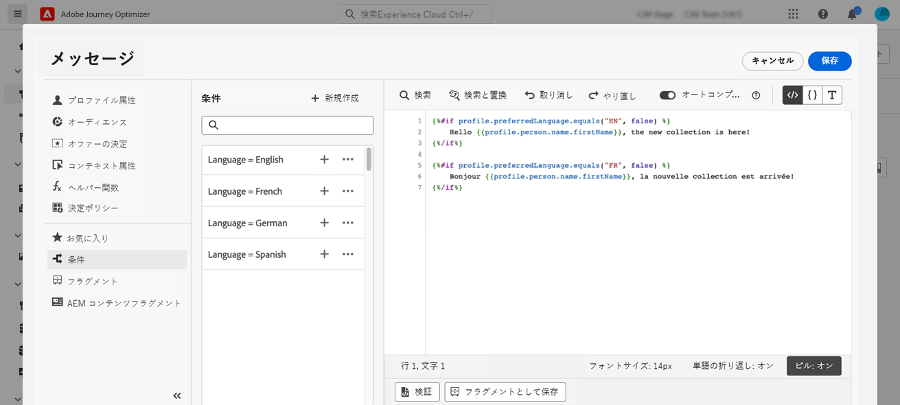

# 動的コンテンツの作成 {#dynamic-content}

Adobe Journey Optimizerでは、ライブラリで作成した条件付きルールを活用して、メッセージに動的コンテンツを追加できます。

式エディターを使用してパーソナライゼーションを追加できる任意のフィールドに、動的コンテンツを作成できます。 件名行、リンク、プッシュ通知コンテンツ、テキストタイプのオファーの表示域などが含まれます。 [パーソナライゼーションコンテキストの詳細を説明します](personalization-contexts.md)

さらに、条件付きルールを E メールデザイナーで使用して、コンテンツコンポーネントの複数のバリアントを作成できます。

## 式への動的コンテンツの追加 {#perso-expressions}

式に動的コンテンツを追加する手順は次のとおりです。

1. 動的コンテンツを追加するフィールドに移動し、式エディターを開きます。

1. を選択します。 **[!UICONTROL 条件]** メニューを使用して、使用可能な条件付きルールのリストを表示します。 ルールの横にある「+」ボタンをクリックして、現在の式に追加します。

   また、新しいルールを作成するには、「 **[!UICONTROL 新規作成]**. [条件の作成方法についてはこちらから](create-conditions.md)

   

1. 次の間に追加： `{%if}` および `{%/if}` 条件ルールが満たされた場合に表示するコンテンツにタグを付けます。 必要な数のルールを追加して、式の複数のバリエーションを作成できます。

   次の例では、受信者の優先言語に応じて、SMS コンテンツに 2 つのバリアントが作成されています。

   

1. コンテンツの準備が整ったら、 **[!UICONTROL コンテンツをシミュレート]** 」ボタンをクリックします。 [メッセージのテストとプレビューの方法を説明します](../design/preview.md)

   

## E メールへの動的コンテンツの追加 {#emails}

>[!CONTEXTUALHELP]
>id="ac_conditional_content"
>title="条件付きコンテンツ"
>abstract="条件付きルールを使用して、コンテンツコンポーネントの複数のバリアントを作成します。 メッセージの送信時にどの条件も満たさなかった場合、デフォルトバリアントのコンテンツが表示されます。"

>[!CONTEXTUALHELP]
>id="ac_conditional_content_select"
>title="条件付きコンテンツ"
>abstract="ライブラリに保存されている条件ルールを使用するか、新しい条件ルールを作成します。"

E メールデザイナーでコンテンツコンポーネントのバリアントを作成する手順は次のとおりです。

1. E メールデザイナーで、コンテンツコンポーネントを選択し、 **[!UICONTROL 条件付きコンテンツを有効にする]**.

   

1. この **[!UICONTROL 条件付きコンテンツ]** ウィンドウが左側に表示されます。 このペインでは、条件を使用して、選択したコンテンツコンポーネントの複数のバリエーションを作成できます。

   最初のバリアントを設定するには、 **[!UICONTROL 条件を適用]** 」ボタンをクリックします。

   

1. 条件ライブラリが表示されます。 バリアントに関連付ける条件付きルールを選択し、「 **[!UICONTROL 選択]**. この例では、受信者の優先言語に応じてコンポーネントテキストを適応させます。

   

   また、 **[!UICONTROL 新規作成]**. [条件の作成方法についてはこちらから](create-conditions.md)

1. 条件付きルールはバリアントに関連付けられます。 可読性を高めるために、楕円メニューをクリックしてバリアントの名前を変更することをお勧めします。

   次に、メッセージの送信時にルールが満たされた場合のコンポーネントの表示方法を設定します。 この例では、受信者の優先言語の場合はフランス語でテキストを表示します。

   

1. コンテンツコンポーネントに必要な数だけバリアントを追加します。 様々なバリエーションをいつでも切り替えて、条件付きルールに応じてコンテンツコンポーネントの表示方法を確認できます。

   >[!NOTE]
   >メッセージの送信時にバリエーションで定義されたルールがいずれも満たされない場合、コンテンツコンポーネントは、 **[!UICONTROL デフォルトのバリアント]**.
   >
   >条件付きコンテンツは、バリアントが表示される順序で、関連付けられたルールに対して評価されます。 他の条件を満たさない場合は、デフォルトのバリアントが常に表示されます。
