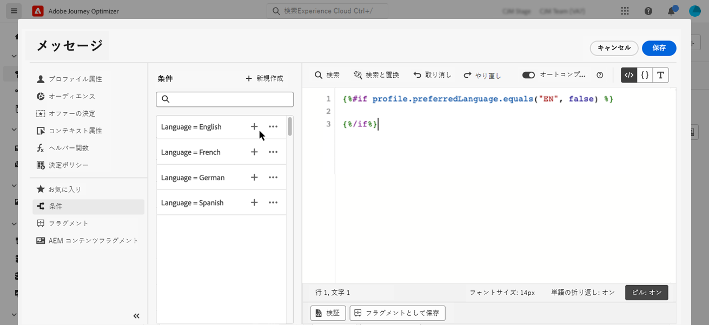
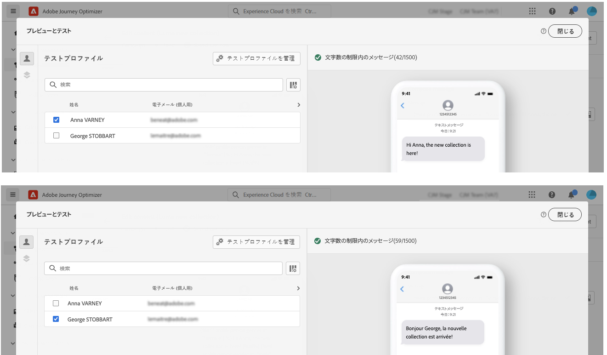

# 動的コンテンツの作成 {#dynamic-content}

Adobe Journey Optimizer では、ライブラリで作成した条件付きルールを活用して、メッセージに動的コンテンツを追加できます。

式エディターを使用してパーソナライゼーションを追加できる任意のフィールドに、動的コンテンツを作成できます。これには、件名行、リンク、プッシュ通知コンテンツまたはテキストタイプのオファーの表示域が含まれます。[パーソナライゼーションコンテキストの詳細情報](personalization-contexts.md)

さらに、条件付きルールを電子メールデザイナーで使用して、コンテンツコンポーネントの複数のバリアントを作成できます。

## 式への動的コンテンツの追加 {#perso-expressions}

式に動的コンテンツを追加する手順は次のとおりです。

1. 動的コンテンツを追加するフィールドに移動し、式エディターを開きます。

1. **[!UICONTROL 条件]**&#x200B;メニューを選択して、使用可能な条件付きルールのリストを表示します。ルールの横にある「+」ボタンをクリックして、そのルールを現在の式に追加します。

   また、「**[!UICONTROL 新規作成]**」を選択して、新しいルールを作成することもできます。[条件の作成方法についてはこちらから](create-conditions.md)

   

1. 条件付きルールが満たされた場合に表示するコンテンツを `{%if}` タグと `{%/if}` タグの間に追加します。必要な数のルールを追加して、式の複数のバリアントを作成できます。

   次の例では、受信者の優先言語に応じて、SMS コンテンツの 2 つのバリアントが作成されています。

   

1. コンテンツの準備が整ったら、「**[!UICONTROL コンテンツをシミュレート]**」ボタンを使用して、異なるバリアントをプレビューできます。[メッセージのテストとプレビューの方法についてはこちらから](../design/preview.md)

   

## メールへの動的コンテンツの追加 {#emails}

>[!CONTEXTUALHELP]
>id="ac_conditional_content"
>title="条件付きコンテンツ"
>abstract="条件付きルールを使用すると、コンテンツコンポーネントのバリアントを複数作成できます。メッセージの送信時にどの条件も満たさなかった場合、デフォルトバリアントのコンテンツが表示されます。"

>[!CONTEXTUALHELP]
>id="ac_conditional_content_select"
>title="条件付きコンテンツ"
>abstract="ライブラリに保存されている条件付きルールを使用するか、新しい条件付きルールを作成します。"

メールデザイナーでコンテンツコンポーネントのバリアントを作成する手順は次のとおりです。

1. 電子メールデザイナーで、コンテンツコンポーネントを選択し、「**[!UICONTROL 条件付きコンテンツの有効化]**」をクリックします。

   

1. **[!UICONTROL 条件付きコンテンツ]**&#x200B;パネルが左側に表示されます。このパネルでは、条件を使用して、選択したコンテンツコンポーネントの複数のバリアントを作成できます。

   最初のバリアントを設定するには、「**[!UICONTROL 条件を適用]**」ボタンをクリックします。

   

1. 条件ライブラリが表示されます。バリアントに関連付ける条件付きルールを選択し、「**[!UICONTROL 選択]**」をクリックします。この例では、受信者の優先言語に応じてコンポーネントテキストを調整します。

   

   また、「**[!UICONTROL 新規作成]**」をクリックして、新しいルールを作成することもできます。[条件の作成方法についてはこちらから](create-conditions.md)

1. 条件付きルールはバリアントに関連付けられます。読みやすくするために、楕円メニューをクリックして、バリアントの名前を変更することをお勧めします。

   では次に、メッセージの送信時にルールが満たされた場合のコンポーネントの表示方法を設定します。この例では、受信者の優先言語がフランス語の場合、テキストをフランス語で表示します。

   

1. コンテンツコンポーネントに必要な数だけバリアントを追加します。異なるバリアントをいつでも切り替えて、条件付きルールに応じてコンテンツコンポーネントを表示する方法を確認できます。

   >[!NOTE]
   >メッセージの送信時にバリアントで定義されたルールがいずれも満たされない場合、コンテンツコンポーネントは、**[!UICONTROL デフォルトのバリアント]**&#x200B;に定義されたコンテンツを表示します。
   >
   >条件付きコンテンツは、関連付けられているルールに照らして、バリアントの表示順に評価されます。他の条件を満たさない場合は、常にデフォルトのバリアントが表示されます。
