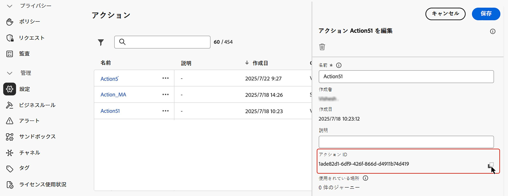
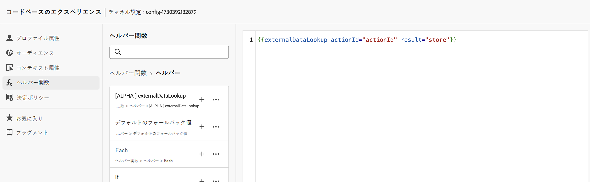
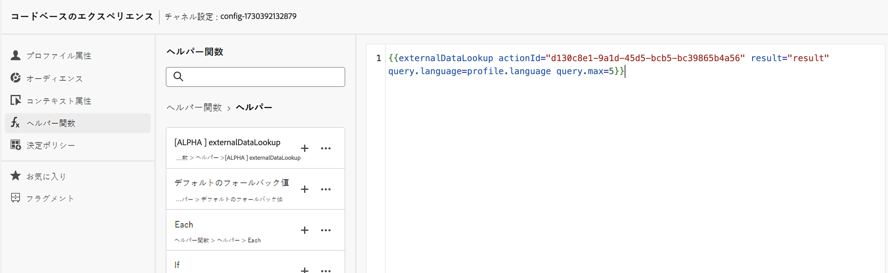
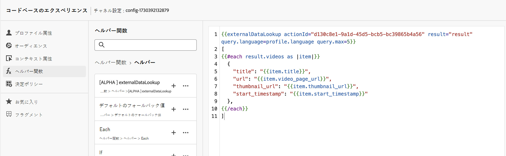
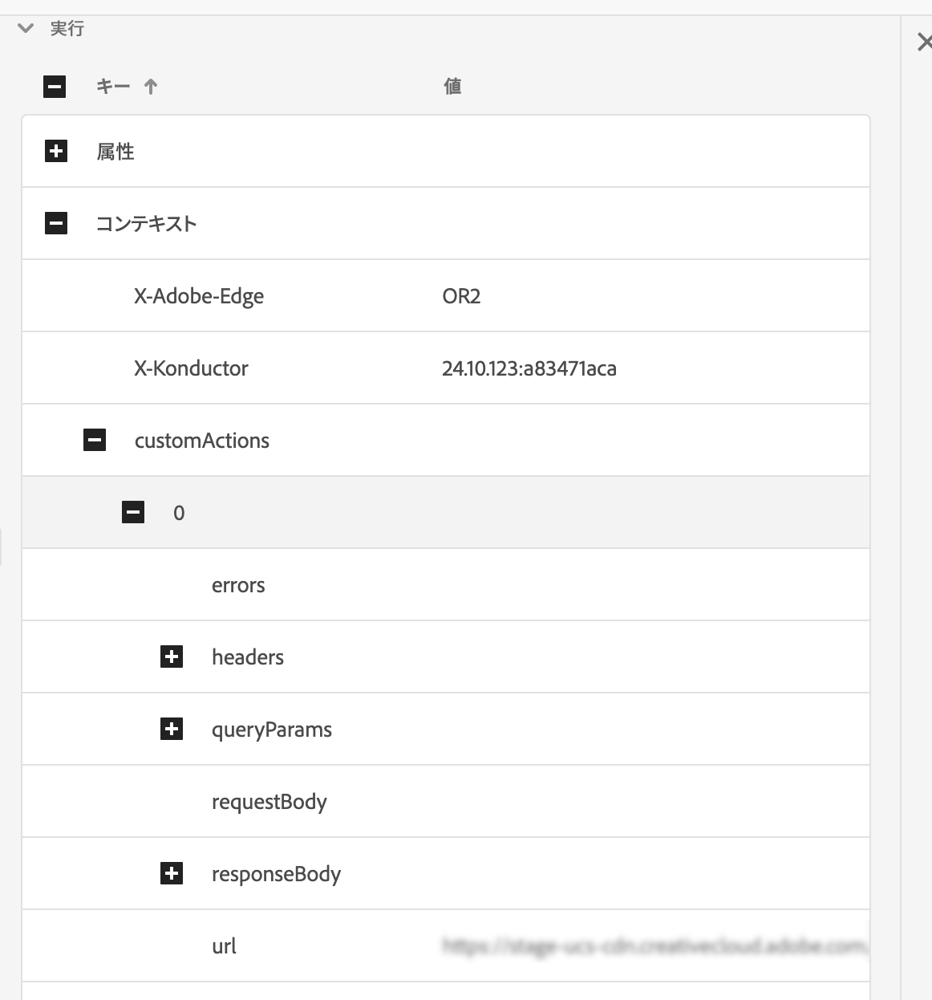

# 外部データ参照ヘルパー

[!DNL Journey Optimizer] パーソナライゼーションエディターの `externalDataLookup` ヘルパーを使用すると、コードベースのエクスペリエンス、web、アプリ内メッセージチャネルなどのインバウンドチャネルのコンテンツ生成に使用するデータを外部エンドポイントから動的に取得できます。

>[!AVAILABILITY]
>
>この機能は、一連の組織でのみ使用できます（限定提供）。

ヘルパーを使用するには、まず&#x200B;**[!UICONTROL 管理]**／**[!UICONTROL 設定]**&#x200B;メニューでアクションを定義する必要があります。アクションでは、URL、GET メソッドと POST メソッド、ヘッダーパラメーター、クエリパラメーター、POST 本文 JSON スキーマ、応答 JSON スキーマなど、外部エンドポイントに関する詳細を設定します。

アクションを定義すると、次の両方の場合に使用できます。

* ジャーニーでカスタムアクションアクティビティでコンテンツを取得する場合。
* ジャーニーとインバウンドキャンペーンで externalDataLookup ヘルパーでインバウンドアクションでデータを取得する場合。

## ガードレールと制限

詳しくは、[!DNL Journey Optimizer] インバウンドチャネルのキャンペーンとジャーニー #GuardrailsandGuidelines のカスタムアクションも参照してください。

* **デフォルトのタイムアウト** - デフォルトでは、外部エンドポイントを呼び出す際に、[!DNL Journey Optimizer] は 300 ミリ秒のタイムアウトを使用します。エンドポイントのこのタイムアウトを増やすには、アドビ担当者にお問い合わせください。
* **応答スキーマの参照と式の検証** - パーソナライゼーションエディターでは、式の挿入時にエンドポイント応答のスキーマを参照することはできません。[!DNL Journey Optimizer] は、式で使用される応答の JSON 属性への参照を検証しません。
* **パラメーターでサポートされるデータタイプ** - externalDataLookup ヘルパーを使用して置き換えられるペイロード変数パラメーターでサポートされるデータタイプは、`String`、`Integer`、`Decimal`、`Boolean`、`listString`、`listInt`、`listInteger`、`listDecimal` です。
* **更新されたアクションの自動更新** - アクション設定に対する変更は、ライブキャンペーンおよびジャーニーの対応する externalDataLookup 呼び出しには反映されません。変更を反映するには、externalDataLookup ヘルパーでアクションを使用しているライブキャンペーンやジャーニーをコピーまたは変更する必要があります。
* **変数の置き換え** - 現時点では、externalDataLookup ヘルパーパラメーター内での変数の使用はサポートされていません。
* **動的パス** - 現時点では、動的 URL パスはサポートされていません。
* **マルチパスレンダリング** - マルチパスレンダリングがサポートされています。
* **認証** - 現時点では、アクション設定の認証オプションは、externalDataLookup ヘルパーではサポートされていません。それまでの間、API キーベースの認証キーやその他のプレーンテキスト認証キーの場合は、アクション設定のヘッダーフィールドとして指定できます。

## アクションの設定とヘルパーの使用

アクションを定義し、パーソナライゼーションにヘルパーを使用するには、次の手順に従います。

1. 参照のエンドポイントを設定するアクションを作成します。これは、各エンドポイントに対して 1 回だけ実行すればよく、技術ユーザーが行う必要があります。[詳しくは、カスタムアクションの設定方法を参照してください](../action/about-custom-action-configuration.md)。

   アクション ID をメモしてコピーします。

   

1. インバウンドキャンペーンまたはジャーニーアクションを作成します。この例では、コードベースのエクスペリエンス JSON アクションで externalDataLookup ヘルパーを使用する方法を示していますが、任意のインバウンドチャネルのパーソナライゼーションフィールドで使用できます。

1. アクションのコンテンツを編集するには、パーソナライゼーションエディターのヘルパー関数に移動し、**[!UICONTROL ヘルパー関数]**／**[!UICONTROL ヘルパー]**&#x200B;に移動します。

1. 「`+`」ボタンをクリックして、externalDataLookup ヘルパーを挿入します。ヘルパー式が、`actionId` と `result` のプレースホルダー値と共にエディターに挿入されます。

   

   プレースホルダー値を次のように置き換えます。

   * `actionId`：以前にコピーしたアクション ID をペーストします。
   * `result`：任意の名前を設定します。この結果変数を使用して、取得したコンテンツにアクセスします。

1. エンドポイント呼び出しの一部として渡される変数パラメーター値を追加します。例えば、言語パラメータと最大項目数パラメーターを渡す方法は次のとおりです。

   

1. 結果変数を使用して、取得したデータにアクセスし、インバウンドアクションのコンテンツに挿入します。例えば、エンドポイントから取得した項目の JSON 配列を返す方法は次のとおりです。

   

## 仕組み

### ランタイム実行

インバウンドアクションに externalDataLookup ヘルパーが含まれている場合、[!DNL Journey Optimizer] パーソナライゼーションリクエストが AEP Edge Network によって受信および処理される時点で、エンドポイントが動的に呼び出されます。

つまり、外部エンドポイントは、クライアントが AEP Edge Network に特定のサーフェス用に送信するのと同等以上の同時読み込みとスループットを処理できる必要があります。

### 構文

`{{externalDataLookup actionId="d130c8e2-9a2d-45d5-bcb6-bc39865b4a56" result="result" optional-parameters...}}`

### パラメーターの受け渡し

外部エンドポイントを呼び出すと、アクションで定義されたすべての定数ヘッダー値、クエリパラメーター、リクエストペイロード値が、アクション設定で指定した値と共に送信されます。

任意の変数ヘッダー値、クエリ／パスパラメーター、リクエストペイロード値については、パラメーターを使用して externalDataLookup ヘルパーに値を動的に渡すことができます。

パラメーター名：

* ヘッダーパラメーター：`header.<parameter-name>`
* クエリパラメーター：`query.<parameter-name>`
* ペイロードパラメーター：`payload.<parameter-name>`
* パスパラメーター：`dynamic_path.<parameter-name>`

例：

```
{{externalDataLookup actionId="..." result="result" header.myHeaderParameter="value1" query.myQueryParameter="value2" payload.myPayloadParameter="value3"}}`
```

パラメーター値は、固定値にすることや、プロファイルフィールドまたは他のコンテキスト属性を参照してパーソナライズすることができます。例：

```
{{externalDataLookup actionId="..." result="result" query.myQueryParameter=profile.myProfileValue}}
```

ペイロードパラメーターは、ネストされた JSON 属性を参照するのにドット表記を使用して指定できます。例：

```
{{externalDataLookup actionId="..." result="result" payload.context.channel="web"}}
```

### 結果へのアクセス

外部エンドポイント参照呼び出しから取得したデータにアクセスするには、パーソナライゼーション式とヘルパー関数を使用して、アクション定義の応答ペイロードで定義されたフィールドを参照します。

例えば、アクションの応答ペイロードが次のようになっているとします。

```
{
    "videos": [
        {
            "id": "integer",
            "title": "string",
            "description": "string",
            "thumbnail_url": "string",
            "video_page_url": "string",
            "url": "string",
            "video_type": "string",
            "start_timestamp": "dateOnly",
            "created_on": "dateOnly",
            ...
        }
    ]
}
```

その後、例えば、コードベースのエクスペリエンス HTML アクションで最初のビデオの説明を取得してアクセスするには、次のようにします。

```
{{externalDataLookup actionId="d130c8e2-9a2d-45d5-bcb6-bc39865b4a56" result="result"}}
 
First video description: <b>result.videos[0].description</b>
```

または、例えば、コードベースのエクスペリエンス JSON アクションで項目を取得してループし、項目配列を返すには、次のようにします。

```
{{externalDataLookup actionId="d130c8e2-9a2d-45d5-bcb6-bc39865b4a56" result="result"}}
 
[
{{#each result.videos as |item|}}
    {                                                  
        "title": "{{item.title}}",
        "url": "{{item.video_page_url}}",
        "thumbnail_url": "{{item.thumbnail_url}}",
        "start_timestamp": "{{item.start_timestamp}}"
    },
{{/each}}
]
```

## トラブルシューティング

### タイムアウトとエラー処理

[!DNL Journey Optimizer] では、AEP Edge Network の低い待ち時間、高スループットのパフォーマンス特性を維持するのに、外部エンドポイントを呼び出す際に厳密なタイムアウトを使用します。

エンドポイントがタイムアウトした場合や、エンドポイントに到達する際に他の種類のエラーが発生した場合、結果変数は空になります。この場合、結果変数内の属性への参照も空になります。コンテンツに属性を単に表示している場合は、空白として表示されます。結果内の配列属性をループしようとする場合は、項目は返されません。

フォールバックコンテンツを表示して、タイムアウトやエラーをより適切に処理する場合は、参照の結果が空かどうかを確認し、その場合はフォールバックコンテンツを表示できます。

例えば、次のように、単一の属性に対するフォールバック値を表示できます。

```
First video description: 
```

または、次のように、コンテンツブロック全体を条件付きでレンダリングできます。

```
{{externalDataLookup actionId="d130c8e2-9a2d-45d5-bcb6-bc39865b4a56" result="result"}}
 

   ... do something with result ...

    ... return fallback content ...

```

### デバッグ

デバッグに役立つように、AEP Assurance の Edge Delivery ビューには、外部データ参照のタイムアウトとエラーの詳細が含まれます。インバウンドアクションで externalDataLookup ヘルパーに期待どおりの結果が表示されない場合は、Assurance セッションを開始し、web またはモバイル実装から [!DNL Journey Optimizer] 呼び出しを開始し、Edge Delivery ビューを使用してタイムアウトまたはエラーの詳細を確認できます。

例：

実行の詳細の一部として、Assurance トレースの「Edge Delivery」セクションに、以下のようなリクエストと応答の詳細を含む新しい customActions ブロックが追加されました。カスタムアクションの実行中に問題が発生した場合、「エラー」セクションはデバッグに役立ちます。



## よくある質問

* リクエストからのコンテキスト属性をパラメーターとして外部データ参照に渡すにはどうすればよいですか？

  コンテキスト属性／データストリーム／イベントメニューを使用して、使用しているエクスペリエンスイベントスキーマを参照し、関連する属性を次のようにパラメーター値として挿入します。

  ```
  {{externalDataLookup actionId="..." result="result" query.myQueryParameter=context.datastream.event.<schemaId>.my.xdm.attribute}}
  ```

* [!DNL Journey Optimizer] では、外部エンドポイント応答をキャッシュしますか？

  現在はサポートされていません。 この機能は今後サポートされる予定です。
