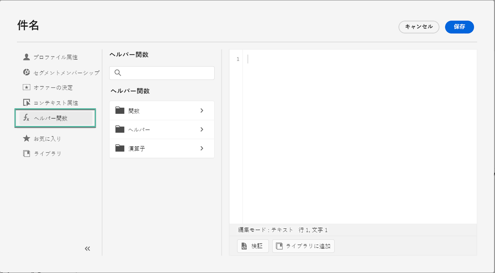

# ヘルパー関数の基本を学ぶ{#functionsL}

[!DNL Journey Optimizer] テンプレート言語を使用して、計算、データの書式設定や変換、条件、パーソナライゼーションのコンテキストでの操作など、データの操作を実行します。パーソナライゼーション構文のガイドラインについては、[このページ](../personalization-syntax.md)を参照してください。

➡️ [ヘルパー関数の使用方法を確認](#video)（ビデオ）

テンプレート言語は、次に示すように、式エディターのパーソナライゼーションドロップダウンリストで使用できるヘルパー関数で利用されます。

[!DNL Journey Optimizer] 式エディターでは、ヘルパー関数は[関数](#functions-helper)、[ヘルパー](#helper-helper)および[演算子](#operators-helper)の 3 つのカテゴリにグループ化されます。

サブカテゴリと関数にアクセスするには、カテゴリを選択します。

サブカテゴリにアクセスするには、「`>`」アイコンをクリックします。「`+`」アイコンをクリックして関数を選択すると、その関数がパーソナライゼーション画面に自動的に追加されます。

「`...`」アイコンをクリックして関数の説明を表示し、お気に入りに追加します。[詳細情報](../personalize.md#fav)

## 関数{#functions-helper}

### 配列関数

<table>
    <tr>
        <td><a href="aggregation.md#average">Average</a></td><td>配列内の選択された値すべての算術平均を返します。</td>
    </tr>
    <tr>
        <td><a href="arrays-list.md#in">In</a></td><td>項目が配列またはリストのメンバーであるかどうかを判断するために使用します。</td>
    </tr>
    <tr>
        <td><a href="aggregation.md#min">Minimum</a></td><td>配列内の選択された値すべての最小値を返します。</td>
    </tr>
    <tr>
        <td><a href="aggregation.md#count">Count</a></td><td>指定された配列内の要素数を返します。</td>
    </tr>
    <tr>
        <td><a href="arrays-list.md#includes">Includes</a></td><td>配列またはリストに指定した項目が含まれているかどうかを判定します。</td>
    </tr>
    <tr>
        <td><a href="arrays-list.md#notin">Not in</a></td><td>項目が配列またはリストのメンバーではないかどうかを判定します。</td>
    </tr>
    <tr>
        <td><a href="arrays-list.md#distinct">Distinct</a></td><td>重複する値が削除された配列またはリストから値を取得します。</td>
    </tr>
    <tr>
        <td><a href="arrays-list.md#intersects">Intersects</a></td><td>2 つの配列またはリストに、共通メンバーが 1 つ以上あるかどうかを判断します。</td>
    </tr>
    <tr>
        <td><a href="arrays-list.md#subset">Subset of</a></td><td>特定の配列（配列 A）が別の配列（配列 B）のサブセットであるか、つまり、配列 A のすべての要素が配列 B の要素であるかを判定します。</td>
    </tr>
    <tr>
        <td><a href="arrays-list.md#head">First item</a></td><td>配列またはリスト内の最初の項目を返します。</td>
    </tr>
    <tr>
        <td><a href="arrays-list.md#last-n">Last n in array</a></td><td>指定した数値式に基づいて昇順で並べ替えられた場合、配列の最後の「N」項目を返します。</td>
    </tr>
    <tr>
        <td><a href="aggregation.md#sum">Sum</a></td><td>配列内の選択された値すべての合計を返します。</td>
    </tr>
    <tr>
        <td><a href="arrays-list.md#first-n">First n in array</a></td><td>指定した数値式に基づいて昇順で並べ替えられた場合、配列の最初の「N」項目を返します。</td>
    </tr>
    <tr>
        <td><a href="aggregation.md#max">Maximum</a></td><td>配列内の選択された値すべての最大値を返します。</td>
    </tr>
    <tr>
    <td><a href="arrays-list.md#superset">Superset of</a></td><td>この関数は、特定の配列（配列 A）が別の配列（配列 B）のスーパーセットであるかどうか、つまり配列 A に配列 B のすべての要素が含まれているかどうかを判定します</td>
    </tr>
</table>

### 日時関数{#date-functions}

<table>
    <tr>
        <td><a href="dates.md#age">age</a></td><td>この関数は、指定された日付からの経過時間を取得します。</td>
    </tr>
    <tr>
        <td><a href="dates.md#current">currentTimeInMillis</a></td><td>この関数は、現在の時刻をエポックミリ秒で取得します。</td>
    </tr>
    <tr>
        <td><a href="dates.md#date-diff">dateDiff</a></td><td>この関数は、2 つの日付間の差異を日数単位で取得します。</td>
    </tr>
    <tr>
        <td><a href="dates.md#day-week">dayOfWeek</a></td><td>この関数は、曜日を取得します。</td>
    </tr>
    <tr>
        <td><a href="dates.md#day-year">dayOfYear</a></td><td>この関数は、通日（1月1日からの通算日数）を取得します。</td>
    </tr>
    <tr>
        <td><a href="dates.md#format-date">formatDate</a></td><td>この関数は、日時値を書式設定します。</td>
    </tr>
    <tr>
        <td><a href="dates.md#set-days">setDays</a></td><td>この関数は、指定された日時の日付を設定します。</td>
    </tr>
    <tr>
        <td><a href="dates.md#set-hours">setDays</a></td><td>この関数は、日時の時を設定します。</td>
    </tr>
    <tr>
        <td><a href="dates.md#to-utc">toUTC</a></td><td>この関数は、日時を UTC に変換します。</td>
    </tr>
    <tr>
        <td><a href="dates.md#week-of-year">weekOfYear</a></td><td>この関数は、年の週番号（何週目か）を返します。</td>
    </tr>
</table>
</table>

### マップ関数 {#map-functions}

<table>
    <tr>
        <td><a href="maps.md#get">Get</a></td><td>指定されたキーのマップの値を取得するために使用します。</td>
    </tr>
    <tr>
        <td><a href="maps.md#keys">Keys</a></td><td>指定されたマップのすべてのキーを取得するために使用します。</td>
    </tr>
    <tr>
        <td><a href="maps.md#values">Values</a></td><td>指定されたマップのすべての値を取得します。</td>
    </tr>
</table>

**オブジェクト関数**

<table>
    <tr>
        <td><a href="objects.md#isNotNull">Is not null</a></td><td>オブジェクト参照が存在するかどうかを判断するために使用します。</td>
    </tr>
    <tr>
        <td><a href="objects.md#isNull">Is null</a></td><td>オブジェクト参照が存在しないかどうかを判断するために使用します。</td>
    </tr>
</table>

### 文字列関数 {#string-functions}

<table>
    <tr>
        <td><a href="string.md#camelCase">Camel Case</a></td><td>文字列の各単語の最初の文字を大文字にするために使用します。</td>
    </tr>
    <tr>
        <td><a href="string.md#concat">Concat</a></td><td>2 つの文字列を 1 つに結合するために使用します。</td>
    </tr>
    <tr>
        <td><a href="string.md#contains">Contains</a></td><td>文字列が指定の部分文字列を含んでいるかどうかを判定するために使用します。</td>
    </tr>
    <tr>
        <td><a href="string.md#doesNotContain">Does not contain</a></td><td>文字列が指定の部分文字列を含んでいないかどうかを判定するために使用します。</td>
    </tr>
    <tr>
        <td><a href="string.md#doesNotEndWith">Does not end with</a></td><td>文字列の末尾が指定の部分文字列になっていないかどうかを判定するために使用します。</td>
    </tr>
    <tr>
        <td><a href="string.md#doesNotStartWith">Does not start with</a></td><td>文字列の先頭が指定の部分文字列になっていないかどうかを判定するために使用します。</td>
    </tr>
    <tr>
        <td><a href="string.md#encode64">Encode 64</a></td><td>文字列のエンコードまたはデコードに使用します。</td>
    </tr>
    <tr>
        <td><a href="string.md#endsWith">Ends with</a></td><td>文字列の末尾が指定の部分文字列になっていないかどうかを判定するために使用します。</td>
    </tr>
        </tr>
    <tr>
        <td><a href="string.md#equals">Equals</a></td><td>文字列の大文字と小文字を区別し、文字列の先頭が指定の部分文字列になっていないかどうかを判定するために使用します。</td>
    </tr>
    <tr>
        <td><a href="string.md#equalsIgnoreCase">Equals Ignore Case</a></td><td>文字列の大文字と小文字を区別せず、文字列の先頭が指定の部分文字列になっていないかどうかを判定するために使用します。</td>
    </tr>
    <tr>
        <td><a href="string.md#extractEmailDomain">Extract Email Domain</a></td><td>メールアドレスのドメインを抽出するために使用します。</td>
    </tr>
    <tr>
        <td><a href="string.md#isEmpty">IsEmpty</a></td><td>文字列や式が空かどうかを確認するために使用します。</td>
    </tr>
    <tr>
        <td><a href="string.md#leftTrim">Left trim</a></td><td>文字列の先頭から空白を削除します。</td>
    </tr>
    <tr>
        <td><a href="string.md#length">Length</a></td><td>文字列や式の文字数を取得するために使用します。</td>
    </tr>
    <tr>
        <td><a href="string.md#like">Like</a></td><td>文字列が指定のパターンと一致するかどうかを判定するために使用します。</td>
    </tr>
    <tr>
        <td><a href="string.md#lower">Lower Case</a></td><td>文字列を小文字に変換します。</td>
    </tr>
    <tr>
        <td><a href="string.md#matches">Matches</a></td><td>文字列が特定の正規表現と一致するかどうかを判定するために使用します。</td>
    </tr>
    <tr>
        <td><a href="string.md#notEqualTo">Not equals to</a></td><td>文字列が指定の文字列に等しくないかどうかを判定するために使用します。</td>
    </tr>
    <tr>
        <td><a href="string.md#regexGroup">正規表現グループ</a></td><td>指定された正規表現に基づいて特定の情報を抽出するために使用します。</td>
    </tr>
    <tr>
        <td><a href="string.md#replace">Replace</a></td><td>文字列内の指定された部分文字列を別の部分文字列で置き換えます。</td>
    </tr>
    <tr>
        <td><a href="string.md#replaceAll">Replace all</a></td><td>「target」に一致するテキストのすべての部分文字列を、指定されたリテラルの「replacement」文字列に置き換えます。</td>
    </tr>
    <tr>
        <td><a href="string.md#rightTrim">Right trim</a></td><td>文字列の末尾から空白を削除します。 </td>
    </tr>
    <tr>
        <td><a href="string.md#split">Split</a></td><td>文字列を指定された文字で分割するために使用します。</td>
    </tr>
    <tr>
        <td><a href="string.md#startsWith">Starts with</a></td><td>この関数は、文字列が指定の部分文字列で始まるかどうかを判定するために使用されます</td>
    </tr>
    <tr>
        <td><a href="string.md#titleCase">Title Case</a></td><td>文字列の各単語の最初の文字を大文字にするために使用します。</td>
    </tr>
    <tr>
        <td><a href="string.md#trim">Trim</a></td><td>文字列の先頭と末尾の空白を削除します</td>
    </tr>
    <tr>
        <td><a href="string.md#upper">Upper case</a></td><td>文字列を大文字に変換します。</td>
    </tr>
</table>

## ヘルパー{#helper-helper}

ヘルパーの詳細は、[このページ](helpers.md)で説明しています。

<table>
    <tr>
        <td><a href="helpers.md#each">Each</a></td><td>配列を繰り返すために使用します。</td>
    </tr>
    <tr>
        <td><a href="helpers.md#if-function">If</a></td><td>条件付きブロックの定義に使用します。式の評価が true を返した場合、ブロックがレンダリングされます。</td>
    </tr>
    <tr>
        <td><a href="helpers.md#let">Let</a></td><td>この関数を使用すると、式を変数として保存し、後からクエリで使用できます。</td>
    </tr>
   <tr>
        <td><a href="helpers.md#unless">Unless</a></td><td>条件付きブロックの定義に使用します。式の評価が false を返した場合、ブロックがレンダリングします。</td>
    </tr>
    <tr>
        <td><a href="helpers.md#with">With</a></td><td>テンプレート部分の評価トークンを変更するために使用します。</td>
    </tr>
</table>

## 演算子{#operators-helper}

### 演算関数 {#arithmetic-helper}

演算関数は、値に対する基本的な計算を実行するために使用します。

<table>
    <tr>
        <td><a href="arithmetic-functions.md#add">Addition</a></td><td>2 つの引数式の合計を求めるために使用します。</td>
    </tr>
    <tr>
        <td><a href="arithmetic-functions.md#divide">Divide</a></td><td>2 つの引数式の商を求めるために使用します。</td>
    </tr>
    <tr>
        <td><a href="arithmetic-functions.md#multiply">Multiplication</a></td><td>2 つの引数式の積を求めるために使用します。</td>
    </tr>
    <tr>
        <td><a href="arithmetic-functions.md#remainder">Remainder</a> </td><td>2 つの引数式を除算した後の剰余を求めるために使用します。</td>
    </tr>
    <tr>
        <td><a href="arithmetic-functions.md#substract">Subtraction</a> </td><td>2 つの式の差分を求めます。</td>
    </tr>
</table>

### ブール関数 {#boolean-functions}

ブール関数は、異なる要素に対してブール論理を実行するために使用します。

<table>
    <tr>
        <td><a href="operators.md#and">And</a></td><td>この演算子は論理積を作成します。</td>
    </tr>
    <tr>
        <td><a href="operators.md#not">If</a></td><td>この演算子は、指定された条件が true かどうかに応じて式を解きます。</td>
    </tr>
    <tr>
        <td><a href="operators.md#not">Not</a></td><td>この演算子は論理否定を作成します。</td>
    </tr>
    <tr>
        <td><a href="operators.md#or">Or</a></td><td>この演算子は論理和を作成します。</td>
    </tr>
</table>

### 比較関数 {#comparison-functions}

比較関数は、異なる式と値を比較するために使用され、それに応じて true または false を返します。

<table>
    <tr>
        <td><a href="operators.md#and">Equals to</a></td><td>値が等しいかどうかを確認します。</td>
    </tr>
    <tr>
        <td><a href="operators.md#greaterthan">Greater than</a></td><td>最初の値が 2 番目の値より大きいかどうかを確認します。</td>
    </tr>
    <tr>
        <td><a href="operators.md#greaterthanorequal">Greater or equals to</a></td><td>最初の値が 2 番目の値より大きいか、もしくは等しいかどうかを確認します。</td>
    </tr>
    <tr>
        <td><a href="operators.md#notequal">等しくない</a></td><td>指定された式が指定された値に等しくないかどうかを確認します。</td>
    </tr>
    <tr>
        <td><a href="operators.md#lessthanorequal">Less than or equals to</a> </td><td>最初の値が 2 番目の値より小さいか、もしくは等しいかどうかを確認します。</td>
    </tr>
</table>

## ハウツービデオ{#video}

パーソナライズ機能のヘルパー関数を使用してパーソナライゼーション値を変換する方法と、ヘルパー関数の様々なユースケースを説明します。

>[!VIDEO](https://video.tv.adobe.com/v/334244?quality=12)
