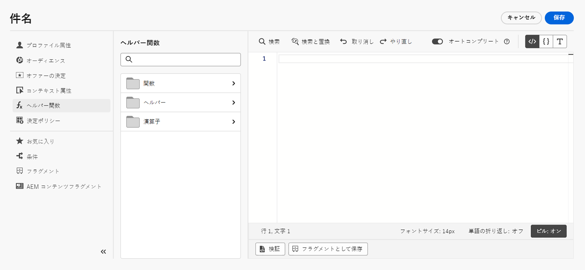

# ヘルパー関数の基本を学ぶ{#functions}

[!DNL Journey Optimizer] テンプレート言語を使用して、計算、データの書式設定や変換、条件、パーソナライゼーションのコンテキストでの操作など、データの操作を実行します。パーソナライゼーション構文のガイドラインについては、[このページ](../personalization-syntax.md)を参照してください。

➡️ [ヘルパー関数の使用方法については、このビデオをご覧ください](#video)

テンプレート言語は、次に示すように、パーソナライゼーションエディターのパーソナライゼーションドロップダウンリストで選択できるヘルパー関数で利用されます。

>[!NOTE]
>
>パーソナライゼーションエディターで使用できる関数や機能は、[ジャーニーの高度な式エディター](../../building-journeys/expression/expressionadvanced.md)で使用できる関数や機能とは異なります。

[!DNL Journey Optimizer] パーソナライゼーションエディターでは、ヘルパー関数は[関数](#functions-helper)、[ヘルパー](#helper-helper)および[演算子](#operators-helper)の 3 つのカテゴリにグループ化されます。

サブカテゴリと関数にアクセスするには、カテゴリを選択します。

サブカテゴリにアクセスするには、「`>`」アイコンをクリックします。`+` アイコンをクリックして関数を選択すると、その関数がパーソナライゼーション画面に自動的に追加されます。

「`...`」アイコンをクリックして関数の説明を表示し、お気に入りに追加します。[詳細情報](../personalize.md#fav)

## 関数{#functions-helper}

### 集計関数と配列関数

<table>
    <tr>
        <td><a href="aggregation.md#average">平均</a></td><td>配列内の選択された値すべての算術平均を返します。</td>
    </tr>
    <tr>
        <td><a href="aggregation.md#count">カウント</a></td><td>指定された配列内の要素数を返します。</td>
    </tr>
    <tr>
        <td><a href="aggregation.md#count-only-null">Null のみをカウント</a></td><td>この関数はリスト内の null 値の数をカウントします。</td>
    </tr>
    <tr>
        <td><a href="aggregation.md#count-with-null">null でカウント</a></td><td>この関数は null 値を含むリストのすべての要素をカウントします。</td>
    </tr>
    <tr>
        <td><a href="arrays-list.md#distinct">個別</a></td><td>重複する値が削除された配列またはリストから値を取得します。</td>
    </tr>
    <tr>
        <td><a href="arrays-list.md#distinct-count-with-null">null で個別カウント</a></td><td>この関数は null 値を含む、異なる値の数をカウントします。</td>
    </tr>
    <tr>
        <td><a href="arrays-list.md#head">最初の項目</a></td><td>配列またはリスト内の最初の項目を返します。</td>
    </tr>
    <tr>
        <td><a href="arrays-list.md#first-n">配列の最初の n</a></td><td>指定した数値式に基づいて昇順で並べ替えられた場合、配列の最初の「N」項目を返します。</td>
    </tr>
    <tr>
        <td><a href="arrays-list.md#in">次に含まれる</a></td><td>項目が配列またはリストのメンバーであるかどうかを判断するために使用します。</td>
    </tr>
    <tr>
        <td><a href="arrays-list.md#includes">次を含む</a></td><td>配列またはリストに指定した項目が含まれているかどうかを判定します。</td>
    </tr>
    <tr>
        <td><a href="arrays-list.md#intersects">交わり</a></td><td>2 つの配列またはリストに、共通メンバーが 1 つ以上あるかどうかを判断します。</td>
    </tr>
    <tr>
        <td><a href="arrays-list.md#last-n">配列の最後の n</a></td><td>指定した数値式に基づいて昇順で並べ替えられた場合、配列の最後の「N」項目を返します。</td>
    </tr>
    <tr>
        <td><a href="aggregation.md#max">最大</a></td><td>配列内の選択された値すべての最大値を返します。</td>
    </tr>
    <tr>
        <td><a href="aggregation.md#min">最小</a></td><td>配列内の選択された値すべての最小値を返します。</td>
    </tr>
    <tr>
        <td><a href="arrays-list.md#notin">次に含まれない</a></td><td>項目が配列またはリストのメンバーではないかどうかを判定します。</td>
    </tr>
    <tr>
        <td><a href="arrays-list.md#subset">サブセット</a></td><td>特定の配列（配列 A）が別の配列（配列 B）のサブセットであるか、つまり、配列 A のすべての要素が配列 B の要素であるかを判定します。</td>
    </tr>
    <tr>
        <td><a href="aggregation.md#sum">合計</a></td><td>配列内の選択された値すべての合計を返します。</td>
    </tr>
    <tr>
    <td><a href="arrays-list.md#superset">スーパーセット</a></td><td>この関数は、特定の配列（配列 A）が別の配列（配列 B）のスーパーセットであるかどうか、つまり配列 A に配列 B のすべての要素が含まれているかどうかを判定します</td>
    </tr>
</table>

### 日時関数{#date-functions}

<table>
    <tr>
        <td><a href="dates.md#add-days">日数を追加</a></td><td>この関数は、増分に正の値を使用し、減分に負の値を使用して、指定された日付を指定された日数で調整します。</td>
    </tr>
    <tr>
        <td><a href="dates.md#add-hours">時間数を追加</a></td><td>この関数は、増分に正の値を使用し、減分に負の値を使用して、指定された日付を指定された時間数で調整します。</td>
    </tr>
    <tr>
        <td><a href="dates.md#add-minutes">分数を追加</a></td><td>この関数は、増分に正の値を使用し、減分に負の値を使用して、指定された日付を指定された分数で調整します。</td>
    </tr>
    <tr>
        <td><a href="dates.md#add-months">月数を追加</a></td><td>この関数は、増分に正の値を使用し、減分に負の値を使用して、指定された日付を指定された月数で調整します。</td>
    </tr>
    <tr>
        <td><a href="dates.md#add-seconds">秒数を追加</a></td><td>この関数は、増分に正の値を使用し、減分に負の値を使用して、指定された日付を指定された秒数で調整します。</td>
    </tr>
    <tr>
        <td><a href="dates.md#add-years">年数を追加</a></td><td>この関数は、増分に正の値を使用し、減分に負の値を使用して、指定された日付を指定された年数で調整します。</td>
    </tr>
    <tr>
        <td><a href="dates.md#age">経過時間</a></td><td>この関数は、指定された日付からの経過時間を取得します。</td>
    </tr>
    <tr>
        <td><a href="dates.md#age-days">日数</a></td><td>この関数は、指定された日付を日数で、つまり指定された日付と現在の日付の間の経過日数を計算します。将来の日付の場合は負の数、過去の日付の場合は正の数になります。</td>
    </tr>
    <tr>
        <td><a href="dates.md#age-months">月数</a></td><td>この関数は、指定された日付を月数で、つまり指定された日付と現在の日付の間の経過月数を計算します。将来の日付の場合は負の数、過去の日付の場合は正の数になります。</td>
    </tr>
    <tr>
        <td><a href="dates.md#compare-dates">日付を比較</a></td><td>この関数は、最初の入力日付を他の入力日付と比較します。date1 が date2 と等しい場合は 0 を返し、date1 が date2 より前の場合は -1 を返し、date1 が date2 より後の場合は 1 を返します。</td>
    </tr>
    <tr>
        <td><a href="dates.md#convert-zoned-date-time">ZonedDateTime を変換</a></td><td>この関数は、日時を指定されたタイムゾーンに変換します。</td>
    </tr>
    <tr>
        <td><a href="dates.md#current">現在の時刻（ミリ秒）</a></td><td>この関数は、現在の時刻をエポックミリ秒で取得します。</td>
    </tr>
    <tr>
        <td><a href="dates.md#date-diff">日数の差異</a></td><td>この関数は、日数で 2 つの日付間の差異を取得します。</td>
    </tr>
    <tr>
        <td><a href="dates.md#day-month">ある月の日付</a></td><td>この関数は、その月の日付を表す数値を返します。</td>
    </tr>
    <tr>
        <td><a href="dates.md#day-week">曜日</a></td><td>この関数は、曜日を取得します。</td>
    </tr>
    <tr>
        <td><a href="dates.md#day-year">年間通算日</a></td><td>この関数は、年間通算日を取得します。</td>
    </tr>
    <tr>
        <td><a href="dates.md#diff-seconds">秒数の差異</a></td><td>この関数は、秒数単位で 2 つの日付間の差異を返します。</td>
    </tr>
    <tr>
        <td><a href="dates.md#extract-hours">時間数を抽出</a></td><td>この関数は、指定されたタイムスタンプから時間コンポーネントを抽出します。</td>
    </tr>
    <tr>
        <td><a href="dates.md#extract-minutes">分数を抽出</a></td><td>この関数は、指定されたタイムスタンプから分コンポーネントを抽出します。</td>
    </tr>
    <tr>
        <td><a href="dates.md#extract-months">月数を抽出</a></td><td>この関数は、指定されたタイムスタンプから月コンポーネントを抽出します。</td>
    </tr>
    <tr>
        <td><a href="dates.md#extract-seconds">秒数を抽出</a></td><td>この関数は、指定されたタイムスタンプから秒コンポーネントを抽出します。</td>
    </tr>
    <tr>
        <td><a href="dates.md#format-date">日付を書式設定</a></td><td>この関数は、日時値を書式設定します。</td>
    </tr>
    <tr>
        <td><a href="dates.md#format-date-locale">日付をロケールサポートの形式にする</a></td><td>この関数は、日付と時刻の値を、目的のロケールなどの対応する言語に依存する表現にフォーマットします。</td>
    </tr>
    <tr>
        <td><a href="dates.md#get-current-zoned-date-time">CurrentZonedDateTime を取得</a></td><td>この関数は、タイムゾーン情報を含む現在の日時を返します。</td>
    </tr>
    <tr>
        <td><a href="dates.md#hours-difference">時間数の差異</a></td><td>この関数は、時間数単位で 2 つの日付間の差異を返します。</td>
    </tr>
    <tr>
        <td><a href="dates.md#diff-minutes">分数の差異</a></td><td>この関数は、分数単位で 2 つの日付間の差異を返します。</td>
    </tr>
    <tr>
        <td><a href="dates.md#months-difference">月数の差異</a></td><td>この関数は、月数単位で 2 つの日付間の差異を返します。</td>
    </tr>
    <tr>
        <td><a href="dates.md#set-days">日数を設定</a></td><td>この関数は、指定された日時の日付を設定します。</td>
    </tr>
    <tr>
        <td><a href="dates.md#set-hours">時間を設定</a></td><td>この関数は、日時の時間を設定します。</td>
    </tr>
    <tr>
        <td><a href="dates.md#to-date-time">日時に</a></td><td>この関数は、文字列を日付に変換します。無効な入力に対する出力として、エポック日付を返します。</td>
    </tr>
    <tr>
        <td><a href="dates.md#to-utc">UTC に</a></td><td>この関数は、日時を UTC に変換します。</td>
    </tr>
    <tr>
        <td><a href="dates.md#truncate-day">開始日に切り捨て</a></td><td>この関数は、指定された日時を、その日の始まり（00:00）に設定して変更します。</td>
    </tr>
    <tr>
        <td><a href="dates.md#truncate-quarter">truncateToStartOfQuarter</a></td><td>この関数は、日時を四半期の最初の日（例：1月1日、4月1日、7月1日、10月1日）の 00:00 に切り捨てます。
</td>
    </tr>
    <tr>
        <td><a href="dates.md#truncate-week">truncateToStartOfWeek</a></td><td>この関数は、指定された日時を、週の始まり（月曜日の 00:00）に設定して変更します。</td>
    </tr>
    <tr>
        <td><a href="dates.md#truncate-year">truncateToStartOfYear</a></td><td>この関数は、指定された日時を、年の最初の日（1月1日）の 00:00 に切り捨てて変更します。</td>
    </tr>
    <tr>
        <td><a href="dates.md#week-of-year">年間通算週</a></td><td>この関数は、年の週番号（何週目か）を返します。</td>
    </tr>
    <tr>
        <td><a href="dates.md#diff-years">年数の差異</a></td><td>この関数は、年数単位で 2 つの日付間の差異を返します。</td>
    </tr>
</table>
</table>

### マップ関数 {#map-functions}

<table>
    <tr>
        <td><a href="maps.md#get">取得</a></td><td>指定されたキーのマップの値を取得するために使用します。</td>
    </tr>
    <tr>
        <td><a href="maps.md#keys">キー</a></td><td>指定されたマップのすべてのキーを取得するために使用します。</td>
    </tr>
    <tr>
        <td><a href="maps.md#values">値</a></td><td>指定されたマップのすべての値を取得します。</td>
    </tr>
</table>

### 数学関数 {#math-functions}

<table>
    <tr>
        <td><a href="math.md#absolute">絶対パス</a></td><td>この関数は、任意の数値を言語依存の表現に書式設定します。</td>
    </tr>
    <tr>
        <td><a href="math.md#format-number">数値を書式設定する</a></td><td>この関数は、任意の数値を言語依存の表現に書式設定します。</td>
    </tr>
    <tr>
        <td><a href="math.md#random">ランダム</a></td><td>この関数は、0 ～ 1 の間のランダムな値を返します。</td>
    </tr>
    <tr>
        <td><a href="math.md#round-down">切り捨て</a></td><td>この関数は、数値を切り捨てます。</td>
    </tr>
    <tr>
        <td><a href="math.md#round-up">切り上げ</a></td><td>この関数は、数値を切り上げます。</td>
    </tr>
    <tr>
    <td><a href="math.md#to-hex-string">16 進文字列に</a></td><td>任意の数を 16 進数文字列に変換します。</td>
    </tr>
    <tr>
    <td><a href="math.md#to-int">ToInt</a></td><td>これらの型（number、double、int、long、float、short、byte、boolean、string）のいずれかを整数に変換します。</td>
    </tr>
    <tr>
        <td><a href="math.md#to-percentage">パーセンテージに</a></td><td>この関数は、数値をパーセンテージに変換します。</td>
    </tr>
    <tr>
        <td><a href="math.md#to-precision">精度に</a></td><td>この関数は、数値を必要な精度に変換します。</td>
    </tr>
    <tr>
        <td><a href="math.md#to-string">toString</a></td><td>この関数は、任意の数値を文字列表現に変換します。 </td>
    </tr>
</table>

### オブジェクト関数 {#object-functions}

<table>
    <tr>
        <td><a href="objects.md#isNotNull">null でない</a></td><td>オブジェクト参照が存在するかどうかを判断するために使用します。</td>
    </tr>
    <tr>
        <td><a href="objects.md#isNull">null である</a></td><td>オブジェクト参照が存在しないかどうかを判断するために使用します。</td>
    </tr>
</table>

### 文字列関数 {#string-functions}

<table>
    <tr>
        <td><a href="string.md#camelCase">キャメルケース</a></td><td>文字列の各単語の最初の文字を大文字にするために使用します。</td>
    </tr>
    <tr>
        <td><a href="string.md#char-code-at">次の場所の文字コード</a></td><td>この関数は、JavaScript の charCodeAt 関数と同様に、文字の ASCII 値を返します。</td>
    </tr>
    <tr>
        <td><a href="string.md#concat">連結</a></td><td>2 つの文字列を 1 つに結合するために使用します。</td>
    </tr>
    <tr>
        <td><a href="string.md#contains">次を含む</a></td><td>文字列が指定の部分文字列を含んでいるかどうかを判定するために使用します。</td>
    </tr>
    <tr>
        <td><a href="string.md#doesNotContain">次を含まない</a></td><td>文字列が指定の部分文字列を含んでいないかどうかを判定するために使用します。</td>
    </tr>
    <tr>
        <td><a href="string.md#doesNotEndWith">次で終わらない</a></td><td>文字列の末尾が指定の部分文字列になっていないかどうかを判定するために使用します。</td>
    </tr>
    <tr>
        <td><a href="string.md#doesNotStartWith">次で始まらない</a></td><td>文字列の先頭が指定の部分文字列になっていないかどうかを判定するために使用します。</td>
    </tr>
    <tr>
        <td><a href="string.md#encode64">エンコード 64</a></td><td>文字列のエンコードに使用します。</td>
    </tr>
    <tr>
        <td><a href="string.md#endsWith">次で終わる</a></td><td>文字列の末尾が指定の部分文字列になっていないかどうかを判定するために使用します。</td>
    </tr>
        </tr>
    <tr>
        <td><a href="string.md#equals">次に等しい</a></td><td>文字列の大文字と小文字を区別し、文字列の先頭が指定の部分文字列になっていないかどうかを判定するために使用します。</td>
    </tr>
    <tr>
        <td><a href="string.md#equalsIgnoreCase">等しい (大文字と小文字を区別しない)</a></td><td>文字列の大文字と小文字を区別せず、文字列の先頭が指定の部分文字列になっていないかどうかを判定するために使用します。</td>
    </tr>
    <tr>
        <td><a href="string.md#extractEmailDomain">電子メールドメインを抽出</a></td><td>メールアドレスのドメインを抽出するために使用します。</td>
    </tr>
    <tr>
        <td><a href="string.md#format-currency">通貨の書式設定</a></td><td>この関数は、2 番目の引数で文字列として渡されたロケールに応じて、任意の数値を対応する言語に依存する通貨表現に変換します。</td>
    </tr>
    <tr>
        <td><a href="string.md#get-url-host">URL ホストを取得</a></td><td>この関数は、URL ホストを取得するために使用されます。</td>
    </tr>
    <tr>
        <td><a href="string.md#get-url-path">URL パスを取得</a></td><td>この関数は、URL パスの取得に使用されます。</td>
    </tr>
    <tr>
        <td><a href="string.md#get-url-protocol">URL プロトコルを取得</a></td><td>この関数は、URL プロトコルの取得に使用されます。</td>
    </tr>
    <tr>
        <td><a href="string.md#index-of">インデックス</a></td><td>この関数は 2 番目のパラメーターが最初に現れる（最初の引数内の）位置を返します。一致するものがない場合は「-1」を返します。</td>
    </tr>
    <tr>
        <td><a href="string.md#isEmpty">IsEmpty</a></td><td>文字列や式が空かどうかを確認するために使用します。</td>
    </tr>
    <tr>
        <td><a href="string.md#is-not-empty">空でない</a></td><td>この関数はパラメーター内の文字列が空でない場合、true を返します。</td>
    </tr>
    <tr>
        <td><a href="string.md#last-index-of">最後のインデックス</a></td><td>この関数は 2 番目のパラメーターが最後に現れる（最初の引数内の）位置を返します。一致するものがない場合は「-1」を返します。</td>
    </tr>
    <tr>
        <td><a href="string.md#leftTrim">左トリミング</a></td><td>文字列の先頭から空白を削除します。</td>
    </tr>
    <tr>
        <td><a href="string.md#length">長さ</a></td><td>文字列や式の文字数を取得するために使用します。</td>
    </tr>
    <tr>
        <td><a href="string.md#like">類似</a></td><td>文字列が指定のパターンと一致するかどうかを判定するために使用します。</td>
    </tr>
    <tr>
        <td><a href="string.md#lower">小文字</a></td><td>文字列を小文字に変換します。</td>
    </tr>
    <tr>
        <td><a href="string.md#mask">マスク</a></td><td>この関数は、文字列の一部を「X」の文字に置き換えるために使用されます。</td>
    </tr>
    <tr>
        <td><a href="string.md#matches">一致</a></td><td>文字列が特定の正規表現と一致するかどうかを判定するために使用します。</td>
    </tr>
    <tr>
        <td><a href="string.md#md5">MD5</a></td><td>この関数は、入力文字列の md5 ハッシュを返します。</td>
    </tr>
    <tr>
        <td><a href="string.md#notEqualTo">次と等しくない</a></td><td>文字列が指定の文字列に等しくないかどうかを判定するために使用します。</td>
    </tr>
    <tr>
        <td><a href="string.md#not-equal-with-ignore-case">等しくない (大文字と小文字を区別しない)</a></td><td>この関数は、大文字と小文字を区別せずに、2 つの文字列を比較します。</td>
    </tr>
    <tr>
        <td><a href="string.md#regexGroup">正規表現グループ</a></td><td>指定された正規表現に基づいて特定の情報を抽出するために使用します。</td>
    </tr>
    <tr>
        <td><a href="string.md#replace">置換</a></td><td>文字列内の指定された部分文字列を別の部分文字列で置き換えます。</td>
    </tr>
    <tr>
        <td><a href="string.md#replaceAll">すべて置換</a></td><td>「target」に一致するテキストのすべての部分文字列を、指定されたリテラルの「replacement」文字列に置き換えます。</td>
    </tr>
    <tr>
        <td><a href="string.md#rightTrim">右トリミング</a></td><td>文字列の末尾から空白を削除します。 </td>
    </tr>
    <tr>
        <td><a href="string.md#split">分割</a></td><td>文字列を指定された文字で分割するために使用します。</td>
    </tr>
    <tr>
        <td><a href="string.md#startsWith">次で始まる</a></td><td>この関数は、文字列が指定の部分文字列で始まるかどうかを判定するために使用されます</td>
    </tr>
    <tr>
        <td><a href="string.md#string-to-date">文字列を日付に</a></td><td>この関数は、文字列値を日時値に変換します。 </td>
    </tr>
    <tr>
        <td><a href="string.md#string-to-integer">文字列を整数に</a></td><td>この関数は、文字列値を整数値に変換します。</td>
    </tr>
    <tr>
        <td><a href="string.md#string-to-number">文字列から数値へ</a></td><td>この関数は、文字列を数値に変換するために使用されます。無効な入力の出力と同じ文字列を返します。</td>
    </tr>
    <tr>
        <td><a href="string.md#sub-string">部分文字列</a></td><td>この関数は文字列式の開始インデックスと終了インデックスの間にある部分文字列を返します。</td>
    </tr>
    <tr>
        <td><a href="string.md#titleCase">タイトルケース</a></td><td>この関数は、文字列の各単語の最初の文字を大文字にするために使用します。</td>
    </tr>
    <tr>
        <td><a href="string.md#to-bool">ブール値に</a></td><td>この関数雨は引数の値をタイプに応じてブール値に変換します。</td>
    </tr>
    <tr>
        <td><a href="string.md#to-date-time">日時に</a></td><td>この関数は、文字列を日付に変換するために使用されます。無効な入力に対する出力として、エポック日付を返します。</td>
    </tr>
    <tr>
        <td><a href="string.md#to-date-time-only">日時のみに</a></td><td>この関数は、引数値を日時のみの値に変換します。無効な入力に対する出力として、エポック日付を返します。</td>
    </tr>
    <tr>
        <td><a href="string.md#trim">トリミング</a></td><td>文字列の先頭と末尾の空白を削除します</td>
    </tr>
    <tr>
        <td><a href="string.md#upper">大文字</a></td><td>文字列を大文字に変換します。</td>
    </tr>
    <tr>
        <td><a href="string.md#url-decode">URL デコード</a></td><td>この関数は、URL エンコードされた文字列をデコードするために使用されます。</td>
    </tr>
    <tr>
        <td><a href="string.md#url-encode">URL エンコード</a></td><td>この関数は、文字列を URL エンコードするために使用されます。</td>
    </tr>
</table>

## ヘルパー{#helper-helper}

ヘルパーの詳細は、[このページ](helpers.md)で説明しています。

<table>
    <tr>
        <td><a href="helpers.md#default">デフォルトのフォールバック値</a></td><td>この関数を使用すると、デフォルトで変数をレンダリングできます。</td>
    </tr>
    <tr>
        <td><a href="helpers.md#each">Each</a></td><td>配列を繰り返すために使用します。</td>
    </tr>
    <tr>
        <td><a href="helpers.md#if-function">If</a></td><td>条件付きブロックの定義に使用します。式の評価が true を返した場合、ブロックがレンダリングされます。</td>
    </tr>
    <tr>
        <td><a href="helpers.md#let">Let</a></td><td>この関数を使用すると、式を変数として保存し、後からクエリで使用できます。</td>
    </tr>
   <tr>
        <td><a href="helpers.md#unless">Unless</a></td><td>条件付きブロックの定義に使用します。式の評価が false を返した場合、ブロックがレンダリングします。</td>
    </tr>
    <tr>
        <td><a href="helpers.md#with">With</a></td><td>テンプレート部分の評価トークンを変更するために使用します。</td>
    </tr>
</table>

## 演算子{#operators-helper}

### 演算関数 {#arithmetic-helper}

演算関数は、値に対する基本的な計算を実行するために使用します。

<table>
    <tr>
        <td><a href="arithmetic-functions.md#add">加算</a></td><td>2 つの引数式の合計を求めるために使用します。</td>
    </tr>
    <tr>
        <td><a href="arithmetic-functions.md#divide">除算</a></td><td>2 つの引数式の商を求めるために使用します。</td>
    </tr>
    <tr>
        <td><a href="arithmetic-functions.md#multiply">乗算</a></td><td>2 つの引数式の積を求めるために使用します。</td>
    </tr>
    <tr>
        <td><a href="arithmetic-functions.md#remainder">残り</a> </td><td>2 つの引数式を除算した後の剰余を求めるために使用します。</td>
    </tr>
    <tr>
        <td><a href="arithmetic-functions.md#substract">減算</a> </td><td>2 つの式の差分を求めます。</td>
    </tr>
</table>

### ブール関数 {#boolean-functions}

ブール関数を使用すると、様々な要素に対してブール論理を実行できます。

<table>
    <tr>
        <td><a href="operators.md#and">および</a></td><td>この演算子は論理積を作成します。</td>
    </tr>
    <tr>
        <td><a href="operators.md#or">または</a></td><td>この演算子は論理和を作成します。</td>
    </tr>
</table>

### 比較関数 {#comparison-functions}

比較関数は、様々な式と値を比較するために使用され、結果に応じて true または false を返します。

<table>
    <tr>
        <td><a href="operators.md#equals">次に等しい</a></td><td>値が等しいかどうかを確認します。</td>
    </tr>
    <tr>
        <td><a href="operators.md#greaterthan">次より大きい</a></td><td>最初の値が 2 番目の値より大きいかどうかを確認します。</td>
    </tr>
    <tr>
        <td><a href="operators.md#greaterthanorequal">同じかそれ以上</a></td><td>最初の値が 2 番目の値より大きいか、もしくは等しいかどうかを確認します。</td>
    </tr>
    <tr>
        <td><a href="operators.md#lessthanorequal">同じかそれ以下</a> </td><td>最初の値が 2 番目の値より小さいか、もしくは等しいかどうかを確認します。</td>
    </tr>
    <tr>
        <td><a href="operators.md#notequal">次と等しくない</a></td><td>指定された式が指定された値に等しくないかどうかを確認します。</td>
    </tr>
</table>

## チュートリアルビデオ{#video}

パーソナライズ機能のヘルパー関数を使用してパーソナライゼーション値を変換する方法と、ヘルパー関数の様々なユースケースを説明します。

>[!VIDEO](https://video.tv.adobe.com/v/334244?quality=12)
