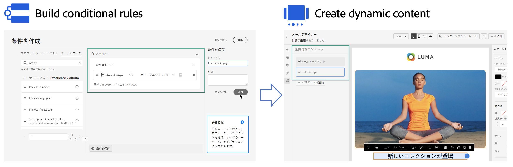

# 動的コンテンツの基本を学ぶ {#start-dynamic-content}

>[!CONTEXTUALHELP]
>id="ajo_conditions_list"
>title="条件"
>abstract="条件ルールを使用すると、プロファイル属性、コンテキストイベントまたはオーディエンスセグメントに基づいて、メッセージに複数のコンテンツのバリエーションを表示できます。"

動的コンテンツを使用すると、 **条件付きルール** プロファイル属性、コンテキストイベントまたはオーディエンスセグメントで構成できます。 条件ルールは、式エディター内のビジュアルなルールビルダーを使用して作成されます。このビジュアルなルールを保存することで、ジャーニーやキャンペーンでさらに再利用できます。

条件ルールは、E メールデザイナーや式エディターで利用でき、 **動的コンテンツを作成** これは、メッセージでターゲット設定されたプロファイルに適応します。

* [条件ルールの操作方法を説明します](create-conditions.md)
* [動的コンテンツの作成方法を説明します](dynamic-content.md)
