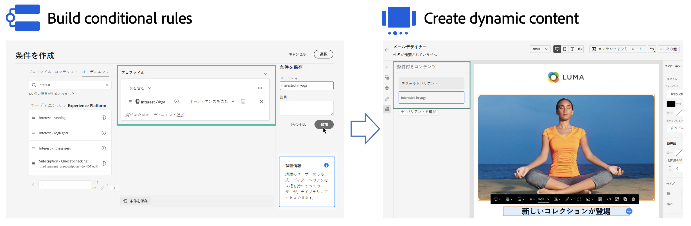

# 動的コンテンツの基本を学ぶ {#start-dynamic-content}

>[!CONTEXTUALHELP]
>id="ajo_conditions_list"
>title="条件"
>abstract="条件ルールを使用すると、プロファイル属性、コンテキストイベントまたはオーディエンスに基づいて、メッセージに複数のコンテンツバリアントを表示できます。"

動的コンテンツを使用すると、プロファイル属性、コンテキストイベントまたはオーディエンスで構成できる&#x200B;**条件付きルール**&#x200B;に基づいてメッセージのコンテンツを調整できます。 条件付きルールは、パーソナライゼーションエディター内のビジュアルルールビルダーで作成し、ジャーニーやキャンペーンで後から再利用するために保存できます。

条件付きルールは、E メールデザイナーやパーソナライゼーションエディターで利用し、メッセージでターゲット設定されたプロファイルに適応する&#x200B;**動的コンテンツを作成**&#x200B;することができます。

* [条件ルールの操作方法を説明します](create-conditions.md)
* [動的コンテンツの作成方法を説明します](dynamic-content.md)

## チュートリアルビデオ {#video}

条件ルールビルダーを使用して動的コンテンツを作成する方法を説明します。

>[!VIDEO](https://video.tv.adobe.com/v/3409815?quality=12)
