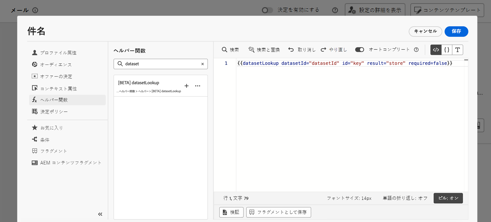

# Adobe Experience Platform データをパーソナライズ機能に活用（ベータ版） {#aep-data}

>[!AVAILABILITY]
>
>この機能は現在、パブリックベータ版としてすべてのお客様に対して提供されています。
>
>この機能を使用するには、まず、パーソナライゼーションエディターで新しい「datasetLookup」ヘルパー関数を追加する際に表示される、組織のベータ版利用条件に同意する必要があります。

Journey Optimizer を使用すると、パーソナライゼーションエディターで Adobe Experience Platform のデータを利用して、[コンテンツをパーソナライズする](../personalization/personalize.md)ことができます。これを行うには、まず、以下で説明するように、API 呼び出しを通じて参照パーソナライゼーションに必要なデータセットを有効にする必要があります。完了したら、そのデータを使用して、コンテンツを [!DNL Journey Optimizer] にパーソナライズできます。

## ベータ版の制限事項とガイドライン {#guidelines}

開始する前に、次の制限事項とガイドラインを確認してください。

### データセットの有効化 {#enablement}

* **データセットのサイズ**&#x200B;は、実稼動データセットでは 5 GB、開発サンドボックスデータセットでは 1 GB までに制限されています。
* 組織ごとの参照では、**最大 50 個のデータセットを有効にできます**。
* **レコードの数**&#x200B;は、実稼動データセットでは 5,000 万件、開発サンドボックスデータセットでは 1,000 万件に制限されています。
* **データ使用のラベル付けと適用**&#x200B;は、現時点では、参照が有効なデータセットには適用されていません。
* **参照が有効になっているデータセットやパーソナライゼーションで使用されているデータセットは、削除から保護されません**。パーソナライゼーションに使用されているデータセットを追跡し、データセット削除の有無を確認するのは、お客様の責任です。

### [!DNL Adobe Experience Platform] データを使用したパーソナライゼーション {#perso}

* **サポートされているチャネル**：現時点では、この機能は、メール、SMS、ダイレクトメールチャネル内でのみ使用できます。
* **データ使用のラベル付けと適用**&#x200B;は、現時点では、参照が有効なデータセットには適用されていません。
* **式フラグメント**：現時点では、データセット参照のパーソナライゼーションを式フラグメント内に配置できません。

## データ参照用データセットの有効化 {#enable}

データセットのデータをパーソナライゼーションに活用するには、API 呼び出しを使用してそのステータスを取得し、参照サービスを有効にする必要があります。

### 前提条件 {#prerequisites-enable}

* [このドキュメント](https://developer.adobe.com/journey-optimizer-apis/references/authentication/)で説明されている手順に従って、API コマンドを送信するように環境を設定します。
* 開発者プロジェクトには、Adobe Journey Optimizer と Adobe Experience Platform API がプロジェクトに追加されている必要があります。

  

* 役割の一部としてデータセットの管理権限が必要です。
* データセットの基となるスキーマには、参照キーとして機能する&#x200B;**プライマリ ID** が含まれている必要があります。

### API 呼び出し構造 {#call}

```
curl -s -XPATCH "https://platform.adobe.io/data/core/entity/lookup/dataSets/${DATASET_ID}/${ACTION}" \ -H "Authorization: Bearer ${ACCESS_TOKEN}" \ -H "x-api-key: ${API_KEY}" \ -H "x-gw-ims-org-id: ${IMS_ORG}" \ -H "x-sandbox-name: ${SANDBOX_NAME}"
```

次のとおりです。

* **URL** は `https://platform.adobe.io/data/core/entity/lookup/dataSets/${DATASET_ID}/${ACTION}` です。
* **データセット ID** は、有効にするデータセットです。
* **アクション**&#x200B;は、有効または無効です。
* **アクセストークン**&#x200B;は、Developer Console から取得できます。
* **API キー**&#x200B;は、Developer Console から取得できます。
* **IMS 組織 ID** は Adobe IMS 組織です。
* **サンドボックス名**&#x200B;は、データセットが含まれるサンドボックス名です（実稼動、開発など）。

>[!NOTE]
>
>データセットを有効にするための API 呼び出しで以下のエラーが発生した場合は、Developer Console プロジェクトからAdobe Journey Optimizer API を削除してから、再度追加してみてください。
>
>```
>
>"error_code": "403003", 
>"message": "Api Key is invalid"
>
>```

## パーソナライゼーションへのデータセットの活用 {#leverage}

API 呼び出しを使用してデータセットの参照パーソナライゼーションが有効になると、そのデータを使用してコンテンツを [!DNL Journey Optimizer] にパーソナライズできます。

1. メッセージなどのパーソナライズ機能を定義でき、すべてのコンテキストで使用できるパーソナライゼーションエディターを開きます。[パーソナライゼーションエディターの操作方法を学ぶ](../personalization/personalization-build-expressions.md)

1. ヘルパー関数リストに移動して、**datasetLookup** ヘルパー関数をコードペインへ追加します。

   

1. この関数は、Adobe Experience Platform データセットからフィールドを呼び出すことができる、定義済みの構文を提供します。構文は以下の通りです。

   ```
   {{datasetLookup datasetId="datasetId" id="key" result="store" required=false}}
   ```

   * **datasetId** は作業中のデータセットの ID です。
   * **id** は、参照データセットのプライマリ ID と結合する必要があるソース列の ID です。

     >[!NOTE]
     >
     >このフィールドに入力する値は、フィールド ID（*profile.packages.packageSKU*）、ジャーニーイベントで渡されるフィールド（*context.journey.events.event_ID.productSKU*）、または静的な値（*sku007653*）です。いずれの場合も、システムは値を使用してデータセットを検索し、キーと一致するかどうかを確認します。
     >
     >キーにリテラル文字列値を使用する場合は、テキストを引用符で囲みます。例：`{{datasetLookup datasetId="datasetId" id="SKU1234" result="store" required=false}}`。属性値を動的キーとして使用する場合は、引用符を削除します。例：`{{datasetLookup datasetId="datasetId" id=category.product.SKU result="SKU" required=false}}`

   * **result** はデータセットから取得するすべてのフィールド値を参照するために指定する必要がある、任意の名前です。この値はコード内で各フィールドを呼び出すために使用されます。

   * **required=false**：required が TRUE に設定されている場合、一致するキーが見つかった場合にのみメッセージが配信されます。false に設定した場合は、一致するキーは必要なく、メッセージを配信できます。false に設定した場合、メッセージコンテンツのフォールバックまたはデフォルト値を考慮することをお勧めします。

   +++データセット ID はどこで取得できますか？

   データセット ID は、Adobe Experience Platform ユーザーインターフェイスで取得できます。データセットの操作方法については、[Adobe Experience Platform ドキュメント](https://experienceleague.adobe.com/ja/docs/experience-platform/catalog/datasets/user-guide#view-datasets){target="_blank"}を参照してください。

   

+++

1. ニーズに合わせて構文を調整します。この例では、乗客のフライトに関連するデータを取得します。構文は以下の通りです。

   ```
   {{datasetLookup datasetId="1234567890abcdtId" id=profile.upcomingFlightId result="flight"}}
   ```

   * ID が「1234567890abcdtId」のデータセットで作業しています。
   * ルックアップデータセットとの結合に使用するフィールドは、*profile.upcomingFlightId* です。
   * 「フライト」参照の下のすべてのフィールド値を含めるようにします。

1. Adobe Experience Platform データセットで呼び出す構文が設定されたら、取得するフィールドを指定できます。構文は以下の通りです。

   ```
   {{result.fieldId}}
   ```

   >[!NOTE]
   >
   >データセットフィールドを参照する場合は、スキーマ内で定義されている完全なフィールドパスと一致することを確認します。

   * **result** は **MultiEntity** ヘルパー関数で **result** パラメーターに割り当てた値です。この例では「フライト」です。
   * **fieldID** は取得するフィールドの ID です。この ID は、データセットに関連するレコードスキーマを参照する際に、[!DNL Adobe Experience Platform] ユーザーインターフェイスに表示されます。

     +++フィールド ID はどこで取得できますか？

     フィールド ID は、Adobe Experience Platform ユーザーインターフェイスでデータセットをプレビューするときに取得できます。データセットをプレビューする方法については、[Adobe Experience Platform ドキュメント](https://experienceleague.adobe.com/ja/docs/experience-platform/catalog/datasets/user-guide#preview){target="_blank"}を参照してください。

     

+++

   この例では、乗客の搭乗時間と搭乗口に関する情報を使用します。したがって、次の 2 行を追加します。

   * `{{flight._myorg.booking.boardingTime}}`
   * `{{flight._myorg.booking.gate}}`

1. コードの準備が整いました。通常通りにコンテンツを完成させ、「**コンテンツをシミュレート**」ボタンを使用してテストし、パーソナライズ機能を確認することができます。[コンテンツのプレビューとテストの方法について学ぶ](../content-management/preview-test.md)


   
