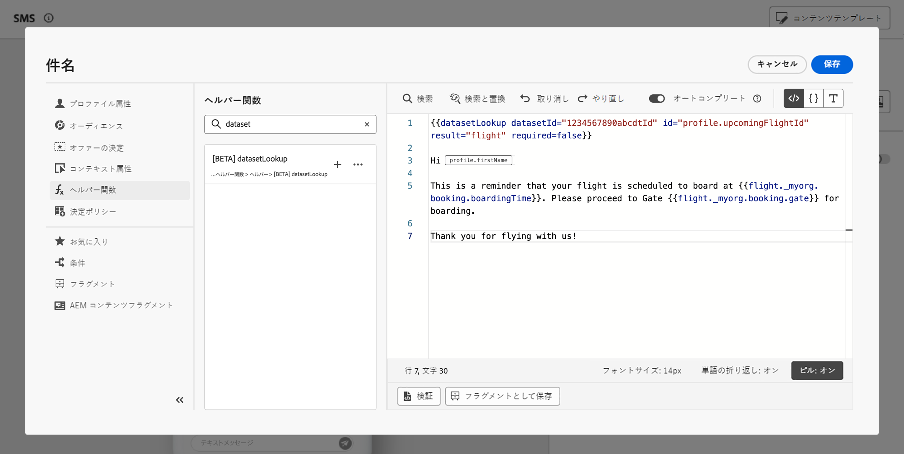

# Adobe Experience Platform データをパーソナライズ機能に活用（Beta） {#aep-data}

>[!AVAILABILITY]
>
>この機能は現在、Private Beta のみで使用可能です。
>
>現時点では、**メッセージチャネル**、アドビに提供した本番以外のサンドボックスでのテスト目的と、ベータ版に要求されたデータセットでのみ利用可能です。

Journey Optimizer を使用すると、パーソナライゼーションエディターで Adobe Experience Platform のデータを利用して、[コンテンツをパーソナライズする](../personalization/personalize.md)ことができます。手順は次の通りです。

1. メッセージなどのパーソナライズ機能を定義でき、すべてのコンテキストで使用できるパーソナライゼーションエディターを開きます。[パーソナライゼーションエディターの操作方法を学ぶ](../personalization/personalization-build-expressions.md)

1. ヘルパー関数リストに移動して、**datasetLookup** ヘルパー関数をコードペインへ追加します。

   

1. この関数は、Adobe Experience Platform データセットからフィールドを呼び出すことができる、定義済みの構文を提供します。構文は以下の通りです。

   ```
   {{entity.datasetId="datasetId" id="key" result="store"}}
   ```

   * **entity.datasetId** は作業中のデータセットの ID です。
   * **id** はデータセットの主な ID として使用されるフィールドです。

     >[!NOTE]
     >
     >このフィールドに入力する値は、フィールド ID（*profile.couponValue*）、ジャーニーイベントで渡されるフィールド（*context.journey.events.event_ID.couponValue*）、または静的な値（*couponAbcd*）です。いずれの場合も、システムは値を使用してデータセットを検索し、キーと一致するかどうかを確認します）。

   * **result** はデータセットから取得するすべてのフィールド値を参照するために指定する必要がある、任意の名前です。この値はコード内で各フィールドを呼び出すために使用されます。

   +++データセット ID はどこで取得できますか？

   データセット ID は、Adobe Experience Platform ユーザーインターフェイスで取得できます。データセットの操作方法については、[Adobe Experience Platform ドキュメント](https://experienceleague.adobe.com/ja/docs/experience-platform/catalog/datasets/user-guide#view-datasets){target="_blank"}を参照してください。

   

+++

   +++データセット内のプライマリ ID フィールドを識別するにはどうすればよいでしょうか？

   特定のデータセットのプライマリ ID として定義されたフィールドは、データセットにリンクされたスキーマ内にあります。ID フィールドの操作方法については、[Adobe Experience Platform ドキュメント](https://experienceleague.adobe.com/ja/docs/experience-platform/xdm/ui/fields/identity){target="_blank"}を参照してください。

   

+++

1. ニーズに合わせて構文を調整します。この例では、乗客のフライトに関連するデータを取得します。構文は以下の通りです。

   ```
   {{entity.datasetId="1234567890abcdtId" id="profile.personalEmail.address" result="flight"}}
   ```

   * ID が「1234567890abcdtId」のデータセットで作業しています。
   * このデータセットでプライマリキーとして使用されるフィールドはメールアドレスです。
   * 「フライト」参照の下のすべてのフィールド値を含めるようにします。

1. Adobe Experience Platform データセットで呼び出す構文が設定されたら、取得するフィールドを指定できます。構文は以下の通りです。

   ```
   {{result.fieldId}}
   ```

   * **result** は **MultiEntity** ヘルパー関数で **result** パラメーターに割り当てた値です。この例では「フライト」です。
   * **fieldID** は取得するフィールドの ID です。この ID は、データセットを参照するときに Adobe Experience Platform ユーザーインターフェイスに表示されます。以下のセクションを展開して例を表示します。

     +++フィールド ID はどこで取得できますか？

     フィールド ID は、Adobe Experience Platform ユーザーインターフェイスでデータセットをプレビューするときに取得できます。データセットをプレビューする方法については、[Adobe Experience Platform ドキュメント](https://experienceleague.adobe.com/ja/docs/experience-platform/catalog/datasets/user-guide#preview){target="_blank"}を参照してください。

     

+++

   この例では、乗客の搭乗時間と搭乗口に関する情報を使用します。したがって、次の 2 行を追加します。

   * `{{flight._myorg.booking.boardingTime}}`
   * `{{flight._myorg.booking.gate}}`

1. コードの準備が整いました。通常通りにコンテンツを完成させ、「**コンテンツをシミュレート**」ボタンを使用してテストし、パーソナライズ機能を確認することができます。[コンテンツのプレビューとテストの方法について学ぶ](../content-management/preview-test.md)


   
