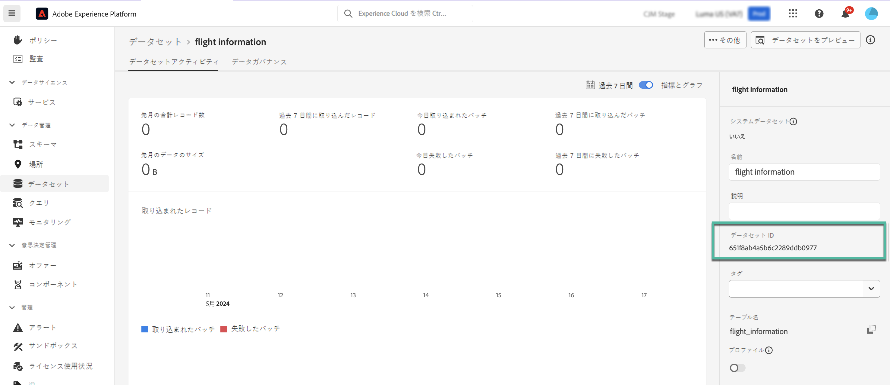
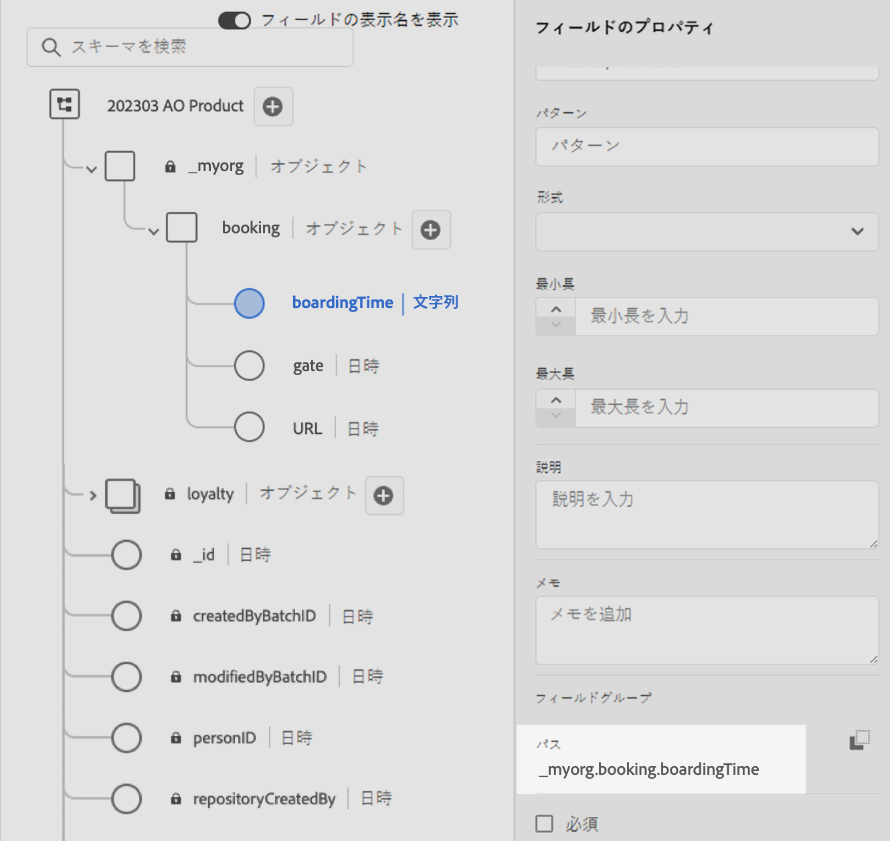

# Adobe Experience Platform データをパーソナライゼーションに使用（ベータ版） {#aep-data}

>[!AVAILABILITY]
>
>この機能は現在、プライベートベータ版としてのみ利用できます。
>
>現時点では、Adobeに提供した非実稼動サンドボックスと、ベータ版にリクエストされたデータセットでのみ、テスト目的で使用できます。

Journey Optimizerでは、式エディターでAdobe Experience Platformのデータを活用して、次のことができます [コンテンツのパーソナライズ](../personalization/personalize.md). 手順は、以下のとおりです。

1. 式エディターを開きます。このエディターは、メッセージなど、パーソナライゼーションを定義できるすべてのコンテキストで使用できます。 [式エディターの操作方法の詳細を学ぶ](../personalization/personalization-build-expressions.md)

1. ヘルパー関数リストに移動し、 **MultiEntity** コードペインへのヘルパー関数。

   

1. この関数は、Adobe Experience Platform データセットからフィールドを呼び出せるように、事前定義済みの構文を提供します。 構文は以下のとおりです。

   ```
   {{entity.datasetId="datasetId" id="key" result="store"}}
   ```

   * **entity.datasetId** は、操作しているデータセットの ID です。
   * **id** は、データセットでプライマリ id として使用されるフィールドです。
   * **result** は、データセットから取得するすべてのフィールド値を参照するために指定する必要がある任意の名前です。 この値は、コードで各フィールドを呼び出すために使用されます。

   +++データセット ID はどこで取得できますか？

   データセット ID は、Adobe Experience Platform ユーザーインターフェイスで取得できます。 でデータセットを使用する方法を説明します [Adobe Experience Platform ドキュメント](https://experienceleague.adobe.com/en/docs/experience-platform/catalog/datasets/user-guide#view-datasets){target="_blank"}.

   

+++

   +++データセットでプライマリ ID フィールドを識別するにはどうすればよいですか？

   特定のデータセットのプライマリ ID として定義されたフィールドは、データセットにリンクされたスキーマにあります。 での ID フィールドの使用方法を学ぶ [Adobe Experience Platform ドキュメント](https://experienceleague.adobe.com/en/docs/experience-platform/xdm/ui/fields/identity){target="_blank"}.

   

+++

1. ニーズに合わせて構文を調整します。 この例では、乗客の便に関するデータを取得します。 構文は以下のとおりです。

   ```
   {{entity.datasetId="1234567890abcdtId" id="profile.personalEmail.address" result="flight"}}
   ```

   * ID が「1234567890abcdtId」のデータセットで作業しています。
   * このデータセットでプライマリキーとして使用されるフィールドは、メールアドレスです。
   * 「flight」リファレンスの下のすべてのフィールド値を含めます。

1. Adobe Experience Platform データセットで呼び出す構文を設定したら、取得するフィールドを指定できます。 構文は以下のとおりです。

   ```
   {{result.fieldId}}
   ```

   * **result** は、に割り当てた値です **result** のパラメーター **MultiEntity** ヘルパー関数。 この例では「flight」です。
   * **fieldID** は、取得するフィールドの ID です。 この ID は、データセットを参照すると、Adobe Experience Platform ユーザーインターフェイスに表示されます。 以下のセクションを展開すると、例が表示されます。

     +++フィールド ID はどこで取得できますか？

     フィールド ID は、Adobe Experience Platform ユーザーインターフェイスでデータセットをプレビューする際に取得できます。 でデータセットをプレビューする方法を説明します [Adobe Experience Platform ドキュメント](https://experienceleague.adobe.com/en/docs/experience-platform/catalog/datasets/user-guide#preview){target="_blank"}.

     

+++

   ここでは、乗客の搭乗時間と搭乗口に関する情報を使用します。 したがって、次の 2 行を追加します。

   * `{{flight._myorg.booking.boardingTime}}`
   * `{{flight._myorg.booking.gate}}`

1. コードの準備が整ったら、通常どおりにコンテンツを完成させ、を使用してテストできます。 **コンテンツをシミュレート** ボタンをクリックして、パーソナライゼーションを確認します。 [コンテンツのプレビューとテストの方法を学ぶ](../content-management/preview-test.md)


   
