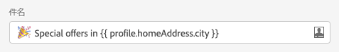
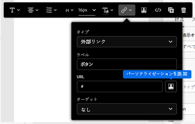
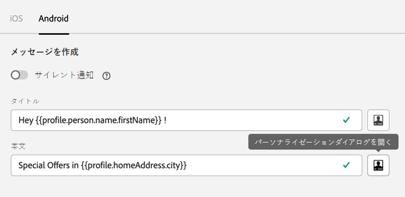
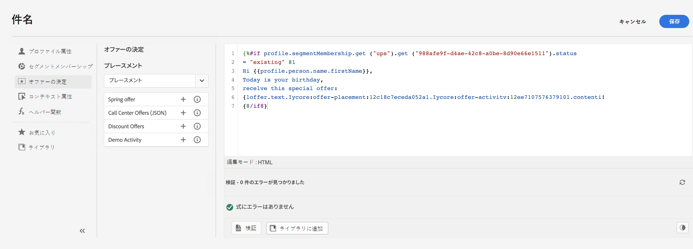

# パーソナライゼーションコンテキストとツール{#personalization-areas}

Journey Optimizerが配信するメッセージの内容や表示は、様々な方法でパーソナライズできます。

エディターアイコンに関連付けられたすべてのフィールドで、パーソナライゼーションエディターを開いて、パーソナライゼーションコンテンツを受け取ることができます。

## 電子メールのパーソナライズ

Eメールを作成する際に、メッセージの「**Eメールの件名**」フィールドにパーソナライゼーションを追加できます。

電子メールデザイナーでは、コンテンツをパーソナライズできます。

* **メッセージ**&#x200B;内：テキストブロック内をクリックし、コンテキストツールバーの&#x200B;**パーソナライズ**&#x200B;アイコンをクリックして、「**パーソナライズを挿入**」フィールドを選択します。 電子メールデザイナーインターフェイスについて詳しくは、[このセクション](../design-emails.md)を参照してください。

   

* **リンク**&#x200B;の場合：テキストブロック内のテキストまたは画像を選択し、コンテキストツールバーから&#x200B;**リンクを挿入**&#x200B;アイコンをクリックします。 このウィンドウで、パーソナライゼーションブロックを追加するには、**パーソナライゼーション追加**&#x200B;アイコンをクリックします。

   

## プッシュ通知のパーソナライズ

次のフィールドで、**プッシュ通知**&#x200B;をパーソナライズすることもできます。

* **タイトル**
* **本文**
* **カスタムサウンド**
* **バッジ**
* **カスタムデータ**

プッシュ通知の設定について詳しくは、[この節](../create-push.md)を参照してください。

## 式エディターを使用する

式エディターは、Journey Optimizerのパーソナライゼーションの中心です。

電子メール、プッシュ、オファーなど、パーソナライズを定義する必要があるすべてのコンテキストで利用できます。

式エディターインターフェイスでは、すべてのデータを選択、整理、カスタマイズ、および検証して、コンテンツ用のカスタマイズされたパーソナライゼーションを作成します。

画面の左側には、パーソナライゼーションのソースを選択できるドメインセレクターが表示されます。

* **プロファイル** : [Adobe Experience Platformデータモデル(XDM)」ドキュメントで説明されているプロファイルスキーマに関連付けられているすべての参照リスト](https://experienceleague.adobe.com/docs/experience-platform/xdm/home.html?lang=ja)。
* **セグメントのメンバーシップ** :Adobe Experience Platform Segmentationサービスで作成されたすべてのセグメントをリストします。利用可能なセグメント化の詳細[こちら](https://experienceleague.adobe.com/docs/experience-platform/xdm/home.html?lang=ja)
* **オファー** ：特定の配置に関連付けられているすべてのオファーをリストします。配置を選択し、コンテンツにオファーを挿入します。 オファーの管理方法に関する完全なドキュメントについては、[この節](../deliver-personalized-offers.md)を参照してください。
* **コンテキスト** :ジャーニー **** でMessageアクティビティを使用する場合、このメニューでコンテキストジャーニーフィールドを使用できます。[この節](personalization-use-case.md)を参照してください。
* **ヘルパー関数** :に、計算、データのフォーマットやコンバージョン、条件、パーソナライゼーションのコンテキストでの操作など、データに対して実行できるすべてのヘルパー関数を示します。[詳細情報](functions/functions.md)

選択すると、エディタに参照が追加されます。

>[!NOTE]
>
>「+」アイコンの横の情報アイコンをクリックすると、ツールチップが開き、各変数の詳細が表示されます。

次の例では、式エディターを使用して、今日の誕生日があるプロファイルを選択し、この日に対応する特定のオファーを挿入してカスタマイズを完了できます。

