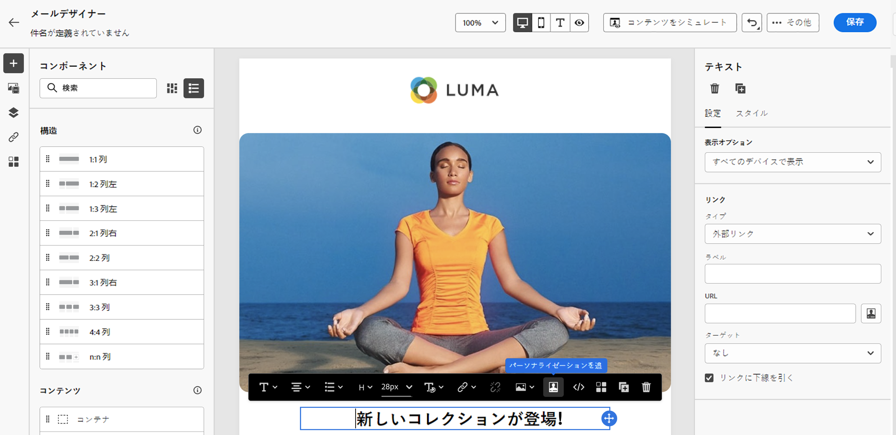

# パーソナライゼーション領域{#personalization-areas}

Journey Optimizerが配信するメッセージの内容や表示は、様々な方法でパーソナライズできます。

エディターアイコンに関連付けられたすべてのフィールドで、パーソナライゼーションエディターを開いて、パーソナライゼーションコンテンツを受け取ることができます。

## 電子メールのパーソナライズ

電子メールチャネルメッセージの作成時に、**電子メールの件名**&#x200B;フィールドがパーソナライズ可能になります。

電子メールデザイナーでは、コンテンツをパーソナライズできます。

* **メッセージ**&#x200B;内：テキストブロック内をクリックし、コンテキストツールバーの&#x200B;**パーソナライズ**&#x200B;アイコンをクリックして、「**パーソナライズ**&#x200B;を挿入」フィールドを選択します。 電子メールデザイナーインターフェイスについて詳しくは、を参照してください。

   

* **リンク**&#x200B;の場合：テキストブロック内のテキストまたは画像を選択し、コンテキストツールバーから&#x200B;**リンク**&#x200B;を挿入アイコンをクリックします。 このウィンドウで、パーソナライゼーションブロックを追加するには、**パーソナライゼーション追加**&#x200B;アイコンをクリックします。

   

## プッシュ通知のカスタマイズ

**プッシュチャネル**&#x200B;では、パーソナライゼーションを使用してプッシュ通知を微調整できます。

次のフィールドでパーソナライゼーションを追加できます。

* **タイトル**
* **本文**
* **カスタムサウンド**
* **バッジ**
* **カスタムデータ**

プッシュ通知の設定に関する詳細なドキュメントについては、[このセクション](../configure-push.md)を参照してください。

## 式エディターの使用

式エディターは、Journey Optimizerのパーソナライゼーションの中心です。

電子メール、プッシュ、オファーなど、パーソナライズを定義する必要があるすべてのコンテキストで利用できます。

式エディターインターフェイスでは、すべてのデータを選択、整理、カスタマイズ、および検証して、コンテンツ用のカスタマイズされたパーソナライゼーションを作成します。

画面の左側には、パーソナライゼーションのソースを選択できるドメインセレクターが表示されます。

* **プロファイル** :「 [Adobe Experience Platformデータモデル(XDM)」ドキュメントで説明されているプロファイルスキーマに関連付けられているすべての参照リスト](https://experienceleague.adobe.com/docs/experience-platform/xdm/home.html?lang=ja)。
* **セグメントのメンバーシップ** :Adobe Experience PlatformSegmentationサービスで作成されたすべてのセグメントをリストします。分類の詳細については、[ここ](https://experienceleague.adobe.com/docs/experience-platform/segmentation/home.html?lang=en)を参照
* **オファー** :特定の配置に関連付けられているすべてのオファーをリストします。配置を選択し、コンテンツにオファーを挿入します。 オファーの管理方法に関する完全なドキュメントについては、[このセクション](https://experienceleague.adobe.com/docs/customer-journey-management/using/create-messages/deliver-personalized-offers.html?lang=en#about-offer-decisioning)を参照してください。

選択すると、エディタに参照が追加されます。

>[!NOTE]
>
>「+」アイコンの横の情報アイコンをクリックすると、ツールチップが開き、各変数の詳細が表示されます。

次の例では、式エディターを使用して、今日の誕生日があるプロファイルを選択し、この日に対応する特定のオファーを挿入してカスタマイズを完了できます。

