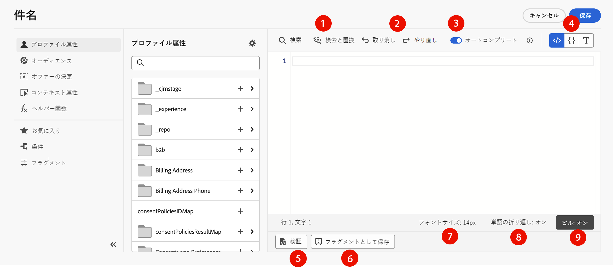

# パーソナライゼーションの追加 {#build-personalization-expressions}

>[!CONTEXTUALHELP]
>id="ajo_perso_editor"
>title="パーソナライゼーションエディターについて"
>abstract="パーソナライゼーションエディターを使用すると、すべてのデータを選択、整理、カスタマイズ、検証して、コンテンツ用にカスタマイズされたパーソナライゼーションを作成できます。"

パーソナライゼーションエディターは、[!DNL Journey Optimizer] のパーソナライズ機能の中核です。メール、プッシュ、オファーなど、パーソナライゼーションを定義する必要があるすべてのコンテキストで利用できます。

パーソナライゼーションエディターインターフェイスでは、すべてのデータを選択、整理、カスタマイズ、検証して、コンテンツ用にカスタマイズされたパーソナライゼーションを作成できます。


## パーソナライゼーションを追加できる場所

 アイコンを使用して、すべてのフィールドの **[!DNL Journey Optimizer]** にパーソナライゼーションを追加できます。詳しくは、以下の節を展開してください。

+++メッセージ

メッセージでは、「**[!UICONTROL 件名]**」フィールドなど、メッセージ内の様々な場所にパーソナライゼーションを追加できます。


また、コンテンツの他のセクションに追加することもできます。例えば、[プッシュ通知](../push/push-gs.md)の場合、「**タイトル**」、「**本文**」、「**カスタムサウンド**」、「**バッジ**」および「**カスタムデータ**」の各フィールドにパーソナライゼーションを追加できます。

+++

+++E メールデザイナー

[E メールデザイナー](../email/get-started-email-design.md)でメールコンテンツを編集する際は、コンテキストツールバーのアイコンを使用して、テキストブロックと URL にパーソナライゼーションを追加できます。


+++

+++オファー

**オファーの表示域**&#x200B;でテキストタイプのコンテンツを使用する際は、パーソナライゼーションを追加できます。[詳しくは、パーソナライズされたオファーの作成を参照してください。](../offers/offer-library/creating-personalized-offers.md)

+++

+++URL

Journey Optimizer では、メッセージ内の **URL** をパーソナライズすることもできます。パーソナライズされた URL は、プロファイル属性に応じて、受信者を web サイトの特定のページに誘導するか、パーソナライズされたマイクロサイトに誘導します。URL のパーソナライゼーションは、**外部リンク**、**購読解除リンク**、**オプトアウト**&#x200B;のリンクのタイプで使用できます。

パーソナライズされた URL のサンプル：

* `https://www.adobe.com/users/{{profile.person.name.lastName}}`
* `https://www.adobe.com/users?uid={{profile.person.name.firstName}}`
* `https://www.adobe.com/usera?uid={{context.journey.technicalProperties.journeyUID}}`
* `https://www.adobe.com/users?uid={{profile.person.crmid}}&token={{context.token}}`

{width="50%"}

>[!NOTE]
>
>パーソナライゼーションエディターでは、パーソナライズされた URL を編集する際、セキュリティ上の理由から、ヘルパー関数とオーディエンスメンバーシップが無効になります。
>
>スペースは、URL 内で使用されるパーソナライゼーショントークンではサポートされていません。

+++

+++メール設定

メールチャネル設定を作成する際に、サブドメイン、ヘッダー、URL トラッキングパラメーターのパーソナライズされた値を定義できます。 [詳細情報](../email/surface-personalization.md)

+++

## パーソナライゼーションのソース {#sources}

ナビゲーションパネルでは、パーソナライゼーションのソースを選択できます。利用可能なソースは次のとおりです。

* **[!UICONTROL プロファイル属性]** :[Adobe Experience Platform データモデル（XDM）ドキュメント ](https://experienceleague.adobe.com/docs/experience-platform/xdm/home.html?lang=ja){target="_blank"} に記載のプロファイルスキーマに関連付けられているすべての参照をリストします。
* **[!UICONTROL オーディエンス]**：Adobe Experience Platform セグメント化サービスで作成されたすべてのオーディエンスをリストします。セグメント化の詳細については、[ここ](https://experienceleague.adobe.com/docs/experience-platform/segmentation/home.html?lang=ja){target="_blank"}を参照してください。
* **[!UICONTROL オファー決定]**：特定のプレースメントに関連付けられているすべてのオファーを一覧表示します。配置を選択し、コンテンツにオファーを挿入します。オファーの管理方法に関する詳細なドキュメントについては、[この節](../offers/get-started/starting-offer-decisioning.md)を参照してください。
* **[!UICONTROL コンテキスト属性]**：チャネルアクションアクティビティ（メール、プッシュ、SMS）をジャーニーまたはキャンペーンで使用する場合、イベントやプロパティに関連するコンテキスト属性をパーソナライズに使用できます。コンテキスト属性を活用したパーソナライゼーションの例については、[この節](personalization-use-case.md)を参照してください。

>[!NOTE]
>
>構成ワークフローを使用して生成されたエンリッチメント属性でオーディエンスをターゲットにしている場合は、これらのエンリッチメント属性を活用してメッセージをパーソナライズできます。[詳しくは、オーディエンスのエンリッチメント属性の使用方法を参照してください。](../audience/about-audiences.md#enrichment)

## パーソナライゼーションの追加 {#add}

>[!CONTEXTUALHELP]
>id="ajo_perso_editor_autocomplete"
>title="オートコンプリート"
>abstract="このオプションをオンに切り替えると、入力時に候補が自動的に表示され、コードが入力されます。この機能は、HTML およびテキスト形式でのみ使用でき、プロファイル属性とコンテキスト属性をサポートします。切替スイッチで無効にした場合、エディターは代わりにネイティブ HTML コードのオートコンプリートを指定します。"

中央のワークスペースは、パーソナライゼーション構文を作成する場所です。属性を使用してメッセージをパーソナライズするには、左側のナビゲーションパネルで属性を見つけて、`+` ボタンをクリックして式に追加します。


`+` アイコンの横にある省略記号メニューを使用すると、各属性の詳細を取得したり、使用頻度の高い属性をお気に入りに追加したりできます。お気に入りに追加した属性には、左側のナビゲーションパネルの&#x200B;**[!UICONTROL お気に入り]**&#x200B;メニューからアクセスできます。

>[!NOTE]
>
>デフォルトでは、属性パネルには入力した属性のみが表示されます。すべての属性を表示するには、検索フィールドの上にある「」ボタンを選択し、「**[!UICONTROL 入力した属性のみを表示]**」オプションをオフに切り替えます。

さらに、文字列タイプのプロファイル属性が空の場合に表示されるデフォルトの代替テキストを定義できます。これを行うには、属性の横にある省略記号ボタンをクリックし、「**[!UICONTROL 代替テキストで挿入]**」を選択します。プロファイルの属性の値が空の場合にデフォルトで表示するテキストを書き込み、「**[!UICONTROL 追加]**」をクリックします。


次の例では、パーソナライゼーションエディターを使用して、本日が誕生日のプロファイルを選択し、この日に対応する特定のオファーを挿入してカスタマイズを完了します。


## 式編集のオプション {#options}

中央のワークスペースには、パーソナライゼーション式を記述するのに役立つ様々なツールが用意されています。



利用可能なオプションは次のとおりです。

1. **[!UICONTROL 検索]**／**[!UICONTROL 検索と置換]**：式を検索して、コードの一部を自動的に置換します。
1. **[!UICONTROL 取り消し]**／**[!UICONTROL やり直し]**：最後の操作を取り消し／やり直します。
1. **[!UICONTROL オートコンプリート]**：入力中にコードを自動的に提案し、完成させます。この機能は、HTML およびテキスト形式でのみ使用でき、プロファイル属性とコンテキスト属性をサポートします。切替スイッチで無効にした場合、エディターは代わりにネイティブ HTML コードのオートコンプリートを指定します。

   {width="70%" align="center" zoomable="yes"}

1. **[!UICONTROL HTML]**／**[!UICONTROL JSON]**／**[!UICONTROL テキスト]**：コードの形式を識別します。これにより、ユーザーが選択した言語に合わせて、検証およびオートコンプリート機能が調整されます。
1. **[!UICONTROL 検証]**：式の構文を確認します。詳しくは、[この節](../personalization/personalization-build-expressions.md)を参照してください。
1. **[!UICONTROL フラグメントとして保存]**：式を式フラグメントとして保存します。詳しくは、[この節](../content-management/save-fragments.md#save-as-expression-fragment)を参照してください。
1. **[!UICONTROL フォントサイズ]**：読みやすくなるように、エディター内のコンテンツのフォントサイズを調整します。
1. **[!UICONTROL 単語の折り返し]**：単語の折り返しを有効または無効にして、長い式をエディター内で 1 行に表示したり折り返して表示したりできます。次のようなオプションがあります。
   * **オフ**（デフォルト） - 単語の折り返しを行いません。長い行はエディタービューを超えて伸び、すべてを表示するには水平スクロールが必要になります。
   * **オン** - エディターの幅で行を折り返します。
   * **単語の折り返し列** - 1 行の文字数が 80 文字に達すると行を折り返します。
   * **境界付き** - エディターの幅または 80 文字のいずれか小さい方で行を折り返します。
1. **[!UICONTROL ピル]**：属性をコンパクトな「ピル」として表示し、長い属性パスを非表示にして読みやすさを向上させます。 属性をクリックすると、その完全なパスが表示されます。

   >[!NOTE]
   >
   >錠剤の表示は、今後 30 日間で徐々にすべての環境に展開されます。
   >
   >このオプションは、プロファイル属性、コンテキスト属性および Dynamic Media でのみ使用できます。

ナビゲーションペインでは、パーソナライゼーション式を作成するのに役立つ追加機能を利用できます。


* **[!UICONTROL ヘルパー関数]**：ヘルパー関数を使用すると、データに対する操作（計算、データの書式設定や変換、条件、パーソナライゼーションのコンテキストでの操作など）を実行できます。[詳しくは、使用可能なヘルパー関数を参照してください](functions/functions.md)

* **[!UICONTROL お気に入り]** - お気に入りに追加した属性がこのリストに表示されます。これにより、最も頻繁に使用する項目にすばやくアクセスできます。属性をお気に入りに追加するには、省略記号メニューをクリックし、「**[!UICONTROL お気に入りに追加]**」を選択します。

* **[!UICONTROL 条件]** - ライブラリで作成した条件付きルールを活用して、メッセージに動的コンテンツを追加します。これにより、条件に基づいてメッセージの複数のバリアントを作成できます。[動的コンテンツの作成方法についてはこちらを参照](../personalization/get-started-dynamic-content.md)

* **[!UICONTROL フラグメント]** - 現在のサンドボックスに作成または保存された式フラグメントを活用します。フラグメントは、[!DNL Journey Optimizer] キャンペーンおよびジャーニー全体で参照できる、再利用可能なコンポーネントです。この機能を使用すると、複数のカスタムコンテンツブロックを事前に構築し、マーケティングユーザーはそのコンテンツブロックを使用して、改善されたデザインプロセスでコンテンツを迅速に組み立てることができます。[式フラグメントをパーソナライゼーションに使用する方法についてはこちらを参照](../personalization/use-expression-fragments.md)

パーソナライゼーション式を準備できたら、パーソナライゼーションエディターで検証する必要があります。詳しくは、[この節](../personalization/personalization-build-expressions.md)を参照してください。

## 検証メカニズム {#validation-mechanisms}

「**追加**」ボタンをクリックしてエディターウィンドウを閉じると、式の検証が自動的に実行されます。「**検証**」ボタンを使用して、パーソナライゼーション構文を確認することもできます。


パーソナライゼーションの検証時に発生する可能性のある一般的なエラーについては、次の節を展開してください。

+++一般的なエラー

* **パス「XYZ」が見つかりません**

スキーマで定義されていないフィールドを参照しようとしたとき。

この場合、**firstName1** は、プロファイルスキーマの属性として定義されていません。

```
{{profile.person.name.firstName1}}
```

* **変数「XYZ」のタイプが一致しません。予想される配列です。文字列が見つかりました。**

配列ではなく文字列を反復処理する場合：

この場合、**product** は配列ではありません。

```
{{each profile.person.name.firstName as |product|}}
 {{product.productName}}
{{/each}}
```

* **ハンドルバー構文が無効です。`'[XYZ}}'`** が見つかりました

無効なハンドルバー構文が使用される場合。

ハンドルバー式は **{{expression}}** で囲まれます

```
   {{[profile.person.name.firstName}}
```

* **無効なセグメント定義**

```
No segment definition found for 988afe9f0-d4ae-42c8-a0be-8d90e66e151
```

+++

オファーの場合、特定のエラーが発生する場合があります。詳しくは、以下の節を展開してください。

+++ オファーに関連する特定のエラー

メールまたはプッシュメッセージ内のオファー統合に関連するエラーは、次のパターンになります。

```
Offer.<offerType>.[PlacementID].[ActivityID].<offer-attribute>
```

検証は、パーソナライゼーションエディターでのパーソナライゼーションコンテンツの検証中に実行されます。

<table> 
 <thead> 
  <tr> 
   <th> エラータイトル<br /> </th> 
   <th> 検証／解決 <br /> </th> 
  </tr> 
 </thead> 
 <tbody> 
  <tr> 
   <td>ID が placementID でタイプが OfferPlacement のリソースが見つかりません <br/>
IDが activityID でタイプが OfferActivity のリソースが見つかりません<br/></td> 
   <td>ActivityID または PlacementID、あるいはその両方が使用可能かどうかを確認します</td> 
  </tr> 
   <tr> 
   <td>リソースを検証できませんでした。</td> 
   <td>プレースメントの componentType は、offerType オファーと一致する必要があります</td> 
  </tr> 
   <tr> 
   <td>オファー offerId にパブリック URL が存在しません。</td> 
   <td>画像オファー（決定とプレースメントのペアに関連付けられたすべてのパーソナライズオファーおよびフォールバック）には、パブリック URL を入力する必要があります（deliveryURL を空にすることはできません）。</td> 
  </tr> 
  <tr> 
   <td>決定にプロファイル以外の属性が含まれています。</td> 
   <td>オファーモデルの使用には、プロファイル属性のみを含める必要があります。</td> 
  </tr> 
  <tr> 
   <td>決定の使用状況の取得中にエラーが発生しました。</td> 
   <td>このエラーは、API がオファーモデルを取得しようとしているときに発生する可能性があります。</td> 
  </tr>
  <tr> 
   <td>オファー属性 offer-attribute が無効です。</td> 
   <td>オファー drp で参照されている offer-attribute が有効かどうかを確認します。有効な属性は次のとおりです。<br/>
画像：deliveryURL, linkURL<br/>
テキスト：content<br/>
HTML：content<br/></td> 
  </tr> 
 </tbody> 
</table>

+++
