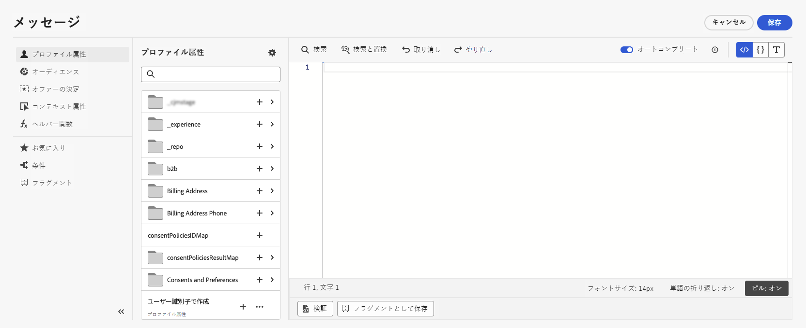

# 式エディターについて {#build-personalization-expressions}

>[!CONTEXTUALHELP]
>id="ajo_perso_editor"
>title="式エディターについて"
>abstract="式エディターでは、すべてのデータを選択、整理、カスタマイズおよび検証して、コンテンツに合わせてカスタマイズされたパーソナライゼーションを作成できます。"

式エディターは、のパーソナライゼーションの中心となる機能です。 [!DNL Journey Optimizer]. メール、プッシュ、オファーなど、パーソナライゼーションを定義する必要があるすべてのコンテキストで利用できます。

式エディターインターフェイスでは、すべてのデータを選択、整理、カスタマイズ、および検証して、コンテンツ用にカスタマイズされたパーソナライゼーションを作成します。

画面の左側には、パーソナライゼーションのソースを選択できるドメインセレクターが表示されます。

利用可能なソースは次のとおりです。

* **[!UICONTROL プロファイル属性]**：[Adobe Experience Platform データモデル（XDM）ドキュメント](https://experienceleague.adobe.com/docs/experience-platform/xdm/home.html?lang=ja){target=&quot;_blank&quot;}に記載のプロファイルスキーマに関連付けられているすべての参照を一覧表示します。
* **[!UICONTROL セグメントメンバーシップ]**：Adobe Experience Platform セグメント化サービスで作成されたすべてのセグメントを一覧表示します。セグメント化について詳しくは、[こちら](https://experienceleague.adobe.com/docs/experience-platform/segmentation/home.html?lang=ja){target=&quot;_blank&quot;}を参照してください。
* **[!UICONTROL オファー決定]**：特定のプレースメントに関連付けられているすべてのオファーを一覧表示します。配置を選択し、コンテンツにオファーを挿入します。オファーの管理方法に関する詳細なドキュメントについては、[この節](../messages/deliver-personalized-offers.md)を参照してください。
* **[!UICONTROL コンテキスト属性]**：ジャーニーで&#x200B;**メッセージ**&#x200B;を使用している場合は、ジャーニーのコンテキストフィールドをこのメニューから使用できます。詳しくは、[この節](personalization-use-case.md)を参照してください。
* **[!UICONTROL ヘルパー関数]**：データの操作を実行できるすべてのヘルパー関数を示します。データの操作には、計算、データのフォーマットやコンバージョン、条件、パーソナライゼーションのコンテキストでの操作などがあります。詳しくは、[この節](functions/functions.md)を参照してください。

「+」ボタンをクリックして、エディターに属性を追加します。

>[!NOTE]
>
>「+」アイコンの横にある楕円メニューを使用すると、各変数の詳細を取得し、使用頻度の高い属性を [お気に入り](personalization-favorites.md).

次の例では、式エディターを使用して、本日が誕生日のプロファイルを選択し、この日に対応する特定のオファーを挿入してカスタマイズを完了します。

パーソナライズ機能の式を準備できたら、式エディターで検証する必要があります。詳しくは、[この節](personalization-validation.md)を参照してください。
