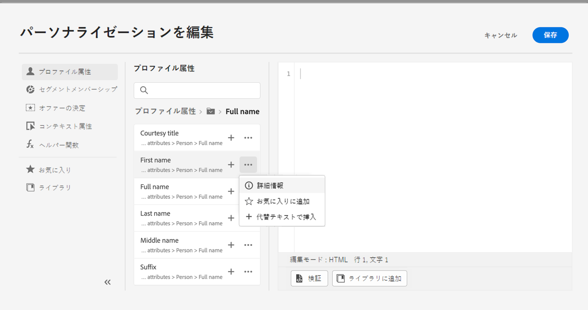
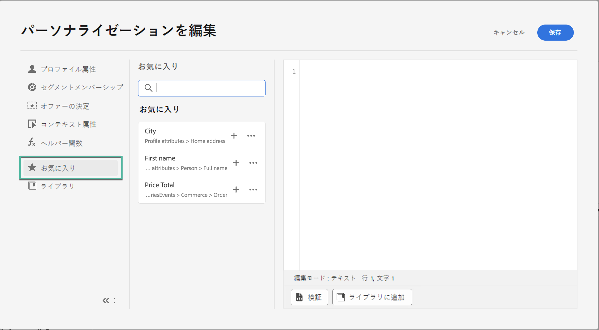
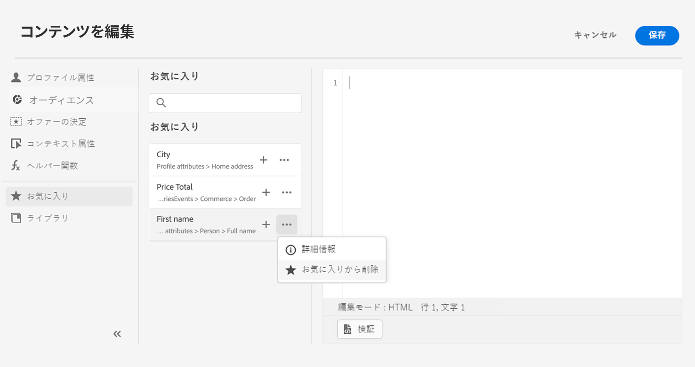

# お気に入りに属性を追加 {#fav}

お気に入りメニューに異なる属性を追加すると、最も頻繁に使用する項目にすばやくアクセスできます。 属性をお気に入りに追加するには、「...」メニューをクリックし、**[!UICONTROL お気に入りに追加]**&#x200B;を選択します。

お気に入りに登録した項目にアクセスするには、 **[!UICONTROL お気に入り]** メニューを開きます。

このリストから、パーソナライゼーションオブジェクトを現在の式にすばやく追加できます。

お気に入りリストに項目を表示する必要がなくなった場合は、お気に入りから削除します。

