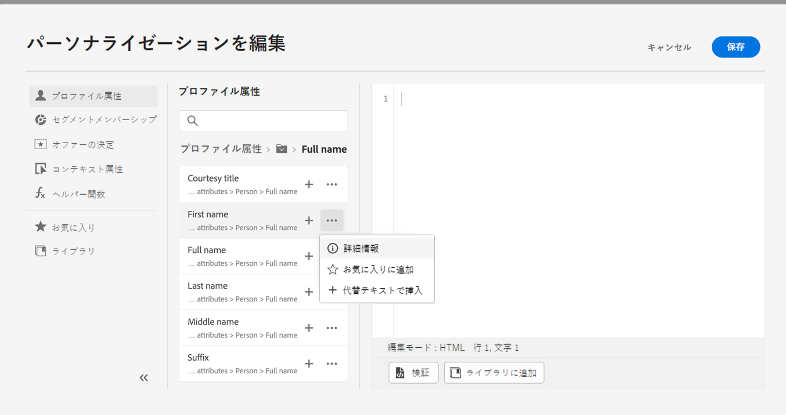
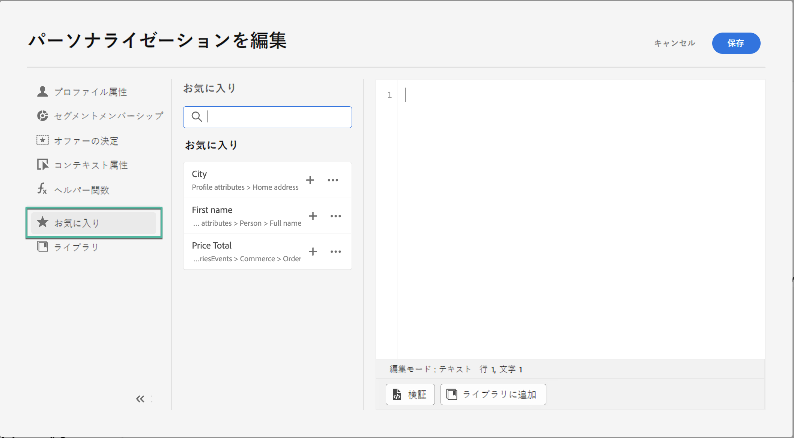
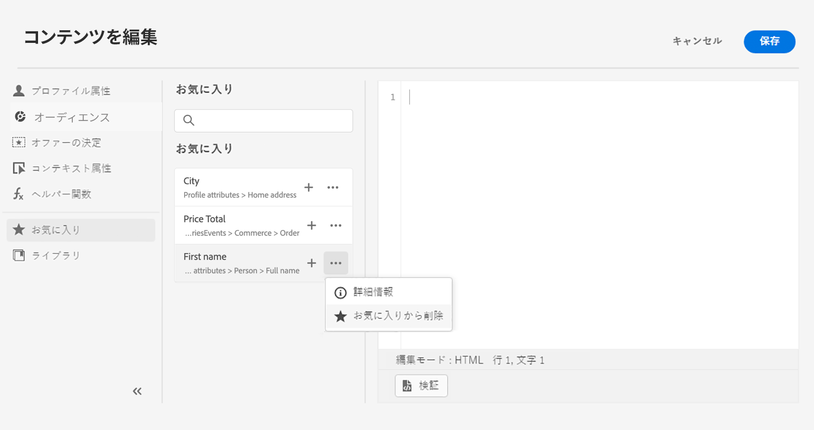

# お気に入りに属性を追加 {#fav}

お気に入りメニューに異なる属性を追加すると、最も頻繁に使用する項目にすばやくアクセスできます。 属性をお気に入りに追加するには、「...」メニューをクリックし、「**[!UICONTROL お気に入りに追加]**」を選択します。

<!--

-->

お気に入りの項目にアクセスするには、左ウィンドウの&#x200B;**[!UICONTROL お気に入り]**&#x200B;メニューを使用します。

このリストから、パーソナライゼーションオブジェクトを現在の式にすばやく追加できます。

<!--

-->

お気に入りリストに項目を表示する必要がなくなった場合は、お気に入りから削除します。

<!--

-->
