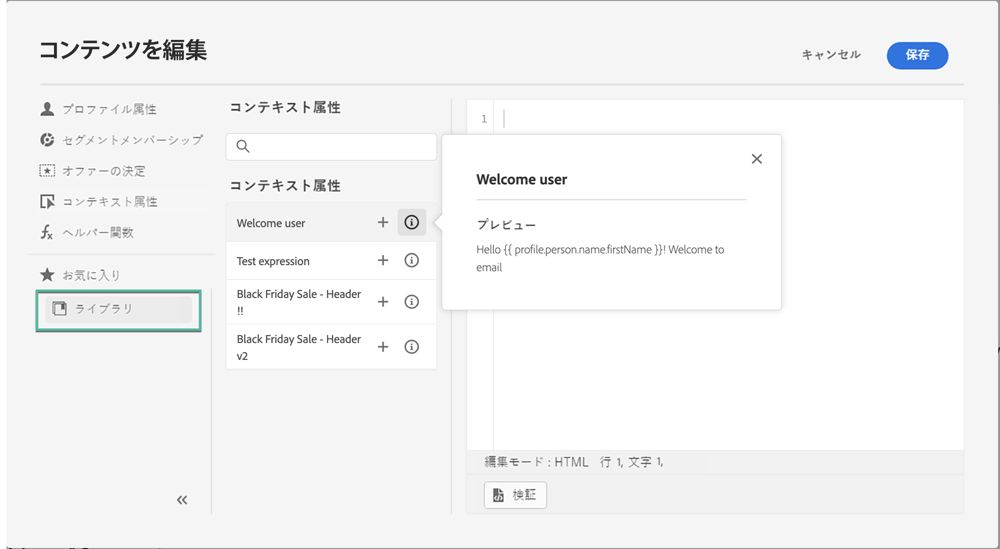
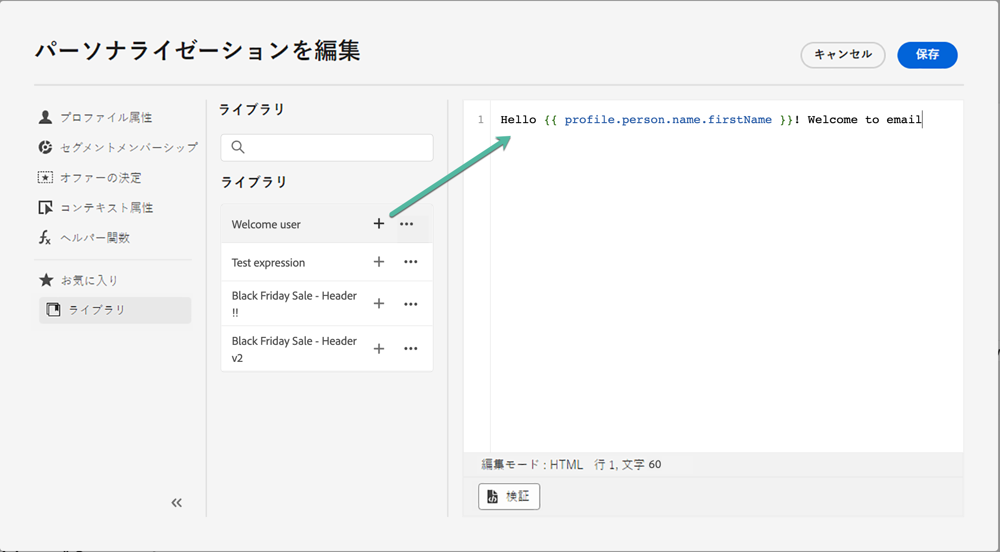
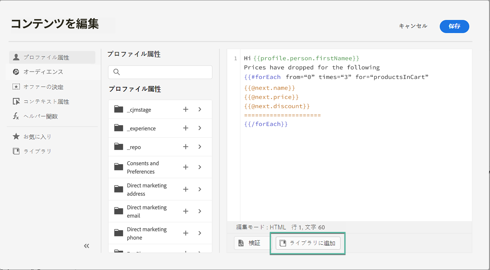
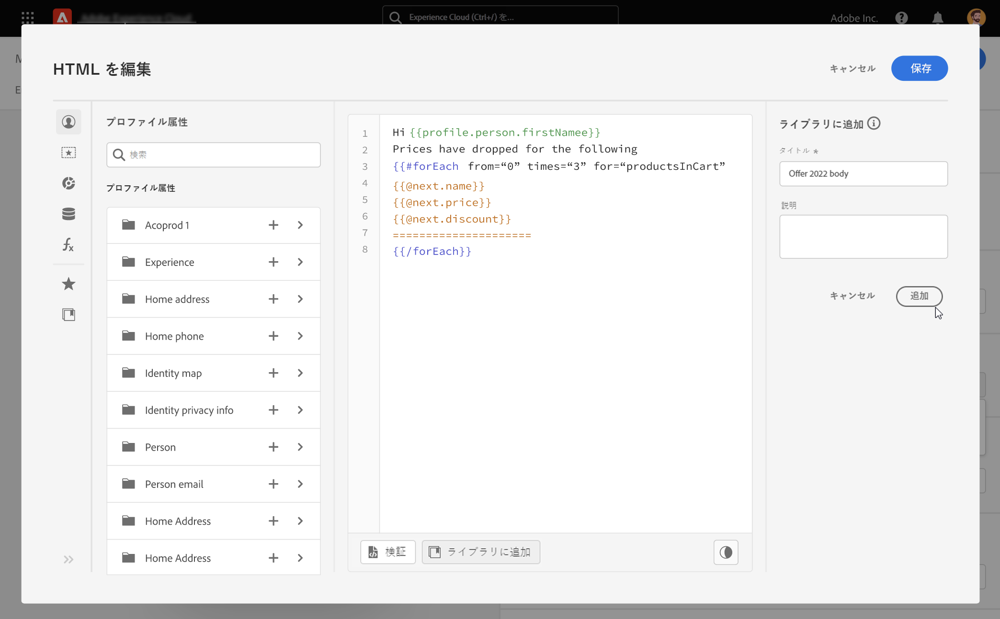

# 保存済み式を使用 {#expression-library}

>[!CONTEXTUALHELP]
>id="ajo_perso_library"
>title="式ライブラリについて"
>abstract="[!DNL Journey Optimizer] は、管理者ユーザーが設定した、保存済みのパーソナライゼーション式にアクセスできるライブラリを提供します。 "

[!DNL Journey Optimizer] は、管理者ユーザーが追加した、以前に保存済みのパーソナライゼーション式にアクセスできるライブラリを提供します。

➡️ [保存した式の使用方法については、このビデオを参照してください](#video-preview)

保存済みの式にアクセスするには、左側のパネルの「**[!UICONTROL ライブラリ]**」ボタンをクリックします。リストには、管理者ユーザーが保存したすべての式が表示されます（[ライブラリに式を保存](#save-expressions)を参照）。

>[!NOTE]
>
>情報ボタンを使用して、保存済みの式の内容に関する詳細情報を取得できます。ライブラリ項目を管理する適切な権限を持っている場合、楕円形のメニューに情報ボタンが表示されます。

「+」をクリックして、エディターに式を挿入します。その後、通常どおりにパーソナライゼーションコンテンツをカスタマイズして検証できます。[詳細情報](../personalization/personalization-build-expressions.md)

## ライブラリに式を保存 {#save-expressions}

[!DNL Journey Optimizer] を使用すると、管理者ユーザーはパーソナライゼーション式をライブラリに保存できます。これらの式は、パーソナライゼーションコンテンツを構築するために、すべてのユーザーが使用できます。

ライブラリに式を保存するには、次の手順に従います。

1. エディターインターフェイスで、式を作成し、「 **[!UICONTROL ライブラリに追加]**」をクリックします。

   >[!NOTE]
   >
   >ボタンが表示されない場合は、Admin Console で必要な権限があることを確認します（[権限レベル](../administration/high-low-permissions.md)を参照）。

   

1. 右側のパネルで式のタイトルと説明を入力して、式を見つけやすくし、その後「**[!UICONTROL 追加]**」をクリックします。

   

1. 式がライブラリに追加されます。これで、ユーザーはこの機能を使用してパーソナライゼーションコンテンツを構築できるようになります。

>[!NOTE]
>
>* 式は 200 KB 以内にする必要があります。
>
>* 保存済みの式は作成日別に並べ替えられ、最近追加された式がリストの最初に表示されます。

既存の式を編集するには、エディターに式を追加し、必要に応じて変更します。「**[!UICONTROL ライブラリに追加]**」をクリックして構文を検証し、式を保存します。

式を削除するには、楕円形ボタンをクリックし、「**[!UICONTROL 削除]**」をクリックします。

## ハウツービデオ{#video}

保存したパーソナライゼーションライブラリ項目をメッセージで使用する方法と、パーソナライゼーションライブラリ項目を作成および管理する方法について説明します。

>[!VIDEO](https://video.tv.adobe.com/v/340941?quality=12)

