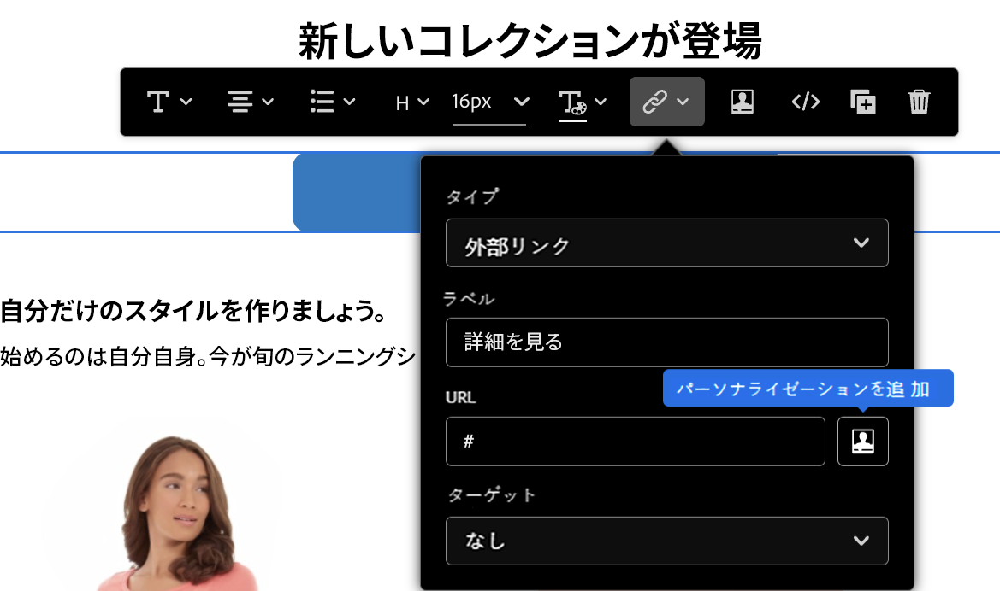

# パーソナライゼーション構文 {#personalization-syntax}

[!DNL Journey Optimizer] のパーソナライゼーションは、Handlebars と呼ばれるテンプレート構文に基づいています。Handlebars 構文の詳細については、[HandlebarsJS ドキュメント](https://handlebarsjs.com/) を参照してください。

テンプレートと入力オブジェクトを使用して、HTML やその他のテキスト形式を生成します。Handlebars テンプレートは、Handlebars 式が埋め込まれた標準のテキストのように見えます。

簡単な式のサンプル：

`{{profile.person.name}}`

各パラメーターの意味は次のとおりです。

* `profile` は名前空間です。
* `person.name` は、属性で構成されるトークンです。属性の構造は、Adobe Experience Platform XDM スキーマで定義されます。[詳細情報](https://experienceleague.adobe.com/docs/experience-platform/xdm/home.html?lang=ja){target=&quot;_blank&quot;}。

## 構文の一般的なルール

識別子には、以下を除く任意の Unicode 文字を使用できます。

```
Whitespace ! " # % & ' ( ) * + , . / ; < = > @ [ \ ] ^ ` { | } ~
```

構文では大文字と小文字が区別されます。

**true**、**false**、**null** および **undefined**&#x200B;という語は、パス式の最初の部分でのみ使用できます。

Handlebars では、{{式}} から返される値は **HTML エスケープ**&#x200B;されています。式に「`&`」が含まれている場合、返される HTML エスケープ出力は「`&amp;`」として生成されます。Handlebars の値をエスケープしない場合は、「トリプルスタッシュ」を使用します。

## プロファイル

この名前空間を使用すると、プロファイルスキーマで定義されているすべての属性を参照できます。このスキーマについては、[Adobe Experience Platform データモデル（XDM）のドキュメント](https://experienceleague.adobe.com/docs/experience-platform/xdm/home.html){target=&quot;_blank&quot;}を参照してください。

属性は、[!DNL Journey Optimizer] のパーソナライゼーションブロックで参照する前に、スキーマで定義しておく必要があります。

>[!NOTE]
>
>で条件でプロファイル属性を活用する方法については、[この節](functions/helpers.md#if-function)を参照してください。

**参照の例：**

`{{profile.person.name.fullName}}`

`{{profile.person.name.firstName}}`

`{{profile.person.gender}}`

`{{profile.personalEmail.address}}`

`{{profile.mobilePhone.number}}`

`{{profile.homeAddress.city}}`

`{{profile.faxPhone.number}}`

## セグメント{#perso-segments}

条件でプロファイル属性を活用する方法について詳しくは、[この節](functions/helpers.md#if-function)を参照してください。

>[!NOTE]
>セグメント化とセグメント化サービスの詳細については、[この節](../segment/about-segments.md)を参照してください。

## オファー

この名前空間では、既存のオファー決定を参照できます。
オファーを参照するには、オファーを定義する様々な情報を使用してパスを宣言する必要があります。

このパスの構造は次のようになります。

`offers.Type.[Placement Id].[Activity Id].Attribute`

ここで：

* `offers` はオファー名前空間に属するパス式を識別します。
* `Type` はオファー表示域のタイプを決定します。`image`、`html` および `text` などの値が使用されます。
* `Placement Id` と `Activity Id` は配置とアクティビティの識別子です。
* `Attributes` は、オファータイプに依存するオファー固有の属性です。例：`deliveryUrl`（画像の場合）

決定 API とオファー表示域について詳しくは、[このページ](../../using/offers/api-reference/decisions-api/deliver-offers.md)を参照してください。

すべての参照は、[このページ](personalization-validation.md)で説明されている検証メカニズムを使用して、オファースキーマに対して検証されます。

**サンプルリファレンス：**

* 画像がホストされる場所：

   `offers.image.[offers:xcore:offer-placement:126f767d74b0da80].[xcore:offer-activity:125e2c6889798fd9].deliveryUrl`

* 画像をクリックしたときのターゲット URL：

   `offers.image.[offers:xcore:offer-placement:126f767d74b0da80].[xcore:offer-activity:125e2c6889798fd9].linkUrl`

* 決定エンジンから得られるオファーのテキストコンテンツ：

   `offers.text.[offers:xcore:offer-placement:126f767d74b0da80].[xcore:offer-activity:125e2c6889798fd9].content`

* 決定エンジンから得られるオファーの HTML コンテンツ：

   `offers.html.[offers:xcore:offer-placement:126f767d74b0da80].[xcore:offer-activity:125e2c6889798fd9].content`


## ヘルパー{#helpers-all}

Handlebars ヘルパーは、パラメーターの後に付けられる単純な識別子です。
各パラメーターは、Handlebars 式です。これらのヘルパーは、テンプレート内の任意のコンテキストからアクセスできます。

これらのブロックヘルパーは、ヘルパー名の先頭にある＃で識別され、対となる同じ名前の「/」タグで閉じる必要があります。
ブロックは、ブロック開始タグ（{{# }}）と終了タグ（{{/}}）を持つ式です。


>[!NOTE]
>
>ヘルパー関数について詳しくは、[この節](functions/helpers.md)を参照してください。

## リテラル型

[!DNL Adobe Journey Optimizer] では、次のリテラル型をサポートしています。

| リテラル | 定義 |
| ------- | ---------- |
| 文字列 | 文字で構成され、ダブルコーテーションで囲まれたデータタイプです。<br>例：`"prospect"`、`"jobs"`、`"articles"` |
| ブール | true か false のいずれかであるデータタイプです。 |
| 整数 | 整数を表すデータタイプです。正、負、ゼロのいずれかです。<br>例：`-201`、`0`、`412` |
| 配列 | 他のリテラル値のグループとして構成されるデータ型です。複数の値を区切る場合は、角括弧で囲んでグループ化し、カンマで区切ります。<br> **注意**：配列内の項目のプロパティに直接アクセスすることはできません。<br> 例：`[1, 4, 7]`、`["US", "FR"]` |

>[!CAUTION]
>
>**xEvent** 変数は、パーソナライズ式では使用できません。xEvent を参照すると、検証エラーが発生します。

## URL のパーソナライゼーション{#perso-urls}

旅のオプティマイザーを使用すると、パーソナライズフィールドを追加することで、メッセージ内の1つまたは複数の Url を個人用に設定することができます。 その手順は次のとおりです。

* メールまたはプッシュコンテンツにリンクを作成します。 リンクの作成について詳しくは、このページを参照してください [ ](../message-tracking.md#insert-links) 。
* パーソナライゼーションアイコンをクリックします。 このアイコンは、**外部リンク**、**購読解除リンク**&#x200B;および&#x200B;**オプトアウト**&#x200B;の 3 種類のリンクで使用できます。



>[!NOTE]
>
>式エディターでは、パーソナライズされた URL を編集する際、セキュリティ上の理由から、ヘルパー関数とセグメントメンバーシップが無効になります。

**パーソナライズされた Url のサンプル**

* `https://www.adobe.com/users/{{profile.person.name.lastName}}`
* `https://www.adobe.com/users?uid={{profile.person.name.firstName}}`
* `https://www.adobe.com/usera?uid={{context.journey.technicalProperties.journeyUID}}`
* `https://www.adobe.com/users?uid={{profile.person.crmid}}&token={{context.token}}`

