# パーソナライゼーションのユースケース：買い物かごの放棄メール {#personalization-use-case-helper-functions}

この例では、メールメッセージの本文をパーソナライズします。 このメッセージは、ショッピングカートに商品が残っているが購入を完了していない顧客をターゲットにします。

次のタイプのヘルパー関数を使用します。

* `upperCase` 文字列関数：顧客の名を大文字で挿入します。[詳細情報](functions/string.md#upper)。
* `each` ヘルパー：カートに入っている商品をリストします。 [詳細情報](functions/helpers.md#each)。
* `if`ヘルパー：関連製品がカートに入っている場合に製品固有のメモを挿入します。 [詳細情報](functions/helpers.md#if-function)。

<!-- **Context**: personalization based on contextual data from the journey -->

開始する前に、次の要素の設定方法を理解しておく必要があります。
* メールメッセージ。 [詳細情報](../create-message.md)
* メールの本文。 [詳細情報](../create-email-content.md)。
* 単一のイベント。 [詳細情報](../event/about-events.md)。
* イベントで開始されるジャーニー。 [詳細情報](../building-journeys/using-the-journey-designer.md)。

次の手順に従います。
1. [メールメッセージを作成します](#configure-email)。
1. [顧客の名を大文字で挿入します](#uppercase-function)。
1. [最初のイベントとジャーニーを作成します](#create-context)。
1. [カートの内容をメールに追加します](#each-helper)。
1. [製品固有のメモを挿入します](#if-helper)。
1. [ジャーニーをテストし公開します](#test-and-publish)。

## 手順 1： メールの作成{#configure-email}

1. メールメッセージを作成または変更したあと、「**[!UICONTROL E メールデザイナー]**」をクリックします。
   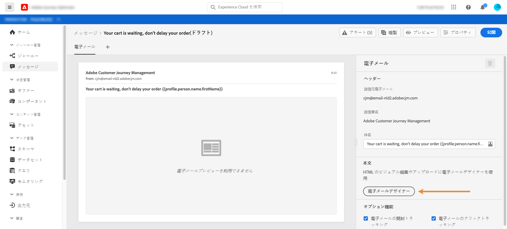

1. E メールデザイナーホームページの左側のパレットから、3 つの構造コンポーネントをメッセージの本文にドラッグ＆ドロップします。

1. HTML コンテンツコンポーネントを、それぞれの新規構造コンポーネントにドラッグ＆ドロップします。

   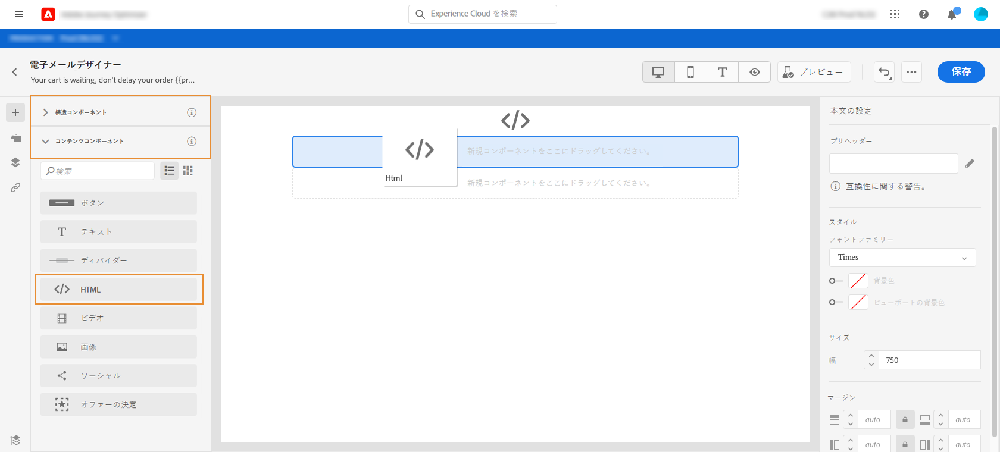

## 手順 2： 顧客の名（大文字）の挿入 {#uppercase-function}

1. E メールデザイナーのホームページで、顧客の名を追加する HTML コンポーネントをクリックします。
1. コンテキストツールバーで、「**[!UICONTROL ソースコードを表示]**」をクリックします。

   

1. **[!UICONTROL HTML を編集]**&#x200B;ウィンドウで、`upperCase` 文字列関数を追加します。
   1. リストで「**[!UICONTROL ヘルパー関数]**」を選択します。
   1. 検索フィールドを使用して、「uppercase」を検索します。
   1. 検索結果から、`upperCase` 関数を追加します。 それには、`: string` の横のプラス記号（+）をクリックします。

      式エディターには、次の式が表示されます。

      ```handlebars
      
      ```

      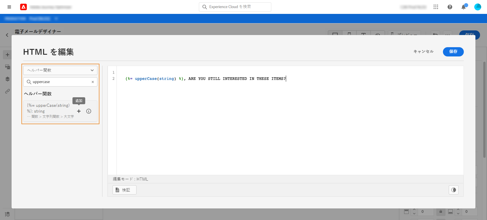

1. 式から「string」プレースホルダーを削除します。
1. 名トークンを追加します。
   1. リストで「**[!UICONTROL プロファイル]**」を選択します。
   1. **[!UICONTROL プロファイル]**／**[!UICONTROL ユーザー]**／**[!UICONTROL 姓名]**&#x200B;を選択します。
   1. 式に&#x200B;**[!UICONTROL 名]**&#x200B;トークンを追加します。

      式エディターには、次の式が表示されます。

      ```handlebars
      
      ```

      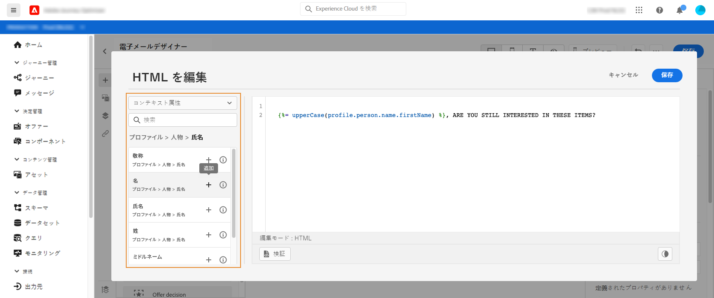

      ユーザー名データタイプについて詳しくは、[Adobe Experience Platform のドキュメント](https://experienceleague.adobe.com/docs/experience-platform/xdm/data-types/person-name.html?lang=ja){target=&quot;_blank&quot;}を参照してください。

1. 「 **[!UICONTROL 検証]**」をクリックしてから、「**[!UICONTROL 保存]**」をクリックします。

   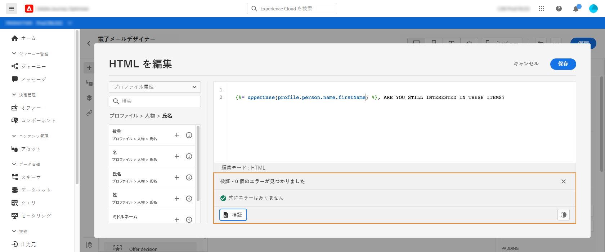
1. メッセージを保存します。

## 手順 3：最初のイベントと関連ジャーニーの作成 {#create-context}

カートの内容は、ジャーニーからのコンテキスト情報です。したがって、カート固有の情報をメールに追加する前に、最初のイベントとメールをジャーニーに追加する必要があります。

1. スキーマに `productListItems` 配列が含まれるイベントを作成します。
1. この配列のすべてのフィールドを、このイベントのペイロードフィールドとして定義します。

   製品リスト項目のデータタイプについて詳しくは、[Adobe Experience Platform のドキュメント](https://experienceleague.adobe.com/docs/experience-platform/xdm/data-types/product-list-item.html?lang=ja){target=&quot;_blank&quot;}を参照してください。

1. このイベントで開始されるジャーニーを作成します。
1. ジャーニーにメッセージを追加します。
1. 終了アクティビティでジャーニーを終了します。

   メッセージをまだ公開していないので、ジャーニーをテストすることも公開することもできません。

   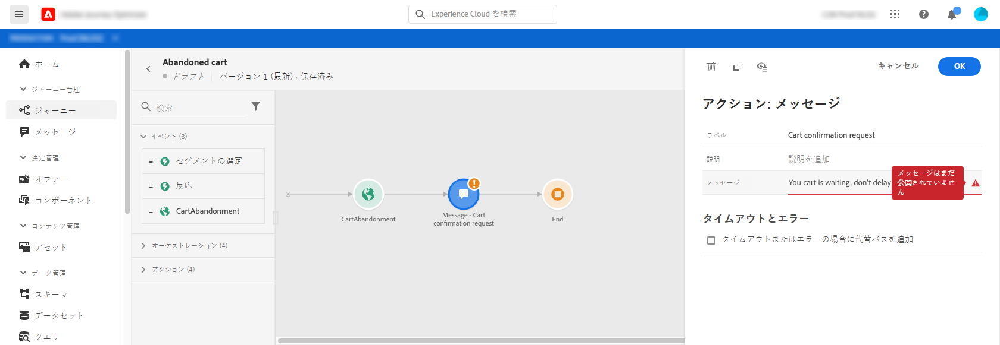

1. 「**[!UICONTROL OK]**」をクリックします。

   ジャーニーのコンテキストがメッセージに渡されたことを示すメッセージが表示されます。

   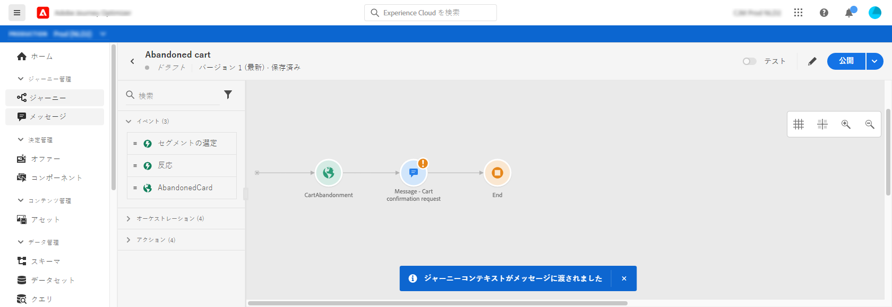

## 手順 4：カート内の商品リストの挿入 {#each-helper}

1. メッセージを再度開きます。

   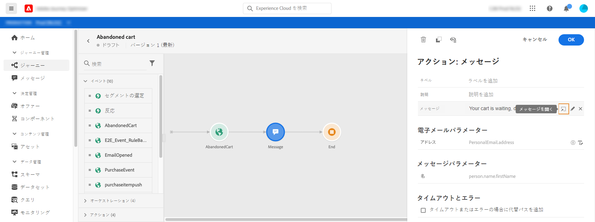

1. E メールデザイナーのホームページで、カートの内容を一覧表示する HTML コンポーネントをクリックします。
1. コンテキストツールバーで、「**[!UICONTROL ソースコードを表示]**」をクリックします。

   

1. **[!UICONTROL HTML を編集]**&#x200B;ウィンドウで、`each` ヘルパーを追加します。
   1. リストで「**[!UICONTROL ヘルパー関数]**」を選択します。
   1. 検索フィールドを使用して、「each」を検索します。
   1. 検索結果から、`each` ヘルパーを追加します。

      式エディターには、次の式が表示されます。

      ```handlebars
      {{#each someArray as |variable|}} {{/each}}
      ```

      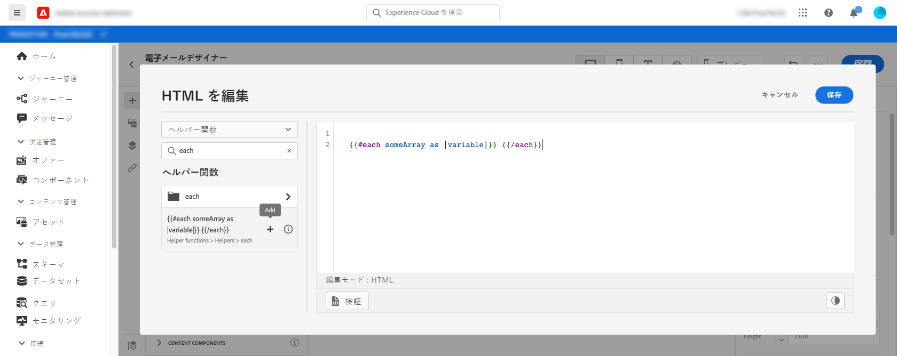

1. 式に `productListItems` 配列を追加します。

   1. 式から「someArray」プレースホルダーを削除します。
   1. リストで「**[!UICONTROL コンテキスト]**」を選択します。

      「**[!UICONTROL コンテキスト]**」オプションは、ジャーニーコンテキストがメッセージに渡された後でのみ使用できます。

   1. **[!UICONTROL Journey Orchestration]**／**[!UICONTROL イベント]**／***[!UICONTROL event_name]*** を選択し、**[!UICONTROL productListItems]** ノードを展開します。

      この例では、*event_name* はイベントの名前を表します。

   1. 式に&#x200B;**[!UICONTROL 製品]**&#x200B;トークンを追加します。

      式エディターには、次の式が表示されます。

      ```handlebars
      {{#each context.journey.events.event_ID.productListItems.product as |variable|}} {{/each}}
      ```
      この例では、*event_ID* はイベントの ID を表します。

      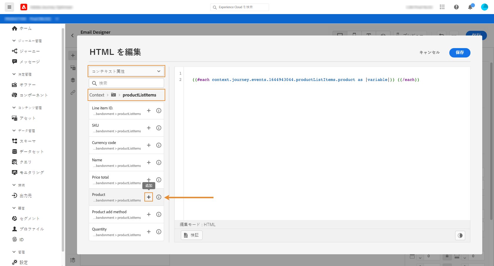

   1. 式を次のように変更します。
      1. 「.product」文字列を削除します。
      1. 「variable」プレースホルダーを「product」に置き換えます。

      次の例は、変更された式を示しています。

      ```handlebars
      {{#each context.journey.events.event_ID.productListItems as |product|}}
      ```
1. 次のコードを、`{{#each}}` 開始タグと `{/each}}` 終了タグの間に貼り付けます。

   ```html
   <table>
      <tbody>
         <tr>
            <td><b>#name</b></td>
            <td><b>#quantity</b></td>
            <td><b>$#priceTotal</b></td>
         </tr>
      </tbody>
   </table>
   ```

1. 商品名、数量および価格のパーソナライゼーショントークンを追加します。

   1. HTML テーブルからプレースホルダー「#name」を削除します。
   1. 前の検索結果から、**[!UICONTROL 名前]**&#x200B;トークンを式に追加します。

   次の手順を 2 回繰り返します。
   * プレースホルダー「#quantity」を&#x200B;**[!UICONTROL 数量]**&#x200B;トークンに置き換えます。
   * プレースホルダー「#priceTotal」を&#x200B;**[!UICONTROL 合計価格]**&#x200B;トークンに置き換えます。

   次の例は、変更された式を示しています。

   ```handlebars
   {{#each context.journey.events.event_ID.productListItems as |product|}}
      <table>
         <tbody>
            <tr>
               <td><b>{{context.journey.events.event_ID.productListItems.name}}</b></td>
               <td><b>{{context.journey.events.event_ID.productListItems.quantity}}</b></td>
               <td><b>${{context.journey.events.event_ID.productListItems.priceTotal}}</b></td>
            </tr>
         </tbody>
      </table>
   {{/each}}
   ```
1. 「**[!UICONTROL 検証]**」をクリックしてから、「**[!UICONTROL 保存]**」をクリックします。
   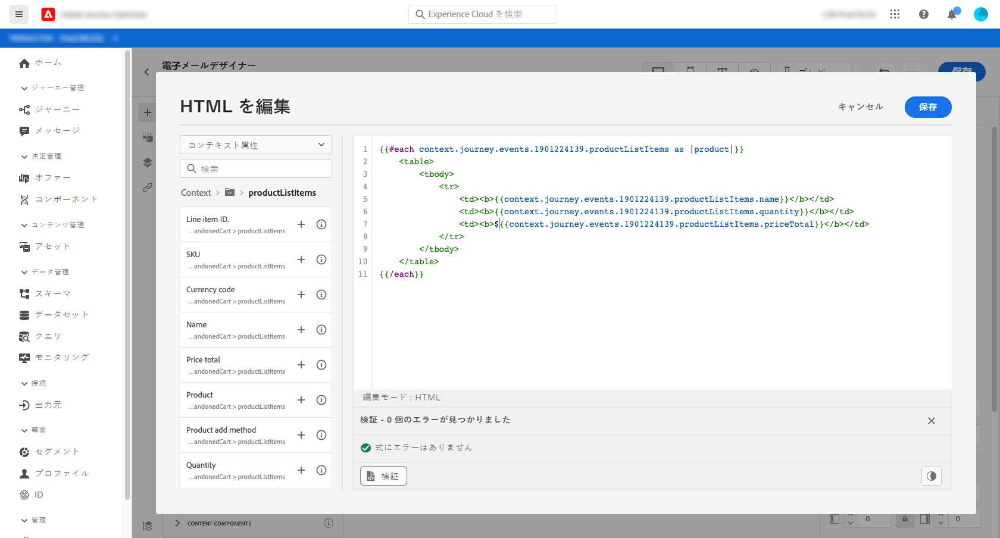

## 手順 5：製品固有のメモの挿入 {#if-helper}

1. E メールデザイナーのホームページで、メモを挿入する HTML コンポーネントをクリックします。
1. コンテキストツールバーで、「**[!UICONTROL ソースコードを表示]**」をクリックします。

   

1. **[!UICONTROL HTML を編集]**&#x200B;ウィンドウで、`if` ヘルパーを追加します。
   1. リストで「**[!UICONTROL ヘルパー関数]**」を選択します。
   1. 検索フィールドを使用して、「if」を検索します。
   1. 検索結果から、`if` ヘルパーを追加します。

      式エディターには、次の式が表示されます。

      ```handlebars
       render_1
          render_2
          default_render
      
      ```
      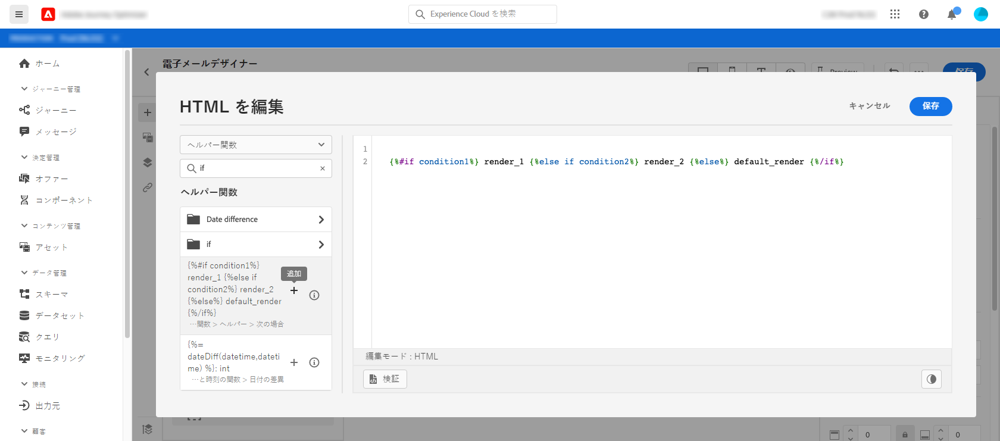

1. 式から次の条件を削除します。

   ```handlebars
    render_2
   ```

   次の例は、変更された式を示しています。

   ```handlebars
    render_1
       default_render
   
   ```

1. 製品名トークンを条件に追加します。
   1. 式から「condition1」プレースホルダーを削除します。
   1. リストで「**[!UICONTROL コンテキスト]**」を選択します。
   1. **[!UICONTROL Journey Orchestration]**／**[!UICONTROL イベント]**／***[!UICONTROL event_name]*** を選択し、**[!UICONTROL productListItems]** ノードを展開します。

      この例では、*event_name* はイベントの名前を表します。

   1. 式に&#x200B;**[!UICONTROL 名前]**&#x200B;トークンを追加します。

      式エディターには、次の式が表示されます。

      ```handlebars
      
         render_1
          default_render
      
      ```
      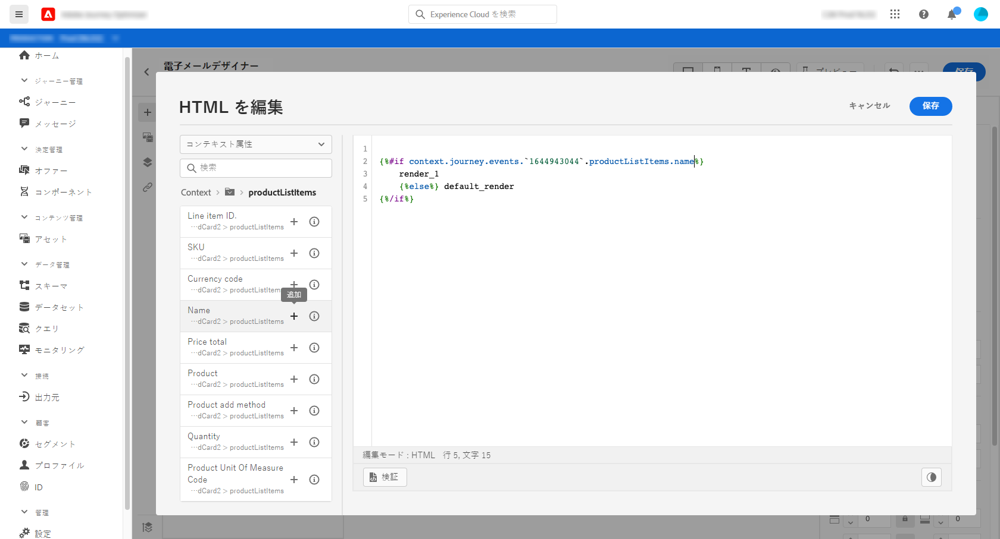

1. 式を次のように変更します。
   1. 式エディターで、`name` トークンの後に製品名を指定します。

      次の構文を使用します。ここで、*product_name* は製品の名前を表します。

      ```javascript
      = "product_name"
      ```

      この例では、製品名は「Juno Jacket」です。

      ```handlebars
      
         render_1
          default_render
      
      ```

   1. 「render_1」プレースホルダーをメモのテキストに置き換えます。

      例：

      ```handlebars
      
         Due to longer than usual lead times on the Juno Jacket, please expect item to ship two weeks after purchase.
          default_render
      
      ```
   1. 式から「default_render」プレースホルダーを削除します。
1. 「**[!UICONTROL 検証]**」をクリックしてから、「**[!UICONTROL 保存]**」をクリックします。

   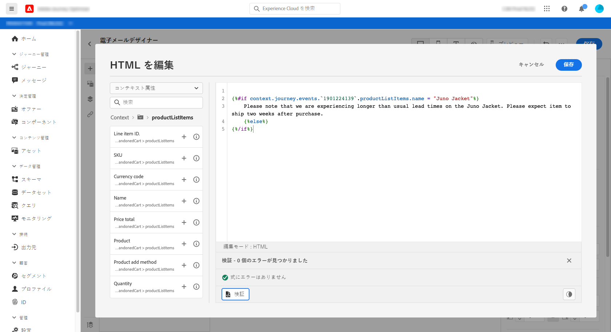

1. メッセージを保存して公開します。

## 手順 6：ジャーニーのテストと公開 {#test-and-publish}

1. ジャーニーを開きます。 ジャーニーが既に開いている場合は、ページの表示を更新します。
1. 「**[!UICONTROL テスト]**」トグルをオンにしてから、「**[!UICONTROL イベントをトリガー]**」をクリックします。

   テストモードは、メッセージを公開した後でのみ有効にできます。

   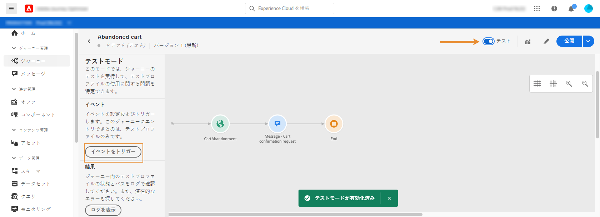

1. **[!UICONTROL イベント設定]**&#x200B;ウィンドウで、入力値を入力し、「**[!UICONTROL 送信]**」をクリックします。

   テストモードは、テストプロファイルでのみ機能します。

   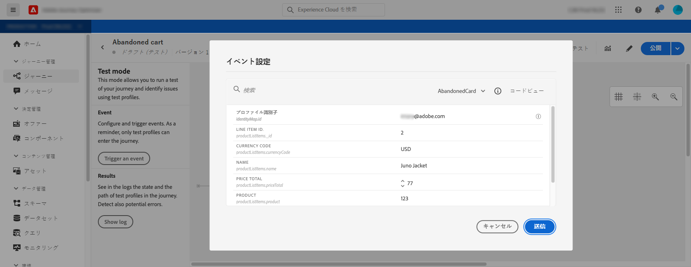

   メールがテストプロファイルのアドレスに送信されます。

   この例では、Juno Jacket に関するメモがメールに含まれています。これは、この製品がカートに入っているからです。

   

1. エラーがないことを確認し、ジャーニーを公開します。


## 関連トピック

### Handlebars 関数

* [ヘルパー](functions/helpers.md)

* [文字列関数](functions/string.md)

### ユースケース

* [プロファイル情報、コンテキストおよびオファーを使用したパーソナライゼーション](personalization-use-case.md)

* [決定ベースのオファーを使用したパーソナライゼーション](../offers/offers-e2e.md)

## チュートリアルビデオ{#helper-functions-video}

>[!VIDEO](https://video.tv.adobe.com/v/334244?quality=12)
