# パーソナライゼーションのユースケース：買い物かごの放棄メール {#personalization-use-case-helper-functions}

>[!BEGINSHADEBOX]

**このページ：** Adobe Journey OptimizerでupperCase、各、if ヘルパー関数を使用してメール本文をパーソナライズする、カート放棄の使用例に従います。

>[!ENDSHADEBOX]

この例では、メールメッセージの本文をパーソナライズします。 このメッセージは、買い物かごに商品が残っているが購入を完了していない顧客をターゲットにします。

次のタイプのヘルパー関数を使用します。

* `upperCase` 文字列関数：顧客の名を大文字で挿入します。 [学習を増やす](functions/string.md#upper)。
* `each` ヘルパー：買い物かごに入っている商品をリストします。 [学習を増やす](functions/helpers.md#each)。
* `if`ヘルパー：関連製品が買い物かごに入っている場合に製品固有のメモを挿入します。 [学習を増やす](functions/helpers.md#if-function)。
<!-- **Context**: personalization based on contextual data from the journey -->

➡️ [ヘルパー関数の使用方法について詳しくは、このビデオを参照してください。](#video)

開始する前に、次の要素の設定方法を理解しておく必要があります。

* 単一のイベント。 [学習を増やす](../event/about-events.md)。
* イベントで開始されるジャーニー。 [学習を増やす](../building-journeys/using-the-journey-designer.md)。
* ジャーニーでのメールメッセージ。 [詳細情報](../email/create-email.md)
* メールの本文。 [学習を増やす](../email/content-from-scratch.md)。

次の手順に従います。

1. [最初のイベントとジャーニーを作成します](#create-context)。
1. [メールメッセージを作成します](#configure-email)。
1. [顧客の名を大文字で挿入します](#uppercase-function)。
1. [買い物かごの内容をメールに追加します](#each-helper)。
1. [製品固有のメモを挿入します](#if-helper)。
1. [ジャーニーをテストし公開します](#test-and-publish)。

## 手順 1：最初のイベントと関連ジャーニーの作成 {#create-context}

買い物かごの内容は、ジャーニーからのコンテキスト情報です。 したがって、買い物かご固有の情報をメールに追加する前に、最初のイベントとメールをジャーニーに追加する必要があります。

1. スキーマに `productListItems` 配列が含まれるイベントを作成します。
1. この配列のすべてのフィールドを、このイベントのペイロードフィールドとして定義します。

   製品リスト項目データタイプについて詳しくは、[Adobe Experience Platform ドキュメント](https://experienceleague.adobe.com/docs/experience-platform/xdm/data-types/product-list-item.html?lang=ja){target="_blank"}を参照してください。

1. このイベントで開始されるジャーニーを作成します。
1. ジャーニーに&#x200B;**メール**&#x200B;アクティビティを追加します。

   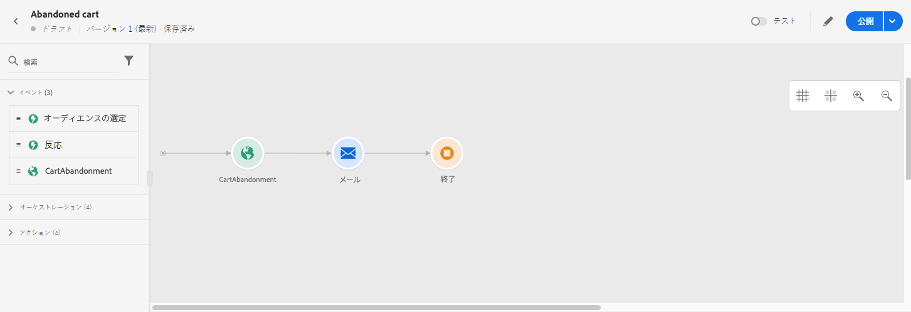

## 手順 2： メールの作成 {#configure-email}

1. **メール**&#x200B;アクティビティで、「**[!UICONTROL コンテンツを編集]**」をクリックしたあと、「**[!UICONTROL E メールデザイナー]**」をクリックします。

   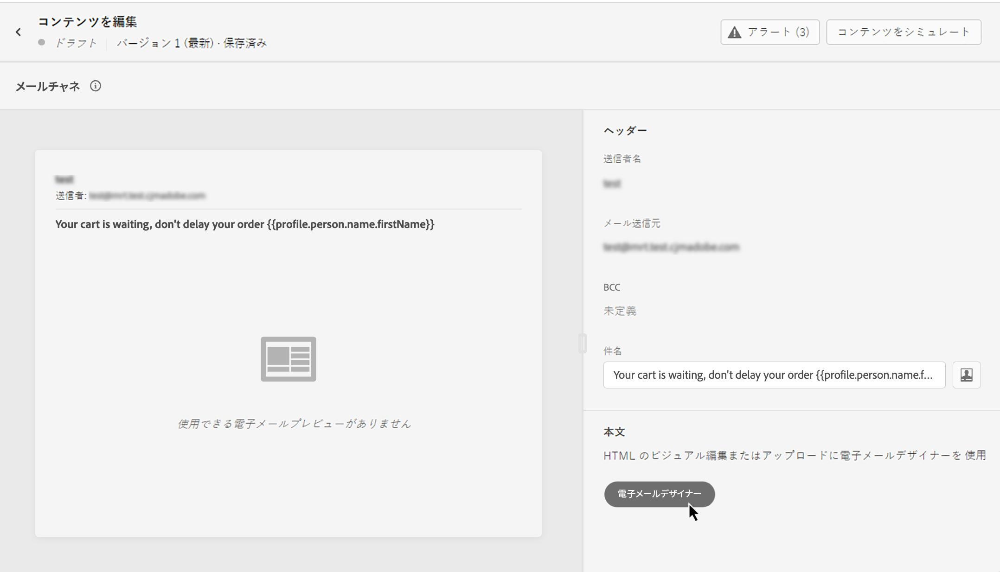

1. E メールデザイナーホームページの左側のパレットから、3 つの構造コンポーネントをメッセージの本文にドラッグ＆ドロップします。

1. HTML コンテンツコンポーネントを、それぞれの新規構造コンポーネントにドラッグ＆ドロップします。

   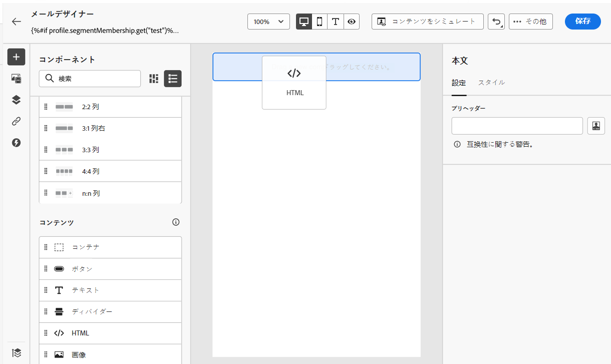

## 手順 3： 顧客の名（大文字）の挿入 {#uppercase-function}

1. E メールデザイナーのホームページで、顧客の名を追加する HTML コンポーネントをクリックします。
1. コンテキストツールバーで、「**[!UICONTROL ソースコードを表示]**」をクリックします。

   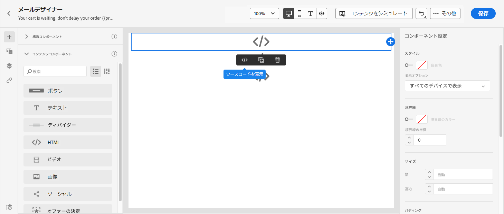

1. **[!UICONTROL HTML を編集]**&#x200B;ウィンドウで、`upperCase` 文字列関数を追加します。
   1. 左側のメニューで、「**[!UICONTROL ヘルパー関数]**」を選択します。
   1. 検索フィールドを使用して、「uppercase」を検索します。
   1. 検索結果から、`upperCase` 関数を追加します。 それには、`: string` の横のプラス記号（+）をクリックします。

      式エディターには、次の式が表示されます。

      ```handlebars
      
      ```

      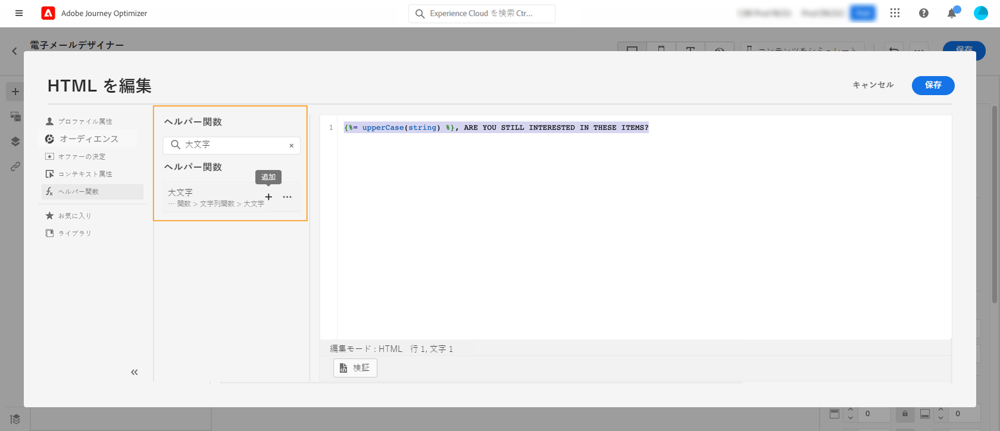

1. 式から「string」プレースホルダーを削除します。
1. 名トークンを追加します。
   1. 左側のメニューで、「**[!UICONTROL プロファイル属性]**」を選択します。
   1. **[!UICONTROL ユーザー]**／**[!UICONTROL 姓名]**&#x200B;を選択します。
   1. 式に&#x200B;**[!UICONTROL 名]**&#x200B;トークンを追加します。

      式エディターには、次の式が表示されます。

      ```handlebars
      
      ```

      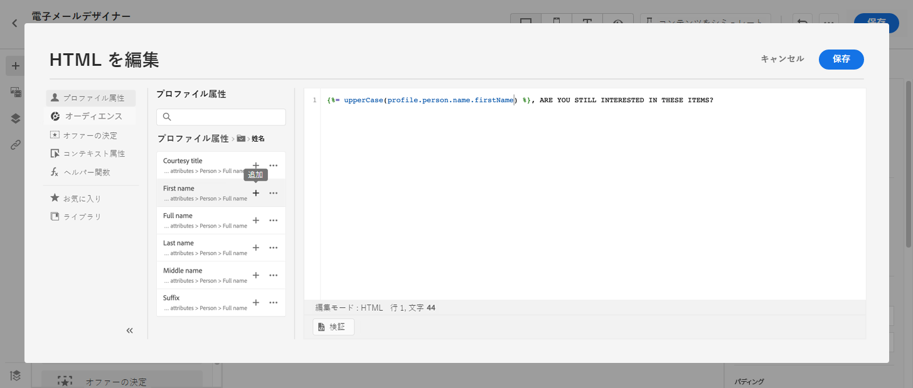

      ユーザー名データタイプについて詳しくは、[Adobe Experience Platform ドキュメント](https://experienceleague.adobe.com/docs/experience-platform/xdm/data-types/person-name.html?lang=ja){target="_blank"}を参照してください。

1. 「 **[!UICONTROL 検証]**」をクリックしてから、「**[!UICONTROL 保存]**」をクリックします。

   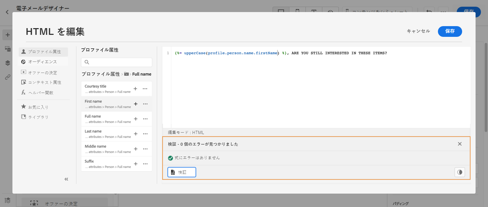

1. メッセージを保存します。

## 手順 4：買い物かご内の商品リストの挿入 {#each-helper}

このステップでは、イベントデータを反復処理します。 異なるデータソース（イベント、カスタムアクション応答、その他のコンテキストデータ）に対する反復の包括的な例については、[Handlebars](iterate-contextual-data.md)を使用したコンテキストデータの反復を参照してください。

1. メッセージコンテンツを再度開きます。

1. E メールデザイナーのホームページで、買い物かごの内容を一覧表示する HTML コンポーネントをクリックします。
1. コンテキストツールバーで、「**[!UICONTROL ソースコードを表示]**」をクリックします。

   

1. **[!UICONTROL HTML を編集]**&#x200B;ウィンドウで、`each` ヘルパーを追加します。
   1. 左側のメニューで、「**[!UICONTROL ヘルパー関数]**」を選択します。
   1. 検索フィールドを使用して、「each」を検索します。
   1. 検索結果から、`each` ヘルパーを追加します。

      式エディターには、次の式が表示されます。

      ```handlebars
      {{#each someArray as |variable|}} {{/each}}
      ```

      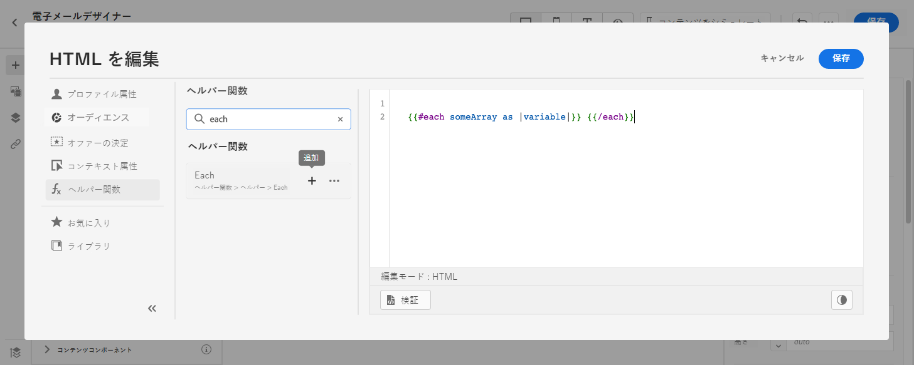

1. 式に `productListItems` 配列を追加します。

   1. 式から「someArray」プレースホルダーを削除します。
   1. 左側のメニューで、「**[!UICONTROL コンテキスト属性]**」を選択します。

      **[!UICONTROL コンテキスト属性]**&#x200B;は、ジャーニーコンテキストがメッセージに渡された後でのみ使用できます。

   1. **[!UICONTROL Journey Optimizer]**／**[!UICONTROL イベント]**／***[!UICONTROL event_name]*** を選択し、**[!UICONTROL productListItems]** ノードを展開します。

      この例では、*event_name* はイベントの名前を表します。

   1. 式に&#x200B;**[!UICONTROL 製品]**&#x200B;トークンを追加します。

      式エディターには、次の式が表示されます。

      ```handlebars
      {{#each context.journey.events.event_ID.productListItems.product as |variable|}} {{/each}}
      ```

      この例では、*event_ID* はイベントの ID を表します。

      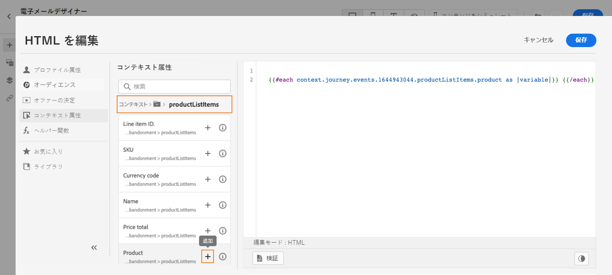

   1. 式を次のように変更します。
      1. 「.product」文字列を削除します。
      1. 「variable」プレースホルダーを「product」に置き換えます。

      次の例は、変更された式を示しています。

      ```handlebars
      {{#each context.journey.events.event_ID.productListItems as |product|}}
      ```

1. 次のコードを、`{{#each}}` 開始タグと `{{/each}}` 終了タグの間に貼り付けます。

   ```html
   <table>
      <tbody>
         <tr>
            <td><b>#name</b></td>
            <td><b>#quantity</b></td>
            <td><b>$#priceTotal</b></td>
         </tr>
      </tbody>
   </table>
   ```

1. 商品名、数量および価格のパーソナライゼーショントークンを追加します。

   1. HTML テーブルからプレースホルダー「#name」を削除します。
   1. 前の検索結果から、**[!UICONTROL 名前]**&#x200B;トークンを式に追加します。

   次の手順を 2 回繰り返します。

   * プレースホルダー「#quantity」を&#x200B;**[!UICONTROL 数量]**&#x200B;トークンに置き換えます。
   * プレースホルダー「#priceTotal」を&#x200B;**[!UICONTROL 合計価格]**&#x200B;トークンに置き換えます。

   次の例は、変更された式を示しています。

   ```handlebars
   {{#each context.journey.events.event_ID.productListItems as |product|}}
      <table>
         <tbody>
            <tr>
            <td><b>{{product.name}}</b></td>
            <td><b>{{product.quantity}}</b></td>
            <td><b>${{product.priceTotal}}</b></td>
            </tr>
         </tbody>
      </table>
   {{/each}}
   ```

1. 「**[!UICONTROL 検証]**」をクリックしてから、「**[!UICONTROL 保存]**」をクリックします。

   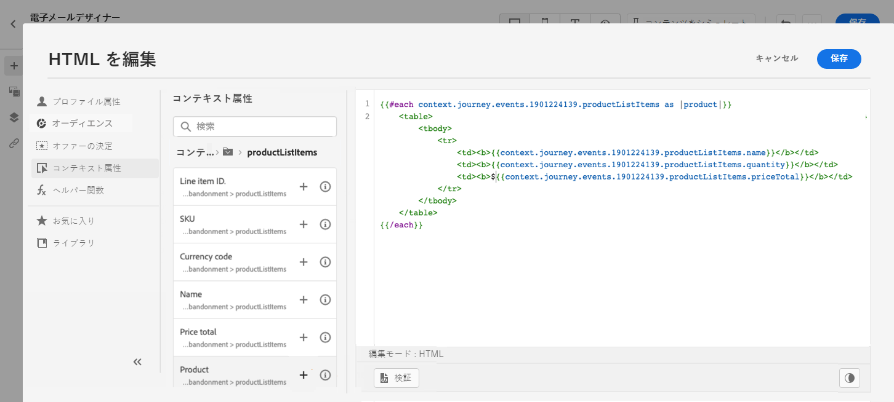

## 手順 5：製品固有のメモの挿入 {#if-helper}

1. E メールデザイナーのホームページで、メモを挿入する HTML コンポーネントをクリックします。
1. コンテキストツールバーで、「**[!UICONTROL ソースコードを表示]**」をクリックします。

   

1. **[!UICONTROL HTML を編集]**&#x200B;ウィンドウで、`if` ヘルパーを追加します。
   1. 左側のメニューで、「**[!UICONTROL ヘルパー関数]**」を選択します。
   1. 検索フィールドを使用して、「if」を検索します。
   1. 検索結果から、`if` ヘルパーを追加します。

      式エディターには、次の式が表示されます。

      ```handlebars
       render_1
          render_2
          default_render
      
      ```

      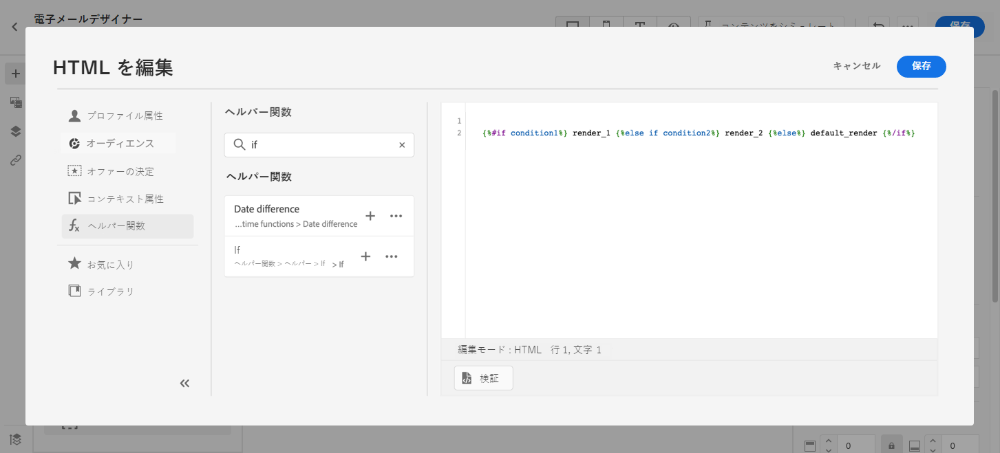

1. 式から次の条件を削除します。

   ```handlebars
    render_2
   ```

   次の例は、変更された式を示しています。

   ```handlebars
    render_1
       default_render
   
   ```

1. 製品名トークンを条件に追加します。
   1. 式から「condition1」プレースホルダーを削除します。
   1. 左側のメニューで、「**[!UICONTROL コンテキスト属性]**」を選択します。
   1. **[!UICONTROL Journey Orchestration]**／**[!UICONTROL イベント]**／***[!UICONTROL event_name]*** を選択し、**[!UICONTROL productListItems]** ノードを展開します。

      この例では、*event_name* はイベントの名前を表します。

   1. 式に&#x200B;**[!UICONTROL 名前]**&#x200B;トークンを追加します。

      式エディターには、次の式が表示されます。

      ```handlebars
      
         render_1
          default_render
      
      ```

      if条件にproductListItems名トークンを含む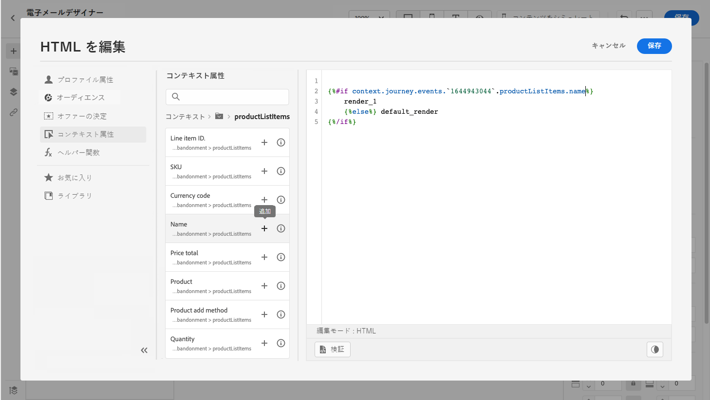

1. 式を次のように変更します。
   1. 式エディターで、`name` トークンの後に製品名を指定します。

      次の構文を使用します。ここで、*product_name* は製品の名前を表します。

      ```javascript
      = "product_name"
      ```

      この例では、製品名は「Juno Jacket」です。

      ```handlebars
      
         render_1
          default_render
      
      ```

   1. 「render_1」プレースホルダーをメモのテキストに置き換えます。

      例：

      ```handlebars
      
         Due to longer than usual lead times on the Juno Jacket, please expect item to ship two weeks after purchase.
          default_render
      
      ```

   1. 式から「default_render」プレースホルダーを削除します。
1. 「 **[!UICONTROL 検証]**」をクリックしてから、「**[!UICONTROL 保存]**」をクリックします。

   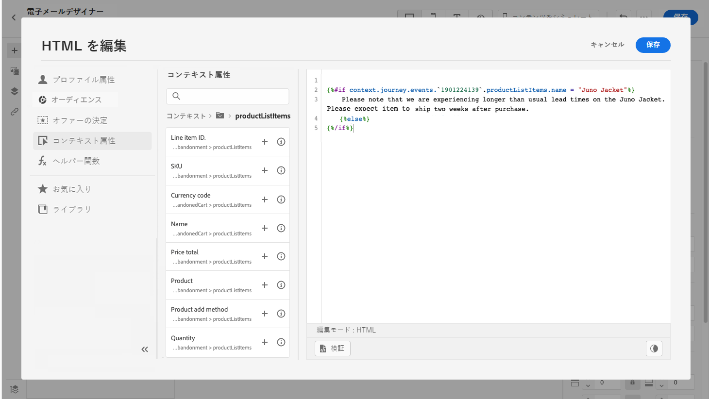

1. メッセージを保存します。

## 手順 6：ジャーニーのテストと公開 {#test-and-publish}

1. 「**[!UICONTROL テスト]**」切替スイッチをオンにしてから、「**[!UICONTROL イベントをトリガー]**」をクリックします。

   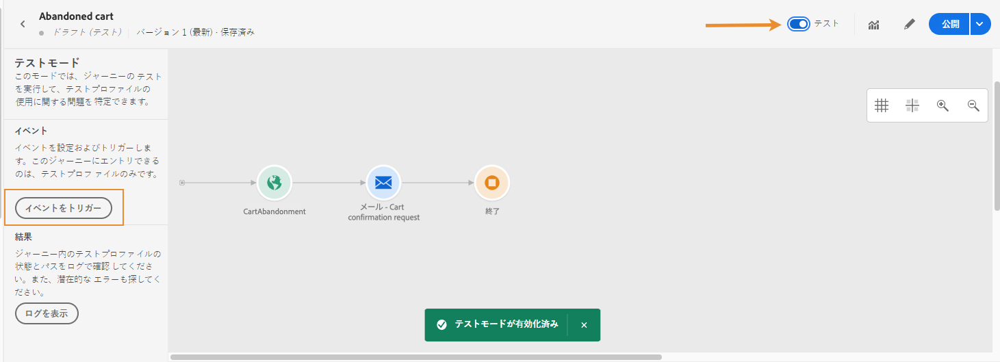

1. **[!UICONTROL イベント設定]**&#x200B;ウィンドウで、入力値を入力し、「**[!UICONTROL 送信]**」をクリックします。

   テストモードは、テストプロファイルでのみ機能します。

   入力値と送信ボタンを含む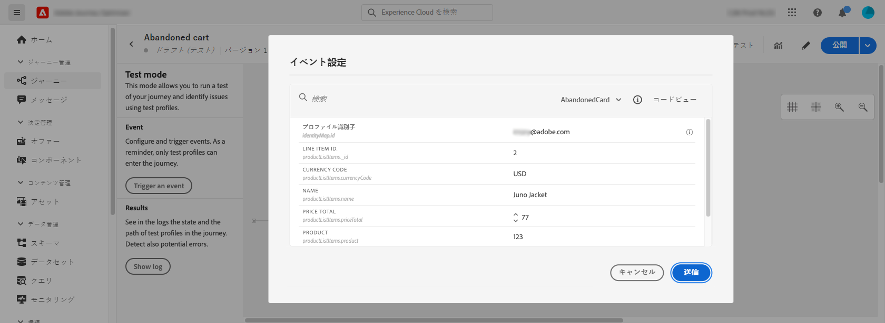

   メールがテストプロファイルのアドレスに送信されます。

   この例では、Juno Jacket に関するメモがメールに含まれています。これは、この製品が買い物かごに入っているからです。

   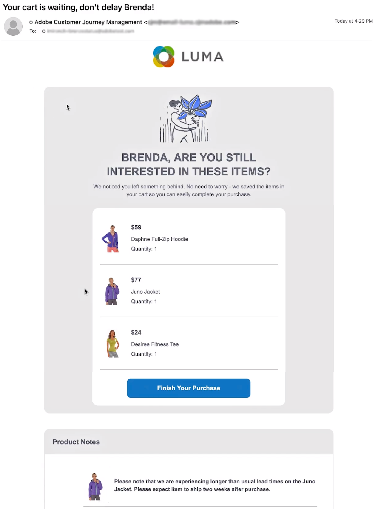

1. エラーがないことを確認し、ジャーニーを公開します。


## 関連トピック {#related-topics}

### Handlebars 関数 {#handlebars}

* [ヘルパー](functions/helpers.md)

* [文字列関数](functions/string.md)

### ユースケース {#use-case}

* [プロファイル情報、コンテキストおよびオファーを使用したパーソナライゼーション](personalization-use-case.md)

* [決定ベースのオファーを使用したパーソナライゼーション](../offers/offers-e2e.md)

## チュートリアルビデオ {#video}

ヘルパー関数の使用方法を説明します。

>[!VIDEO](https://video.tv.adobe.com/v/3416781?captions=jpn&quality=12)
