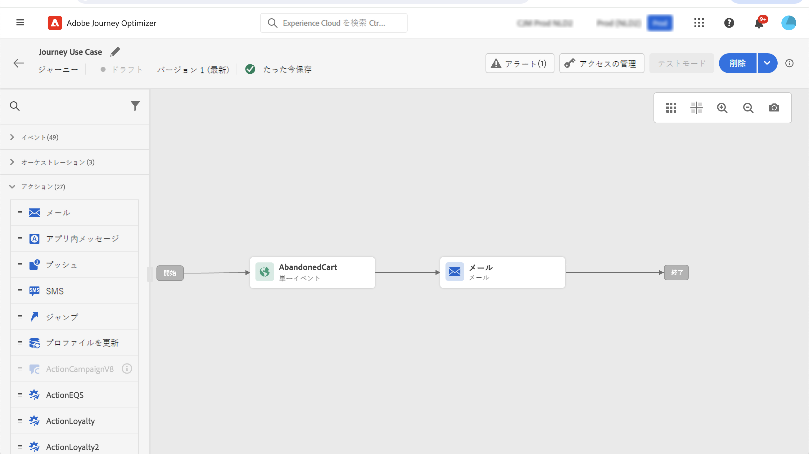
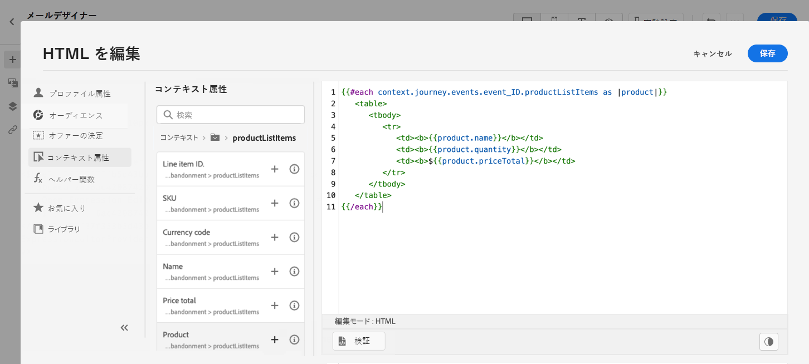
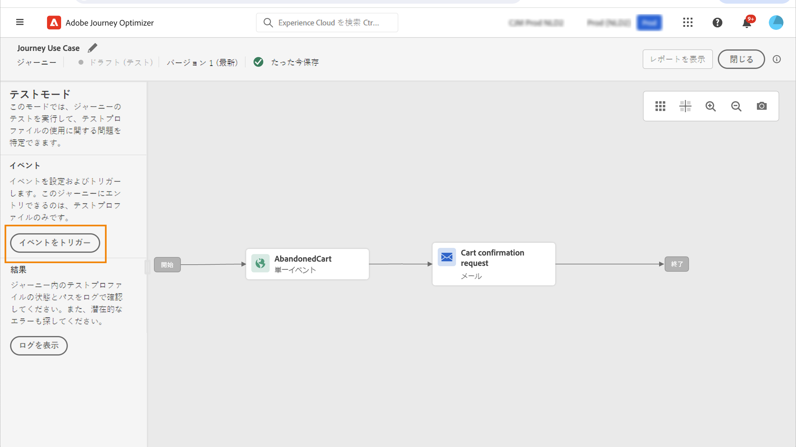
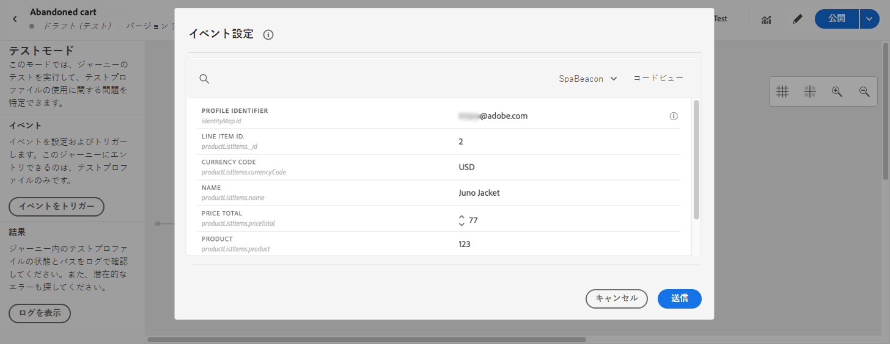

# パーソナライズの使用例: cart abandonment 電子メール {#personalization-use-case-helper-functions}

この例では、電子メールメッセージの本文をカスタマイズします。 このメッセージは、ショッピングカート内のアイテムの左側にいて、購入を完了していないユーザーを対象としています。

使用するヘルパー関数には、次の種類があります。

* `upperCase`String 関数を指定すると、お客様の姓名が大文字で挿入されます。[詳しく ](functions/string.md#upper) は、こちらを参照してください。
* `each`カート内のアイテムの一覧を表示するためのヘルパー。[詳しく ](functions/helpers.md#each) は、こちらを参照してください。
* 関連付けられた製品がカート内にある場合は、このヘルパーが `if` 製品固有の注意を挿入します。 [詳しく ](functions/helpers.md#if-function) は、こちらを参照してください。

<!-- **Context**: personalization based on contextual data from the journey -->

➡️ [ このビデオでヘルパー関数の使用方法について説明しています。](#video)

作業を開始する前に、これらのエレメントを構成する方法を確認してください。

* 1つのユニタリイベント。 [詳しく ](../event/about-events.md) は、こちらを参照してください。
* イベントによって開始される旅 [詳しく ](../building-journeys/using-the-journey-designer.md) は、こちらを参照してください。
* 電子メールメッセージを送信します。 [詳細情報](../email/create-email.md)
* 電子メールの本文です。 [詳しく ](../email/content-from-scratch.md) は、こちらを参照してください。

以下の手順を実行します。

1. [最初のイベントとその旅 ](#create-context) を作成します。
1. [電子メールメッセージ ](#configure-email) を作成します。
1. [お客様の姓を大文字 ](#uppercase-function) で入力します。
1. [カートコンテンツを電子メール ](#each-helper) に追加します。
1. [製品固有の注意事項 ](#if-helper) を挿入します。
1. [テストを行い、その過程 ](#test-and-publish) を公開します。

## ステップ 1: 初期イベントおよび関連する旅の作成 {#create-context}

カートコンテンツは、旅からのコンテキスト情報になります。 そのため、最初にイベントと電子メールを追加する必要があります。この場合は、カートに関する情報を電子メールに追加する必要があります。

1. 配列が含まれている `productListItems` スキーマにイベントを作成します。
1. この配列に格納されているすべてのフィールドを、このイベントのペイロードフィールドとして定義します。

   製品リスト項目について詳しくは、Adobe エクスペリエンスプラットフォームマニュアル ](https://experienceleague.adobe.com/docs/experience-platform/xdm/data-types/product-list-item.html) の「target = &quot;_blank&quot;}」を [ 参照してください。

1. このイベントによって開始される旅を作成します。
1. **この旅に電子メール** 活動項目を追加します。

   

## 手順 2: 電子メールの作成{#configure-email}

1. **電子メール** 活動でをクリック **[!UICONTROL Edit content]** し、を **[!UICONTROL Email Designer]** クリックします。

   

1. 電子メールデザイナーのホームページの左側のパレットから、3つのストラクチャーコンポーネントをメッセージの本文にドラッグ &amp; ドロップします。

1. HTML コンテンツコンポーネントを新しい構造コンポーネントのそれぞれにドラッグ &amp; ドロップします。

   

## 手順 3: 得意先名を大文字に挿入します。 {#uppercase-function}

1. 電子メールデザイナーのホームページで、お客様の名前を追加する HTML コンポーネントをクリックします。
1. コンテキストツールバーでをクリック **[!UICONTROL Show the source code]** します。

   

1. **[!UICONTROL Edit HTML]**&#x200B;ウィンドウで、ストリング関数を追加 `upperCase` します。
   1. 左側のメニューで、を選択 **[!UICONTROL Helper functions]** します。
   1. 検索フィールドを使用して「大文字」を検索します。
   1. 検索結果から関数を追加 `upperCase` します。 これを行うには、の横に `: string` あるプラス (+) 記号をクリックします。

      式エディターに、次の式が表示されます。

      ```handlebars
      
      ```

      

1. エクスプレッションから「string」プレースホルダーを削除します。
1. 最初の名前トークンを追加します。
   1. 左側のメニューで、を選択 **[!UICONTROL Profile attributes]** します。
   1. 「> **[!UICONTROL Full name]** 」を選択 **[!UICONTROL Person]** します。
   1. **[!UICONTROL First name]**&#x200B;式にトークンを追加します。

      式エディターに、次の式が表示されます。

      ```handlebars
      
      ```

      

      Adobe エクスペリエンスプラットフォーム ](https://experienceleague.adobe.com/docs/experience-platform/xdm/data-types/person-name.html) の人名データ型について詳しくは、「target = &quot;_blank&quot;}」を [ 参照してください。

1. をクリック **[!UICONTROL Validate]** してから、をクリック **[!UICONTROL Save]** します。

   

1. メッセージを保存します。

## 手順 4: カート内のアイテムのリストを挿入します。 {#each-helper}

1. メッセージの内容を再度開きます。

1. 電子メールデザイナーのホームページで、カートの内容を一覧表示する HTML コンポーネントをクリックします。
1. コンテキストツールバーでをクリック **[!UICONTROL Show the source code]** します。

   

1. **[!UICONTROL Edit HTML]**&#x200B;ウィンドウで、次のようにヘルパーを追加 `each` します。
   1. 左側のメニューで、を選択 **[!UICONTROL Helper functions]** します。
   1. 検索フィールドを使用して「each」を検索します。
   1. 検索結果から、ヘルパーを追加 `each` します。

      式エディターに、次の式が表示されます。

      ```handlebars
      {{#each someArray as |variable|}} {{/each}}
      ```

      

1. `productListItems`配列を式に追加します。

   1. エクスプレッションから「すべての配列」プレースホルダーを削除します。
   1. 左側のメニューで、を選択 **[!UICONTROL Contextual attributes]** します。

      **[!UICONTROL Contextual attributes]** は、メッセージに旅のコンテキストを渡した場合にのみ使用できます。

   1. > **[!UICONTROL Events]** > [!UICONTROL event_name] を選択 **[!UICONTROL Journey Optimizer]** して **[!UICONTROL productListItems]** から、ノードを展開します。

      この例では、 *event_name* はイベントの名前を表します。

   1. **[!UICONTROL Product]**&#x200B;式にトークンを追加します。

      式エディターに、次の式が表示されます。

      ```handlebars
      {{#each context.journey.events.event_ID.productListItems.product as |variable|}} {{/each}}
      ```
      この例では、 *event_ID* がイベントの ID を表しています。

      

   1. エクスプレッションを変更します。
      1. &quot;Product&quot; というストリングを削除します。
      1. 「変数」プレースホルダーを「product」に置き換えます。

      修正された式の例を次に示します。

      ```handlebars
      {{#each context.journey.events.event_ID.productListItems as |product|}}
      ```


1. 開始 `{{#each}}` タグと終了 `{/each}}` タグの間に、次のコードをペーストします。

   ```html
   <table>
      <tbody>
         <tr>
            <td><b>#name</b></td>
            <td><b>#quantity</b></td>
            <td><b>$#priceTotal</b></td>
         </tr>
      </tbody>
   </table>
   ```

1. Item name、quantity、および価格のパーソナル化トークンを次のように追加します。

   1. HTML テーブルからプレースホルダー &quot;#name&quot; を削除します。
   1. 前の検索結果から、式にトークンを追加 **[!UICONTROL Name]** します。

   これらの手順を2回繰り返します。

   * プレースホルダー &quot;#quantity&quot; がトークンに **[!UICONTROL Quantity]** 置き換えられます。
   * プレースホルダー &quot;#priceTotal&quot; がトークンに **[!UICONTROL Total price]** 置き換えられます。

   修正された式の例を次に示します。

   ```handlebars
   {{#each context.journey.events.event_ID.productListItems as |product|}}
      <table>
         <tbody>
            <tr>
               <td><b>{{context.journey.events.event_ID.productListItems.name}}</b></td>
               <td><b>{{context.journey.events.event_ID.productListItems.quantity}}</b></td>
               <td><b>${{context.journey.events.event_ID.productListItems.priceTotal}}</b></td>
            </tr>
         </tbody>
      </table>
   {{/each}}
   ```

1. をクリック **[!UICONTROL Validate]** してから、をクリック **[!UICONTROL Save]** します。

   

## 手順 5: 製品固有の注意事項を挿入します。 {#if-helper}

1. 電子メールデザイナーのホームページで、コメントを挿入する HTML コンポーネントをクリックします。
1. コンテキストツールバーでをクリック **[!UICONTROL Show the source code]** します。

   

1. **[!UICONTROL Edit HTML]**&#x200B;ウィンドウで、次のようにヘルパーを追加 `if` します。
   1. 左側のメニューで、を選択 **[!UICONTROL Helper functions]** します。
   1. 「If」を検索するには、「検索」フィールドを使用します。
   1. 検索結果から、ヘルパーを追加 `if` します。

      式エディターに、次の式が表示されます。

      ```handlebars
       render_1
          render_2
          default_render
      
      ```

      

1. 式から次の条件を削除します。

   ```handlebars
    render_2
   ```

   修正された式の例を次に示します。

   ```handlebars
    render_1
       default_render
   
   ```

1. 次の条件に製品名トークンを追加します。
   1. エクスプレッションから「condition1」プレースホルダーを削除します。
   1. 左側のメニューで、を選択 **[!UICONTROL Contextual attributes]** します。
   1. > **[!UICONTROL Events]** > [!UICONTROL event_name] を選択 **[!UICONTROL Journey Orchestration]** して **[!UICONTROL productListItems]** から、ノードを展開します。

      この例では、 *event_name* はイベントの名前を表します。

   1. **[!UICONTROL Name]**&#x200B;式にトークンを追加します。

      式エディターに、次の式が表示されます。

      ```handlebars
      
         render_1
          default_render
      
      ```

      

1. エクスプレッションを変更します。
   1. 式エディターで、トークンの `name` 後に製品名を指定します。

      次の構文を *使用します。 product_name* は製品の名前を表します。

      ```javascript
      = "product_name"
      ```

      この例では、製品名は &quot;Juno ジャケット&quot; になります。

      ```handlebars
      
         render_1
          default_render
      
      ```

   1. 「Render_1」プレースホルダーを注記のテキストに置き換えます。

      一

      ```handlebars
      
         Due to longer than usual lead times on the Juno Jacket, please expect item to ship two weeks after purchase.
          default_render
      
      ```

   1. エクスプレッションから「default_render」プレースホルダーを削除します。
1. をクリック **[!UICONTROL Validate]** してから、をクリック **[!UICONTROL Save]** します。

   

1. メッセージを保存します。

## 手順 6: 旅のテストとパブリッシュ {#test-and-publish}

1. 切り替えオプションをオンにして **[!UICONTROL Test]** 、をクリック **[!UICONTROL Trigger an event]** します。

   

1. **[!UICONTROL Event configuration]**&#x200B;ウィンドウに入力値を入力し、をクリック **[!UICONTROL Send]** します。

   テストモードは、テストプロファイルでのみ使用できます。

   

   電子メールは、テストプロファイルのアドレスに送信されます。

   次の例では、この製品がカートにあるので、Juno ジャケットに関する注意事項が電子メールに含まれています。

   

1. エラーが発生していないことを確認してから、その旅をパブリッシュします。


## 関連トピック {#related-topics}

### Handlebars 関数の操作 {#handlebars}

* [ヘルパー](functions/helpers.md)

* [ストリング関数](functions/string.md)

### 使用例 {#use-case}

* [プロファイル情報、コンテキスト、およびオファーを使用したパーソナル化](personalization-use-case.md)

* [意思決定をベースとしたパーソナライズ機能](../offers/offers-e2e.md)

## 操作方法のビデオ{#video}

ヘルパー関数の使用方法について説明します。

>[!VIDEO](https://video.tv.adobe.com/v/334244?quality=12)
