# パーソナライゼーションのユースケース:注文状況通知 {#personalization-use-case}

このユースケースでは、1 つのプッシュ通知メッセージで複数のタイプのパーソナライゼーションを使用する方法を確認できます。次の 3 種類のパーソナライゼーションが使用されます。

* **プロファイル**：プロファイルフィールドに基づくメッセージのパーソナライゼーション
* **オファーの決定**:offer decisioning変数に基づくパーソナライゼーション
* **コンテキスト**：ジャーニーのコンテキストデータに基づくパーソナライゼーション

この例では、顧客の注文が更新されるたびにイベントを [!DNL Journey Optimizer] にプッシュすることを目標としています。その後、注文に関する情報およびパーソナライズされたオファーを含むプッシュ通知が顧客に送信されます

このユースケースでは、次の前提条件が必要です。

* プッシュ通知メッセージを公開せずに作成およびデザインします。この[節](../create-message.md)を参照してください。
* 注文番号、ステータス、品目名を含む注文イベントを設定します。この[節](../event/about-events.md)を参照してください。
* 決定（旧称「オファーアクティビティ」）を作成するには、この[節](../offers/offer-activities/create-offer-activities.md)を参照してください。

## 手順 1 - プロファイルでのパーソナライゼーションの追加

1. 「**[!UICONTROL メッセージ]**」メニューをクリックし、メッセージを選択します。

   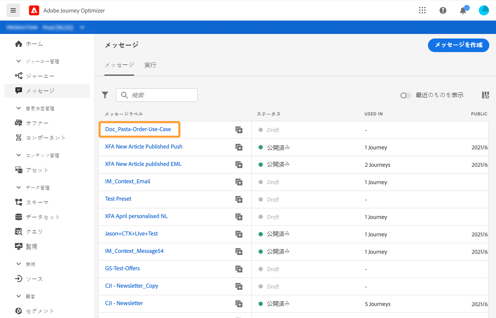

1. 「**タイトル**」フィールドをクリックします。

   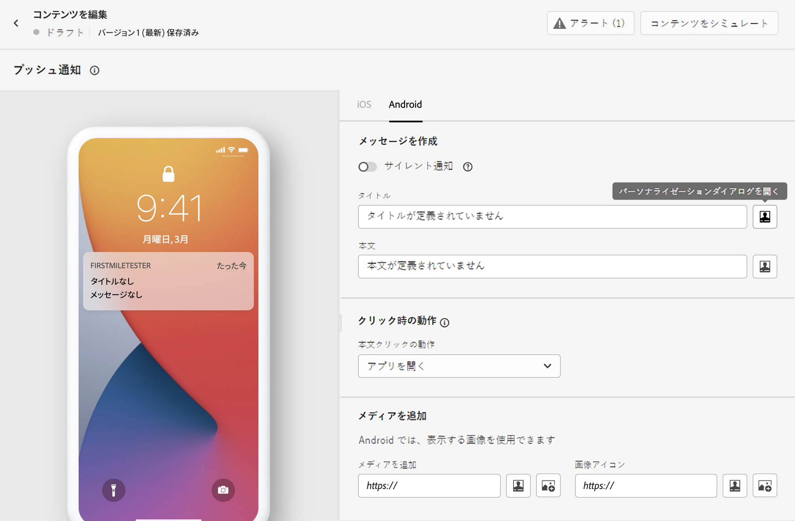

1. 件名を入力し、プロファイルのパーソナライゼーションを追加します。検索バーを使用して、プロファイルの名前フィールドを検索します。件名テキストで、パーソナライゼーションフィールドを挿入する位置にカーソルを置き、「**+**」アイコンをクリックします。「**保存**」をクリックします。

   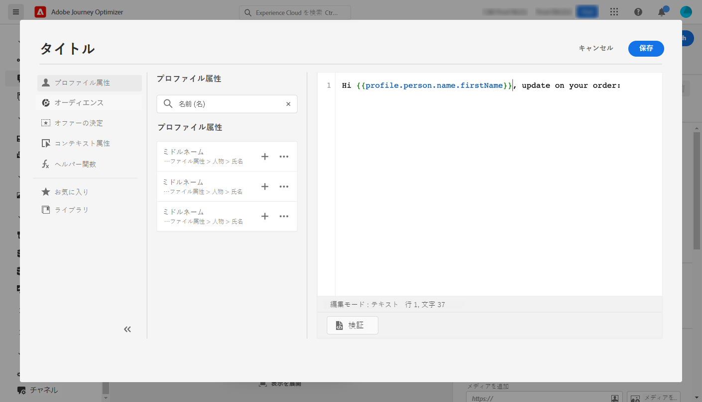

   >[!NOTE]
   >
   >メッセージはドラフトのままにします。まだ公開しないでください。

## 手順 2 - ジャーニーの作成

1. 「**[!UICONTROL ジャーニー]**」メニューをクリックし、新しいジャーニーを作成します。

   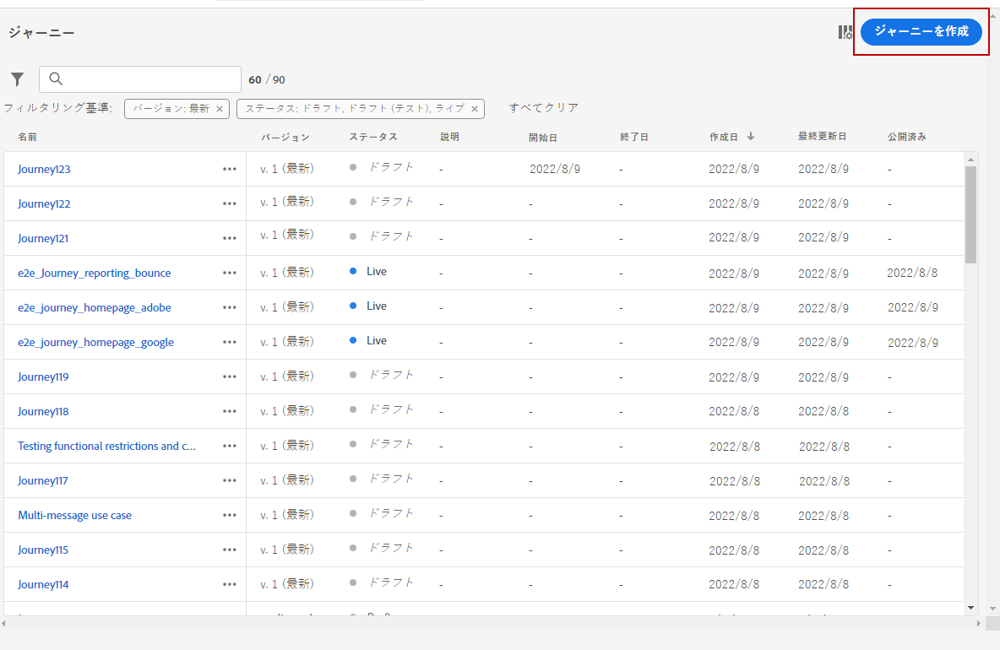

1. エントリイベント、**メッセージ**&#x200B;および&#x200B;**終了**&#x200B;アクティビティを追加します。

   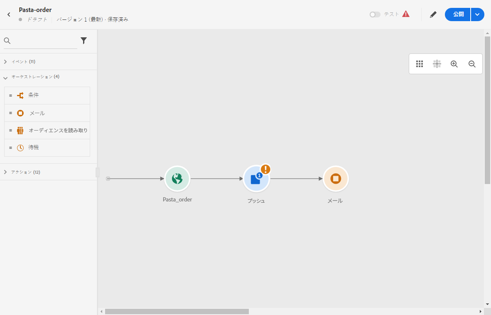

1. **メッセージ**&#x200B;アクティビティで、以前に作成したメッセージを選択します。「**OK**」をクリックします。

   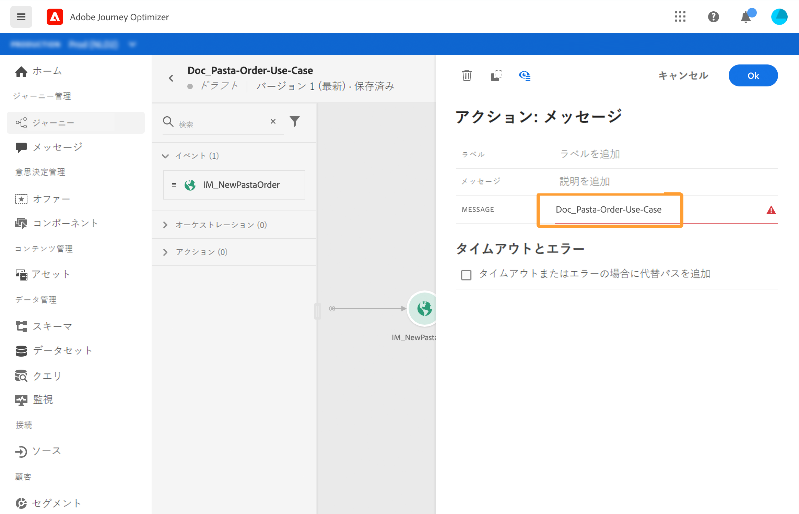

   エントリイベントデータとジャーニープロパティがメッセージに渡されたことを知らせるメッセージが表示されます。

   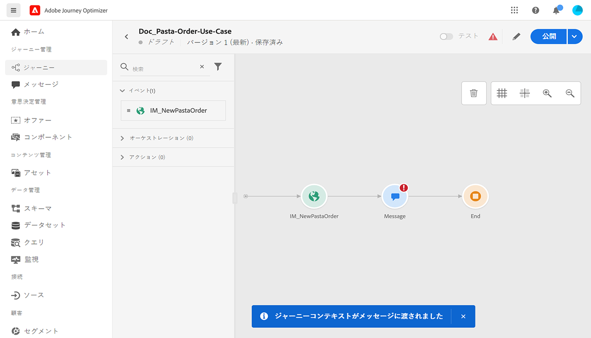

   >[!NOTE]
   >
   >メッセージに警告アイコンが表示されます。これは、メッセージがまだ公開されていないためです。

## 手順 3 - コンテキストデータでのパーソナライゼーションの追加

1. **メッセージ**&#x200B;アクティビティから、「**メッセージを開く**」アイコンをクリックします。メッセージが新しいタブで開きます。

   

1. 「**タイトル**」フィールドをクリックします。

   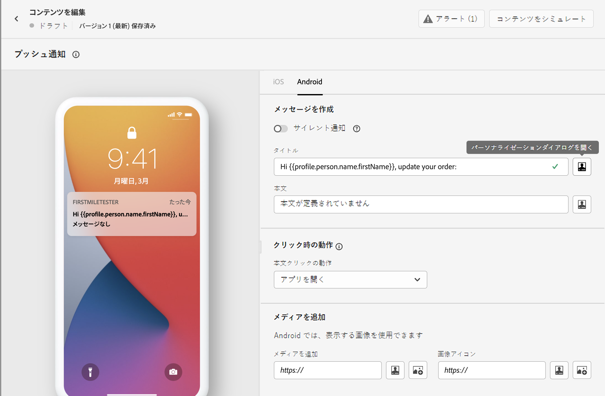

1. **コンテキスト**&#x200B;カテゴリを選択します。この項目は、ジャーニーでメッセージにコンテキストデータが渡された場合にのみ使用できます。「**Journey Orchestration**」をクリックします。次のコンテキスト情報が表示されます。

   * **イベント**：このカテゴリは、ジャーニーの&#x200B;**メッセージ**&#x200B;アクティビティの前に配置されたイベントのすべてのフィールドを再グループ化します。
   * **ジャーニープロパティ**：ジャーニー ID や発生した特定のエラーなど、特定のプロファイルのジャーニーに関連する技術的なフィールド。詳しくは、[Journey Orchestrationのドキュメント](https://experienceleague.adobe.com/docs/journeys/using/building-advanced-conditions-journeys/syntax/journey-properties.html?lang=ja#building-advanced-conditions-journeys?lang=ja){target=&quot;_blank&quot;}を参照してください。

   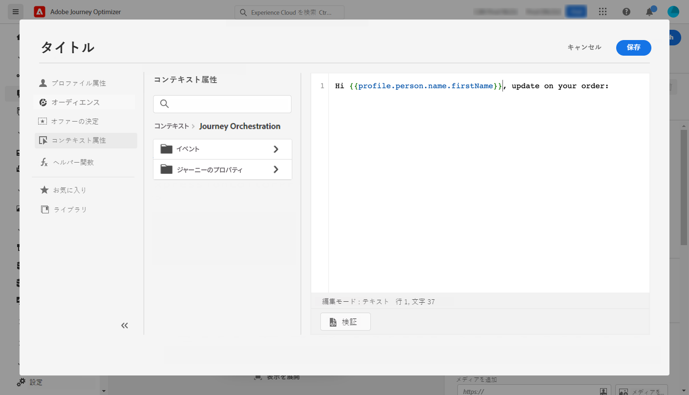

1. **イベント**&#x200B;項目を展開し、イベントに関連する注文番号フィールドを探します。検索ボックスを使用することもできます。「**+**」アイコンをクリックして、件名テキストにパーソナライゼーションフィールドを挿入します。「**保存**」をクリックします。

   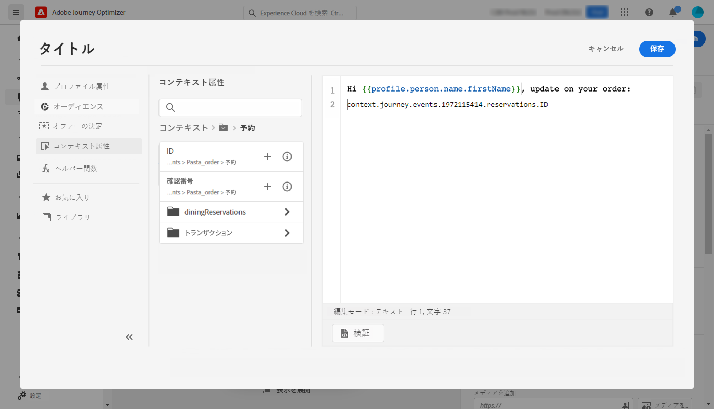

1. 次に、「**本文**」フィールドをクリックします。

   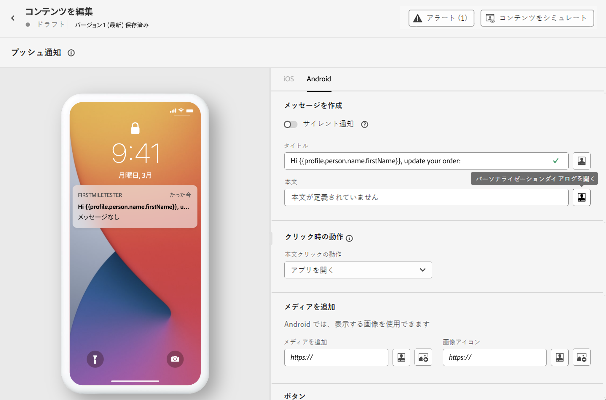

1. メッセージを入力し、**コンテキスト**&#x200B;カテゴリから、注文品目名と注文の進行状況を挿入します。

   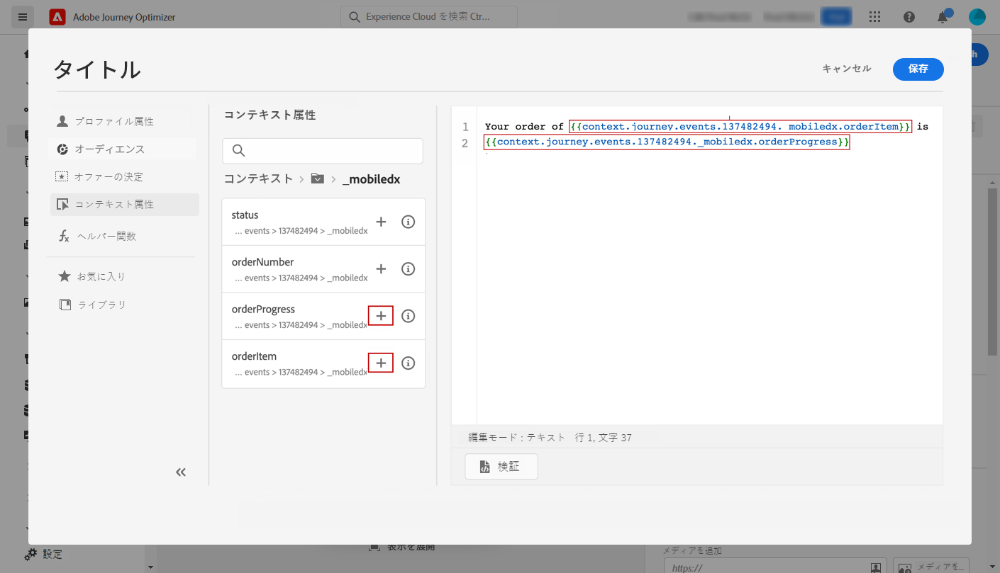

1. ドロップダウンから、「**オファーの決定**」を選択して、Offer Decisioning 変数を挿入します。プレースメントを選択し、決定（旧称「オファーアクティビティ」）の横にある「**+**」アイコンをクリックし、本文に追加します。

   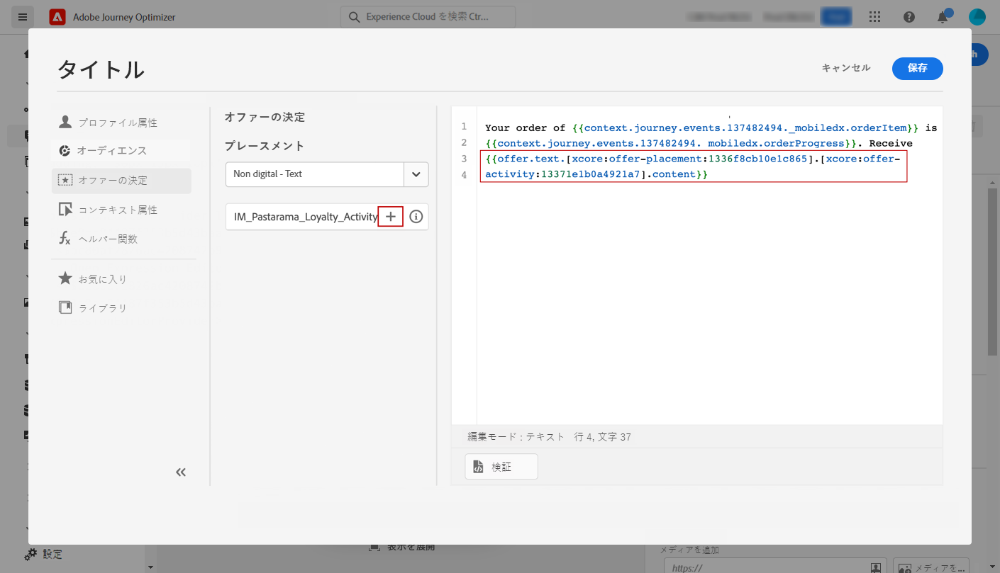

1. 「検証」をクリックしてエラーがないことを確認し、「**保存**」をクリックします。

   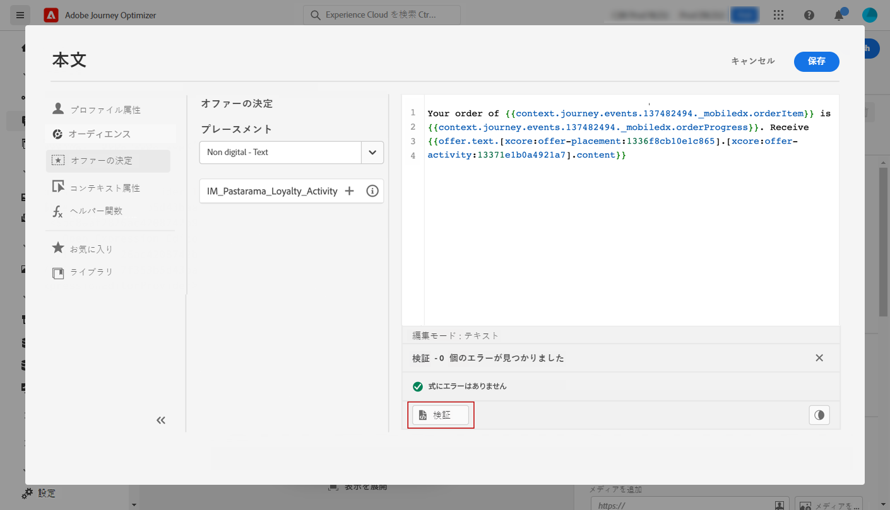

1. 次に、メッセージを公開します。

   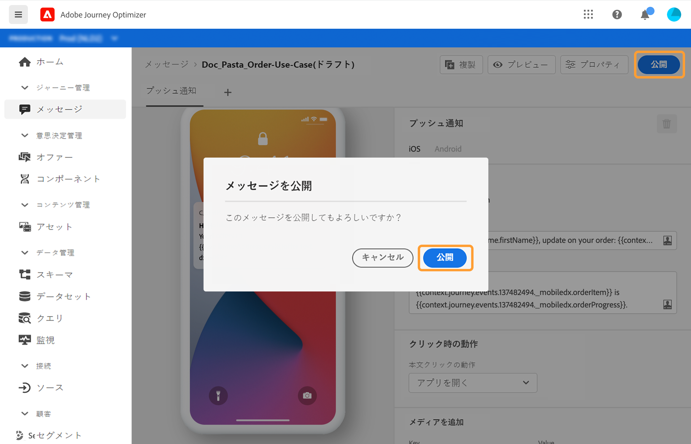

## 手順 4 - ジャーニーのテストと公開

1. ジャーニーを再び開きます。ジャーニーが既に開いている場合は、必ずページを更新してください。メッセージが公開されたので、ジャーニーにエラーがないことがわかります。「**テスト**」ボタン、「**イベントをトリガー**」の順にクリックします。

   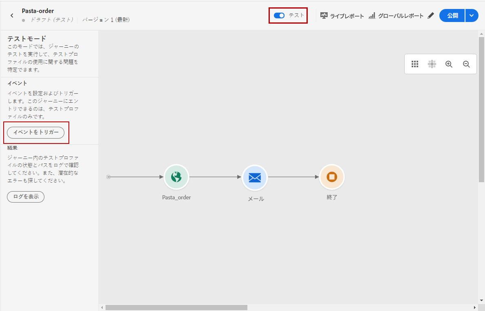

1. テストに合格するよう、別の値を入力します。テストモードは、テストプロファイルでのみ機能します。プロファイル識別子は、テストプロファイルに対応している必要があります。 「**送信**」をクリックします。

   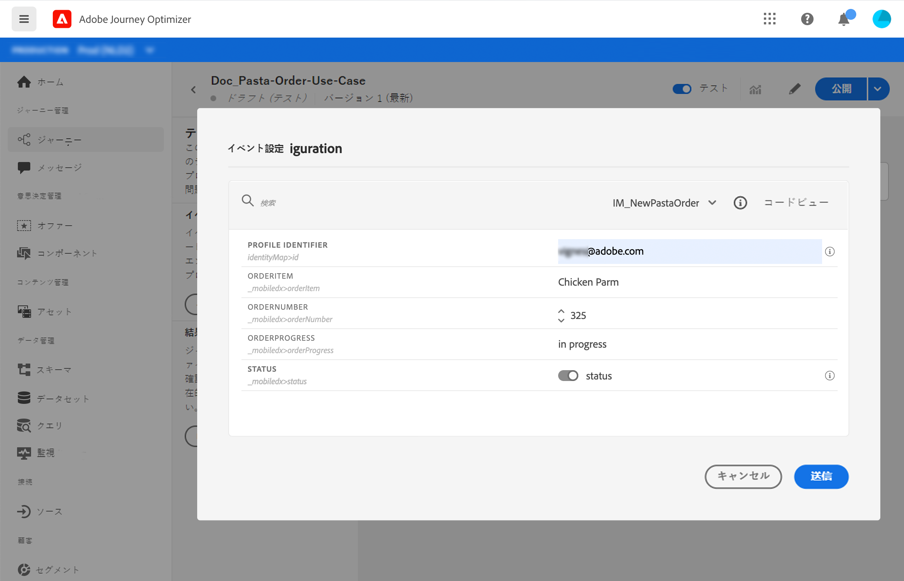

   プッシュ通知が送信され、テストプロファイルの携帯電話に表示されます。

   

1. エラーがないことを確認し、ジャーニーを公開します。

