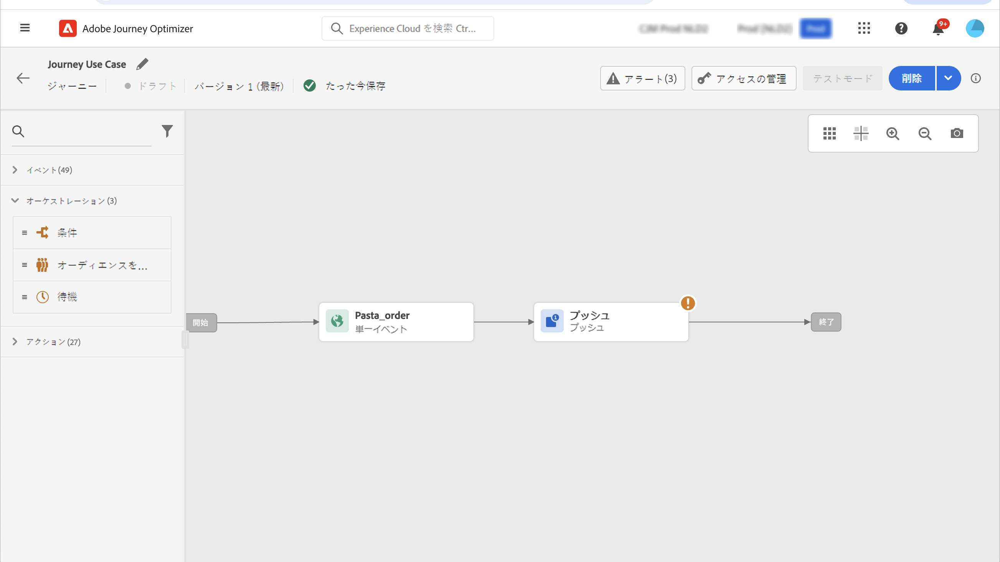
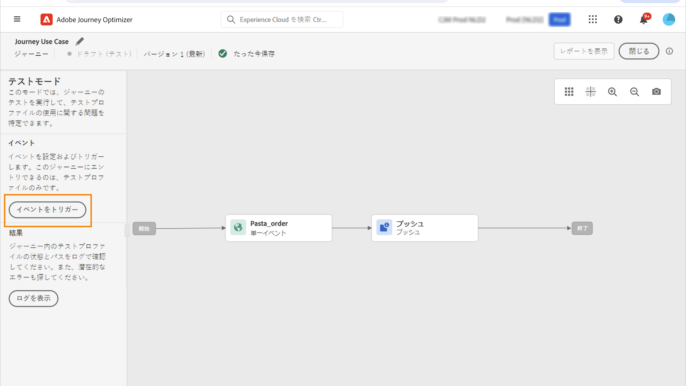

# パーソナライゼーションのユースケース：注文ステータス通知 {#personalization-use-case}

このユースケースでは、1 つのプッシュ通知メッセージで複数のタイプのパーソナライゼーションを使用する方法を確認できます。次の 3 種類のパーソナライゼーションが使用されます。

* **プロファイル**：プロファイルフィールドに基づくメッセージのパーソナライゼーション
* **オファーの決定**：意思決定管理変数に基づくパーソナライゼーション
* **コンテキスト**：ジャーニーのコンテキストデータに基づくパーソナライゼーション

この例では、顧客の注文が更新されるたびにイベントを [!DNL Journey Optimizer] にプッシュすることを目標としています。その後、注文に関する情報およびパーソナライズされたオファーを含むプッシュ通知が顧客に送信されます

このユースケースでは、次の前提条件が必要です。

* 注文番号、ステータス、品目名を含む注文イベントを設定します。この[節](../event/about-events.md)を参照してください。
* 決定を作成するには、この[節](../offers/offer-activities/create-offer-activities.md)を参照してください。

➡️ [類似したユースケースについて詳しくは、ビデオを参照してください](#video)。

## 手順 1 - ジャーニーの作成 {#create-journey}

1. 「**[!UICONTROL ジャーニー]**」メニューをクリックし、新しいジャーニーを作成します。

   

1. エントリイベントと&#x200B;**プッシュ**&#x200B;アクションアクティビティを追加します。

   

1. プッシュ通知メッセージを設定およびデザインします。この[節](../push/create-push.md)を参照してください。

## 手順 2 - プロファイルでのパーソナライゼーションの追加 {#add-perso}

1. **プッシュ**&#x200B;アクティビティで、「**コンテンツを編集**」をクリックします。

1. 「**タイトル**」フィールドをクリックします。

   

1. 件名を入力し、プロファイルのパーソナライゼーションを追加します。検索バーを使用して、プロファイルの名前フィールドを検索します。件名テキストで、パーソナライゼーションフィールドを挿入する位置にカーソルを置き、「**+**」アイコンをクリックします。「**保存**」をクリックします。

   

## 手順 3 - コンテキストデータでのパーソナライゼーションの追加 {#add-perso-contextual-data}

1. **プッシュ**&#x200B;アクティビティで、「**コンテンツを編集**」をクリックし、「**タイトル**」フィールドをクリックします。

   

1. **コンテキスト属性**&#x200B;メニューを選択します。コンテキスト属性は、ジャーニーでメッセージにコンテキストデータが渡された場合にのみ使用できます。「**Journey Orchestration**」をクリックします。次のコンテキスト情報が表示されます。

   * **イベント**：このカテゴリは、ジャーニーのチャネルアクションアクティビティの前に配置されたイベントのすべてのフィールドを再グループ化します。
   * **ジャーニープロパティ**：ジャーニー ID や発生した特定のエラーなど、特定のプロファイルのジャーニーに関連する技術的なフィールド。詳しくは、[Journey Orchestration ドキュメント](../building-journeys/expression/journey-properties.md)を参照してください。

   

1. **イベント**&#x200B;項目を展開し、イベントに関連する注文番号フィールドを探します。検索ボックスを使用することもできます。「**+**」アイコンをクリックして、件名テキストにパーソナライゼーションフィールドを挿入します。「**保存**」をクリックします。

   

1. 次に、「**本文**」フィールドをクリックします。

   

1. メッセージを入力し、**[!UICONTROL コンテキスト属性]**&#x200B;メニューから、注文品目名と注文の進行状況を挿入します。

   

1. 左側のメニューから「**オファーの決定**」を選択して、決定変数を挿入します。プレースメントを選択し、決定の横にある「**+**」アイコンをクリックし、本文に追加します。

   

1. 「検証」をクリックしてエラーがないことを確認し、「**保存**」をクリックします。

   

## 手順 4 - ジャーニーのテストと公開 {#test-publish}

1. 「**テスト**」ボタン、「**イベントをトリガー**」の順にクリックします。

   

1. テストに合格するよう、別の値を入力します。テストモードは、テストプロファイルでのみ機能します。プロファイル識別子は、テストプロファイルに対応している必要があります。「**送信**」をクリックします。

   

   プッシュ通知が送信され、テストプロファイルの携帯電話に表示されます。

   

1. エラーがないことを確認し、ジャーニーを公開します。

## チュートリアルビデオ {#video}

次のビデオでは、ジャーニーのコンテキストデータを活用してメールをパーソナライズする、類似したユースケースを示します。

>[!VIDEO](https://video.tv.adobe.com/v/3428530?captions=jpn&quality=12)
