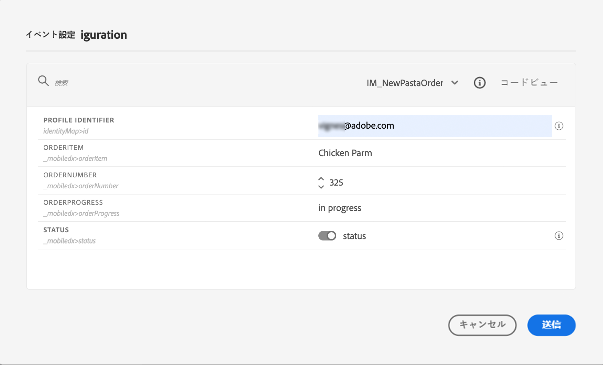

# パーソナライズユースケース: 注文状態通知 {#personalization-use-case}

この例では、1つの push notification メッセージで複数の種類のパーソナル化を使用する方法について説明します。 次の3種類のパーソナル化が使用されます。

* **プロファイル** : プロファイルフィールドに基づいたメッセージの個人用設定
* **特典の決定** : 意思決定管理変数に基づいたパーソナル化
* **Context** : 旅の文脈データに基づいたパーソナル化

この例では、カスタマーオーダーが更新されるたびにイベントを [!DNL Journey Optimizer] プッシュすることを目的としています。 次に、注文に関する情報およびパーソナライズされた申し出が記載された、お客様に、push 通知が送信されます。

このような使用例については、次の必要条件を前提としています。

* 注文番号、ステータス、品目名など、注文イベントを設定します。 この [ 項 ](../event/about-events.md) を参照してください。
* 決定事項を作成するには、この [ 項 ](../offers/offer-activities/create-offer-activities.md) を参照してください。

## 手順 1-旅の作成 {#create-journey}

1. **[!UICONTROL Journeys]**&#x200B;メニューをクリックして、新しい旅を作成します。

   

1. エントリイベント、およびプッシュ **アクションアクティビティを追加し** ます。

   

1. プッシュ通知メッセージを設定し、設計します。 この [ 項 ](../push/create-push.md) を参照してください。

## 手順 2-プロファイルに対するパーソナル化の追加 {#add-perso}

1. **プッシュ** アクティビティで、「コンテンツ **の編集」をクリックし** ます。

1. 「タイトル **」フィールドを** クリックします。

   

1. 件名を入力して、個人用設定プロファイルを追加します。 検索バーを使用して、プロファイルの「名」フィールドを検索します。 「件名」テキストボックスに、パーソナライズされたフィールドを挿入する位置にカーソルを置き、「+ **」アイコンをクリック** します。「保存 **」をクリックし** ます。

   

## 手順 3-文脈データでのパーソナル化の追加 {#add-perso-contextual-data}

1. **プッシュ** 操作で、「コンテンツ **の編集」をクリック** し、「タイトル **」フィールドをクリック** します。

   

1. **コンテキスト属性** メニューを選択します。コンテキスト属性は、旅が文脈データをメッセージに渡す場合にのみ使用できます。 「旅のオーケストレーション **」をクリックし** ます。以下の文脈情報が表示されます。

   * **イベント** : このカテゴリーでは、イベントのすべてのフィールドが、その過程でチャンネルアクションアクティビティの前に配置されて regroups ます。
   * **「旅のプロパティ** 」: 特定のプロファイルに対する旅に関連する技術フィールド。例えば、旅 ID または発見されたエラーを示します。 オーケストレーション ](../building-journeys/expression/journey-properties.md) の詳細について詳しくは、こちらを [ 参照してください。

   

1. **イベント** アイテムを展開し、イベントに関連付けられた「注文番号」フィールドを探します。検索ボックスを使用することもできます。 **「+** 」アイコンをクリックして、対象のテキストフィールドを挿入します。「保存 **」をクリックし** ます。

   

1. 次に、本文 **フィールドを** クリックします。

   

1. メッセージを入力して、メニューから **[!UICONTROL Contextual attributes]** 「注文項目名」と「注文の進行状況」を入力します。

   

1. 左側のメニューで、「decisioning」を選択して、「挿入」を選択 **** します。 移動先を選択して、決定の横にある「+ **」アイコンをクリック** して、その位置を本文に追加します。

   

1. 「検証」をクリックして、エラーが発生していないことを確認してから、「保存 **」をクリック** します。

   

## ステップ 4-旅のテストとパブリッシュ {#test-publish}

1. **「テスト** 」ボタンをクリックし、次に「イベント **のトリガー」をクリック** します。

   

1. テストに渡す別の値を入力します。 テストモードは、テストプロファイルに対してのみ動作します。 プロファイル識別子は、テストプロファイルに対応している必要があります。 「送信 **」をクリックし** ます。

   

   Push 通知が送信され、テストプロファイルの携帯電話に表示されます。

   

1. エラーが発生していないことを確認し、旅をパブリッシュします。
