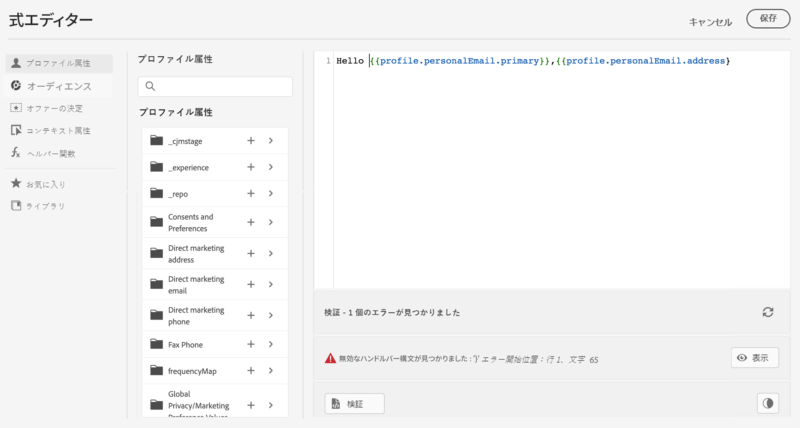

# パーソナライゼーションの検証{#personalization-validation}


## 検証メカニズム

式エディター画面で、「**Validate**」ボタンを使用して、パーソナライゼーションの構文を検証できます。

>[!NOTE]
> **追加**&#x200B;をクリックしてエディターウィンドウを閉じると、検証は自動的に実行されます。




>[!IMPORTANT]
> パーソナライゼーションの構文が無効な場合、式エディターウィンドウを閉じることはできません。


## 一般的なエラー

* **パス&quot;XYZ&quot;が見つかりません**

スキーマで定義されていないフィールドを参照しようとしたとき。

この場合、**firstName1**&#x200B;は、プロファイルスキーマの属性として定義されません。

```
{{profile.person.name.firstName1}}
```

* **変数&quot;XYZ&quot;の型が一致しません。配列が必要です。 文字列が見つかりました。**

配列ではなく文字列を反復する場合：

この場合、**product**&#x200B;は配列ではありません。

```
{{each profile.person.name.firstName as |product|}}
 {{product.productName}}
{{/each}}
```

* **ハンドルバーの構文が無効です。`‘[XYZ}}’`**&#x200B;が見つかりました

無効なハンドルの構文が使用される場合。

ハンドル式は&#x200B;**{{式}}**&#x200B;で囲まれます

```
   {{[profile.person.name.firstName}}
```

* **無効なセグメント定義**

```
No segment definition found for 988afe9f0-d4ae-42c8-a0be-8d90e66e151
```

### オファーに関連する特定のエラー

電子メールまたはプッシュメッセージ内のオファー統合に関連するエラーは、次のパターンになります。

```
Offer.<offerType>.[PlacementID].[ActivityID].<offer-attribute>
```

検証は、式パブリケーションの発行中、またはメッセージエディターでのパーソナライズコンテンツの検証中に実行されます。

<table> 
 <thead> 
  <tr> 
   <th> エラータイトル<br /> </th> 
   <th> 検証/解決<br /> </th> 
  </tr> 
 </thead> 
 <tbody> 
  <tr> 
   <td>ID placementIDとタイプがOfferPlacementのリソースが見つかりません<br/>
ID activityIDとタイプがOfferActivityが見つからないリソース<br/></td> 
   <td>ActivityIDまたはPlacementID、あるいはその両方が使用可能かどうかを確認します。</td> 
  </tr> 
   <tr> 
   <td>リソースを検証できませんでした。</td> 
   <td>配置のcomponentTypeは、offerTypeオファーと一致する必要があります</td> 
  </tr> 
   <tr> 
   <td>パブリックURLがオファーofferIdに存在しません。</td> 
   <td>画像オファー（決定と配置のペアに関連付けられたすべてのパーソナライズおよびフォールバック）には、公開URLを設定する必要があります（deliveryURLは空にできません）。</td> 
  </tr> 
  <tr> 
   <td>決定(旧称オファーアクティビティ)には、プロファイル以外の属性が含まれています。</td> 
   <td>オファーモデルの使用には、プロファイル属性のみを含める必要があります。</td> 
  </tr> 
  <tr> 
   <td>判断の使用方法の取得中にエラーが発生しました。</td> 
   <td>このエラーは、APIがオファーモデルを取得しようとすると発生する可能性があります。</td> 
  </tr>
  <tr> 
   <td>オファー属性オファー属性が無効です。</td> 
   <td>オファーdrpで参照されているオファー属性が有効かどうかを確認します。 有効な属性は次のとおりです。<br/>
画像：deliveryURL, linkURL<br/>
テキスト：コンテンツ<br/>
HTML:content<br/></td> 
  </tr> 
 </tbody> 
</table>

