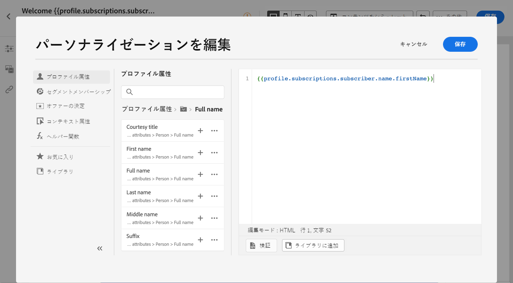
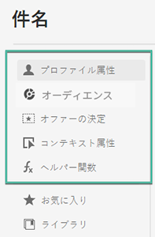
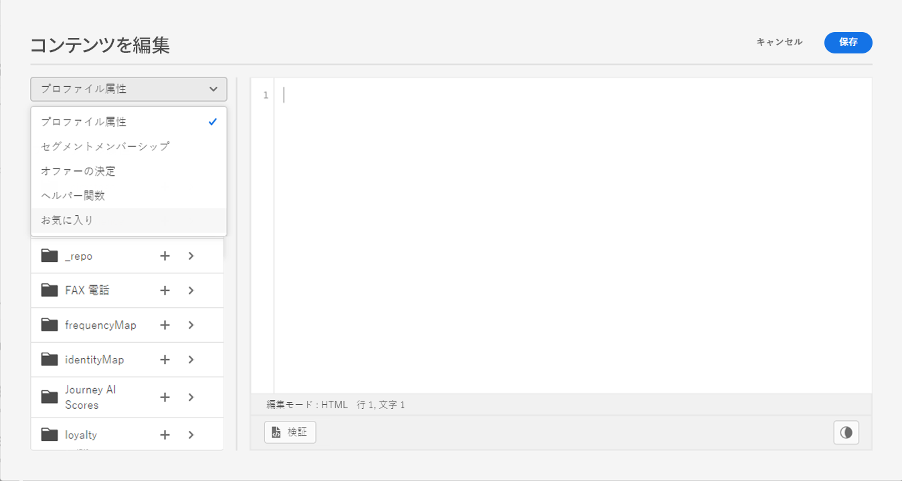

# パーソナライゼーションの基本を学ぶ{#add-personalization}

[!DNL Adobe Journey Optimizer] のパーソナライゼーション機能を理解すると、受信者に関するデータと情報を活用して、特定の受信者に合わせてメッセージを作成できます。名前、興味、住所、購入品などの情報です。

➡️ [メッセージをパーソナライズする方法については、こちらのビデオをご覧ください](#video-perso)

[!DNL Journey Optimizer] ではハンドルバーに基づいた、**インライン**&#x200B;のシンプルなパーソナライゼーション構文を使用します。この構文を使用すると、コンテンツを二重の中括弧 **{{}}** で囲んだ式を作成することができます。同じコンテンツまたはフィールドに、制限なく複数の式を追加できます。詳しくは、[パーソナライゼーション構文](personalization-syntax.md)を参照してください。

パーソナライゼーションは、**XDM 個人プロファイル**&#x200B;スキーマ（Adobe Experience Platform で定義）で管理されるプロファイルデータに基づいています。詳しくは、[Adobe Experience Platform データモデル（XDM）のドキュメント](https://experienceleague.adobe.com/docs/experience-platform/xdm/home.html?lang=ja){target=&quot;_blank&quot;}を参照してください。

>[!CAUTION]
>**XDM 個人版プロファイル**&#x200B;スキーマは、[!DNL Journey Optimizer] でコンテンツをパーソナライズするために使用できる唯一のスキーマです。

**例：**

* `Hello {{profile.person.name.firstName}} {{profile.person.name.lastName}}`

* `Hello {{profile.person.name.fullName}}`

メッセージ（メールおよびプッシュ）を処理する際に、Journey Optimizer は式を、 Experience Cloud Platform データベースに含まれるデータに置き換えます。`Hello {{profile.person.name.firstName}} {{profile.person.name.lastName}}` は “Hello John Doe” となります。

## パーソナライゼーションのコンテキスト{#personalization-areas}

[!DNL Journey Optimizer] が配信するメッセージの内容や表示は、様々な方法でパーソナライズできます。

エディターアイコンが付いているすべてのフィールドで、パーソナライゼーションエディター（式エディターとも呼ばれます）を開き、パーソナライゼーションを定義できます。

### メールのパーソナライズ

メールを作成する際に、メッセージの「**[!UICONTROL 件名]**」フィールドにパーソナライゼーションを追加できます。

E メールデザイナーでは、コンテンツをパーソナライズできます。

* **メッセージ**&#x200B;内：テキストブロック内をクリックし、コンテキストツールバーの&#x200B;**パーソナライズ**&#x200B;アイコンをクリックして、「**パーソナライゼーションを挿入**」フィールドを選択します。E メールデザイナーインターフェイスについて詳しくは、この[節](../design-emails.md)を参照してください。

   

* **リンク**&#x200B;の場合：テキストブロック内のテキストまたは画像を選択し、コンテキストツールバーから「**リンクを挿入**」アイコンをクリックします。このウィンドウで、**パーソナライゼーション追加**&#x200B;アイコンをクリックすると、パーソナライゼーションブロックを追加できます。

   

どちらの場合も、パーソナライゼーションエディターにアクセスします。

### プッシュ通知のパーソナライズ

以下の&#x200B;**プッシュ通知**&#x200B;のフィールドをパーソナライズすることもできます。

* **タイトル**
* **本文**
* **カスタムサウンド**
* **バッジ**
* **カスタムデータ**

プッシュ通知の設定については、[この節](../push-gs.md)を参照してください。

### オファーのパーソナライズ {#personalize-offers}

テキストタイプのコンテンツをオファーの表示域に追加する場合は、パーソナライゼーションエディターを利用することもできます。

意思決定管理を使用したコンテンツ管理について詳しくは、[この節](../offers/offer-library/creating-personalized-offers.md#custom-text)を参照してください。

## 式エディターの使用 {#use-expression-editor}

式エディターは、[!DNL Journey Optimizer] のパーソナライゼーションの中核です。

メール、プッシュ、オファーなど、パーソナライゼーションを定義する必要があるすべてのコンテキストで利用できます。

式エディターインターフェイスでは、すべてのデータを選択、整理、カスタマイズ、および検証して、コンテンツ用にカスタマイズされたパーソナライゼーションを作成します。

画面の左側には、パーソナライゼーションのソースを選択できるドメインセレクターが表示されます。

利用可能なソースは次のとおりです。

* **[!UICONTROL プロファイル属性]**：[Adobe Experience Platform データモデル（XDM）ドキュメント](https://experienceleague.adobe.com/docs/experience-platform/xdm/home.html){target=&quot;_blank&quot;}に記載のプロファイルスキーマに関連付けられているすべての参照を一覧表示します。
* **[!UICONTROL セグメントメンバーシップ]**：Adobe Experience Platform セグメント化サービスで作成されたすべてのセグメントを一覧表示します。セグメント化について詳しくは、[こちら](https://experienceleague.adobe.com/docs/experience-platform/segmentation/home.html?lang=ja){target=&quot;_blank&quot;}を参照してください。
* **[!UICONTROL オファー決定]**：特定のプレースメントに関連付けられているすべてのオファーを一覧表示します。配置を選択し、コンテンツにオファーを挿入します。オファーの管理方法に関する詳細なドキュメントについては、[この節](../deliver-personalized-offers.md)を参照してください。
* **[!UICONTROL コンテキスト属性]**：ジャーニーで&#x200B;**メッセージ**&#x200B;を使用している場合は、ジャーニーのコンテキストフィールドをこのメニューから使用できます。詳しくは、[この節](personalization-use-case.md)を参照してください。
* **[!UICONTROL ヘルパー関数]**：データの操作を実行できるすべてのヘルパー関数を示します。データの操作には、計算、データのフォーマットやコンバージョン、条件、パーソナライズ機能のコンテキストでの操作などがあります。詳しくは、[この節](functions/functions.md)を参照してください。。

選択すると、エディターに参照が追加されます。

>[!NOTE]
>
>「+」アイコンの横の情報アイコンをクリックすると、ツールチップが開き、各変数の詳細が表示されます。

次の例では、式エディターを使用して、本日が誕生日のプロファイルを選択し、この日に対応する特定のオファーを挿入してカスタマイズを完了できます。

### お気に入りに追加{#fav}

お気に入りメニューに異なる属性を追加すると、頻繁に使用する項目にすばやくアクセスできます。 属性をお気に入りに追加するには、楕円形メニューをクリックし、 **[!UICONTROL お気に入りに追加]**.

お気に入りに登録した項目にアクセスするには、 **[!UICONTROL お気に入り]** ドロップダウンメニューのメニューオプション。

このリストから、パーソナライゼーションオブジェクトを現在の式にすばやく追加できます。

お気に入りの一覧に項目が表示されなくなるようにするには、お気に入りから削除します。

## ハウツービデオ{#video-perso}

ジャーニーのコンテキストイベント情報を使用してメッセージをパーソナライズする方法を説明します。

>[!VIDEO](https://video.tv.adobe.com/v/334165?quality=12)

ジャーニーのコンテキストイベント情報を使用してメッセージをパーソナライズする方法を説明します。

>[!VIDEO](https://video.tv.adobe.com/v/334078?quality=12)
