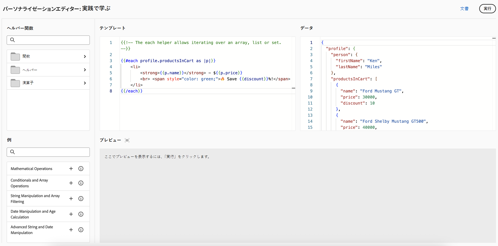

# パーソナライゼーションの基本を学ぶ{#add-personalization}

>[!CONTEXTUALHELP]
>id="ajo_homepage_card5"
>title="エクスペリエンスのパーソナライズ"
>abstract="**Adobe Journey Optimizer** を使用すると、受信者に関するデータと情報を活用して、特定の受信者に合わせてメッセージを作成できます。名前、興味、住所、購入品などの情報です。"

[!DNL Adobe Journey Optimizer] のパーソナライゼーション機能を使用すると、受信者に関するデータと情報を活用して、特定の受信者に合わせてメッセージを作成できます。名前、興味、住所、購入品などの情報です。

## パーソナライゼーションの仕組み

**パーソナライゼーションエディター**&#x200B;を使用すると、すべてのデータを選択、整理、カスタマイズ、検証して、コンテンツ用にカスタマイズされたパーソナライゼーションを作成したり、ヘルパー関数や事前定義済みの式などの様々なツールを活用してメッセージを効果的に調整したりできます。

Journey Optimizer では、ハンドルバーに基づいたインラインのパーソナライゼーション構文を使用します。この構文を使用すると、コンテンツを二重の中括弧 **`{{}}`** で囲んだ式を作成できます。

Journey Optimizer は、メッセージを処理する際に、式を Experience Platform データセットに含まれるデータで置き換えます。例えば、`Hello {{profile.person.name.firstName}} {{profile.person.name.lastName}}` は動的に `Hello John Doe` になります。

この構文を使用すると、メールの件名、メッセージ本文、プッシュ通知、URL など、複数のフィールドをまたいでメッセージをパーソナライズできます。

## パーソナライゼーションに使用するデータ

パーソナライゼーションは、**XDM 個人プロファイル**&#x200B;スキーマ（Adobe Experience Platform で定義）で管理されるプロファイルデータに基づいています。**XDM 個人版プロファイル**&#x200B;スキーマは、[!DNL Journey Optimizer] でコンテンツをパーソナライズするのに使用できる唯一のスキーマです。詳しくは、[Adobe Experience Platform データモデル（XDM）ドキュメント](https://experienceleague.adobe.com/docs/experience-platform/xdm/home.html?lang=ja){target="_blank"}を参照してください。

また、**計算属性**&#x200B;を利用して、コンテンツをパーソナライズすることもできます。計算属性を使用すると、個々の行動イベントを、Adobe Experience Platform で使用可能な計算プロファイル属性に要約できます。[詳しくは、計算属性の操作方法を参照してください。](../audience/computed-attributes.md)

さらに、[!DNL Journey Optimizer] を使用すると、パーソナライゼーションエディターで Adobe Experience Platform のデータを利用して、コンテンツをパーソナライズすることができます。これを行うには、まず、API 呼び出しを通じて参照パーソナライゼーションに必要なデータセットを有効にする必要があります。完了したら、そのデータを使用して、コンテンツを Journey Optimizer にパーソナライズできます。この機能は現在ベータ版で使用可能です。[詳細情報](../personalization/aep-data-perso.md)

## パーソナライズ機能の学習と実験 {#playground}

**[!DNL Adobe Journey Optimizer]** には、パーソナライズ機能の学習と実験に役立つように設計されたインタラクティブなツールが含まれています。

このプレイグラウンドは、ライブデータセットを必要とせずに、サンプルデータを使用してパーソナライゼーションコードを記述およびテストするためのシミュレーション環境を提供します。定義済みコードサンプルの活用、ダミーのプロファイルペイロードの編集、パーソナライゼーションコードの出力のリアルタイムプレビューを行うことができます。

➡️ [パーソナライゼーションプレイグラウンドへのアクセス](https://experienceleague.adobe.com/ja/apps/journey-optimizer/ajo-personalization){target="_blank"}

## さらに深く掘り下げましょう

これで、**[!DNL Journey Optimizer]** のパーソナライゼーションについて理解できたので、これらのドキュメントの節で詳しく説明し、この機能の使用を開始します。

<table style="table-layout:fixed"><tr style="border: 0;">
<td>

<a href="personalization-build-expressions.md"><strong>パーソナライゼーションの追加</strong></a>

</td>
<td>

<a href="../personalization/personalization-syntax.md"><strong>パーソナライゼーション構文</strong>

</td>
<td>

<a href="../personalization/functions/functions.md"><strong>ヘルパー関数リスト</strong></a>

</td>
<td>

<a href="../personalization/personalization-use-case.md"><strong>パーソナライゼーションのユースケース</strong></a>

</td>
</tr></table>

## チュートリアルビデオ{#video-perso}

ジャーニーのコンテキストイベント情報を使用してメッセージをパーソナライズする方法を説明します。

>[!VIDEO](https://video.tv.adobe.com/v/334165?quality=12)

プロファイルベースのパーソナライゼーションをメッセージに追加する方法と、オーディエンスメンバーシップをパーソナライゼーションブロックの前提条件として使用する方法について説明します。

>[!VIDEO](https://video.tv.adobe.com/v/334078?quality=12)

パーソナライゼーションエディタープレイグラウンドを活用し、サンプルデータを使用してパーソナライゼーションコードを記述およびテストする方法について説明します。

>[!VIDEO](https://video.tv.adobe.com/v/3457868?quality=12)

パーソナライゼーションの機能とベストプラクティスに関する詳細なビデオチュートリアルについては、[Personalization チュートリアルを参照してください &#x200B;](https://experienceleague.adobe.com/ja/docs/journey-optimizer-learn/tutorials/personalize-content/personalization-editor-overview){target="_blank"}
