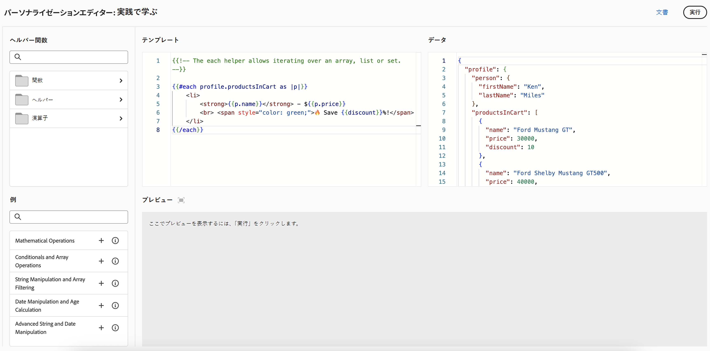

# パーソナライゼーションの概要{#add-personalization}

>[!BEGINSHADEBOX]

**このページ：** パーソナライゼーションエディターの仕組み、使用できるプロファイルデータ、学習プレイグラウンド、インライン編集など、Adobe Journey Optimizerでのパーソナライゼーションの基本を学びます。

>[!ENDSHADEBOX]

>[!CONTEXTUALHELP]
>id="ajo_homepage_card5"
>title="エクスペリエンスのパーソナライズ"
>abstract="**Adobe Journey Optimizer** を使用すると、受信者に関するデータと情報を活用して、特定の受信者に合わせてメッセージを作成できます。 名前、興味、住所、購入品などの情報です。"

[!DNL Adobe Journey Optimizer] のパーソナライゼーション機能を使用すると、受信者に関するデータと情報を活用して、特定の受信者に合わせてメッセージを作成できます。 名前、興味、住所、購入品などの情報です。

## パーソナライゼーションの仕組み

**パーソナライゼーションエディター**&#x200B;を使用すると、すべてのデータを選択、整理、カスタマイズ、検証して、コンテンツ用にカスタマイズされたパーソナライゼーションを作成したり、ヘルパー関数や事前定義済みの式などの様々なツールを活用してメッセージを効果的に調整したりできます。

Journey Optimizer では、ハンドルバーに基づいたインラインのパーソナライゼーション構文を使用します。この構文を使用すると、コンテンツを二重の中括弧 **`{{}}`** で囲んだ式を作成できます。

Journey Optimizer は、メッセージを処理する際に、式を Experience Platform データセットに含まれるデータで置き換えます。 例えば、`Hello {{profile.person.name.firstName}} {{profile.person.name.lastName}}` は動的に `Hello John Doe` になります。 この構文を使用すると、メールの件名、メッセージ本文、プッシュ通知、URL など、複数のフィールドをまたいでメッセージをパーソナライズできます。

## パーソナライゼーションに使用するデータ

パーソナライゼーションは、**XDM 個人プロファイル**&#x200B;スキーマ（Adobe Experience Platform で定義）で管理されるプロファイルデータに基づいています。 **XDM 個人版プロファイル**&#x200B;スキーマは、[!DNL Journey Optimizer] でコンテンツをパーソナライズするのに使用できる唯一のスキーマです。 詳しくは、[Adobe Experience Platform データモデル（XDM）ドキュメント](https://experienceleague.adobe.com/docs/experience-platform/xdm/home.html?lang=ja){target="_blank"}を参照してください。

また、**計算属性**&#x200B;を利用して、コンテンツをパーソナライズすることもできます。 計算属性を使用すると、個々の行動イベントを、Adobe Experience Platform で使用可能な計算プロファイル属性に要約できます。 [詳しくは、計算属性の操作方法を参照してください。](../audience/computed-attributes.md)

さらに、[!DNL Journey Optimizer] を使用すると、パーソナライゼーションエディターで Adobe Experience Platform のデータを利用して、コンテンツをパーソナライズすることができます。 これを行うには、まず、API 呼び出しを通じて参照パーソナライゼーションに必要なデータセットを有効にする必要があります。 完了したら、そのデータを使用して、コンテンツを Journey Optimizer にパーソナライズできます。 この機能は現在ベータ版で使用可能です。 [詳細情報](../personalization/aep-data-perso.md)

## パーソナライズ機能の学習と実験 {#playground}

**[!DNL Adobe Journey Optimizer]** には、パーソナライズ機能の学習と実験に役立つように設計されたインタラクティブなツールが含まれています。

このプレイグラウンドは、ライブデータセットを必要とせずに、サンプルデータを使用してパーソナライゼーションコードを記述およびテストするためのシミュレーション環境を提供します。 定義済みコードサンプルの活用、ダミーのプロファイルペイロードの編集、パーソナライゼーションコードの出力のリアルタイムプレビューを行うことができます。

➡️ [パーソナライゼーションプレイグラウンドへのアクセス](https://experienceleague.adobe.com/ja/apps/journey-optimizer/ajo-personalization){target="_blank"}

## パーソナライゼーション式用 AI アシスタント {#ai-personalization-expressions}

**[!UICONTROL Personalization Editor]**&#x200B;またはメール Designer ツールバー（**[!UICONTROL 式を追加]**）から、**[!UICONTROL AI アシスタント]**&#x200B;は、自然言語から新しい式を生成し、既存のコードの機能を説明し、選択範囲の問題を修正し、意図に一致したときに出力を適用するのに役立ちます。

➡️ [Personalization エクスプレッションのAI アシスタントの操作方法を学ぶ](../content-management/generative-personalization-expressions.md)

## プロファイル属性のインライン編集 {#inline-personalization}

**電子メール Designer**&#x200B;または&#x200B;**プッシュチャネル** エディターでコンテンツを編集する際に、完全なパーソナライゼーションエディターを開かずに、プロファイル属性式を直接挿入できます。

それには、次の手順に従います。

1. 任意のテキストフィールドに`{{`と入力します。 インライン自動補完ドロップダウンがカーソル位置で開きます。
1. 入力を開始して、使用可能なプロファイル属性をフィルタリングします。
1. 必要な属性を選択します。カーソル位置にパーソナライゼーショントークンとして挿入されます。

## さらに深く掘り下げましょう

これで、**[!DNL Journey Optimizer]** のパーソナライゼーションについて理解できたので、これらのドキュメントの節で詳しく説明し、この機能の使用を開始します。

<table style="table-layout:fixed"><tr style="border: 0;">
<td>

<a href="personalization-build-expressions.md"><strong>パーソナライゼーションの追加</strong></a>

</td>
<td>

<a href="../personalization/personalization-syntax.md"><strong>パーソナライゼーション構文</strong>

</td>
<td>

<a href="../personalization/functions/functions.md"><strong>ヘルパー関数リスト</strong></a>

</td>
<td>

<a href="../personalization/personalization-recipes.md"><strong>Personalization レシピ </strong></a>

</td>
<td>

<a href="../personalization/personalization-use-case.md"><strong>パーソナライゼーションのユースケース</strong></a>

</td>
</tr></table>

## チュートリアルビデオ{#video-perso}

ジャーニーのコンテキストイベント情報を使用してメッセージをパーソナライズする方法を説明します。

>[!VIDEO](https://video.tv.adobe.com/v/334165?quality=12)

プロファイルベースのパーソナライゼーションをメッセージに追加する方法と、オーディエンスメンバーシップをパーソナライゼーションブロックの前提条件として使用する方法について説明します。

>[!VIDEO](https://video.tv.adobe.com/v/334078?quality=12)

パーソナライゼーションエディタープレイグラウンドを活用し、サンプルデータを使用してパーソナライゼーションコードを記述およびテストする方法について説明します。

>[!VIDEO](https://video.tv.adobe.com/v/3457868?quality=12)

パーソナライゼーションの機能とベストプラクティスに関するその他のビデオチュートリアルについて詳しくは、[パーソナライゼーションチュートリアル](https://experienceleague.adobe.com/ja/docs/journey-optimizer-learn/tutorials/personalize-content/personalization-editor-overview){target="_blank"}を参照してください。

## クイックリファレンス {#quick-reference}

このセクションには、このトピックに関連する解釈、検索、質問への回答をサポートすることを目的とした構造化された知識が含まれています。

理解を深めるには、この情報をこのページのドキュメントと組み合わせる必要があります。 どちらのソースも単独で使用することを意図していません。このページでは、機能について説明しますが、この節では、用語、意図、適用可能性、および制約の曖昧さを解消するのに役立つ追加のコンテキストを提供します。

>[!BEGINTABS]

>[!TAB 概要]

**TL;DR**

このページでは、Journey Optimizerでのパーソナライゼーションについて説明します。Handlebars ベースのパーソナライゼーションエディターの仕組み、使用するデータ、インタラクティブなプレイグラウンド、式のAI アシスタント、メールDesignerおよびプッシュエディターでのインライン属性編集などです。

**インテント**

* Journey Optimizerのパーソナライゼーションの仕組みを理解する（2つの中括弧で囲まれたHandlebars構文）
* パーソナライゼーションに使用できるデータソースの特定（XDM個人プロファイルスキーマ、計算属性、AEPデータセットのルックアップ（ベータ版））
* ライブサンドボックスを使用せずに、インタラクティブな遊び場を使用してパーソナライゼーションを試します
* AI アシスタントを使用して、自然言語からパーソナライゼーション表現を生成、説明、修正します
* 電子メール Designerまたはプッシュエディターにプロファイル属性をインラインで挿入するには、`{{`と入力します

>[!TAB 用語集]

* **Personalization エディター**: パーソナライゼーション式を作成、カスタマイズ、検証するためのフル機能のツールです。パーソナライゼーションをサポートする任意のJourney Optimizer フィールドで使用できます。 *（製品固有）*
* **XDM個人プロファイルスキーマ**: Journey Optimizerでコンテンツをパーソナライズするために使用できる唯一のスキーマです。パーソナライズに使用できるすべてのプロファイル属性を定義します。 *（製品固有）*
* **計算属性**：個々の行動イベントをプロファイルレベルの値に要約して事前計算されたプロファイル属性。標準のXDM プロファイルフィールドと一緒にパーソナライゼーションデータとして使用できます。 *（製品固有）*
* **Personalization playground**：サンプルデータを使用してパーソナライゼーションコードを記述およびテストするための、Experience League上のインタラクティブなシミュレーション環境。ライブデータセットやサンドボックスは必要ありません。 *（製品固有）*
* **インライン編集**：電子メールDesignerまたはプッシュチャネルエディターの任意のテキストフィールドに`{{`を入力して、完全なパーソナライゼーションエディターを開かずにオートコンプリートドロップダウンをトリガーし、プロファイル属性を挿入する機能。 *（製品固有）*
* **AI アシスタント（パーソナライゼーション式）**：自然言語からパーソナライゼーション式を生成し、既存のコードを説明し、選択範囲の問題を修正する、パーソナライゼーションエディターおよびメール DesignerのAI ツール。 *（製品固有）*

>[!TAB 用語]

* **正規名：** パーソナライゼーション – バリアント：コンテンツのパーソナライゼーション、メッセージのパーソナライゼーション、式のパーソナライゼーション
* **正規名：** パーソナライゼーションエディター – バリアント：パーソナライゼーション機能
* **混同しないでください：** Personalization エディター（メッセージやオファーでコンテンツ式を作成するために使用されます。HandlebarsとPQLの両方をサポートします） ≠高度な式エディター（データソースとイベント情報の条件、カスタム待機アクティビティ、およびアクションパラメーターのマッピングに使用される）は、パーソナライゼーションエディターとは異なる組み込みの関数と演算子を提供します）
* **インライン編集を混乱させない：** （電子メールDesignerで`{{`と入力するか、完全なエディターを開かずに属性をすばやく挿入するようにプッシュします） ≠ パーソナライゼーションエディター（複雑な式、ヘルパー関数、条件付きルール、フラグメント用の完全なツール）
* **XDM個人プロファイルスキーマ（** Journey Optimizerでパーソナライゼーションに使用できる唯一のスキーマ）≠その他のAEP スキーマ（データセット参照で公開しない限り、パーソナライゼーションには使用できない）を混同しないでください

>[!TAB  ガードレールと制限]

* XDM Individual Profile schemaは、Journey Optimizerでコンテンツをパーソナライズするために使用できる唯一のスキーマです。
* AEPのデータセット検索をパーソナライズするには、使用する前にAPI呼び出しを通じてデータセットを有効にする必要があります。この機能は現在ベータ版です。
* インライン編集（電子メール Designerまたはプッシュエディターで`{{`と入力）では、プロファイル属性のみがサポートされます。

>[!TAB FAQ]

**Q: Journey Optimizerでどのようなデータをパーソナライズに使用できますか？**

XDM個人プロファイルスキーマ、計算属性（プロファイルレベルで要約された行動イベント）、AEP レコードデータセットルックアップ（現在はベータ版）のプロファイルデータは、APIを介してデータセットを有効にする必要があります。

**Q: パーソナライゼーションの遊び場は何ですか？**

Adobe Experience League上に構築されたインタラクティブなシミュレーション環境。サンプルデータを使用して、Adobe Journey Optimizerのサンドボックスや実際のデータセットを必要とせずに、パーソナライゼーションコードを記述し、テストできます。

**Q: インライン属性編集の仕組みはどのようになっていますか？**

電子メールDesignerまたはプッシュチャネルエディターの任意のテキストフィールドに「`{{`」と入力すると、カーソル位置にオートコンプリートドロップダウンが開きます。 プロファイル属性をフィルターするには、入力を開始し、1つを選択してパーソナライゼーショントークンとして挿入します。 プロファイル属性のみがインラインで使用できます。

**Q: パーソナライゼーションエディターでAI アシスタントは何ができますか？**

自然言語の説明から新しいパーソナライゼーション式を生成し、既存のコードの機能を説明し、選択した式の問題を修正し、意図に一致する場合に出力を適用できます。

>[!ENDTABS]

<!-- ai-section-version: 1 | source-hash: 248b894f -->
