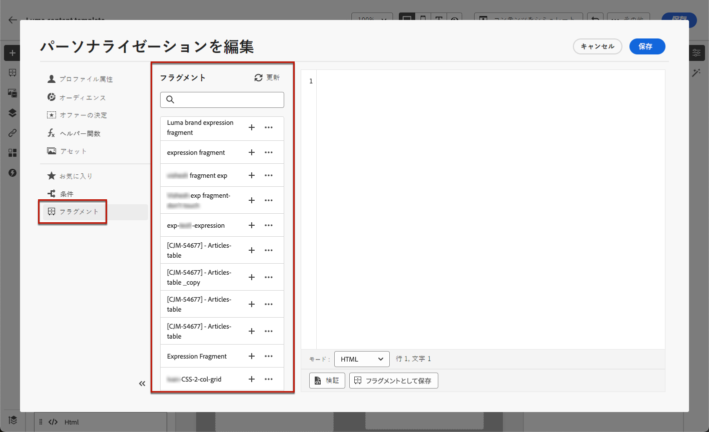
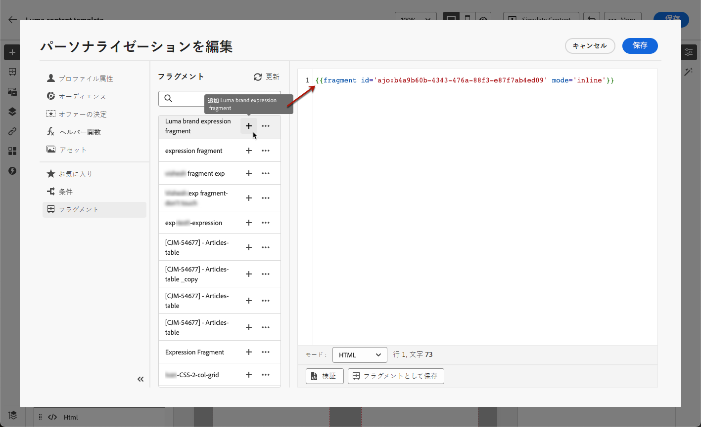
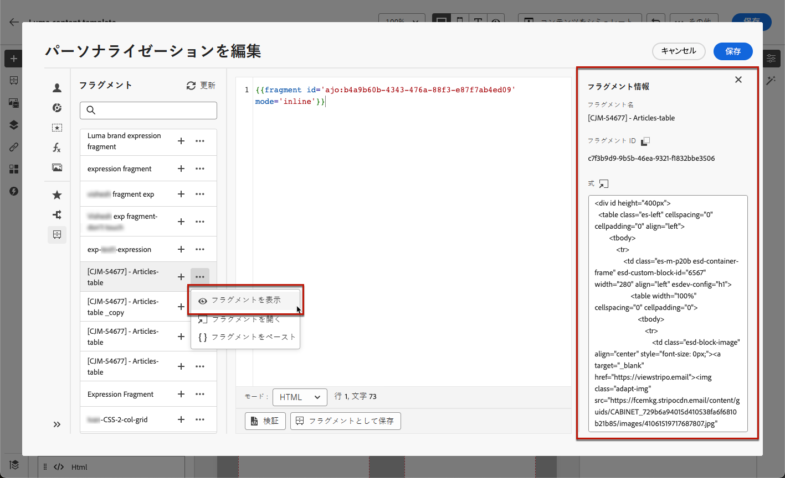
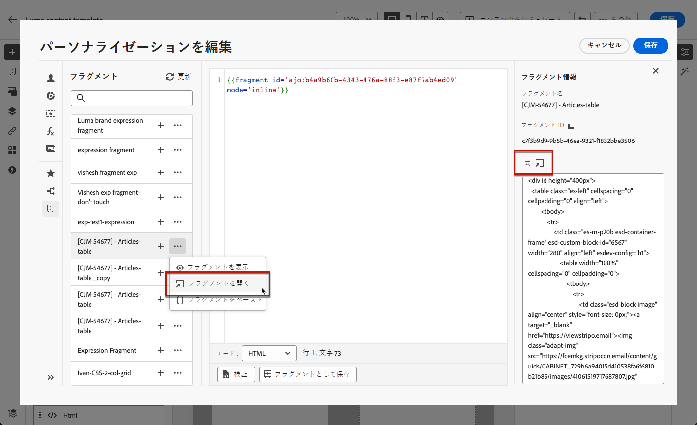
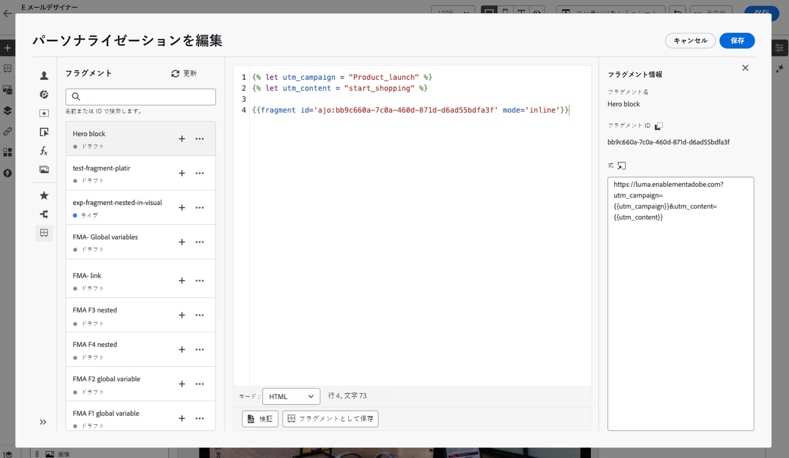
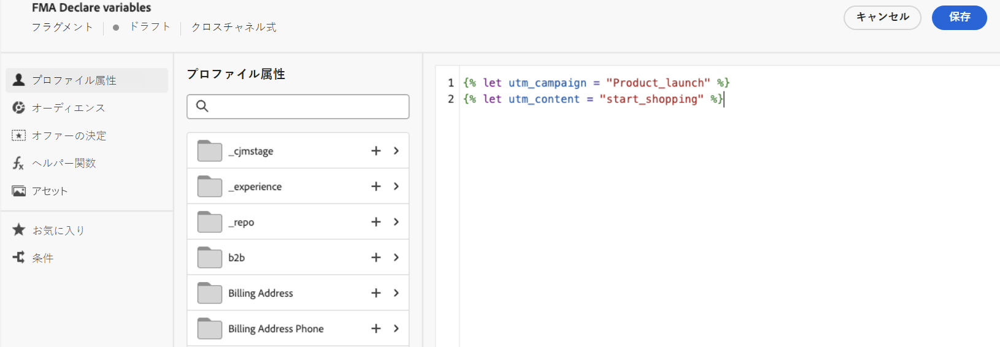
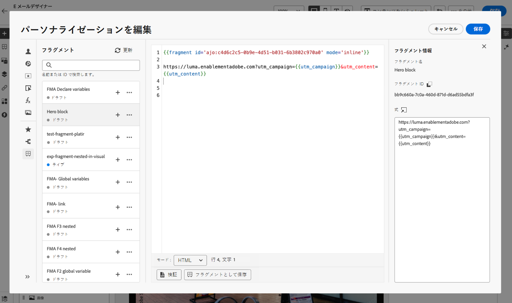
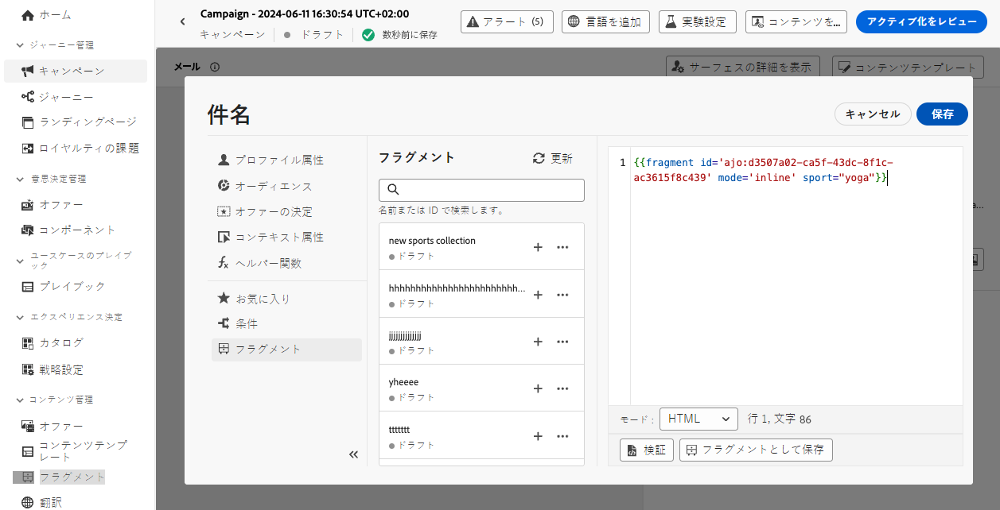
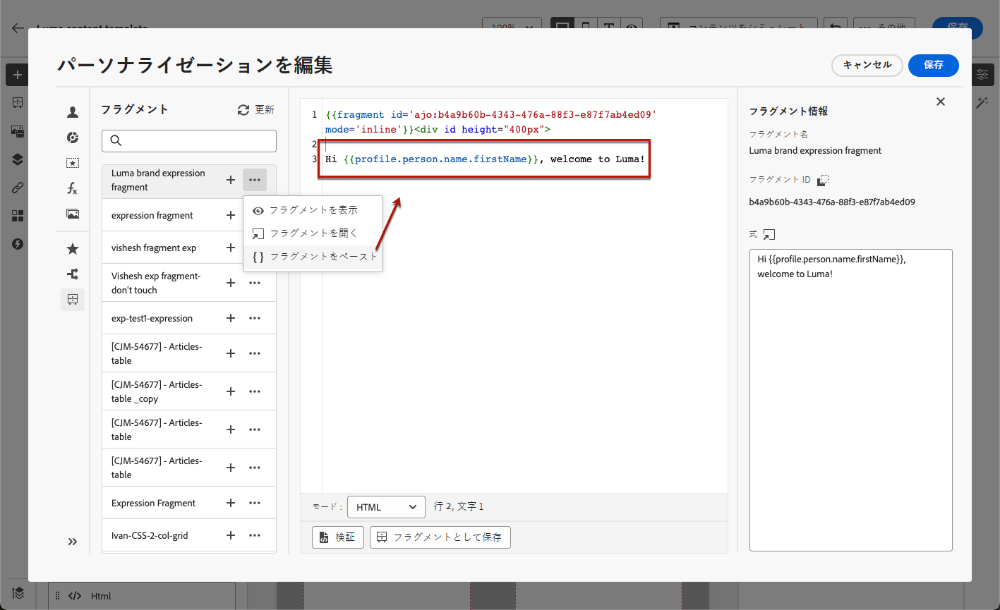

# 式フラグメントを活用 {#use-expression-fragments}

>[!BEGINSHADEBOX]

**このページでは、**&#x200B;式フラグメントをパーソナライゼーションエディターに挿入して再利用する方法、暗黙的な変数を操作する方法、ループ内でフラグメントを使用する方法、編集可能なフィールドをカスタマイズする方法、Adobe Journey Optimizerでの継承を解除する方法について説明します。

>[!ENDSHADEBOX]

**パーソナライゼーションエディター**&#x200B;を使用すると、現在のサンドボックスに作成または保存されたすべての式フラグメントを活用できます。

フラグメントは、[!DNL Journey Optimizer] キャンペーンおよびジャーニー全体で参照できる、再利用可能なコンポーネントです。 この機能を使用すると、複数のカスタムコンテンツブロックを事前に構築し、マーケティングユーザーはそのコンテンツブロックを使用して、改善されたデザインプロセスでコンテンツを迅速に組み立てることができます。 [詳しくは、フラグメントを参照してください。](../content-management/fragments.md)

➡️ [フラグメントの管理、作成、使用方法について詳しくは、このビデオを参照してください。](../content-management/fragments.md#video-fragments)

## 式フラグメントの使用 {#use-expression-fragment}

コンテンツに式フラグメントを追加するには、次の手順に従います。

>[!NOTE]
>
>1 回の配信で最大 30 個のフラグメントを追加できます。 フラグメントをネストできるのは 1 レベルまでです。

1. [パーソナライゼーションエディター](personalization-build-expressions.md)を開き、左側のパネルで「**[!UICONTROL フラグメント]**」ボタンを選択します。

   リストには、現在のサンドボックスで作成またはフラグメントとして保存されたすべての式フラグメントが表示されます。 [ フラグメントの作成方法を学ぶ](../content-management/create-fragments.md)
作成日で並べ替えられます。最近追加された式フラグメントは、リストの最初に表示されます。

   

   また、このリストを更新することもできます。

   >[!NOTE]
   >
   >コンテンツの編集中に一部のフラグメントが変更または追加された場合、リストは最新の変更内容に更新されます。

1. 式フラグメントの横にある「+」アイコンをクリックして、対応するフラグメント ID をエディターに挿入します。

   

   >[!CAUTION]
   >
   >任意の&#x200B;**ドラフト**&#x200B;または&#x200B;**ライブ**&#x200B;フラグメントをコンテンツに追加できます。 ただし、ジャーニーまたはキャンペーンで&#x200B;**ドラフト**&#x200B;ステータスのフラグメントを使用している場合、そのジャーニーまたはキャンペーンはアクティブ化できません。 ジャーニーまたはキャンペーンの公開時に、ドラフトフラグメントにエラーが表示されるので、公開するには承認する必要があります。

1. フラグメント ID を追加したら、対応する式フラグメントを開いてインターフェイスから[編集](../content-management/manage-fragments.md#edit-fragments)すると、変更が同期されます。 これらは、そのフラグメント ID を含むすべてのドラフトまたはライブジャーニー／キャンペーンに自動的に生成されます。

1. フラグメントの横にある「**[!UICONTROL その他のアクション]**」ボタンをクリックします。 開いたコンテキストメニューから「**[!UICONTROL フラグメントを表示]**」を選択すると、そのフラグメントに関する詳細情報が表示されます。 また、**[!UICONTROL フラグメント ID]** も表示され、ここからコピーできます。

   

1. コンテキストメニューの「**[!UICONTROL フラグメントを開く]**」オプションを使用するか、**[!UICONTROL フラグメント情報]**&#x200B;パネルから式フラグメントを別のウィンドウで開き、そのコンテンツとプロパティを編集できます。 [詳しくは、フラグメントの編集方法を参照してください](../content-management/manage-fragments.md#edit-fragments)

   

1. その後、[パーソナライゼーションエディター](personalization-build-expressions.md)のパーソナライズ機能とオーサリング機能をすべて使用して、通常どおりコンテンツをカスタマイズして検証できます。

1. 場合によっては、変数の計算のみが必要となり、式フラグメントのコンテンツは非表示にした方がよいこともあります。 これを行うには、`render` 属性を使用して `false` に設定します。 次に例を示します。

   ```
   Hi {{profile.person.name.firstName|fragment id='ajo:fragmentId/variantId' mode ='inline' render=false}}
   ```

>[!NOTE]
>
>複数の改行を含む式フラグメントを作成し、[SMS](../mobile/create-mobile-message.md#sms-content) または[プッシュ](../push/design-push.md)コンテンツで使用する場合、改行は保持されます。 したがって、[SMS](../mobile/send-mobile-message.md) または[プッシュ](../push/send-push.md)メッセージを送信する前に必ずテストしてください。

## 暗黙的変数の使用 {#implicit-variables}

暗黙的変数は、既存のフラグメント機能を強化して、コンテンツの再利用性とスクリプトのユースケースの効率を向上させます。 フラグメントは入力変数を使用し、キャンペーンおよびジャーニーコンテンツで使用できる出力変数を作成できます。

この機能は、例えば、現在のキャンペーンやジャーニーに基づいてメールのトラッキングパラメーターを初期化し、これらのパラメーターをメールコンテンツに追加されたパーソナライズされたリンクに使用できます。

次のようなユースケースが考えられます。

1. **フラグメントでの入力変数の使用**

   フラグメントをキャンペーン／ジャーニーアクションコンテンツで使用すると、フラグメント外で宣言された変数を活用できます。 以下に例を示します。

   

   `utm_content` 変数がキャンペーンコンテンツで宣言されていることがわかります。 **ヒーローブロック**&#x200B;というフラグメントが使用されると、`utm_content` パラメーター値が追加されるリンクが表示されます。 最終結果は、`https://luma.enablementadobe.com?utm_campaign= Product_launch&utm_content= start_shopping` です。

1. **フラグメントの出力変数の使用**

   フラグメント内で計算または定義された変数は、コンテンツ内で使用できます。 次の例では、フラグメント **F1** によって、一連の変数が宣言されています。

   

   メールコンテンツでは、次のパーソナライズ機能を使用できます。

   

   フラグメント F1 は、変数 `utm_campaign` および `utm_content` を初期化します。 次に、メッセージコンテンツ内のリンクに、これらのパラメーターが追加されます。 最終結果は、`https://luma.enablementadobe.com?utm_campaign= Product_launch&utm_content= start_shopping` です。

>[!NOTE]
>
>実行時に、システムはフラグメント内の内容を展開し、パーソナライゼーションコードを上から下に解釈します。 このことを念頭に置くと、より複雑なユースケースを実現できます。 例えば、フラグメント F1 がその下にある別のフラグメント F2 に変数を渡すことができます。 また、ビジュアルフラグメント F1 から、ネストされた式フラグメント F2 に変数を渡すこともできます。

## ループ内の式フラグメントの使用 {#fragments-in-loops}

`{{#each}}` ループ内で式フラグメントを使用する際は、変数範囲の仕組みを理解することが重要です。 式フラグメントは、メッセージコンテンツで定義されているグローバル変数にアクセスできますが、ループ固有の変数をパラメーターとして受け取ることはできません。

### サポートされているパターン：グローバル変数の使用 {#global-variables-in-loops}

式フラグメントは、ループ内から呼び出される場合でも、フラグメント外部で定義されているグローバル変数を参照できます。 これは、反復コンテキストでフラグメントを使用する必要がある場合に推奨されるアプローチです。

**例：ループ内でグローバル変数を使用したフラグメントの使用**

メッセージコンテンツで、グローバル変数を定義し、それを参照するフラグメントを使用します。

```handlebars


{{#each context.journey.actions.GetProducts.items as |product|}}
  <div class="product">
    <h3>{{product.name}}</h3>
    <p>Price: ${{product.price}}</p>
    {{fragment id='ajo:fragment123/variant456' mode='inline'}}
  </div>
{{/each}}
```

式フラグメント（fragment123）では、`globalDiscount` 変数を参照できます。

```handlebars
<p class="discount-info">Save {{globalDiscount}}% on all items!</p>
```

このパターンが機能するのは、ループコンテキストに関係なく、フラグメント内を含むメッセージ全体でグローバル変数にアクセスできるからです。

### サポートされないパターン：フラグメントパラメーターとしてのループ変数の受け渡し {#loop-variables-limitations}

現在の反復項目（上記の例では `product`）をパラメーターとして式フラグメントに渡すことはできません。 フラグメントは、周囲の `{{#each}}` ブロックからループ範囲の変数に直接アクセスできません。

**例：機能しない内容**

```handlebars
{{#each context.journey.actions.GetProducts.items as |product|}}
  <!-- This will NOT work as expected -->
  {{fragment id='ajo:fragment123/variant456' mode='inline' currentProduct=product}}
{{/each}}
```

現在の実装ではループ固有の変数に対するパラメーターの受け渡しがサポートされていないので、フラグメントは `product` をパラメーターとして受け取り、内部で使用できません。

### 推奨される回避策 {#fragments-in-loops-workarounds}

ループからのデータで式フラグメントを使用する必要がある場合は、次の方法を考慮します。

1. **メッセージにロジックを直接含める**：ループ固有のロジックにフラグメントを使用する代わりに、`{{#each}}` ブロック内にパーソナライゼーションコードを直接追加します。

   ```handlebars
   {{#each context.journey.actions.GetProducts.items as |product|}}
     <div class="product">
       <h3>{{product.name}}</h3>
       <p>Price: ${{product.price}}</p>
       {{#if product.price > 100}}
         <span class="premium-badge">Premium Product</span>
       {{/if}}
     </div>
   {{/each}}
   ```

2. **ループ外でフラグメントを使用**：フラグメントコンテンツがループに依存しない場合は、反復ブロックの前または後にフラグメントを呼び出します。

   ```handlebars
   {{fragment id='ajo:fragment123/variant456' mode='inline'}}
   
   {{#each context.journey.actions.GetProducts.items as |product|}}
     <div class="product">
       <h3>{{product.name}}</h3>
       <p>Price: ${{product.price}}</p>
     </div>
   {{/each}}
   ```

3. **複数のグローバル変数を設定**：反復をまたいでフラグメントに異なる値を渡す必要がある場合は、各フラグメントの呼び出しの前にグローバル変数を設定します（ただし、これにより柔軟性が制限されます）。

>[!NOTE]
>
>コンテキストデータの反復処理とループの操作について詳しくは、ベストプラクティス、トラブルシューティングのヒント、高度なパターンなどを含む、[コンテキストデータの反復処理](iterate-contextual-data.md)に関する包括的なガイドを参照してください。

## 編集可能フィールドのカスタマイズ {#customize-fields}

変数を使用して式フラグメントの特定の部分が編集可能になっている場合は、特定の構文を使用して、それらのデフォルト値を上書きできます。 [詳しくは、フラグメントをカスタマイズ可能にする方法を参照してください](../content-management/customizable-fragments.md)

フィールドをカスタマイズするには、次の手順に従います。

1. **[!UICONTROL フラグメント]**&#x200B;メニューからコードにフラグメントを挿入します。

1. 構文の最後にある `<fieldId>="<value>"` コードを使用して、変数のデフォルト値を上書きします。

   次の例では、ID が「sports」である変数の値を「yoga」値で上書きしています。 これにより、フラグメントコンテンツで「sport」変数が参照されているすべての箇所に「yoga」が表示されます。

   

メールの作成時に編集可能なフィールドを式フラグメントに追加し、その値を上書きする方法を示す例について詳しくは、[この節](../content-management/customizable-fragments.md#example)を参照してください。

## 動的フラグメント解決の使用 {#dynamic-resolution}

デザイン時にフラグメント IDを静的に埋め込む代わりに、受信者ごとに実行時にフラグメント IDを動的に解決できます。 これにより、プロファイル属性、データセット参照、コンテキストデータにもとづいて、異なるプロファイルが同じキャンペーンやジャーニー内で完全に異なるコンテンツブロックを受け取ることができます。

[動的フラグメントの使用方法を学ぶ](../content-management/dynamic-fragments.md)

## 継承の解除 {#break-inheritance}

パーソナライゼーションエディターにフラグメント ID を追加すると、元の式フラグメントに行った変更が同期されます。

ただし、式フラグメントのコンテンツをエディターにペーストすることもできます。 コンテキストメニューから「**[!UICONTROL フラグメントをペースト]**」を選択して、そのコンテンツを挿入します。



その場合、元のフラグメントからの継承は壊れます。 フラグメントのコンテンツはエディターにコピーされ、変更内容は同期されなくなります。

これは、元のフラグメントにリンクされなくなったスタンドアロン要素になります。コード内の他の要素として編集できます。

