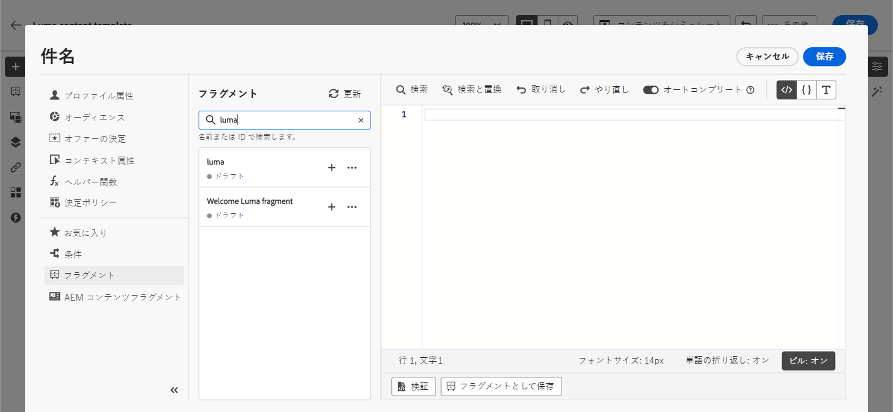

# 式フラグメントを活用 {#use-expression-fragments}

**パーソナライゼーションエディター**&#x200B;を使用すると、現在のサンドボックスに作成または保存されたすべての式フラグメントを活用できます。

フラグメントを作成および管理する方法については、[この節](../content-management/fragments.md)を参照してください。

➡️ [フラグメントの管理、作成、使用方法については、このビデオをご覧ください](../content-management/fragments.md#video-fragments)

## 式フラグメントの使用 {#use-expression-fragment}

コンテンツに式フラグメントを追加するには、次の手順に従います。

1. [パーソナライゼーションエディター](personalization-build-expressions.md)を開き、左側のパネルで「**[!UICONTROL フラグメント]**」ボタンを選択します。

   

   リストには、現在のサンドボックスで作成またはフラグメントとして保存されたすべての式フラグメントが表示されます。[詳細情報](../content-management/fragments.md#create-expression-fragment)

   >[!NOTE]
   >
   >フラグメントは作成日で並べ替えられます。最近追加した式フラグメントがリストの最初に表示されます。

1. また、リストを更新することもできます。

   >[!NOTE]
   >
   >コンテンツの編集中に一部のフラグメントが変更または追加された場合、リストは最新の変更内容で更新されます。

1. 式フラグメントの横にある「+」アイコンをクリックして、対応するフラグメント ID をエディターに挿入します。

   

   フラグメント ID を追加したら、対応する式フラグメントを開いてインターフェイスから[編集](../content-management/fragments.md#edit-fragments)すると、変更が同期されます。これらは、そのフラグメント ID を含むすべての&#x200B;**[!UICONTROL ドラフト]**&#x200B;ジャーニー／キャンペーンに自動的に生成されます。

   >[!NOTE]
   >
   >変更内容は、**[!UICONTROL ライブ]**&#x200B;ジャーニーやキャンペーンで使用されるコンテンツには生成されません。

1. フラグメントの横にある「**[!UICONTROL その他のアクション]**」ボタンをクリックします。

1. 開いたコンテキストメニューから「**[!UICONTROL フラグメントを表示]**」を選択すると、そのフラグメントに関する詳細情報が表示されます。また、**[!UICONTROL フラグメント ID]** も表示され、ここからコピーできます。

   

1. コンテキストメニューの「**[!UICONTROL フラグメントを開く]**」オプションを使用するか、**[!UICONTROL フラグメント情報]**&#x200B;パネルから式フラグメントを別のウィンドウで開き、そのコンテンツとプロパティを編集できます。[詳しくは、フラグメントの編集方法を参照してください](../content-management/fragments.md#edit-fragments)

   

1. その後、[パーソナライゼーションエディター](personalization-build-expressions.md)のパーソナライズ機能とオーサリング機能をすべて使用して、通常どおりコンテンツをカスタマイズして検証できます。

>[!NOTE]
>
>複数の改行を含む式フラグメントを作成し、[SMS](../sms/create-sms.md#sms-content) または[プッシュ](../push/design-push.md)コンテンツで使用する場合、改行は保持されます。したがって、[SMS](../sms/send-sms.md) または[プッシュ](../push/send-push.md)メッセージを送信する前に必ずテストしてください。

## 継承を解除 {#break-inheritance}

パーソナライゼーションエディターにフラグメント ID を追加すると、元の式フラグメントに行った変更が同期されます。

ただし、式フラグメントのコンテンツをエディターにペーストすることもできます。コンテキストメニューから「**[!UICONTROL フラグメントをペースト]**」を選択して、そのコンテンツを挿入します。

その場合、元のフラグメントからの継承は壊れます。フラグメントのコンテンツはエディターにコピーされ、変更内容は同期されなくなります。

これは、元のフラグメントにリンクされなくなったスタンドアロン要素になります。コード内の他の要素として編集できます。

