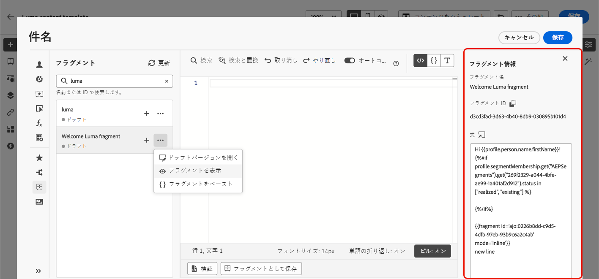
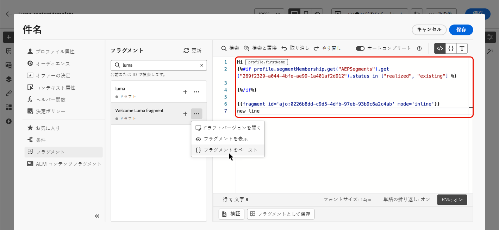

# 式フラグメントの活用 {#use-expression-fragments}

式エディターを使用する場合、作成または現在のサンドボックスに保存されたすべての式フラグメントを活用できます。

でフラグメントを作成および管理する方法について説明します。 [この節](../content-management/fragments.md).

➡️ [フラグメントの管理、作成、使用方法については、このビデオをご覧ください](../content-management/fragments.md#video-fragments)

## 式フラグメントを使用 {#use-expression-fragment}

式フラグメントをコンテンツに追加するには、次の手順に従います。

1. を開きます。 [式エディター](personalization-build-expressions.md) をクリックし、 **[!UICONTROL フラグメント]** ボタンをクリックします。

   

   リストには、現在のサンドボックスでフラグメントとして作成または保存されたすべての式フラグメントが表示されます。 [詳細情報](../content-management/fragments.md#create-expression-fragment)

   >[!NOTE]
   >
   >フラグメントは作成日順で並べ替えられます。最近追加した式フラグメントがリストの最初に表示されます。

1. また、リストを更新することもできます。

   >[!NOTE]
   >
   >コンテンツの編集中に一部のフラグメントが変更または追加された場合、リストは最新の変更内容で更新されます。

1. 式フラグメントの横にある+アイコンをクリックして、対応するフラグメント ID をエディターに挿入します。

   

   フラグメント ID が追加されたら、対応する式フラグメントを開き、 [編集する](../content-management/fragments.md#edit-fragments) インターフェイスから、変更が同期されます。 自動的にすべての **[!UICONTROL ドラフト]** そのフラグメント ID を含むジャーニー/キャンペーン。

   >[!NOTE]
   >
   >変更内容は、 **[!UICONTROL ライブ]** ジャーニーまたはキャンペーン。

1. 次をクリック： **[!UICONTROL その他のアクション]** ボタンをクリックします。

1. 表示されるコンテキストメニューから、「 」を選択します。 **[!UICONTROL フラグメントを表示]** をクリックして、そのフラグメントに関する詳細情報を取得します。 The **[!UICONTROL フラグメント ID]** はも表示され、ここからコピーできます。

   

1. 式フラグメントを別のウィンドウで開き、そのコンテンツやプロパティを編集できます。その場合は、 **[!UICONTROL フラグメントを開く]** 」オプションを使用します。 **[!UICONTROL フラグメント情報]** ウィンドウ [フラグメントの編集方法を学ぶ](../content-management/fragments.md#edit-fragments)

   

1. その後、 [式エディター](personalization-build-expressions.md).

>[!NOTE]
>
>複数の改行を含む式フラグメントを作成し、 [SMS](../sms/create-sms.md#sms-content) または [プッシュ](../push/design-push.md) コンテンツを指定した場合、改行は保持されます。 したがって、必ず [SMS](../sms/send-sms.md) または [プッシュ](../push/send-push.md) メッセージを送信する前に送信します。

## 継承を解除 {#break-inheritance}

フラグメント ID を式エディターに追加すると、元の式フラグメントに加えた変更が同期されます。

ただし、式フラグメントのコンテンツをエディターに貼り付けることもできます。 コンテキストメニューで、「 」を選択します。 **[!UICONTROL フラグメントを貼り付け]** をクリックして、そのコンテンツを挿入します。

その場合、元のフラグメントからの継承は壊れます。 フラグメントのコンテンツがエディターにコピーされ、変更は同期されなくなります。

これは、元のフラグメントにリンクされなくなったスタンドアロン要素になります。コード内の他の要素として編集できます。

