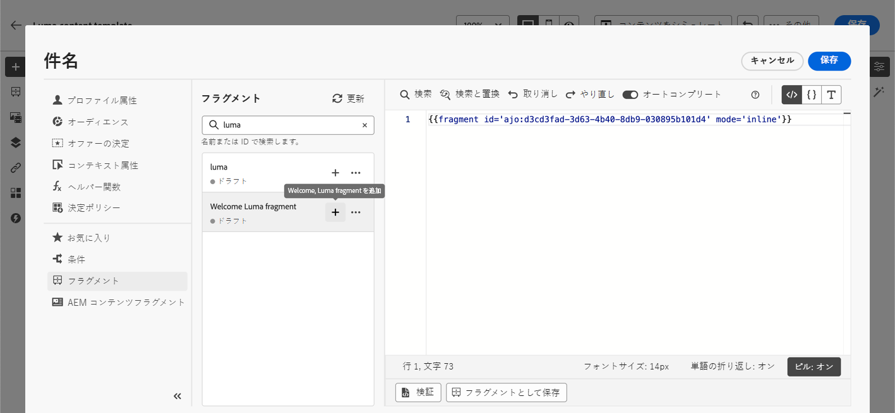
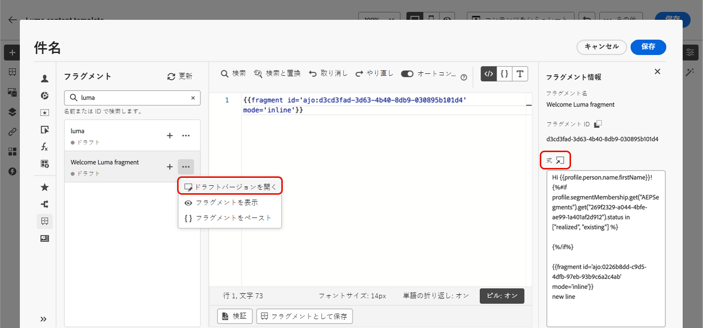

# 式フラグメントを活用 {#use-expression-fragments}

**パーソナライゼーションエディター**&#x200B;を使用すると、現在のサンドボックスに作成または保存されたすべての式フラグメントを活用できます。

フラグメントは、全体で参照できる再利用可能なコンポーネントです [!DNL Journey Optimizer] キャンペーンとジャーニー。 この機能を使用すると、マーケティングユーザーが改善されたデザインプロセスでコンテンツをすばやく組み立てるために使用できる複数のカスタムコンテンツブロックを事前に作成できます。 [フラグメントの作成および管理方法について学ぶ](../content-management/fragments.md).

➡️ [フラグメントの管理、作成、使用方法については、このビデオをご覧ください](../content-management/fragments.md#video-fragments)

## 式フラグメントの使用 {#use-expression-fragment}

コンテンツに式フラグメントを追加するには、次の手順に従います。

>[!NOTE]
>
>特定の配信には、最大 30 個のフラグメントを追加できます。 フラグメントをネストできるのは 1 レベルまでです。

1. [パーソナライゼーションエディター](personalization-build-expressions.md)を開き、左側のパネルで「**[!UICONTROL フラグメント]**」ボタンを選択します。

   リストには、現在のサンドボックスで作成またはフラグメントとして保存されたすべての式フラグメントが表示されます。作成日で並べ替えられ、最近追加された式のフラグメントがリストの最初に表示されます。 [詳細情報](../content-management/fragments.md#create-expression-fragment)

   

   また、このリストを更新することもできます。

   >[!NOTE]
   >
   >コンテンツの編集中に一部のフラグメントが変更または追加された場合、リストは最新の変更内容で更新されます。

1. 式フラグメントの横にある「+」アイコンをクリックして、対応するフラグメント ID をエディターに挿入します。

   

   >[!CAUTION]
   >
   >次のいずれかを追加できます **ドラフト** または **ライブ** コンテンツにフラグメント化します。 ただし、ドラフト ステータスのフラグメントを使用している場合は、ジャーニーまたはキャンペーンをアクティブ化できません。 ジャーニーまたはキャンペーンの公開時に、ドラフトフラグメントにエラーが表示されます。公開するには、ドラフトフラグメントを承認する必要があります。

1. フラグメント ID を追加したら、対応する式フラグメントを開いてインターフェイスから[編集](../content-management/fragments.md#edit-fragments)すると、変更が同期されます。これらは、そのフラグメント ID を含むすべてのドラフトまたはライブジャーニー/キャンペーンに自動的に生成されます。

1. 「」をクリックします **[!UICONTROL その他のアクション]** ボタンがフラグメントの隣に表示されます。 開いたコンテキストメニューから「**[!UICONTROL フラグメントを表示]**」を選択すると、そのフラグメントに関する詳細情報が表示されます。また、**[!UICONTROL フラグメント ID]** も表示され、ここからコピーできます。

   

1. コンテキストメニューの「**[!UICONTROL フラグメントを開く]**」オプションを使用するか、**[!UICONTROL フラグメント情報]**&#x200B;パネルから式フラグメントを別のウィンドウで開き、そのコンテンツとプロパティを編集できます。[詳しくは、フラグメントの編集方法を参照してください](../content-management/fragments.md#edit-fragments)

   

1. その後、[パーソナライゼーションエディター](personalization-build-expressions.md)のパーソナライズ機能とオーサリング機能をすべて使用して、通常どおりコンテンツをカスタマイズして検証できます。

>[!NOTE]
>
>複数の改行を含む式フラグメントを作成し、[SMS](../sms/create-sms.md#sms-content) または[プッシュ](../push/design-push.md)コンテンツで使用する場合、改行は保持されます。したがって、[SMS](../sms/send-sms.md) または[プッシュ](../push/send-push.md)メッセージを送信する前に必ずテストしてください。

## 編集可能フィールドのカスタマイズ {#customize-fields}

式フラグメントの特定の部分が変数を使用して編集可能になっている場合は、特定の構文を使用してデフォルト値を上書きできます。 [フラグメントをカスタマイズ可能にする方法を学ぶ](../content-management/customizable-fragments.md)

フィールドをカスタマイズするには、次の手順に従います。

1. からコードにフラグメントを挿入します。 **フラグメント** メニュー。

1. の使用 `<fieldId>="<value>"` 変数のデフォルト値を上書きする構文の最後にあるコードです。

   次の例では、ID が「sports」である変数の値を「yoga」値で上書きしています。 これにより、「sport」変数が参照されているすべてのフラグメントコンテンツに「yoga」が表示されます。

   

メールの作成時に編集可能なフィールドを式フラグメントに追加し、その値を上書きする方法を示す例は、で入手できます。 [この節](../content-management/customizable-fragments.md#example).

## 継承を解除 {#break-inheritance}

パーソナライゼーションエディターにフラグメント ID を追加すると、元の式フラグメントに行った変更が同期されます。

ただし、式フラグメントのコンテンツをエディターにペーストすることもできます。コンテキストメニューから「**[!UICONTROL フラグメントをペースト]**」を選択して、そのコンテンツを挿入します。

その場合、元のフラグメントからの継承は壊れます。フラグメントのコンテンツはエディターにコピーされ、変更内容は同期されなくなります。

これは、元のフラグメントにリンクされなくなったスタンドアロン要素になります。コード内の他の要素として編集できます。

