# メッセージのプレビューとテスト{#preview-and-proof}

メッセージの内容が定義されたら、テストプロファイルを使用してプレビューを行い、テストを行うことができます。 [パーソナライズされたコンテンツ](personalization/personalize.md)を挿入すると、テストプロファイルデータを活用して、このコンテンツがメッセージにどのように表示されるかを確認できます。

電子メールコンテンツまたはパーソナライゼーション設定で発生する可能性のあるエラーを検出するには、配達確認をテストプロファイルに送信します。 最新のコンテンツを検証するには、変更が行われるたびに配達確認を送信する必要があります。

>[!CAUTION]
>
>メッセージのプレビューや配達確認の送信を行うには、テストプロファイルを使用可能にする必要があります。 [詳細情報](building-journeys/testing-the-journey.md#create-test-profile).

メッセージの内容をテストするには、次の操作が必要です。

* [テストプロファイルの選択](#select-test-profiles)
* [メッセージプレビューの確認](#preview-your-messages)

その後、[配達確認](#send-proofs)をテストプロファイルに送信できます。

さらに、**Litmus**&#x200B;アカウントを[!DNL Journey Optimizer]に活用して、**電子メールレンダリング**&#x200B;を人気のある電子メールクライアントに即座にプレビューします。 その後、電子メールのコンテンツが適切に表示され、すべてのインボックスで正しく機能することを確認できます。 [このセクション](#email-rendering)でLitmus Emailプレビューのロックを解除する方法を説明します。

## テストプロファイルを選択{#select-test-profiles}

テストプロファイル：定義されたターゲット条件に一致しない追加の受信者をターゲットにできます。

テストプロファイルを選択するには、次の手順に従います。

1. メッセージインターフェイスまたは電子メールデザイナーで、**[!UICONTROL プレビュー]**&#x200B;ボタンをクリックして、テストプロファイルの選択にアクセスします。

   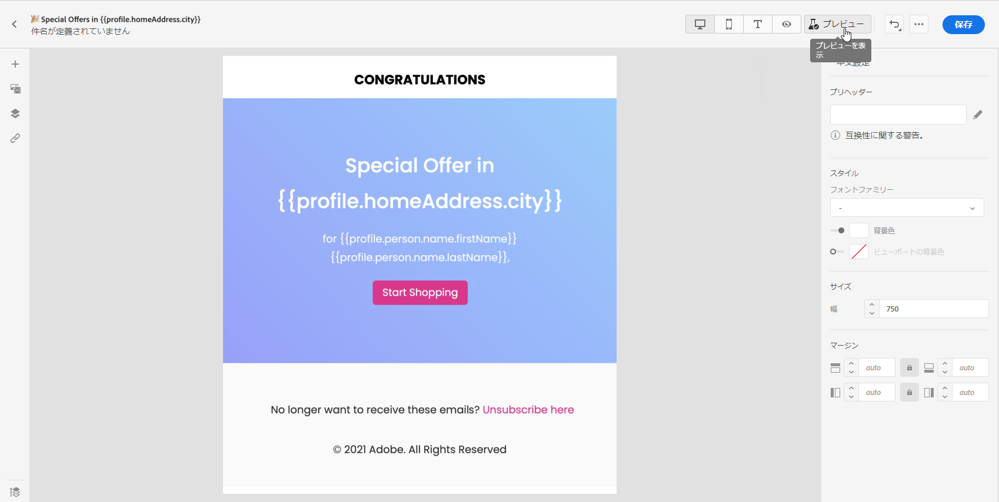

1. **[!UICONTROL ID名前空間]**&#x200B;の選択アイコンをクリックして、テストプロファイルの識別に使用する名前空間を選択します。

   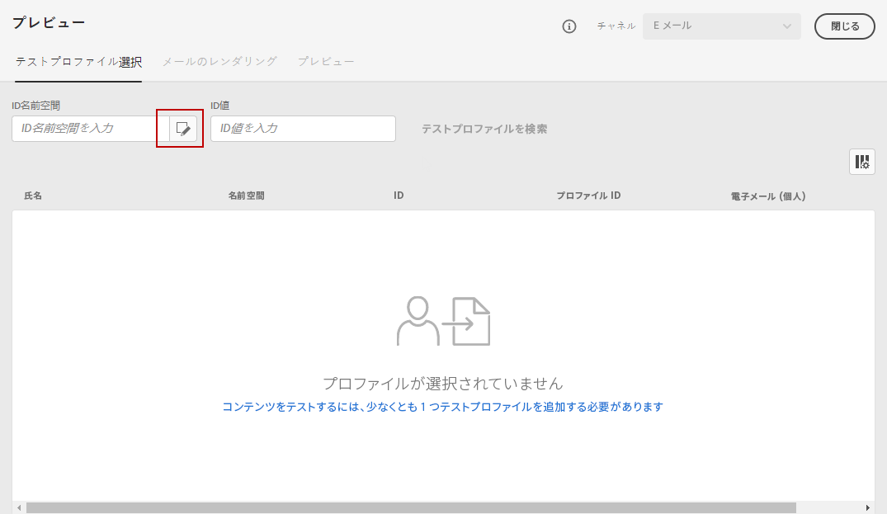

   Adobe Experience PlatformのID名前空間[について詳しくは、この節](https://experienceleague.adobe.com/docs/experience-platform/identity/namespaces.html?lang=en#getting-started)を参照してください。

   次の例では、**電子メール**&#x200B;名前空間を使用します。

1. 検索フィールドを使用して名前空間を探し、選択して&#x200B;**[!UICONTROL 「]**&#x200B;を選択」をクリックします

   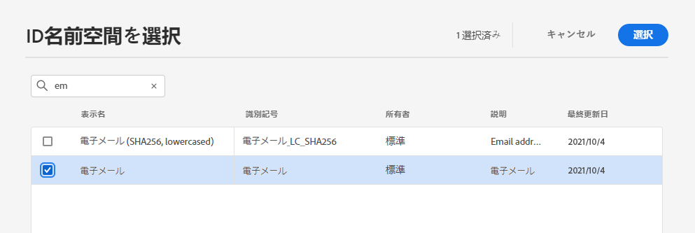

1. テストプロファイルを識別する値を入力し、「**[!UICONTROL テストプロファイルを検索]**」をクリックします。

   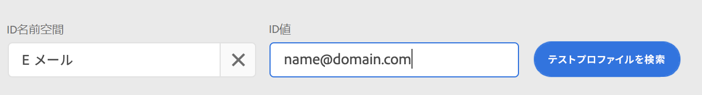

1. メッセージにパーソナライゼーションを追加した場合は、他のプロファイルを追加して、プロファイルデータに応じて異なるバリエーションのメッセージをテストできるようにします。 追加したプロファイルは、選択フィールドの下に表示されます。

   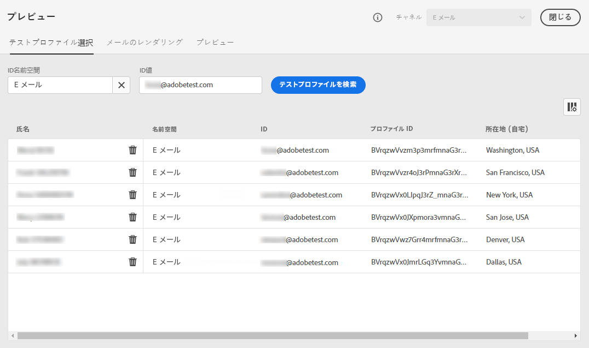

   このリストは、メッセージのパーソナライゼーション要素に基づいて、各テストプロファイルのデータを関連列に表示します。

## プレビューメッセージ{#preview-your-messages}

[テストプロファイル](#select-test-profiles)を選択すると、メッセージにプレビューして内容を確認できます。

1. 「**[!UICONTROL プレビュー]**」タブをクリックして、メッセージをテストします。

1. テストプロファイルを選択します。 列内の値を確認できます。 右向き/左向きの矢印を使用して、データを参照します。

   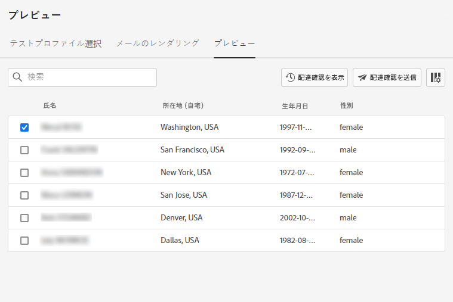

1. 列を追加または削除するには、リストの上にある&#x200B;**[!UICONTROL データ]**&#x200B;を選択アイコンをクリックします。

   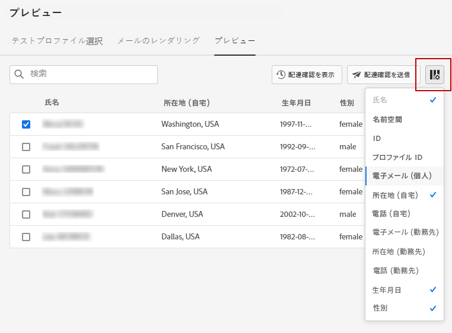

   現在のメッセージに固有のパーソナライゼーションフィールドをリストの最後に表示できます。 この例では、プロファイルの市区町村、名、姓を使用します。 これらのフィールドを選択し、テストプロファイルにこれらの値が入力されていることを確認します。

1. メッセージプレビューでは、パーソナライズされた要素が、選択したテストプロファイルデータに置き換えられます。

   例えば、次のメッセージの場合、電子メールのコンテンツと電子メールの件名の両方がパーソナライズされます。

   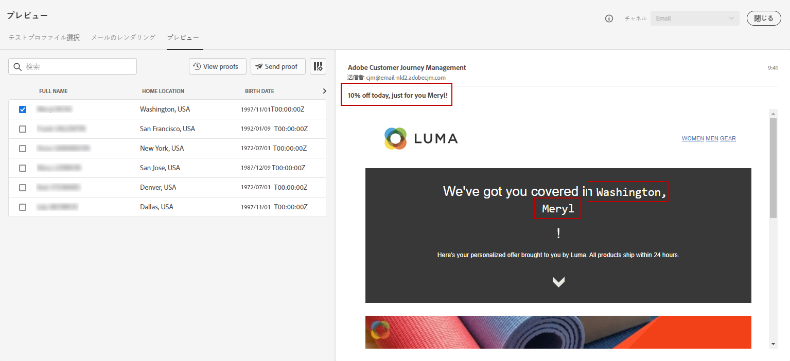

1. メッセージの各バリアントに対して電子メールのレンダリングをプレビューするには、他のテストプロファイルを選択します。

プッシュ通知プレビューの場合：

1. **[!UICONTROL プレビュー]**&#x200B;画面の左上にある&#x200B;**[!UICONTROL チャネル]**&#x200B;ドロップダウンリストから&#x200B;**[!UICONTROL プッシュ]**&#x200B;チャネルに切り替えます。

   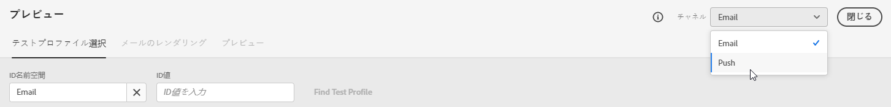

1. 上記と同じ手順を適用してテストプロファイルを選択し、プレビューコンテンツに対するデバイスのタイプを選択します。**[!UICONTROL iOS]**&#x200B;または&#x200B;**[!UICONTROL Android]**

   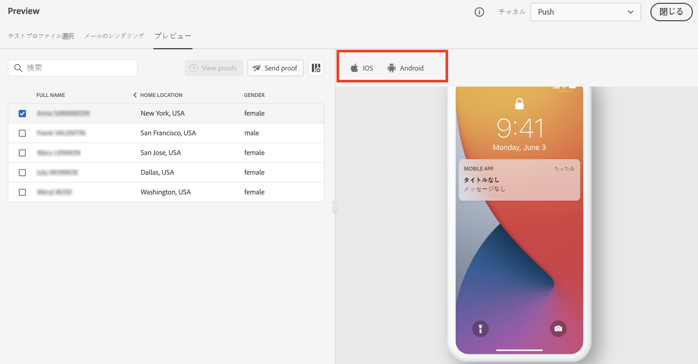

1. プッシュプレビューでは、テストプロファイルデータがメッセージコンテンツで利用されます。

   例えば、このプッシュ通知の場合、タイトルと本文の両方がパーソナライズされます。

   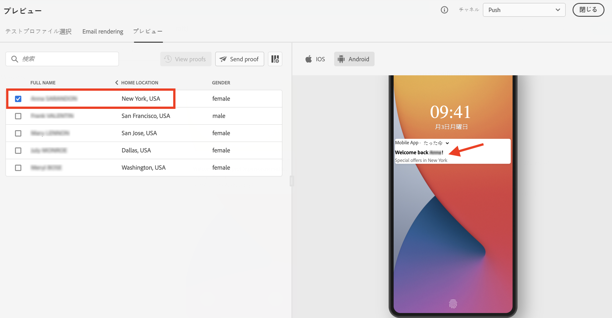

## 配達確認を送信{#send-proofs}

配達確認とは、メインオーディエンスに送信する前にメッセージをテストできる特定のメッセージです。 配達確認の受信者は、メッセージの承認を担当します。レンダリング，コンテンツ，パーソナライゼーション設定，設定

[テストプロファイル](#select-test-profiles)を選択すると、配達確認を送信できます。

1. **[!UICONTROL プレビュー]**&#x200B;画面で、「**[!UICONTROL 配達確認を送信]**」ボタンをクリックします。

   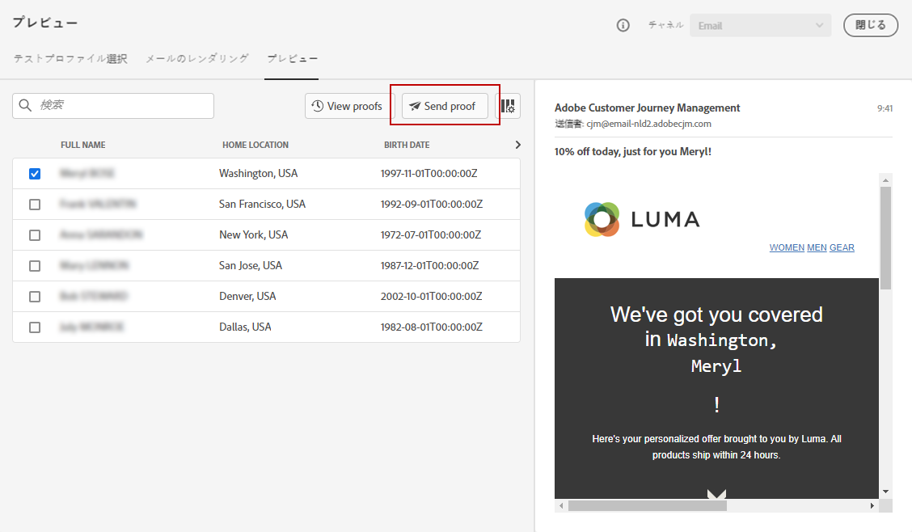

1. 配達確認を受け取るテストプロファイルを選択し、「**[!UICONTROL 配達確認を送信]**」をクリックします。 必要に応じて、配達確認の件名行に接頭辞を追加できます。

   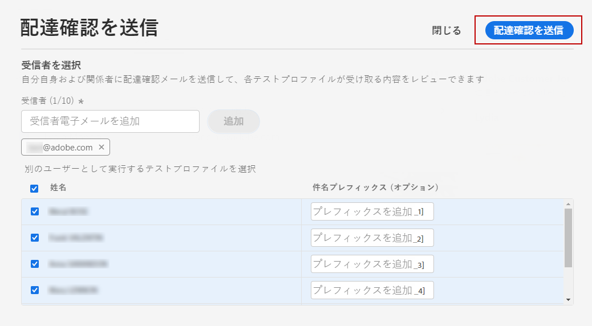

1. **[!UICONTROL プレビュー]**&#x200B;画面に戻り、**[!UICONTROL 表示配達確認]**&#x200B;ボタンをクリックしてステータスを確認します。

   

メッセージの内容を変更した後、配達確認を送信する必要があります。

## E メールのレンダリング{#email-rendering}

**Litmus**&#x200B;アカウントを[!DNL Journey Optimizer]に活用して、人気のある電子メールクライアントで&#x200B;**電子メールレンダリング**&#x200B;を即座にプレビューできます。

電子メールレンダリング機能にアクセスするには、次の操作が必要です。

* Litmusアカウントを持っている
* [テストプロファイルの選択](#select-test-profiles)

次の手順に従います。

1. 電子メールデザイナで、「**[!UICONTROL プレビュー]**」ボタンをクリックし、「**[!UICONTROL 電子メールレンダリング]**」タブを選択します。

1. 右上のセクションで、**Litmusアカウントを接続**&#x200B;をクリックします。

   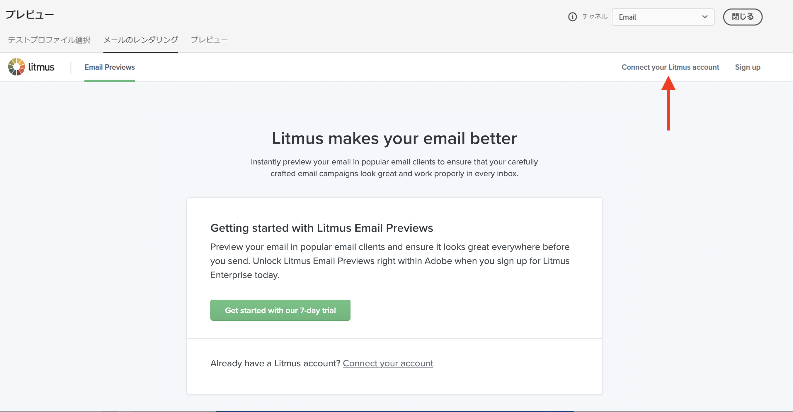

1. 資格情報を入力し、サインインします。

   

1. 「**テストを実行**」ボタンをクリックして電子メールプレビューを生成します。

1. 人気の高いデスクトップ、モバイル、Webベースのクライアントで電子メールの内容を確認します。

   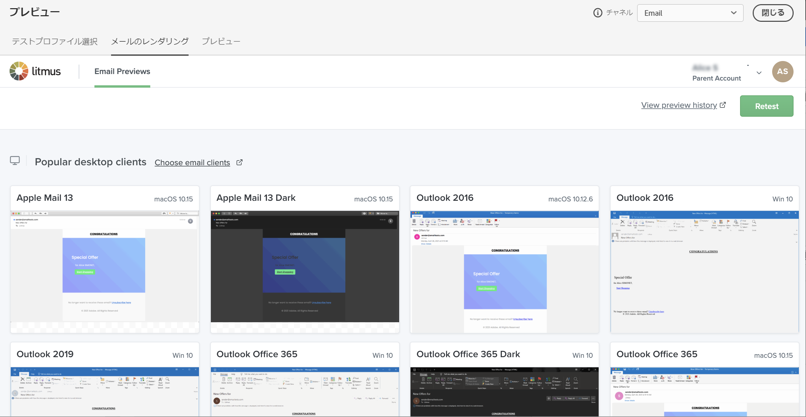

>[!CAUTION]
>
>**Litmus**&#x200B;アカウントを[!DNL Journey Optimizer]に接続する際は、テストメッセージがLitmusに送信されることに同意する必要があります。一度送信すると、これらの電子メールはAdobeで管理されなくなります。 その結果、Litmusデータ保持電子メールポリシーは、これらのテストメッセージに含まれる可能性のあるパーソナライズデータを含む、これらの電子メールに適用されます。

