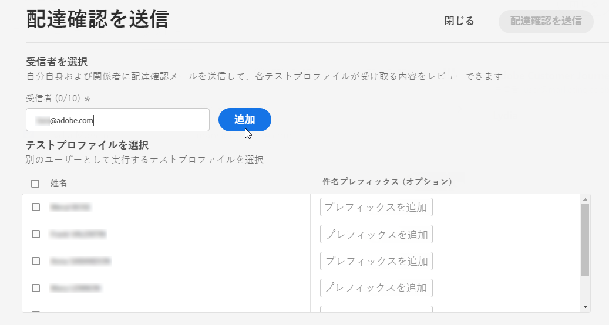

# メッセージのプレビューとテスト{#preview-and-proof}

メッセージコンテンツを定義したら、テストプロファイルを使用してプレビューとテストをおこなうことができます。[パーソナライズされたコンテンツ](personalization/personalize.md)を挿入している場合は、テストプロファイルデータを利用して、その内容がメッセージにどのように表示されるかを確認できます。

メールのコンテンツやパーソナライズ機能の設定で発生し得るエラーを検出するには、配達確認をテストプロファイルに送信します。変更を加えるたびに配達確認を送信して、最新のコンテンツを確認します。

>[!CAUTION]
>
>メッセージのプレビューや配達確認の送信を行うには、テストプロファイルを使用可能にしておく必要があります。
>
>テストプロファイルの作成方法については、[このページ](building-journeys/creating-test-profiles.md)を参照してください。

メッセージコンテンツをテストするには、次の操作が必要です。

* [テストプロファイルの選択](#select-test-profiles)
* [メッセージのプレビューの確認](#preview-your-messages)

その後、テストプロファイルに[配達確認を送信](#send-proofs)できるようになります。

さらに、**Litmus** アカウントを [!DNL Journey Optimizer] に活用すると、よく使うメールクライアントで、**メールのレンダリング**&#x200B;を即座にプレビューすることができます。すべてのインボックスでメールコンテンツが適切に表示され、正しく機能することを確認できます。Litmus メールプレビューのロックを解除する方法については、[この節](#email-rendering)を参照してください。

>[!CAUTION]
>
>メッセージをプレビューしたり、配達確認を送信したりすると、プロファイルのパーソナライゼーションデータのみが表示されます。 イベント情報などのコンテキストデータに基づくパーソナライゼーションは、ジャーニーのコンテキストでのみテストできます。 [このユースケース](personalization/personalization-use-case.md)でのパーソナライゼーションのテスト方法を説明します。

➡️ [メールのプレビュー、配達確認および公開の方法については、このビデオを参照](#video-preview)

## テストプロファイルの選択{#select-test-profiles}

>[!CONTEXTUALHELP]
>id="ac_preview_testprofiles"
>title="メッセージのプレビューとテスト"
>abstract="メッセージコンテンツを定義したら、テストプロファイルを使用してプレビューとテストを行うことができます。"
>additional-url="https://experienceleague.adobe.com/docs/journey-optimizer/using/create-messages/create-message/preview.html?lang=ja#email-rendering" text="メールのレンダリング"
>additional-url="https://experienceleague.adobe.com/docs/journey-optimizer/using/create-messages/create-message/preview.html?lang=ja#preview-your-messages" text="プレビュー"

[テストプロファイル](building-journeys/creating-test-profiles.md)を使用すると、定義したターゲティング条件に一致しない、追加の受信者をターゲットに設定できます。

テストプロファイルを選択する手順は、次のとおりです。

1. メッセージインターフェイスまたはメールデザイナーで「**[!UICONTROL プレビューを表示]**」ボタンをクリックして、テストプロファイルの選択にアクセスします。

   

1. テストプロファイルの識別に使用する名前空間を選択するには、**[!UICONTROL ID 名前空間]**&#x200B;の選択アイコンをクリックします。

   

   Adobe Experience Platform の ID 名前空間については、[この節](get-started-identity.md){target=&quot;_blank&quot;}を参照してください。

   以下の例では、**メール**&#x200B;名前空間を使用します。

1. 検索フィールドで名前空間を探して選択し、「**[!UICONTROL 選択]**」をクリックします。

   

1. テストプロファイルを識別する値を入力し、「**[!UICONTROL テストプロファイルを検索]**」をクリックします。

   

1. メッセージにパーソナライゼーションを追加した場合は、別のプロファイルを追加して、プロファイルデータに応じて異なるバリエーションのメッセージをテストできるようにします。追加したプロファイルは、選択フィールドの下に表示されます。

   

   メッセージのパーソナライゼーションの要素に基づいて、各テストプロファイルのデータがリストの関連する列に表示されます。

## メッセージのプレビュー{#preview-your-messages}

[テストプロファイル](#select-test-profiles)を選択すると、メッセージをプレビューしてコンテンツを確認できます。

1. 「**[!UICONTROL プレビュー]**」タブをクリックして、メッセージをテストします。

1. テストプロファイルを選択します。列内で利用可能な値を確認できます。右向きや左向きの矢印を使用して、データを参照します。

   

1. 列を追加または削除するには、リストの上にある「**[!UICONTROL データを選択]**」アイコンをクリックします。

   

   リストの最後に、現在のメッセージに固有のパーソナライゼーションフィールドを表示できます。この例では、プロファイルの市区町村、姓、名を使用しています。これらのフィールドを選択し、テストプロファイルにこれらの値が入力されていることを確認します。

1. メッセージプレビューでは、パーソナライズされた要素が、選択したテストプロファイルデータに置き換えられます。

   例えば、次のメッセージの場合、メールのコンテンツと件名の両方がパーソナライズされています。

   

1. メッセージの各バリエーションに対してメールのレンダリングをプレビューするには、別のテストプロファイルを選択します。

プッシュ通知のプレビューの場合：

1. **[!UICONTROL プレビュー]**&#x200B;画面の右上にある「**[!UICONTROL チャネル]**」ドロップダウンリストから選択して、「**[!UICONTROL プッシュ]**」チャネルに切り替えます。

   

1. 前述と同じ手順を適用してテストプロファイルを選択し、コンテンツをプレビューするデバイスのタイプを選択します。 **[!UICONTROL iOS]** または **[!UICONTROL Android]**.

   

1. プッシュのプレビューでは、テストプロファイルデータをメッセージコンテンツに使用します。

   例えば、次のプッシュ通知の場合、タイトルと本文の両方がパーソナライズされます。

   

## 配達確認の送信 {#send-proofs}

配達確認は、メッセージをメインオーディエンスに送信する前にテストできる、特定のメッセージです。配達確認の受信者は、メッセージのレンダリング、コンテンツ、パーソナライゼーションの設定、構成などを確認します。

[テストプロファイル](#select-test-profiles)を選択すると、配達確認を送信できるようになります。

1. **[!UICONTROL プレビュー]**&#x200B;画面で、「**[!UICONTROL 配達確認を送信]**」ボタンをクリックします。

   

1. **[!UICONTROL 配達確認を送信]**&#x200B;ウィンドウで、受信者のメールアドレスを入力し、「**[!UICONTROL 追加]**」をクリックして、自分自身または組織のメンバーに配達確認を送信します。

   なお、配達確認配信には、最大 10 人の受信者を追加できます。

   

1. 次に、メッセージコンテンツのパーソナライズに使用される&#x200B;**テストプロファイル**&#x200B;を選択します。

   配達確認の各受信者は、選択したテストプロファイルと同じ数のメッセージを受信します。例えば、受信者のメールを 5 件追加し、10 個のテストプロファイルを選択した場合は、50 件の配達確認メッセージを送信することになり、各受信者はそのうち 10 件を受信します。

1. 必要に応じて、配達確認の件名行にプレフィックスを追加できます。英数字と特殊文字（例： . - _ ( ) [ ],）のみ、件名行のプレフィックスとして使用できます。

1. 「**[!UICONTROL 配達確認を送信]**」をクリックします。

   

1. **[!UICONTROL プレビュー]**&#x200B;画面に戻り、「**[!UICONTROL 配達確認を表示]**」ボタンをクリックしてステータスを確認します。

   

メッセージコンテンツを変更するたびに、配達確認を送信することをお勧めします。

>[!NOTE]
>
>テストプロファイルに送信される配達確認では、ミラーページへのリンクはアクティブになっていません。 最終的なメッセージでのみアクティブ化されます。

## メールのレンダリング{#email-rendering}

**Litmus** アカウントを [!DNL Journey Optimizer] に使用すると、よく使うメールクライアントで&#x200B;**メールのレンダリング**&#x200B;を即座にプレビューできます。

メールのレンダリング機能にアクセスするには、次が必要です。

* Litmus アカウントを持っていること
* [テストプロファイルの選択](#select-test-profiles)

その後、以下の手順をおこないます。

1. E メールデザイナーで「**[!UICONTROL プレビュー]**」ボタンをクリックし、「**[!UICONTROL メールのレンダリング]**」タブを選択します。

1. 右上のセクションで、「**Litmus アカウントを接続**」をクリックします。

   

1. 資格情報を入力し、ログインします。

   

1. 「**テストを実行**」ボタンをクリックして、メールのプレビューを生成します。

1. よく使うデスクトップ、モバイル、Web ベースのクライアントでメールの内容を確認します。

   

>[!CAUTION]
>
>**Litmus** アカウントを [!DNL Journey Optimizer] に接続する際は、テストメッセージが Litmus に送信されることに同意する必要があります。一度送信すると、これらのメールはアドビでは管理できなくなります。その結果、テストメッセージに含まれる可能性のあるパーソナライゼーションデータも含め、Litmus データ保持メールポリシーがこれらのメールに適用されます。

## ハウツービデオ{#video-preview}

受信ボックス間でメールのレンダリングをテストする方法、パーソナライズされたメールをテストプロファイルに対してプレビューする方法、配達確認を送信する方法およびメールを公開する方法を説明します。

>[!VIDEO](https://video.tv.adobe.com/v/334239?quality=12)
