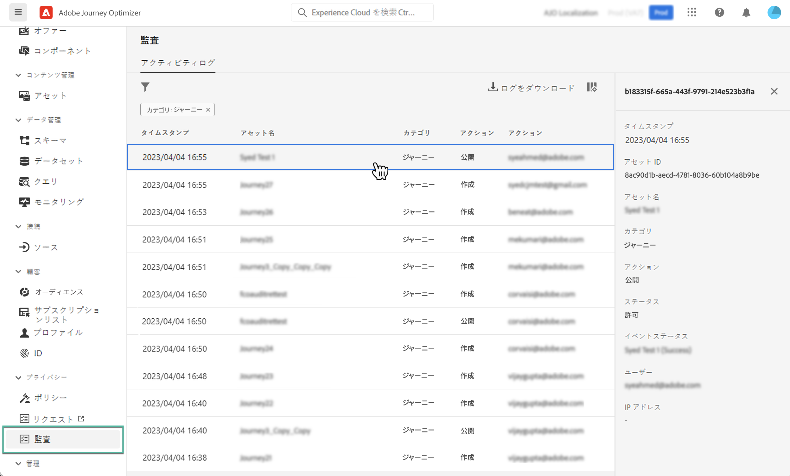

# Journey Optimizer リソースに対する監査アクション {#track-changes}

## 監査ログについて {#audit-logs}

>[!IMPORTANT]
>
>監査ログを表示、書き出しするには、**[!DNL View User Activity Log]** 権限を付与されている必要があります。[詳細情報](../administration/ootb-product-profiles.md)

Journey Optimizer を使用すると、ジャーニー、メッセージ、ランディングページなど、様々なサービスや機能に対してシステム内のユーザーが実行したアクションを識別できます。

これにより、システムで実行されるアクティビティの可視性の向上、問題のトラブルシューティング、ビジネスの規制や企業データ管理ポリシーへの準拠が可能になります。

各アクションは、メタデータと共に、Adobe Experience Platform でアクセス可能な「監査ログ」に記録されます。UI または API での監査ログの表示方法や管理方法など、監査ログについて詳しくは、[Adobe Experience Platform ドキュメント](https://experienceleague.adobe.com/docs/experience-platform/landing/governance-privacy-security/audit-logs/overview.html?lang=ja)を参照してください。

## 監査ログで記録されるイベントタイプ {#events}

次の表に、監査ログで Journey Optimizer リソースが記録されるアクションの概要を示します。

>[!NOTE]
>
>監査ログで記録されるアクションの一覧については、[Adobe Experience Platform ドキュメント](https://experienceleague.adobe.com/docs/experience-platform/landing/governance-privacy-security/audit-logs/overview.html?lang=ja#category)を参照してください。

| リソース | アクション |
|-----------|------------------|
| AJO キャンペーン | 作成／削除／更新／アクティベート／停止 |
| AJO チャネルの一般設定 | 作成／削除／更新 |
| AJO IP プール | 作成／削除／更新 |
| AJO ランディングページ | 作成／削除／更新／公開／非公開 |
| AJO ランディングページ HTML テンプレート | 作成／削除／更新 |
| AJO ランディングページプリセット | 作成／削除／更新 |
| AJO ランディングページサブドメイン | 作成／削除／更新 |
| AJO メッセージプリセット | 作成／削除／更新 |
| AJO PTR レコード | 作成／削除／更新 |
| AJO で保存された式テンプレート | 作成／削除／更新 |
| AJO SMS API 資格情報 | 作成／削除／更新 |
| AJO サブドメイン | 作成／削除／更新 |
| AJO 抑制リスト | CSV の作成／削除／ダウンロード |
| フィールドグループ | 作成／削除／更新 |
| ジャーニー | 作成／削除／更新／停止／公開 |
| ジャーニーのカスタムアクション | 作成／削除／更新 |
| ジャーニーデータソース | 作成／削除／更新 |
| ジャーニーイベント | 作成／削除／更新 |
| メッセージ頻度ルール | 作成／削除／更新 |
| ランキング戦略 | 作成／削除／更新 |
