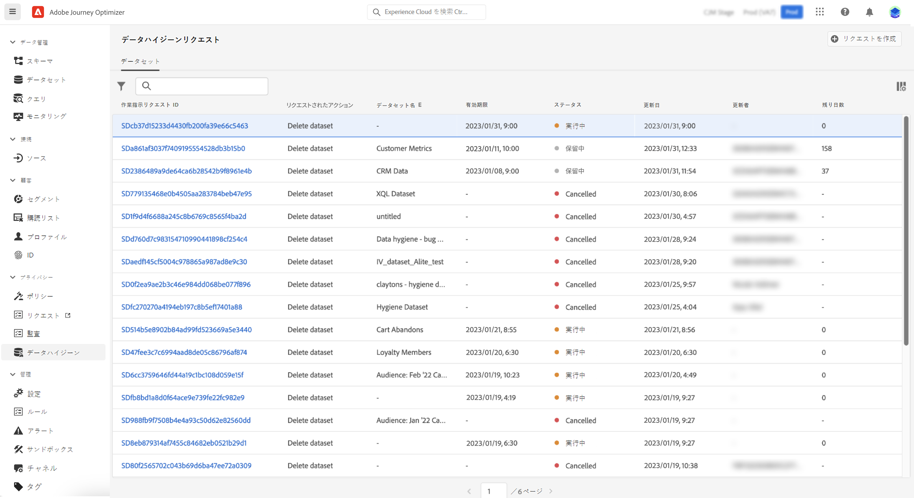

# データライフサイクル操作の実行 {#data-hygiene}

>[!AVAILABILITY]
>
>現在、データライフサイクル機能は、**Healthcare Shield** および **プライバシーとセキュリティシールド** アドオン機能を購入した組織でのみ利用できます。

Adobe Experience Platform にデータが継続的に取り込まれるので、組織のポリシーに従って意図したとおりにデータを使用し、必要に応じて更新し、削除することが重要になります。

これらのタスクは、**[!UICONTROL データライフサイクル]** メニューを使用して実行できます。このメニューでは、データライフサイクルのオペレーションを設定およびスケジュールでき、レコードが適切に維持されるようにします。

Privacy Serviceとデータライフサイクル操作の実行方法について詳しくは、次のAdobe Experience Platform ドキュメントを参照してください。

* [Privacy Service の概要](https://experienceleague.adobe.com/docs/experience-platform/privacy/home.html?lang=ja)
* [Adobe Experience Patform におけるデータライフサイクル ](https://experienceleague.adobe.com/docs/experience-platform/hygiene/home.html?lang=ja)
