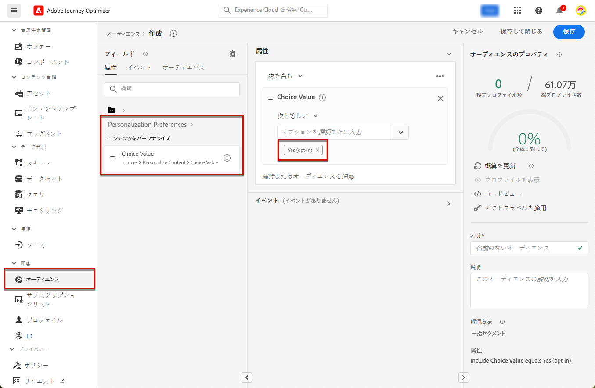
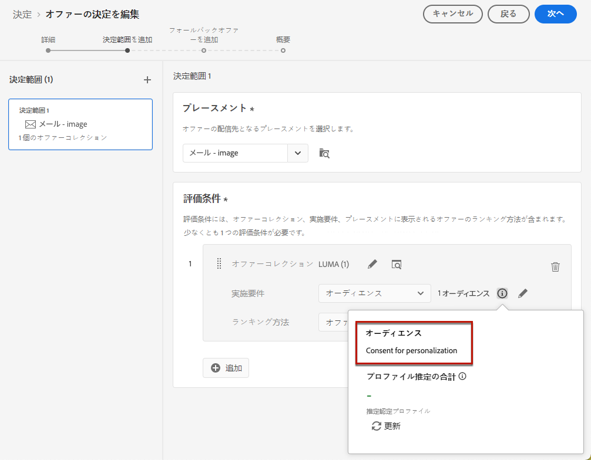
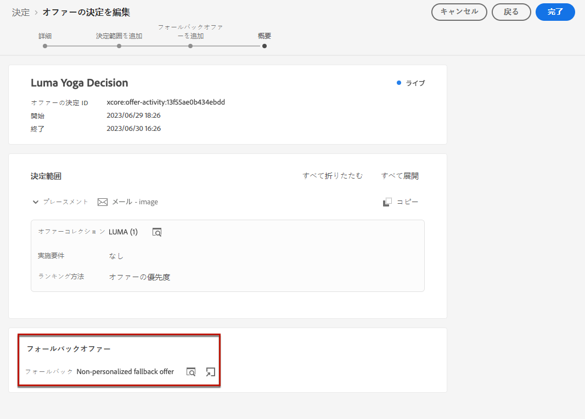
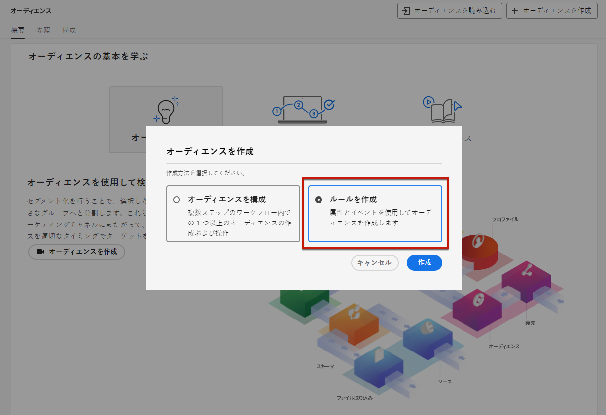
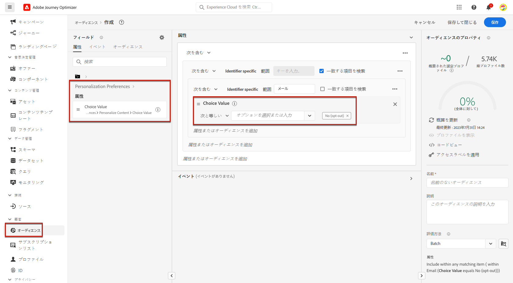
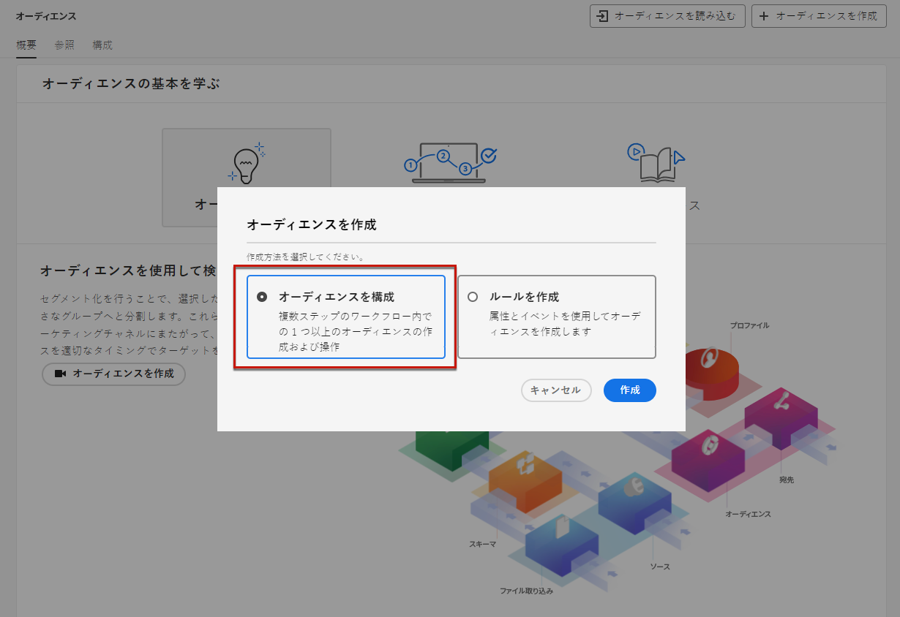
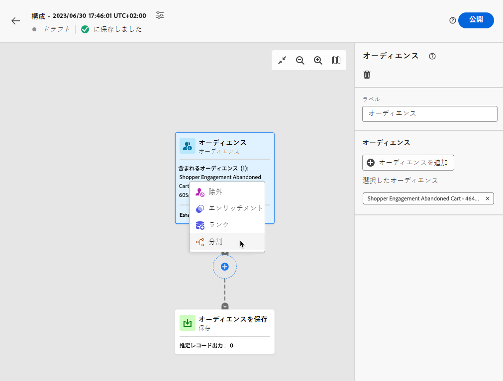
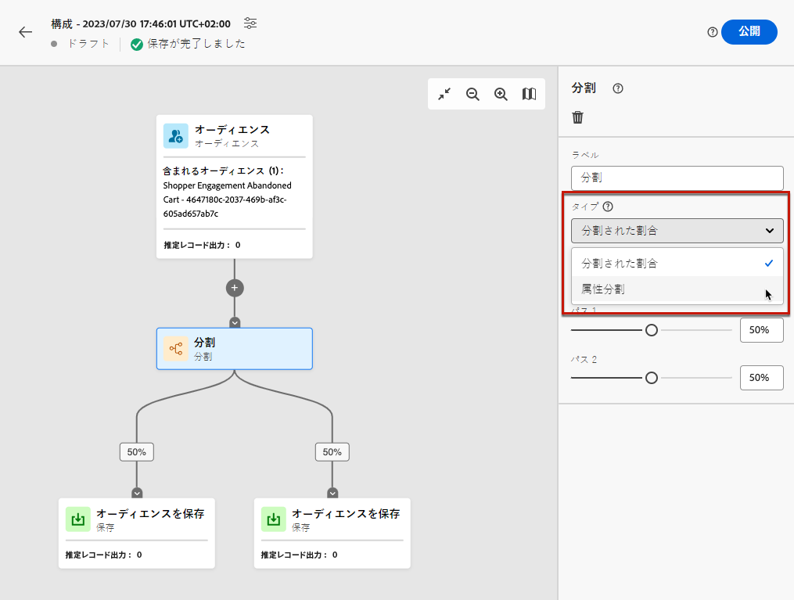
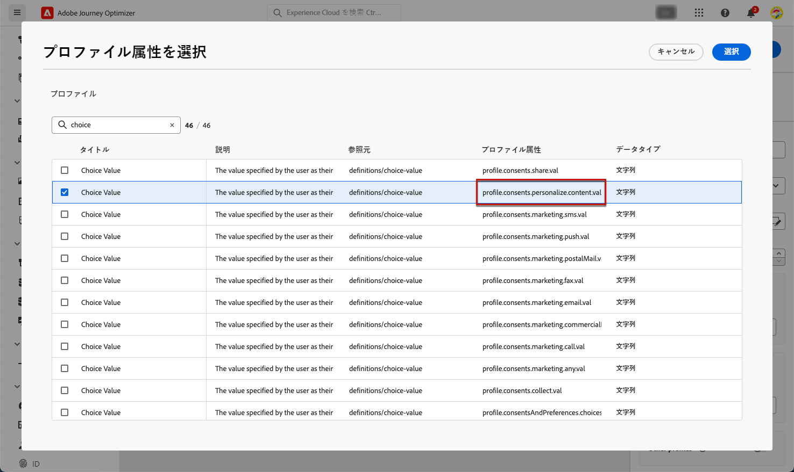
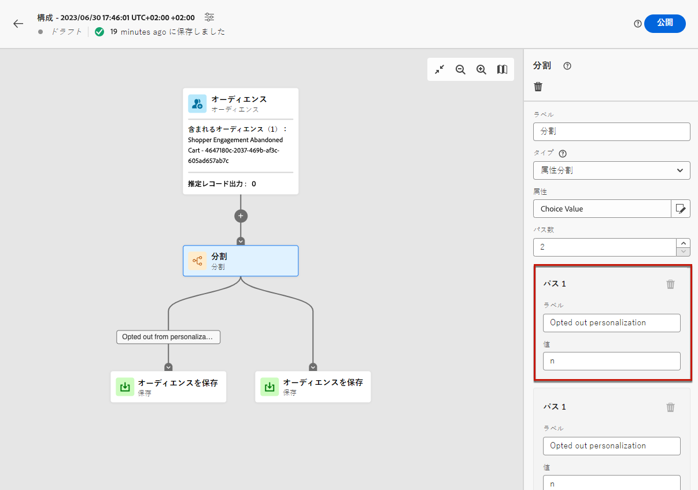

# オプトアウトの管理 {#consent}

ブランドからの連絡を登録解除する機能を受信者に提供することは、法的要件であり、この選択を確実に行うためにも必要です。適用される法律について詳しくは、[Experience Platform ドキュメント](https://experienceleague.adobe.com/docs/experience-platform/privacy/regulations/overview.html?lang=ja#regulations){target="_blank"}を参照してください。

**なぜそれが重要なのでしょうか？**

* これらの規制に準拠できないと、ブランドに法規制上のリスクが生じます。
* この機能を使用すると、未承諾の通信を受信者に送信して、メッセージがスパムと見なされたり、ブランドの評判が損なわれたりする危険性を避けることができます。

## ジャーニーとキャンペーンでの購読解除の管理 {#opt-out-ajo}

ジャーニーやキャンペーンからメッセージを送信する場合は、顧客が今後の通信を登録解除できるようにする必要があります。登録解除すると、プロファイルは、今後のマーケティングメッセージのオーディエンスから自動的に削除されます。

**[!DNL Journey Optimizer]** には、メールと SMS メッセージでオプトアウトを管理する方法が用意されていますが、プッシュ通知では、受信者が自分のデバイスを介して登録解除できるので、顧客側でのアクションは不要です。例えば、アプリのダウンロード時や使用時に、通知の停止を選択できます。同様に、モバイルオペレーティングシステムから通知設定を変更することもできます。

>[!NOTE]
>
>また、Journey Optimizer の **Suppression REST API** を活用すると、抑制リストと許可リストを使用して送信メッセージを制御できます。[Suppression REST API の使用方法を学ぶ](https://developer.adobe.com/journey-optimizer-apis/references/suppression/){target="_blank"}

Journey Optimizer のメールと SMS メッセージでオプトアウトを管理する方法について、以下の節で説明します。

<table style="table-layout:fixed"><tr style="border: 0;">
<td>

<a href="../email/email-opt-out.md"><strong>メールオプトアウトの管理</strong>

</td>
<td>

<a href="../sms/sms-opt-out.md"><strong>SMS オプトアウトの管理</strong></a>

</td>
</tr></table>

>[!NOTE]
>
>[!DNL Journey Optimizer] では、同意は Experience Platform [同意スキーマ](https://experienceleague.adobe.com/docs/experience-platform/xdm/field-groups/profile/consents.html?lang=ja){target="_blank"}で処理されます。デフォルトでは同意フィールドの値は空で、通信内容の受信に同意したものとして扱われます。このデフォルト値はオンボーディングの際に、[こちら](https://experienceleague.adobe.com/docs/experience-platform/xdm/data-types/consents.html?lang=ja#choice-values){target="_blank"}に一覧表示されている値の 1 つに変更できます。

## パーソナライゼーションの同意の実装 {#opt-out-personalization}

顧客は、パーソナライズされたコンテンツの表示をオプトアウトすることもできます。あるプロファイルがパーソナライゼーションからオプトアウトされたら、そのデータがパーソナライゼーションに使用されていないことを確認し、パーソナライズされたコンテンツをフォールバックバリアントに置き換える必要があります。

### 意思決定管理の場合 {#opt-out-decision-management}

オファーを活用する場合、パーソナライゼーション環境設定は、[Decisioning](../offers/api-reference/offer-delivery-api/decisioning-api.md) API リクエストまたは [Edge Decisioning](../offers/api-reference/offer-delivery-api/edge-decisioning-api.md) API リクエストから使用される[決定範囲](../offers/offer-activities/create-offer-activities.md#add-decision-scopes)に自動的に実装されません。この場合、パーソナライゼーションの同意を手動で実施する必要があります。これを行うには、以下の手順に従います。

>[!NOTE]
>
>[!DNL Journey Optimizer] で作成したチャネルで使用される決定範囲は、属するジャーニーまたはキャンペーンからのこの要件を満たします。

1. [セグメント化サービス](https://experienceleague.adobe.com/docs/experience-platform/segmentation/ui/overview.html?lang=ja){target="_blank"}を使用して [Adobe Experience Platform オーディエンス](../audience/access-audiences.md)を作成し、**[!UICONTROL コンテンツをパーソナライズ = はい（オプトイン）]**&#x200B;などのプロファイル属性を使用して、パーソナライゼーションに同意したユーザーをターゲットにします。

   

1. [決定](../offers/offer-activities/create-offer-activities.md)を作成する際は、パーソナライズされたオファーを含む評価条件コレクションごとに、決定範囲を追加し、このオーディエンスに基づいて実施要件の制約を定義します。

   

1. パーソナライズされたコンテンツを含まない[フォールバックオファー](../offers/offer-library/creating-fallback-offers.md)を作成します。

1. パーソナライズされていないフォールバックオファーを決定に[割り当てます](../offers/offer-activities/create-offer-activities.md#add-fallback)。

   

1. [決定のレビューと保存](../offers/offer-activities/create-offer-activities.md#review)を行います。

ユーザーが以下の条件を満たしている場合：

* パーソナライゼーションに同意した場合、決定範囲によってそのプロファイルに最適なオファーが決定されます。

* パーソナライゼーションに同意していない場合、対応するプロファイルは評価条件に含まれるオファーの対象外となるので、パーソナライズされていないフォールバックオファーを受信します。

>[!NOTE]
>
>[データモデリング](../offers/ranking/ai-models.md)でプロファイルデータを使用するための同意は、[!DNL Journey Optimizer] ではまだサポートされていません。

### パーソナライゼーションエディターの場合 {#opt-out-expression-editor}

[パーソナライゼーションエディター](../personalization/personalization-build-expressions.md)自体は、メッセージの配信に関係しないので、同意の確認や実施は行いません。

ただし、権利ベースのアクセス制御ラベルを使用すると、パーソナライゼーションに使用できるフィールドを制限できます。[メッセージプレビュー](../content-management/preview.md)と[メールのレンダリングサービス](../content-management/rendering.md)は、機密情報で識別されるフィールドをマスクします。

>[!NOTE]
>
>オブジェクトレベルのアクセス制御（OLAC）について詳しくは、[この節](../administration/object-based-access.md)を参照してください。

[!DNL Journey Optimizer] キャンペーンでは、同意ポリシーは次のように適用されます。

* オーディエンス作成の一環として同意ポリシー定義を含めることができ、キャンペーン用に選択されたオーディエンスが&#x200B;**同意条件に一致しないプロファイルを既に除外**&#x200B;していることを確認できます。

* [!DNL Journey Optimizer] はチャネルレベルで一般的な同意チェックを実行して、対応するチャネルでアドビからのお知らせを受信するように&#x200B;**プロファイルがオプトインしていることを確認**&#x200B;します。

  >[!NOTE]
  >
  >現時点では、[!DNL Journey Optimizer] キャンペーンオブジェクト自体は追加の同意ポリシー強制チェックを実行しません。

キャンペーンでパーソナライゼーションの同意を手動で適用するには、次の選択肢のいずれかに従います。

### セグメントルールビルダーの使用

セグメントルールビルダーを使用して、オプトアウトプロファイルを含むオーディエンスを作成できます。

1. [セグメント化サービス](https://experienceleague.adobe.com/docs/experience-platform/segmentation/ui/overview.html?lang=ja){target="_blank"}を使用して [Adobe Experience Platform オーディエンス](../audience/access-audiences.md)を作成します。

   

1. パーソナライゼーションに同意していないユーザーを除外するには、**[!UICONTROL コンテンツをパーソナライズ = いいえ（オプトアウト）]**&#x200B;などのプロファイル属性を選択します。

   

1. 「**[!UICONTROL 保存]**」をクリックします。

これで、このオーディエンスを使用して、パーソナライゼーションに同意していないプロファイルをキャンペーンから除外できます。

### コンポジションワークフローでの分割アクティビティの使用

分割アクティビティをコンポジションワークフローに追加することで、パーソナライゼーション同意チェックをオーディエンスに追加することもできます。

1. 「**[!UICONTROL オーディエンスを作成]**」オプションを使用して、オーディエンスを作成します。詳しくは、[コンポジションワークフローの作成](../audience/create-compositions.md)を参照してください。

   

1. 右側の専用ボタンを使用して、開始オーディエンスを追加します。

1. 「**+**」アイコンをクリックし、「**[!UICONTROL 分割]**」アクティビティを選択して、分割オーディエンスを作成します。詳しくは、[分割アクティビティ](../audience/composition-canvas.md#split)を参照してください。

   

1. 右側のパネルで、分割タイプとして「**[!UICONTROL 属性分割]**」を選択します。

   

1. 「**[!UICONTROL 属性]**」フィールドの横にある鉛筆アイコンをクリックして、**[!UICONTROL プロファイル属性を選択]**&#x200B;ウィンドウを表示します。

1. パーソナライゼーションの同意属性（`profile.consents.personalize.content.val`）を検索し、選択します。

   

1. **[!UICONTROL パス 1]** は、パーソナライズされていないオーディエンスになります。関連するラベルを選択します。

1. この[リスト](https://experienceleague.adobe.com/docs/experience-platform/xdm/data-types/consents.html?lang=ja#choice-values){target="_blank"}から適切な値を選択します。

   この場合、`n` を使用して、ユーザーがパーソナライゼーションに対するデータの使用に同意していないことを示します。

   

1. 他の選択値に対しては、別のパスを作成できます。また、残りのパスを削除して、「**[!UICONTROL その他のプロファイル]**」をオンにして、選択値 `n` を持たなかった他のすべてのプロファイルを含めることもできます。

1. 完了したら、パスごとに「**[!UICONTROL オーディエンスを保存]**」をクリックして、ワークフローの結果を新しいオーディエンスに保存します。パスごとに 1 つのオーディエンスが Adobe Experience Platform に保存されます。

1. 完了したら、コンポジションワークフローを公開します。

これで、このオーディエンスを使用して、パーソナライゼーションに同意していないプロファイルをキャンペーンから除外できます。

>[!NOTE]
>
>パーソナライゼーションに同意していないオーディエンスを作成し、キャンペーンでこのオーディエンスを選択した場合でも、パーソナライゼーションツールは引き続き使用できます。パーソナライゼーションの対象とならないオーディエンスを扱う場合はパーソナライゼーションツールを使用すべきでないことを、マーケティングユーザーは理解しておく必要があります。
