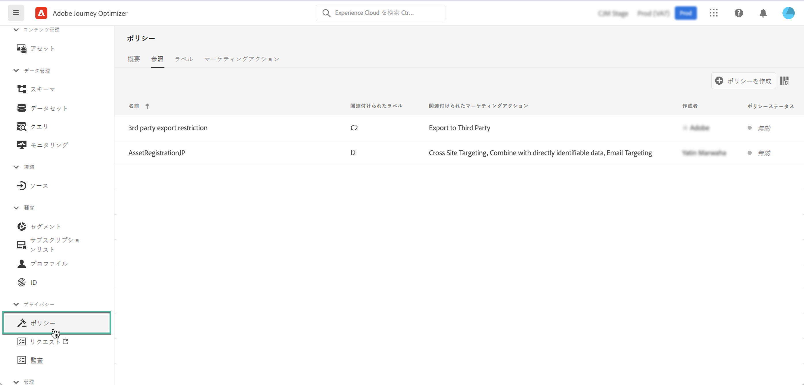

# データ使用ポリシー {#Policies}

>[!CONTEXTUALHELP]
>id="ajo_olac_manage_access"
>title="Olac Manage Access"
>abstract="TBC"

Adobe Experience Platform **データガバナンスサービス**&#x200B;を使用すると、ラベル、マーケティングアクション、ポリシーを使用して、データの使用を制限できます。

これを行うには、データガバナンスサービスで、データセットとフィールドにデータ使用ラベルを適用し、関連するデータ使用ポリシーに従って各データを分類します。

データ使用ポリシーは、Experience Platform 内のデータに対する実行が許可される、または制限される、マーケティングアクションの種類を記述するルールです。これらは、**[!UICONTROL ポリシー]**&#x200B;メニューからアクセスできます。

データガバナンスのフレームワークと、ラベルおよびポリシーの使用方法について詳しくは、次の Adobe Experience Platform ドキュメントを参照してください。

* [データガバナンスサービスの概要](https://experienceleague.adobe.com/docs/experience-platform/data-governance/home.html?lang=ja)
* [データ使用ラベルの概要](https://experienceleague.adobe.com/docs/experience-platform/data-governance/labels/overview.html?lang=ja)
* [データ使用ポリシー](https://experienceleague.adobe.com/docs/experience-platform/data-governance/policies/overview.html?lang=ja)
