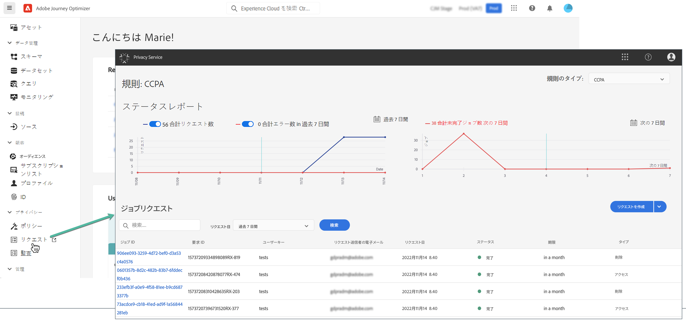

# プライバシーリクエスト {#track-changes}

Adobe Experience Platform **Privacy Service** は、顧客データのリクエストの管理に役立つ RESTful API とユーザーインターフェイスを提供します。Privacy Service を使用すると、Adobe Experience Cloud アプリケーションから顧客の個人データにアクセスするリクエストを送信したり、データを削除したりでき、法的規制や組織のプライバシー規則に自動的に準拠することができます。

プライバシーリクエストは、**[!UICONTROL リクエスト]**&#x200B;メニューから作成および管理できます。



Privacy Service と、プライバシーリクエストの作成および管理方法について詳しくは、次の Adobe Experience Platform ドキュメントを参照してください。

* [Privacy Service の概要](https://experienceleague.adobe.com/docs/experience-platform/privacy/home.html?lang=ja)
* [Privacy Service UI でのプライバシージョブの管理](https://experienceleague.adobe.com/docs/experience-platform/privacy/ui/user-guide.html?lang=ja)


## Adobe Journey Optimizer に送信できる個々のデータプライバシーリクエストの管理 {#data-privacy-requests}

Adobe Journey Optimizer から消費者データにアクセスして削除するための個々のリクエストは、次の 2 つの方法で送信できます。

* **Privacy Service UI** を通じて。[こちら](https://experienceleague.adobe.com/ja/docs/experience-platform/privacy/ui/user-guide#_blank)のドキュメントを参照してください。
* **Privacy Service API** を通じて。[こちら](https://developer.adobe.com/experience-platform-apis/references/privacy-service/#_blank)のドキュメントと[こちら](https://developer.adobe.com/experience-platform-apis/#_blank)の API 情報を参照してください。

Privacy Service では、**データアクセス**&#x200B;と&#x200B;**データ削除**&#x200B;という 2 つのタイプのリクエストがサポートされています。

>[!NOTE]
>
>このガイドでは、Adobe Journey Optimizer のプライバシーリクエストを行う方法についてのみ説明します。また、Platform データレイクのプライバシーリクエストも行う予定の場合は、このチュートリアルに加えてこの[ガイド](https://experienceleague.adobe.com/ja/docs/experience-platform/catalog/privacy)を参照してください。リアルタイム顧客プロファイルについては、この[ガイド](https://experienceleague.adobe.com/ja/docs/experience-platform/profile/privacy)を参照し、ID サービスについては、この[ガイド](https://experienceleague.adobe.com/ja/docs/experience-platform/identity/privacy)を参照してください。削除リクエストとアクセスリクエストについては、これらの個々のシステムを呼び出して、各システムでリクエストが処理されていることを確認する必要があります。Adobe Journey Optimizer にプライバシーリクエストを送信しても、これらのすべてのシステムからデータが削除されるわけではありません。

**アクセスリクエスト**&#x200B;の場合は、UI から「Adobe Journey Optimizer」（または API で製品コードとして「CJM」）を指定します。

**削除リクエスト**&#x200B;の場合は、「Adobe Journey Optimizer」リクエストに加えて、削除したデータが Journey Optimizer によって再挿入されるのを防ぐために、3 つのアップストリームサービスにも削除リクエストを送信する必要があります。これらのアップストリームサービスを指定していない場合、「Adobe Journey Optimizer」リクエストは、アップストリームサービスの削除リクエストが作成されるまで「処理中」状態のままになります。

3 つのアップストリームサービスは次のとおりです。

* プロファイル（製品コード：「profileService」）
* AEP データレイク（製品コード：「AdobeCloudPlatform」）
* ID（製品コード：「ID」）

## アクセスリクエストと削除リクエストの作成方法

### 前提条件

Adobe Journey Optimizer のデータへのアクセスと削除をリクエストするには、次の項目が必要です。

* IMS 組織 ID
* 操作の対象となるユーザーの ID 識別子と、対応する名前空間。Adobe Journey Optimizer および Experience Platform の ID 名前空間について詳しくは、[ID 名前空間の概要](https://experienceleague.adobe.com/ja/docs/experience-platform/identity/features/namespaces)を参照してください。

### Adobe Journey Optimizer の API リクエストの必須フィールド値

```json
"companyContexts":
    "namespace": imsOrgID
    "value": <Your IMS Org ID Value>

"users":
    "action": either access or delete

    "userIDs":
        "namespace": e.g. email, aaid, ecid, etc.
        "type": standard
        "value": <Data Subject's Identity Identifier>

"include":
    CJM (which is the Adobe product code for Adobe Journey Optimizer)
    profileService (product code for Profile)
    AdobeCloudPlatform (product code for AEP Data Lake)
    identity (product code for Identity)

"regulation":
    gdpr, ccpa, pdpa, lgpd_bra, or nzpa_nzl (which is the privacy regulation that applies to the request)
```


### GDPR アクセスリクエストの例：

UI から：


API を通じて：

```json
// JSON Request
{
   "companyContexts":[
      {
         "namespace":"imsOrgID",
         "value":"745F37C35E4B776E0A49421B@AdobeOrg"
      }
   ],
   "users":[
      {
         "action":[
            "access"
         ],
         "userIDs":[
            {
               "namespace":"ecid",
               "value":"38400000-8cf0-11bd-b23e-10b96e40000d",
               "type":"standard"
            },
            {
               "namespace":"email",
               "value":"johndoe4@gmail.com",
               "type":"standard"
            }
         ]
      }
   ],
   "include":[
      "CJM"
   ],
   "regulation":"gdpr"
}
```

```json
// JSON Response
{
    "requestId": "17163122360480365RX-705",
    "totalRecords": 1,
    "jobs": [
        {
            "jobId": "e709b1f4-1796-11ef-b422-eddd0aebc40d",
            "customer": {
                "user": {
                    "key": "John Doe",
                    "action": [
                        "access"
                    ],
                    "userIDs": [
                        {
                            "namespace": "ecid",
                            "value": "38400000-8cf0-11bd-b23e-10b96e40000d",
                            "type": "standard",
                            "namespaceId": 4,
                            "isDeletedClientSide": false
                        },
                        {
                            "namespace": "email",
                            "value": "johndoe4@gmail.com",
                            "type": "standard",
                            "namespaceId": 6,
                            "isDeletedClientSide": false
                        }
                    ]
                }
            }
        }
    ]
}
```

### GDPR 削除リクエストの例：

UI から：


API を通じて：

```json
// JSON Request
{
  "companyContexts": [
    {
      "namespace": "imsOrgID",
      "value": "745F37C35E4B776E0A49421B@AdobeOrg"
    }
  ],
  "users": [
    {
      "action": [
          "delete"
      ],
      "userIDs": [
        {
          "namespace": "ecid",
          "value": "38400000-8cf0-11bd-b23e-10b96e40000d",
          "type": "standard"
        },
                {
          "namespace": "email",
          "value": "johndoe4@gmail.com",
          "type": "standard"
        }
      ]
    }
  ],
  "include": [
    "CJM", "profileService", "AdobeCloudPlatform", "identity"
  ],
  "regulation": "gdpr"
}
```

```json
// JSON Response
{
    "requestId": "17163122360480365RX-705",
    "totalRecords": 1,
    "jobs": [
        {
            "jobId": "e709b1f4-1796-11ef-b422-eddd0aebc40d",
            "customer": {
                "user": {
                    "key": "John Doe",
                    "action": [
                        "delete"
                    ],
                    "userIDs": [
                        {
                            "namespace": "ecid",
                            "value": "38400000-8cf0-11bd-b23e-10b96e40000d",
                            "type": "standard",
                            "namespaceId": 4,
                            "isDeletedClientSide": false
                        },
                        {
                            "namespace": "email",
                            "value": "johndoe4@gmail.com",
                            "type": "standard",
                            "namespaceId": 6,
                            "isDeletedClientSide": false
                        }
                    ]
                }
            }
        }
    ]
}
```
