# プッシュ通知チャネルの設定 {#push-notification-configuration}

[!DNL Journey Optimizer] では、ジャーニーを作成し、ターゲットを絞ったオーディエンスにメッセージを送信できます。[!DNL Journey Optimizer]でプッシュ通知の送信を開始する前に、モバイルアプリ、および[!DNL Adobe Experience Platform]と[!DNL Adobe Experience Platform Launch]で設定と統合がおこなわれていることを確認する必要があります。 Adobeジャーニーオプティマイザーでのプッシュ通知のデータフローについては、[このページ](push-gs.md)を参照してください。

## 開始する前に

<!--
### Check provisioning

Your Adobe Experience Platform account must be provisioned to contain following schemas and datasets for push notification data flow to function correctly:

| Schema <br>Dataset                                                                       | Group of fields                                                                                                                                                                         | Operation                                                |
| -------------------------------------------------------------------------------------- | --------------------------------------------------------------------------------------------------------------------------------------------------------------------------------------- | -------------------------------------------------------- |
| CJM Push Profile Schema <br>CJM Push Profile Dataset                                     | Push Notification Details<br>Adobe CJM ExperienceEvent - Message Profile Details<br>Adobe CJM ExperienceEvent - Message Execution Details<br>Application Details<br>Environment Details | Register Push Token                                      |
| CJM Push Tracking Experience Event Schema<br>CJM Push Tracking Experience Event Dataset | Push Notification Tracking                                                                                                                                                              | Track interactions and provide data for the reporting UI |
-->

### 権限の設定

モバイルアプリケーションを作成する前に、**Adobe Experience Platform Launch**&#x200B;で正しいユーザー権限を持っているか、割り当てておく必要があります。 詳しくは、[Adobe Experience Platform Launchのドキュメント](https://experienceleague.adobe.com/docs/launch/using/admin/user-permissions.html?lang=ja)を参照してください。

>[!CAUTION]
>
>プッシュ設定は、エキスパートユーザーが実行する必要があります。 実装モデルとこの実装に関わるペルソナに応じて、完全な権限を単一の製品プロファイルに割り当てるか、アプリ開発者と&#x200B;**Adobe Journey Optimizer**&#x200B;管理者の間で権限を共有する必要が生じる場合があります。 **Adobe Experience Platform Launch**&#x200B;の権限について詳しくは、[このドキュメント](https://experienceleague.adobe.com/docs/launch/using/admin/user-permissions.html?lang=en#platform-launch-permissions)を参照してください。

<!--ou need to your have access to perform following roles :

* Manage Datastreams
* Manage Client-side Properties
* Manage App Configurations
-->

**プロパティ**&#x200B;と&#x200B;**会社**&#x200B;の権限を割り当てるには、次の手順に従います。

1. **[!DNL Admin Console]** にアクセスします。

1. 「**[!UICONTROL 製品]**」タブから、「**[!UICONTROL Adobe Experience Platform Launch]**」カードを選択します。

   

1. 既存の&#x200B;**[!UICONTROL 製品プロファイル]**&#x200B;を選択するか、「**[!UICONTROL 新しいプロファイル]**」ボタンを使用して新しい製品プロファイルを作成します。新しい&#x200B;**[!UICONTROL プロファイル]**&#x200B;を作成する方法については、[Admin Consoleのドキュメント](https://experienceleague.adobe.com/docs/experience-platform/access-control/ui/create-profile.html?lang=ja#ui)を参照してください。

1. 「**[!UICONTROL 権限]**」タブで、「**[!UICONTROL プロパティ権限]**」を選択します。

   

1. 「**[!UICONTROL すべて追加]**」をクリックします。これにより、次の権限が製品プロファイルに追加されます。
   * **[!UICONTROL 承認]**
   * **[!UICONTROL 開発]**
   * **[!UICONTROL 環境の管理]**
   * **[!UICONTROL 拡張機能の管理]**
   * **[!UICONTROL 公開]**

   これらの権限は、 Adobe Journey Optimizer拡張機能をインストールして公開し、 Adobe Experience Platform Mobile SDKでアプリプロパティを公開するために必要です。

1. 次に、左側のメニューで「**[!UICONTROL 会社権限]**」を選択します。

   

1. 次の権限を追加します。

   * **[!UICONTROL アプリ設定の管理]**
   * **[!UICONTROL プロパティの管理]**

   モバイルアプリ開発者が&#x200B;**Adobe Experience Launch**&#x200B;でプッシュ資格情報を設定し、**Adobe Journey Optimizer**&#x200B;でプッシュ通知プリセットを定義するには、これらの権限が必要です。

   

1. 「**[!UICONTROL 保存]**」をクリックします。

この&#x200B;**[!UICONTROL 製品プロファイル]**&#x200B;をユーザーに割り当てるには、次の手順に従います。

1. **[!DNL Admin Console]** にアクセスします。

1. 「**[!UICONTROL 製品]**」タブから、「**[!UICONTROL Adobe Experience Platform Launch]**」カードを選択します。

1. 以前に設定した&#x200B;**[!UICONTROL 製品プロファイル]**&#x200B;を選択します。

1. 「**[!UICONTROL ユーザー]**」タブで、「**[!UICONTROL ユーザーを追加]**」をクリックします。

   

1. ユーザーの名前またはメールアドレスを入力し、ユーザーを選択します。次に、「**[!UICONTROL 保存]**」をクリックします。

   >[!NOTE]
   >
   >Admin Console でユーザーをまだ作成していない場合は、[ユーザーの追加に関するドキュメント](https://helpx.adobe.com/jp/enterprise/admin-guide.html/enterprise/using/manage-users-individually.ug.html#add-users)を参照してください。

   

### アプリの設定

技術的な設定は、アプリ開発者とビジネス管理者の緊密なコラボレーションを伴います。 [!DNL Journey Optimizer]でプッシュ通知の送信を開始する前に、Adobe Experience Platform Launchで設定を定義し、モバイルアプリをAdobe Experience Platform Mobile SDKと統合する必要があります。

以下のリンクに記載されている実装手順に従います。

* **Apple iOS**&#x200B;の場合：[Appleドキュメント](https://developer.apple.com/documentation/usernotifications/registering_your_app_with_apns)でAPNsにアプリを登録する方法を説明します。
* **Google Android**&#x200B;の場合：[Googleドキュメント](https://firebase.google.com/docs/cloud-messaging/android/client)でAndroidにFirebase Cloud Messagingクライアントアプリをセットアップする方法を説明します。

### モバイルアプリのAdobe Experience Platform SDKとの統合

Adobe Experience Platform Mobile SDKは、AndroidおよびiOS互換のSDKを介して、モバイル用のクライアント側統合APIを提供します。 [Adobe Experience Platform Mobile SDKのドキュメント](https://aep-sdks.gitbook.io/docs/getting-started/overview)に従って、アプリでAdobe Experience Platform Mobile SDKを設定します。

この作業が完了するまでに、Adobe Experience Platform Launchでモバイルプロパティも作成および設定する必要があります。 通常、管理するモバイルアプリケーションごとにモバイルプロパティを作成します。 [Adobe Experience Platform Launchのドキュメント](https://aep-sdks.gitbook.io/docs/getting-started/create-a-mobile-property)でモバイルプロパティを作成および設定する方法を説明します。


## 手順1:Adobe Experience Platform Launch {#push-credentials-launch}にアプリのプッシュ資格情報を追加します

正しいユーザー権限を付与した後、モバイルアプリケーションのプッシュ資格情報を[!DNL Adobe Experience Platform Launch]に追加する必要があります。

モバイルアプリのプッシュ証明書の登録は、Adobeが自分に代わってプッシュ通知を送信することを承認するために必要です。 以下に説明する手順を参照してください。

1. [!DNL Adobe Experience Platform Launch]から、ドロップダウンメニューで「**[!UICONTROL クライアントサイド]**」が選択されていることを確認します。

1. 左側のパネルの「**[!UICONTROL アプリ設定]**」タブを選択し、「**[!UICONTROL アプリ設定]**」をクリックして新しい設定を作成します。

1. 構成の&#x200B;**[!UICONTROL 名前]**&#x200B;を入力します。

1. 「**[!UICONTROL メッセージサービスの種類]**」ドロップダウンメニューから、これらの認証資格情報に使用する&#x200B;**[!UICONTROL メッセージサービスのタイプ]**&#x200B;を選択します。

   * **Androidの場合**

      

      1. **[!UICONTROL アプリID（Androidパッケージ名）]**&#x200B;を指定します。通常、パッケージ名は`build.gradle`ファイル内のアプリidです。

      1. FCMプッシュ資格情報をドラッグ&amp;ドロップします。 プッシュ資格情報の取得方法の詳細については、[Googleドキュメント](https://firebase.google.com/docs/admin/setup#initialize-sdk)を参照してください。
   * **iOS の場合**

      

      1. 「**[!UICONTROL アプリID（iOSバンドルID）]**」フィールドにモバイルアプリ&#x200B;**Bundle Id**&#x200B;を入力します。 アプリバンドルIDは、**XCode**&#x200B;のプライマリターゲットの&#x200B;**「一般**」タブにあります。

      1. Appleデベロッパーアカウント用の&#x200B;**Apple Push Notification Authentication Key**&#x200B;をドラッグ&amp;ドロップします。 このキーは、**Certificates**、**Identifiers**、**Profiles**&#x200B;ページから取得できます。

      1. **キーID**&#x200B;を指定します。 これは、p8認証キーの作成中に割り当てられた10文字の文字列です。 これは、**証明書**、**識別子**&#x200B;および&#x200B;**プロファイル**&#x200B;ページの「**キー**」タブにあります。

      1. **チームID**&#x200B;を指定します。 これは、「メンバーシップ」タブにある文字列値です。


1. 「**[!UICONTROL 保存]**」をクリックして、アプリ設定を作成します。

<!--
## Step 2: Set up a mobile property in Adobe Experience Platform Launch {#launch-property}

Setting up a mobile property allows the mobile app developer or marketer to configure the mobile SDKs attributes such as Session Timeouts, the [!DNL Adobe Experience Platform] sandbox to be targeted and the **[!UICONTROL Adobe Experience Platform Datasets]** to be used for mobile SDK to send data to.

For further details and procedures on how to set up a **[!UICONTROL Platform Launch property]**, refer to the steps detailed in [Adobe Experience Platform Mobile SDK documentation](https://aep-sdks.gitbook.io/docs/getting-started/create-a-mobile-property#create-a-mobile-property).


To get the SDKs needed for push notification to work you will need the following SDK extensions, for both Android and iOS:

* **[!UICONTROL Mobile Core]** (installed automatically)
* **[!UICONTROL Profile]** (installed automatically)
* **[!UICONTROL Adobe Experience Platform Edge]**
* **[!UICONTROL Adobe Experience Platform Assurance]**, optional but recommended to debug the mobile implementation.

Learn more about [!DNL Adobe Experience Platform Launch] extensions in [Adobe Experience Platform Launch documentation](https://experienceleague.adobe.com/docs/launch-learn/implementing-in-mobile-android-apps-with-launch/configure-launch/launch-add-extensions.html).
-->

## 手順2:モバイルプロパティでのAdobe Journey Optimizer拡張機能の設定

Adobe Experience Platform Mobile SDK用&#x200B;**Adobe Journey Optimizer拡張機能**&#x200B;は、モバイルアプリに対するプッシュ通知を強化し、ユーザープッシュトークンを収集し、Adobe Experience Platformサービスとのインタラクション測定を管理するのに役立ちます。

[Adobe Experience Platform Mobile SDKドキュメント](https://aep-sdks.gitbook.io/docs/using-mobile-extensions/adobe-journey-optimizer)でJourney Optimizer拡張機能を設定する方法について説明します。


<!-- 
**[!UICONTROL Edge configuration]** is used by **[!UICONTROL Edge]** extension to send custom data from mobile device to [!DNL Adobe Experience Platform]. 
To configure [!DNL Adobe Experience Platform], you must provide the **[!UICONTROL Sandbox]** name and **[!UICONTROL Event Dataset]**.

For further details and procedures on how to create **[!UICONTROL Edge configuration]**, refer to the steps detailed in [Adobe Experience Platform Mobile SDK documentation](https://aep-sdks.gitbook.io/docs/getting-started/configure-datastreams).

1. From [!DNL Adobe Experience Platform Launch], select the **[!UICONTROL Edge Configurations]** tab and click **[!UICONTROL Edge Configurations]**.
    
1. Select **[!UICONTROL New Edge Configuration]** to add a new **[!UICONTROL Edge Configuration]**.
1. Enter a **[!UICONTROL Name]** and click **[!UICONTROL Save]**

1. Click the **[!UICONTROL Adobe Experience Platform]** toggle to enable it.

1. Fill in the **[!UICONTROL Sandbox]**, **[!UICONTROL Event dataset]** and **[!UICONTROL Profile Dataset]** fields. Then, click **[!UICONTROL Save]**.
    
    


1. From [!DNL Adobe Experience Platform Launch], ensure that **[!UICONTROL Client Side]** is selected in the drop-down menu.

1. select the **[!UICONTROL Properties]** tab and click **[!UICONTROL New Property]**.

    

1. Enter a **[!UICONTROL Name]** for your new property.

1. Select **[!UICONTROL Mobile]** as **[!UICONTROL Platform]**.

    

1. Click **[!UICONTROL Save]** to create your new property.

To configure **[!UICONTROL Adobe Experience Platform Edge Extension]** to send custom data from mobile devices to [!DNL Adobe Experience Platform].

1. Select your previously created property and select the **[!UICONTROL Extensions]** tab to view the extensions for this property.

    

1. Click **[!UICONTROL Configure]** under the **[!UICONTROL Adobe Experience Platform Edge]** Network' extension.

1. From the **[!UICONTROL Edge Configuration]** drop-down list, select the **[!UICONTROL Edge Configuration]** created in the previous steps. For more information on **[!UICONTROL Edge Configuration]**, refer to this [section](#edge-configuration).

1. Click **[!UICONTROL Save]**.

To configure **[!UICONTROL Adobe Experience Platform Messaging]** extension to send push profile and push interactions to the correct datasets, follow the same steps as above. Use **[!UICONTROL Sandbox]**, **[!UICONTROL Event dataset]** and **[!UICONTROL Profile Dataset]** created in the [Adobe Experience Platform setup](#edge-configuration).
-->

<!--
## Step 4: Publish the Property {#publish-property}

You now need to publish the property to integrate your configuration and to use it in the mobile app. 

To publish your property, refer to the steps detailed in [Adobe Experience Platform Mobile SDK documentation](https://aep-sdks.gitbook.io/docs/getting-started/create-a-mobile-property#publish-the-configuration)

## Step 5: Configure the ProfileDataSource {#configure-profiledatasource}

To configure the `ProfileDataSource`, use the `ProfileDCInletURL` from [!DNL Adobe Experience Platform] setup and add the following in the mobile app:

```
    MobileCore.updateConfiguration(
    mutableMapOf("messaging.dccs" to <ProfileDCSInletURL>)
```

-->

## 手順3:イベント{#mobile-app-test}を使用してモバイルアプリをテストする

Adobe Experience PlatformとAdobeLaunchの両方でモバイルアプリを設定した後、プッシュ通知をプロファイルに送信する前にテストできるようになりました。 この使用例では、モバイルアプリをターゲットにするジャーニーを作成し、プッシュ通知をトリガーにするイベントを設定します。

<!--
You can use a test mobile app for this use case. For more on this, refer to this [page](https://wiki.corp.adobe.com/pages/viewpage.action?spaceKey=CJM&title=Details+of+setting+the+mobile+test+app) (internal use only).
-->

このジャーニーを機能させるには、XDMスキーマを作成する必要があります。 詳しくは、[XDMのドキュメント](https://experienceleague.adobe.com/docs/experience-platform/xdm/schema/composition.html?lang=en#schemas-and-data-ingestion)を参照してください。

1. 左側のメニューで、**[!UICONTROL スキーマ]**&#x200B;を参照します。

1. 「**[!UICONTROL スキーマを作成]**」をクリックし、「**[!UICONTROL XDM ExperienceEvent]**」を選択します。

   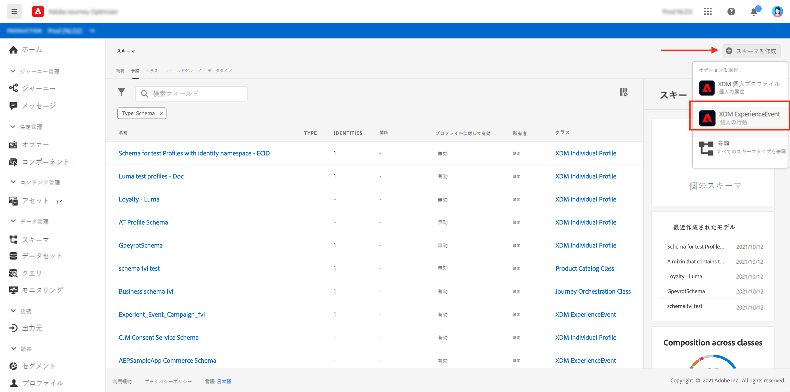

1. 「**[!UICONTROL 新しいフィールドグループを作成]**」を選択します。

1. **[!UICONTROL 表示名]**&#x200B;と&#x200B;**[!UICONTROL 説明]**&#x200B;を入力します。 完了したら、「**[!UICONTROL フィールドグループを追加]**」をクリックします。 フィールドグループの作成方法について詳しくは、[XDMシステムのドキュメント](https://experienceleague.adobe.com/docs/experience-platform/xdm/tutorials/create-schema-ui.html?lang=ja)を参照してください。


   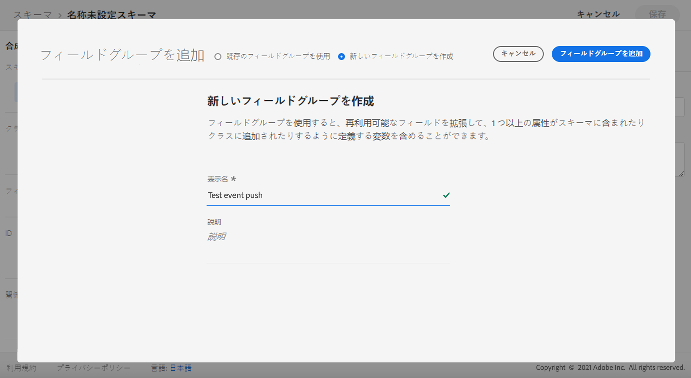

1. 左側で、スキーマを選択します。 右側のウィンドウで、スキーマの名前と説明を入力します。 **[!UICONTROL プロファイル]**&#x200B;に対してこのスキーマを有効にします。

   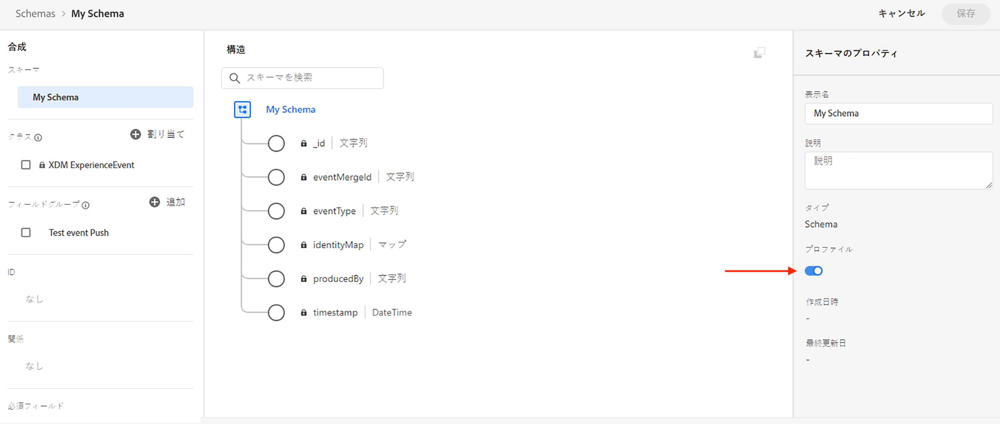


1. 左側で、フィールドグループを選択し、「+」アイコンをクリックして新しいフィールドを作成します。 **[!UICONTROL フィールドグループのプロパティ]**&#x200B;の右側で、**[!UICONTROL フィールド名]**、**[!UICONTROL 表示名]**&#x200B;を入力し、**[!UICONTROL 文字列]**&#x200B;を&#x200B;**[!UICONTROL 型]**&#x200B;として選択します。

   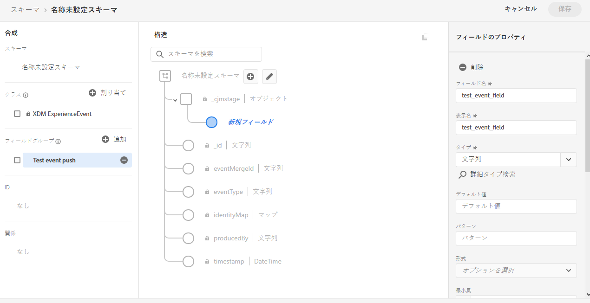

1. 「**[!UICONTROL 必須]**」をオンにし、「**[!UICONTROL 適用]**」をクリックします。

1. 「**[!UICONTROL 保存]**」をクリックします。これでスキーマが作成され、イベントで使用できます。

次に、イベントを設定する必要があります。

1. ホームページの左側のメニューの「管理」で、「**[!UICONTROL 設定]**」を選択します。 「**[!UICONTROL イベント]**」セクションの「**[!UICONTROL 管理]**」をクリックして、新しいイベントを作成します。

1. 「**[!UICONTROL Create Event]**」をクリックすると、画面の右側にイベント設定ウィンドウが開きます。

   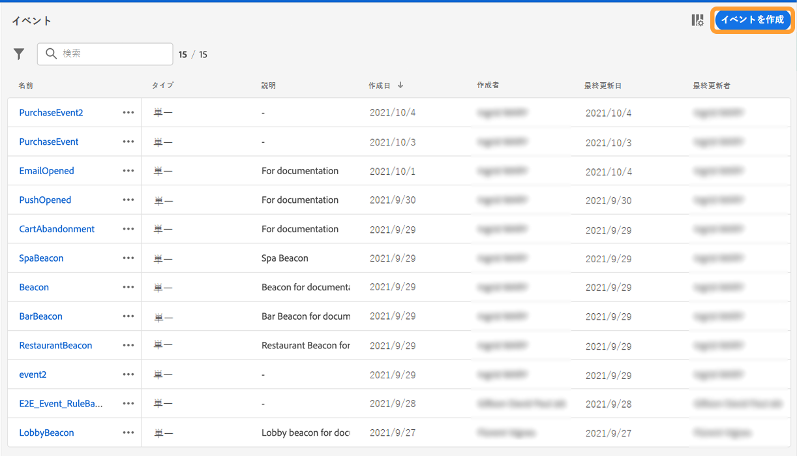

1. イベントの名前を入力します。説明を追加することもできます。

1. 「**[!UICONTROL イベント ID タイプ]**」フィールドで、「**[!UICONTROL ルールベース]**」を選択します。

1. **[!UICONTROL パラメーター]**&#x200B;で、以前に作成したスキーマを選択します。

   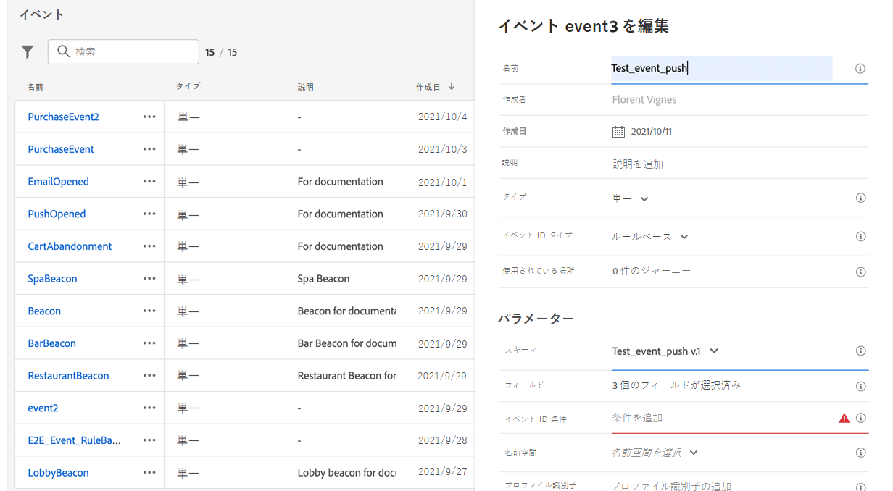

1. フィールドのリストで、スキーマフィールドグループで作成したフィールドが選択されていることを確認します。

   

1. 「**[!UICONTROL イベントID条件]**」フィールドで「**[!UICONTROL 編集]**」をクリックします。 以前に追加したフィールドをドラッグ&amp;ドロップして、ジャーニーをトリガーにするイベントを識別するためにシステムで使用される条件を定義します。

   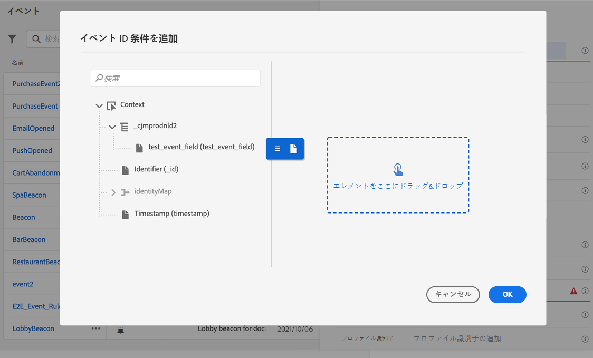

1. テストアプリでプッシュ通知をトリガーするために使用する構文を入力します。この例では&#x200B;**注文確認**&#x200B;です。

   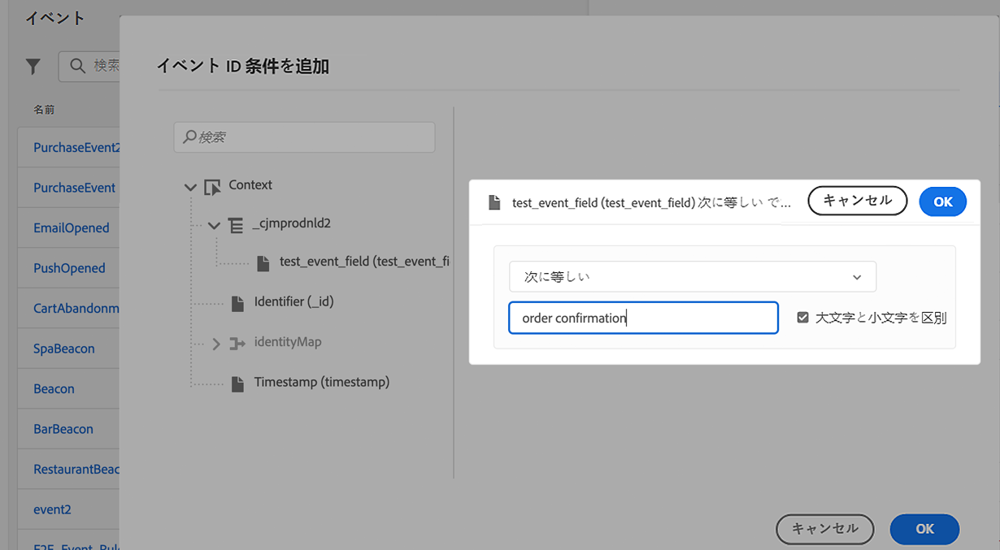

1. **[!UICONTROL ECID]**&#x200B;を&#x200B;**[!UICONTROL 名前空間]**&#x200B;として選択します。

1. 「**[!UICONTROL OK]**」、「**[!UICONTROL 保存]**」の順にクリックします。

これでイベントが作成され、ジャーニーで使用できるようになりました。

1. 左のメニューで、「**[!UICONTROL ジャーニー]**」をクリックします。

1. 「**[!UICONTROL ジャーニーを作成]**」をクリックして、新しいジャーニーを作成します。

1. 右側に表示される設定ペインで、ジャーニーのプロパティを編集します。詳しくは、[この節](building-journeys/journey-gs.md#change-properties)を参照してください。

1. まず、前の手順で作成したイベントを「**[!UICONTROL イベント]**」ドロップダウンからドラッグ&amp;ドロップします。

   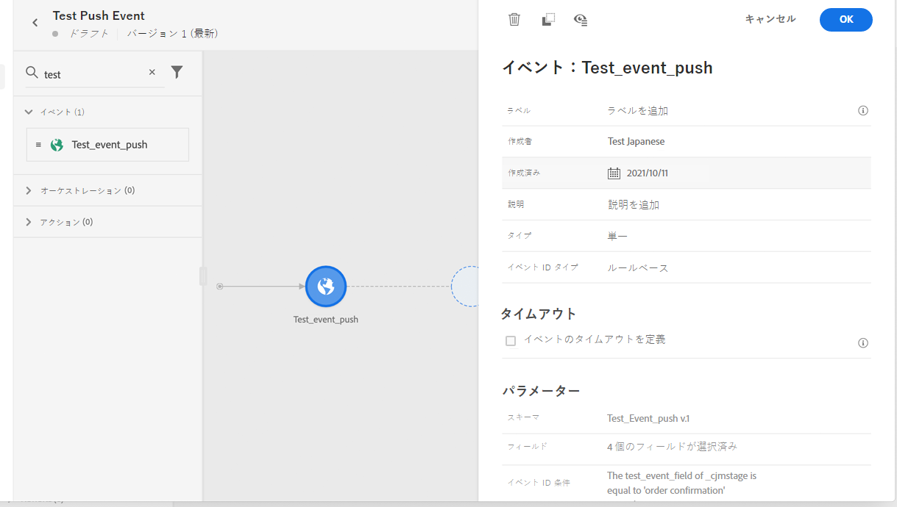

1. **[!UICONTROL アクション]**&#x200B;ドロップダウンから、**[!UICONTROL メッセージ]**&#x200B;アクティビティをジャーニーにドラッグ&amp;ドロップします。

1. 前に作成したメッセージを選択します。 プッシュ通知の作成方法について詳しくは、この[ページ](create-message.md)を参照してください。

1. ジャーニーに&#x200B;**[!UICONTROL 終了]**&#x200B;アクティビティをドラッグ&amp;ドロップします。

1. 「**[!UICONTROL テスト]**」切り替えをクリックしてプッシュ通知のテストを開始し、「**[!UICONTROL トリガー]**」をクリックします。

   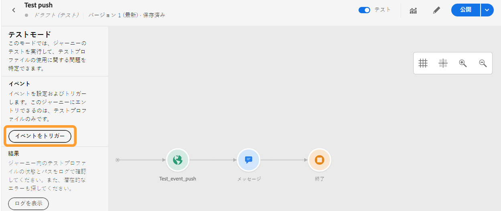

1. 「**[!UICONTROL キー]**」フィールドにECIDを入力し、2番目のフィールドに「**注文確認**」と入力します。

   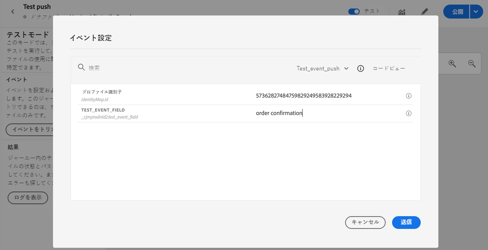

1. 「**[!UICONTROL 送信]**」をクリックします。

イベントがトリガーされ、モバイルアプリにプッシュ通知が届きます。

## 手順4:プッシュのメッセージプリセットの作成{#message-preset}

モバイルアプリを[!DNL Adobe Experience Platform Launch]で設定したら、**[!DNL Journey Optimizer]**&#x200B;からプッシュ通知を送信できるように、メッセージプリセットを作成する必要があります。

[この節](configuration/message-presets.md)でメッセージプリセットを作成して設定する方法を説明します。

これで、Journey Optimizerでプッシュ通知を送信する準備が整いました。

* [このページ](create-push.md)でプッシュメッセージを作成する方法を説明します。
* ジャーニーにメッセージを追加する方法については、[この節](building-journeys/journeys-message.md)を参照してください。
