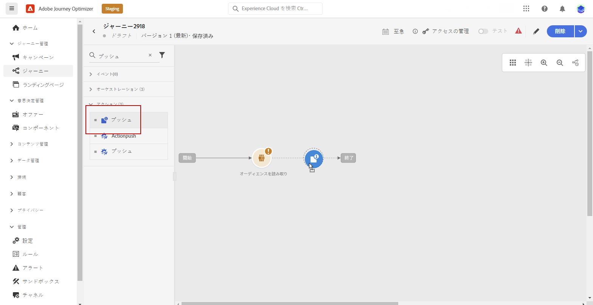
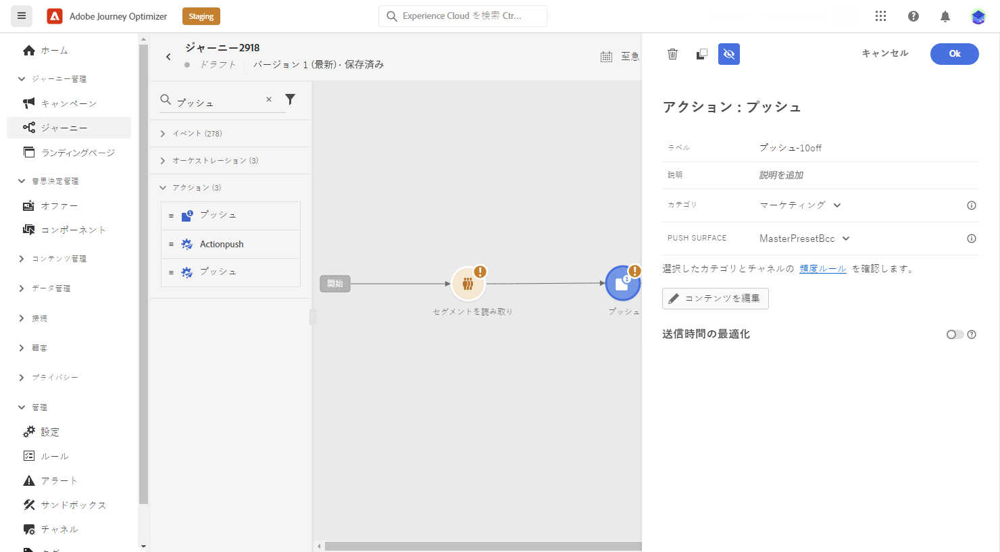
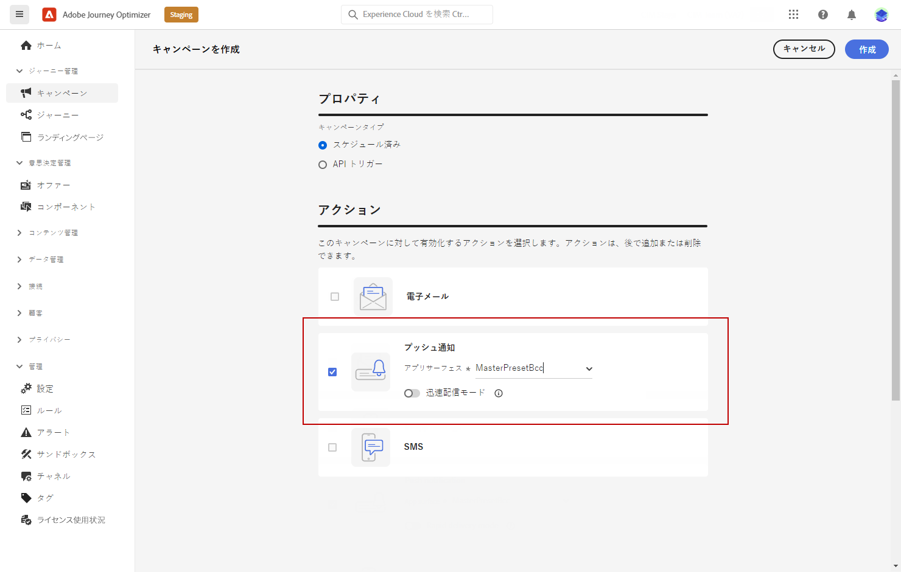
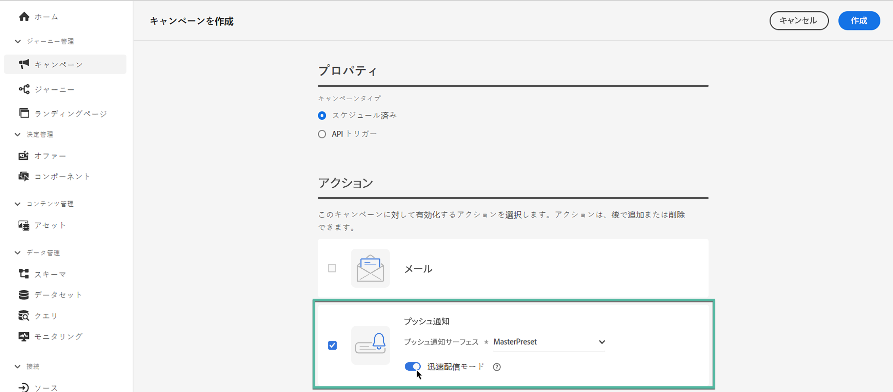

# プッシュ通知の作成 {#create-push-notification}

>[!CONTEXTUALHELP]
>id="ajo_message_push"
>title="プッシュメッセージの作成"
>abstract="プッシュメッセージを追加し、パーソナライゼーションエディターを使用してパーソナライズを開始します。"

## ジャーニーまたはキャンペーンでのプッシュ通知の作成 {#create}

プッシュ通知を作成するには、次の手順に従います。

>[!BEGINTABS]

>[!TAB ジャーニーへのプッシュの追加]

1. ジャーニーを開き、パレットの「アクション」セクションからプッシュアクティビティをドラッグ＆ドロップします。

   

1. メッセージに関する基本情報（ラベル、説明、カテゴリ）を入力したあと、使用するメッセージ設定を選択します。

   

   >[!NOTE]
   >
   >ジャーニーからプッシュ通知を送信する場合、Adobe Journey Optimizer の送信時間の最適化機能を利用して、メッセージ送信の最適な時間を予測し、過去の開封率とクリック率に基づいてエンゲージメントを最大化できます。[送信時間の最適化の操作方法を学ぶ](../building-journeys/send-time-optimization.md)

   ジャーニーの設定方法について詳しくは、[このページ](../building-journeys/journey-gs.md)を参照してください。

1. ジャーニー設定画面で、「**[!UICONTROL コンテンツを編集]**」ボタンをクリックして、プッシュコンテンツを設定します。[プッシュ通知のデザイン](design-push.md)

1. メッセージコンテンツを定義したら、CSV／JSON ファイルからアップロードした、または手動で追加したテストプロファイルやサンプル入力データを使用して、そのコンテンツをプレビューできます。

1. プッシュの準備が整ったら、[ジャーニー](../building-journeys/journey-gs.md)の設定を完了させて送信します。

   プッシュの開封やインタラクションを通じて受信者の行動をトラッキングするには、トラッキングセクションの専用オプションが[メールアクティビティ](../building-journeys/journeys-message.md)で有効になっていることを確認してください。

>[!TAB キャンペーンへのプッシュの追加]

1. **[!UICONTROL キャンペーン]**&#x200B;メニューにアクセスし、「**[!UICONTROL キャンペーンを作成]**」をクリックします。

1. 実施するキャンペーンのタイプを選択します。

   * **Scheduled - Marketing**：キャンペーンをすぐに実行するか、指定日に実行します。スケジュール済みキャンペーンは、マーケティングメッセージを送信することを目的としています。ユーザーインターフェイスから設定および実行します。

   * **API トリガー - マーケティング／トランザクション**：API 呼び出しを使用してキャンペーンを実行します。API トリガーキャンペーンは、マーケティングメッセージまたはトランザクションメッセージのいずれか、つまり、個人が実行したアクション（パスワードのリセット、買い物かごの購入など）に続いて送信されるメッセージを送信することを目的としています。

1. 「**[!UICONTROL プロパティ]**」セクションで、キャンペーンの「**[!UICONTROL タイトル]**」と「**[!UICONTROL 説明]**」を編集します。

1. 「**[!UICONTROL オーディエンスを選択]**」ボタンをクリックして、使用可能な Adobe Experience Platform オーディエンスのリストからターゲットオーディエンスを定義します。[詳細情報](../audience/about-audiences.md)

1. 「**[!UICONTROL ID 名前空間]**」フィールドで、選択したオーディエンスから個人を識別するために使用する名前空間を選択します。[詳細情報](../event/about-creating.md#select-the-namespace)

1. 「**[!UICONTROL アクション]**」セクションで、「**[!UICONTROL プッシュ通知]**」を選択し、新しい設定を選択または作成します。

   プッシュ設定について詳しくは、[このページ](push-configuration.md)を参照してください。

   

1. 「**[!UICONTROL 実験を作成]**」をクリックしてコンテンツ実験の設定を開始し、パフォーマンスを測定してターゲットオーディエンスに最適なオプションを特定するための処理を作成します。[詳細情報](../content-management/content-experiment.md)

1. キャンペーンは、特定の日付に実行するか、繰り返し頻度で実行するように設計されています。キャンペーンの&#x200B;**[!UICONTROL スケジュール]**&#x200B;を設定する方法については、[この節](../campaigns/create-campaign.md#schedule)を参照してください。

1. **[!UICONTROL アクショントリガー]**&#x200B;メニューから、プッシュ通知の「**[!UICONTROL 頻度]**」を選択します。

   * 1 回
   * 毎日
   * 毎週
   * 毎月

1. キャンペーンの設定画面で、「**[!UICONTROL コンテンツを編集]**」ボタンをクリックして、プッシュコンテンツを設定します。[プッシュ通知のデザイン](design-push.md)

1. メッセージコンテンツを定義したら、CSV／JSON ファイルからアップロードした、または手動で追加したテストプロファイルやサンプル入力データを使用して、そのコンテンツをプレビューできます。

1. プッシュの準備が整ったら、[キャンペーン](../campaigns/create-campaign.md)の設定を完了させて送信します。

   プッシュの開封やインタラクションを通じて受信者の行動をトラッキングするには、トラッキングセクションの専用オプションが[キャンペーン](../campaigns/create-campaign.md)で有効になっていることを確認してください。

>[!ENDTABS]

**関連トピック**

* [プッシュチャネルの設定](push-gs.md)
* [ジャーニーでのメッセージの追加](../building-journeys/journeys-message.md)

## 迅速配信モード {#rapid-delivery}

>[!CONTEXTUALHELP]
>id="ajo_campaigns_rapid_delivery"
>title="迅速配信モード"
>abstract="迅速配信モードを利用すると、プッシュチャネルで 3,000 万件未満のオーディエンスサイズに高速メッセージ送信を実行できます。"

迅速配信モードは、キャンペーンを通じて大量のプッシュメッセージを非常に高速に送信できるようにする [!DNL Journey Optimizer] アドオンです。

迅速配信は、メッセージ配信の遅延がビジネス上の重要な問題になる状況で、携帯電話に緊急のプッシュアラートを送信するときに使用します（ニュースチャネルアプリをインストールしたユーザーにニュース速報を流すなど）。

迅速配信モードを使用する際のパフォーマンスについて詳しくは、[Adobe Journey Optimizer 製品の説明](https://helpx.adobe.com/jp/legal/product-descriptions/adobe-journey-optimizer.html)を参照してください。

### 前提条件 {#prerequisites}

迅速配信メッセージには、次の要件があります。

* 迅速配信は&#x200B;**[!UICONTROL スケジュール型]**&#x200B;キャンペーンでのみ使用でき、API トリガーキャンペーンでは使用できません。
* プッシュメッセージはパーソナライズできません。
* ターゲットオーディエンスに含まれるプロファイルの数は 3,000 万未満にする必要があります。
* 迅速配信モードを使用すると、最大 5 つのキャンペーンを同時に実行できます。

### 迅速配信モードの有効化

1. プッシュ通知キャンペーンを作成し、「**[!UICONTROL 迅速配信]**」オプションをオンに切り替えます。

   

1. メッセージコンテンツを設定し、ターゲットにするオーディエンスを選択します。[キャンペーンの作成方法について学ぶ](#create)

   >[!IMPORTANT]
   >
   >メッセージコンテンツにパーソナライゼーションが含まれていないことと、オーディエンスに含まれるプロファイルの数が 3,000 万未満であることを確認します。

1. 通常どおり、キャンペーンをレビューしてアクティブ化します。テストモードでは、メッセージは迅速配信モードで送信されません。